# Introduction to AWS

# What is Cloud Computing?

* Cloud computing enables you to stop thinking of your infrastructure as hardware, and instead think of it (and use it)
  as software.

## Models of Cloud Computing

* **Infrastructure as Service (IaaS):** Basic building blocks for cloud IT
    * Network features
    * Computer
    * Data storage space
* **Platform as a service (PaaS):** Enables you to run applications without the need to manage underlying
  infrastructure (
  for example hardware and operation system)
* **Software as a service (SaaS):** Provides you with a completed product that the service provider runs and manages

### Amazon Resource Name (ARN)

* You can use Amazon Resource Names (ARNs) to uniquely identify AWS resources or groups of resources.
  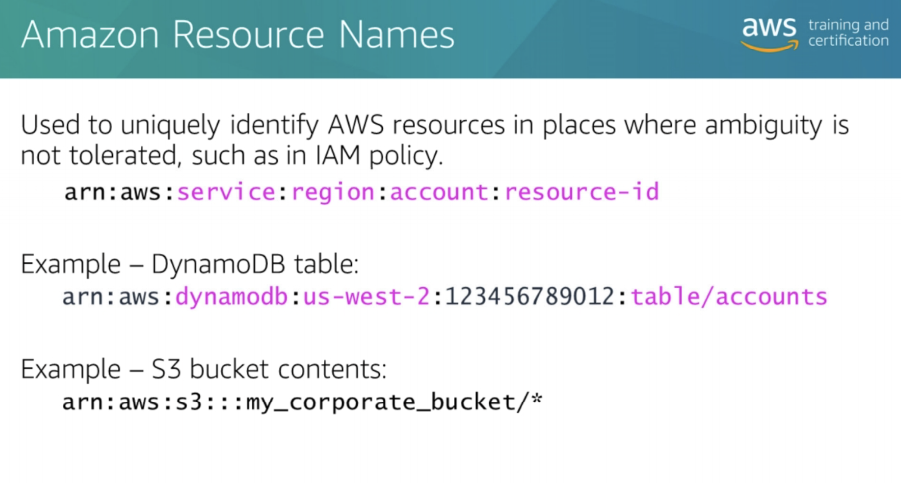

## AWS service Stack


## AWS Foundation Services


* AWS provides several foundation services
    * Compute:
        * Amazon Elastic Compute Cloud (EC2) id AWS compute services
        * Easy to boot new server
        * You can combine EC2 with Elastic Load Balancing and Auto Scaling services to develop a high availability and
          high-performance infra for your apps.
    * Networking:
        * Networking group provides a DNS
            * DNS can give direct control over your AWS and interaction with EC2 instances over your network.
    * Storage:
        * Provides several type of storage options

### Compute

* **Amazon Elastic Compute Cloud (EC2) :**
    * Provides pay-as-you-go pricing
    * Creates Amazon Machine Images (AMIs)
    * Add / terminate instances as needed
    * Pause / Resume instances
    * Scalability:
        * Scale in -> add more instance
        * Scale out -> removes instance
        * Scale up -> extend current memory , not recommended
        * Scale down -> downgrad current memory , not recommended
    * Pricing
        * On-demand
        * Reserved instance
        * Spot instance: is %90 less than on-demand.
            * Spot Instances are unused EC2 capacity; the price you pay is determined by the supply and demand for the
              instance
            * You can specify max price willing to pay by instance hour
                * can reduce the cost of running your Hadoop or Spark clusters, increase your compute capacity and
                  throughput without increasing your budget, or both
            * Spot Instances are also available to run for a predefined duration


* General purpose instances provide a balanced set of resources and a low-cost platform that is well suited for a wide
  variety of applications.
* Compute optimized instances provide a higher level of processing performance and are ideal for applications that
  require higher absolute CPU and memory capacities. For example, these include encoding applications, high-traffic
  content management systems, and Memcached applications.
* Memory optimized instances offer large memory sizes for high-throughput applications, including database and
  memory-caching applications.
* Accelerated Computing instances have proportionally more CPU resources than memory (RAM) and are well suited for
  compute-intensive applications. Various high-storage and cluster-computer instance types are also available
* [AWS instance Types](http://aws.amazon.com/ec2/instance-types/)


* **Amazon Elastic Load Balancing :**
    * Distributes traffic accross multiple targets, such as Amazon EC2 instances in multiple available zone, containers
      and IP addresses
    * Supports health check of EC2 instances
    * Supports routing and load balancing of EC2 instances.

</br>


* **AWS Lambda** :
    * AWS Lambda can automatically run code in response to multiple events, such as:
        * HTTP requests through Amazon API Gateway
        * Modifications to objects in Amazon S3 buckets
        * Table updates in Amazon DynamoDB
        * State transitions in AWS Step Functions

## AWS Platform Services

* Platform services devided 4 categories
* Database: several options to store data based on the type
    * SQL: Amazon Relational Database (Amazon RDS)
    * NoSQL :
        * AWS DynamoDb is a great key value database
        * AWS Document DB : Document DB
        * AWS ElasticCache, for Redis or MemCache
        * Amazon Redshift for data warehouse
* Analytics: provides services to analyse big data
    * Amazon Kinesis
    * Amazon EMR
* Development Tools:
    * AWS CodeCommit is a source control service is combined with development services such as
        * AWS CodeDeploy
        * AWS Elastic Beanstalk
        * AWS Cloud Formation
    * Helps to create robust DevOps model.
* Mobile:
    * AWS Simple Notification Service SNS for notification.
    * Amazon Cognito for authentication and saving mobile user data
    * Amazon Pinpoint to measure and analyse mobile application usage


## Architecture Evaluation


# AWS Identity and Access Management

* **AWS IAM(Identity Access Management) :**
    * IAM enables you to create and manage AWS users and groups. With IAM, you can set up roles and policies to control
      access to AWS services.
    * Security of the Cloud = AWS
    * Security in the Cloud = You
    * To see who changed user account? Configure AWS CloudTrail or not.
    * When you create IAM **policies**, follow the principle of least privilege—that is, granting only the permissions
      required to perform a task. Determine what users need to do and then craft policies that allow the users to
      perform only those tasks
    * A **role** has policies granting access to specific services and operations.

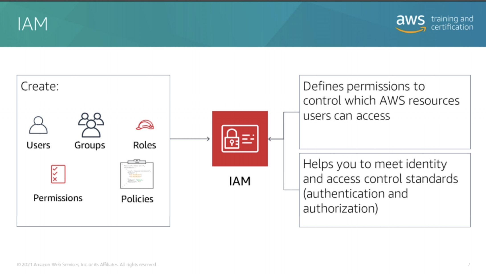</br>
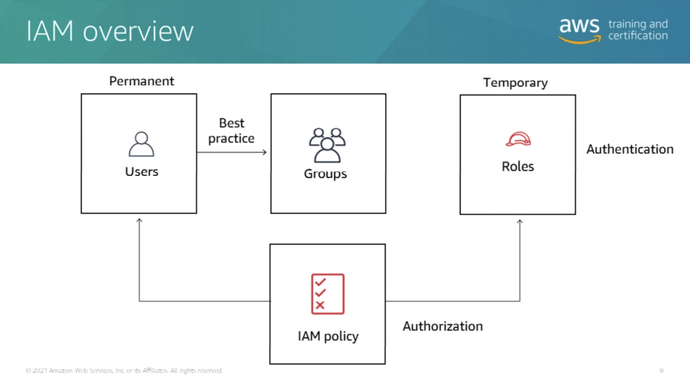</br>
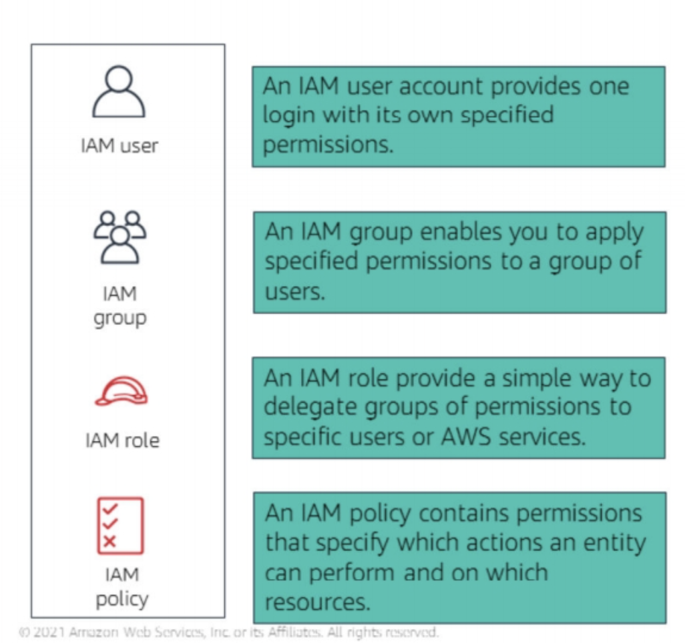</br>

* Example of IAM Policy
  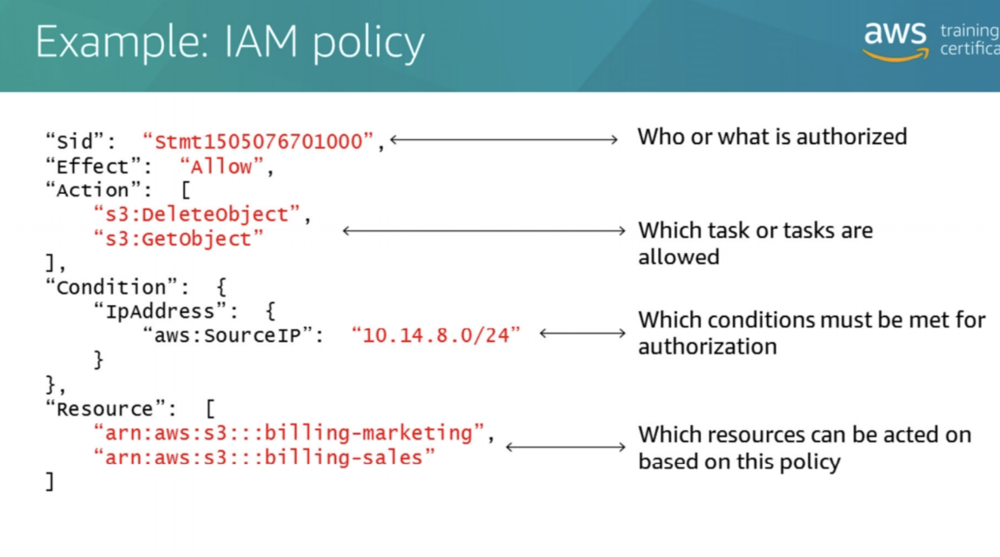</br>

* IAM Permission Type
    * Identity-based permissions are attached to the IAM user and indicate what the user is permitted to do.
    * Resource-based permissions are attached to a resource and indicate what a specified user (or group of users) is
      permitted to do with it. Amazon S3, Amazon Simple Queue Service (Amazon SQS), Amazon Simple Notification Service (
      Amazon SNS), and AWS OpsWorks are the only services that support resource-based permissions.

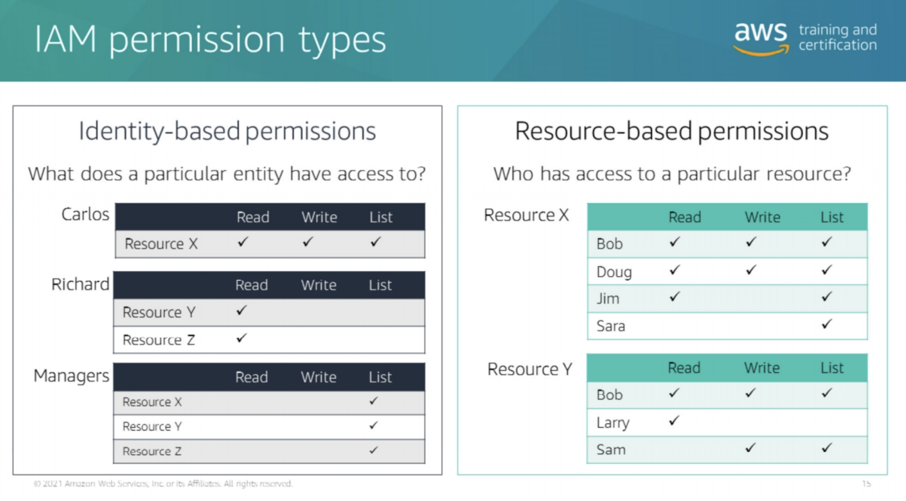</br>
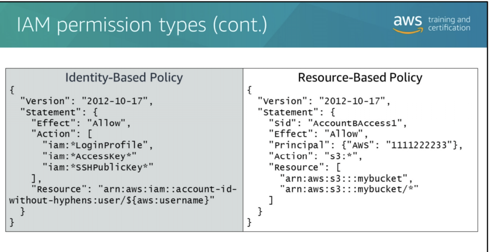</br>

* IAM Policy Types
  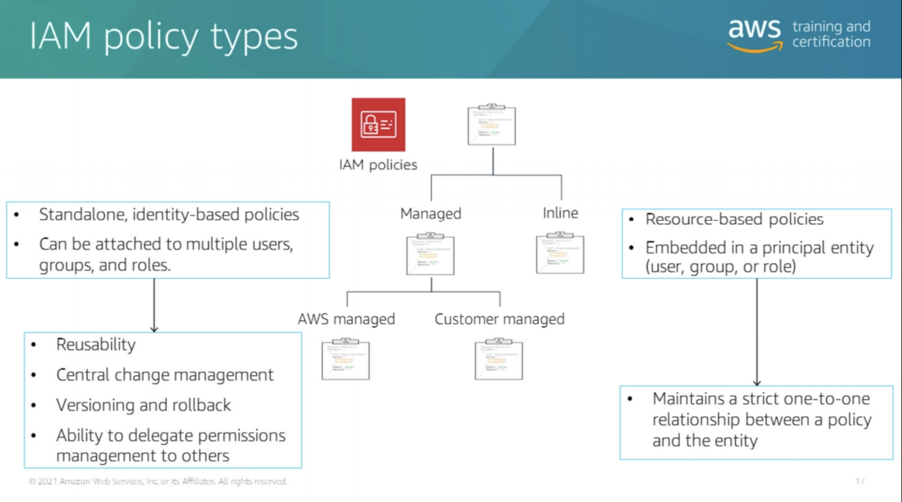</br>

* IAM Policies Evaluation Logic
    * Use policies to fine-tune permissions granted to IAM users, groups, and roles.
    * Policies can be in a variety of formats. Because policies are in JSON format, you can use them with a
      version-control system.
    * It’s good practice to define least privilege access to each user, group, or role. Then you can customize access to
      specific resources by using an authorization policy.
    * To determine whether the request should be allowed or denied, these rules are followed:
        * By default, all requests are denied. (In general, requests made by using the account/root credentials for
          resources in the account are always allowed.)
        * An explicit allow overrides this default.
        * An explicit deny overrides any allows.
    * All policies that have been applied to the IAM entity are evaluated. If there is a conflict, the most restrictive
      policy is applied. For example, when one policy allows an acMon and another policy denies an acMon, the policy
      that denies the acMon is applied

  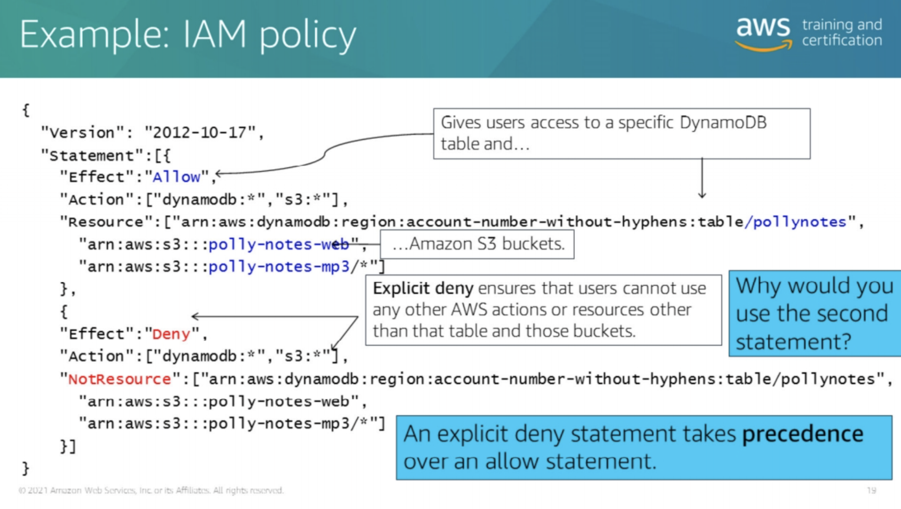</br>

* The example policy gives users access to only the following:
    * The DynamoDB table whose name is represented by table-name.
    * The AWS account's corporate Amazon S3 bucket whose name is represented by bucket-name and all the objects it
      contains.
    * The policy includes an explicit deny ("Effect":"Deny" element). Used with the NotResource element, this helps to
      ensure that the users cannot use any AWS actions or resources. The exception is those specified in the policy,
      even if permissions have been granted in another policy. (An explicit deny statement takes precedence over an
      allow statement.)

* Overview of Authentication
    * For example, if you are developing a mobile photo app on AWS, you must sign in to AWS using credentials to create
      the AWS environment for that app. Signing in to AWS here requires that you authenticate with AWS (AWS
      authentication).
    * After the environment has been set up, the end user should be able to sign in to their photo application. Signing
      in to the photo application requires the user to authenticate with their application (
      application authentication).
    * If the user takes a picture using their photo app and uploads it to AWS, authentication occurs with AWS (AWS
      authentication).
    * Finally, the photos that have been uploaded to the S3 bucket can cause a backend job to update the RDS database
      with an entry for the uploaded photo. This job requires database authentication

  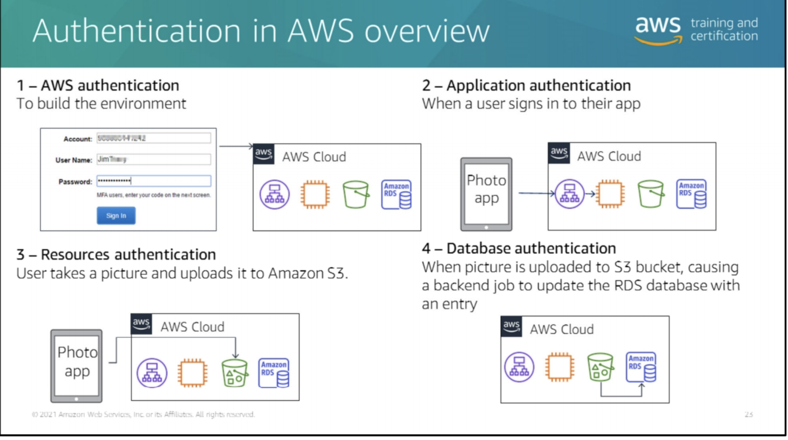</br>

* Authentication via Deeloper Tools

* IAM Authentiation in CLI and SDK
  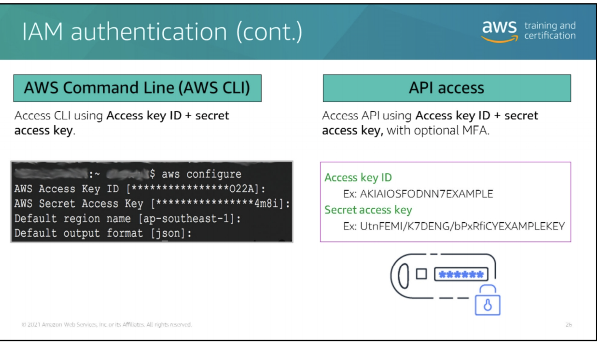

* Best Practices:
    * not using your AWS account root user credentials. Instead, create separate IAM users with their own access keys
      for each project, and tailor the permissions of the users specific to those projects.
    * In general,recommended you use IAM roles when running your application on Amazon EC2 and use credential profiles
      or environment variables elsewhere.

* Security Credential rules
  

# Developer Tools

* **AWS Cloud9 :** Creates a Development environment
    * Has all apps you can download

* **AWS SDK**
    * helps to build infra with code

* **AWS CLI:**
* Aws command, followed by the three parts:
    * Command – The top-level service that you are calling (for example, Amazon EC2, Amazon CloudWatch). For a list of
      currently supported services, see [Cli Doc](http://docs.aws.amazon.com/cli/latest/reference/). Using the example
      script, Amazon EC2 is being called.
    * Subcommand – The operation to perform on that service (for example, run-instances, put-metric-data). In this
      Amazon EC2 example, the run-instances subcommand requests the creation of a new Amazon EC2 instance.
    * Parameters – Any arguments required to perform the operation. Argument names are preceded by two dashes (--). For
      example, to run the Amazon EC2 run instances operation, pass in a number of parameters, such as the AMI ID, to
      create the instance.
    * Options – The AWS CLI also provides choices that you can specify when executing operation. For example, you can
      use the --query option to limit the response text so that it returns only the instance ID of your new instan


* to list EC2 instances

```shell
aws ec2 describe-instances
```

* To run an EC2 instance with one line command

```shell
aws ec2 run-instances --image-id ami-0164f9b296f8e78cc --instance-type t4g.micro --count 1 --key-name Calvin_Key_Pair --security-group-ids sg-0ad8af9859c84d24d --subnet-id subnet-0983cbe1804161068 --block-device-mappings DeviceName=/dev/sdh,Ebs={VolumeSize=10}  --dry-run
```

* stop instance

```shell
aws ec2 stop-instances --instance-id i-123456
```

* Configure the aws region info

```shell
aws configure
```

* **AWS X-Ray :**
    * helps to track all actions.
    * helps developers analyze and debug production or distributed applications
    * X-Ray provides a complete view of requests as they travel through your application, and shows a map of your
      application’s underlying components.
    * Creates service map
        * This provides you with a view of connections among services in your application. The service map enables you
          to do the following:
            * Create a dependency tree
            * Detect latency or errors when working across AWS Availability Zones or AWS Regions
            * Identify services not operating as expecte
    * Will show you how long the process takes time
    * identify errors and bugs
        * X-Ray can automatically highlight bugs or errors in your application code by analyzing the response code for
          each request made to your application.
    * identify performance bottlenecks
        * With service maps, you can view relationships between services and resources in your application in real time.
          You can easily detect where high latencies are occurring and visualize node and edge latency distribution for
          services.
    * Build our own analysis and visualization app
        * X-Ray provides a set of query APIs you can use to build your own analysis and visualizations applications that
          use the data that X-Ray records
    * X-Ray Commands: https://docs.aws.amazon.com/xray/latest/api/API_Operations.html
    * Instromentantion for code
    * [Integration with other services](https://github.com/aws?q=xray-sdk.)


# Management Tools:

* **AWS CloudWatch**:
    * Monitor performance metrics/ analytic
    * Collects ant tracks metrics
    * Setup alarms
    * Create dashboards
    * Does not tell you one of instances getting down

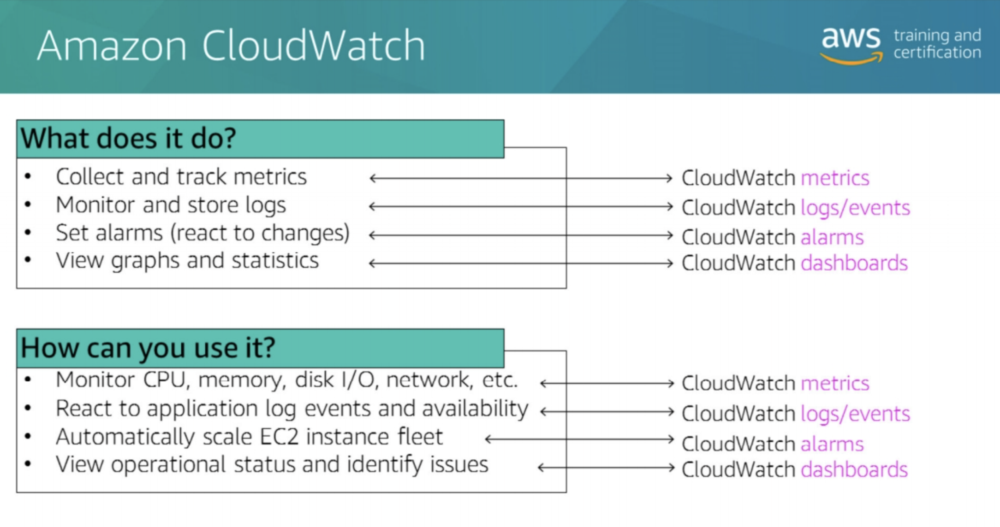</br>

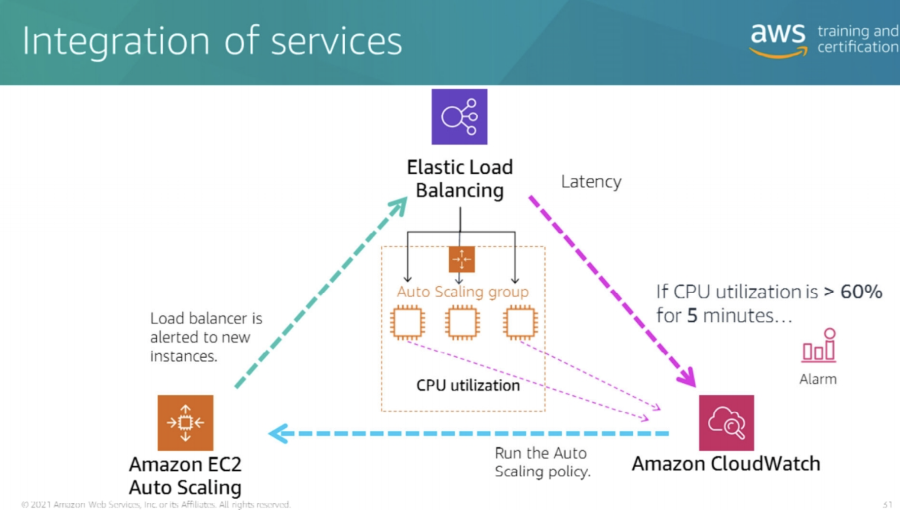

* Auto Scaling works as a trio of services working together. Elastic Load Balancing and EC2 instances feed metrics to
  Amazon CloudWatch. Auto Scaling defines a group with launch configurations and Auto Scaling policies. Amazon
  CloudWatch alarms run Auto Scaling policies to affect the size of your fleet. All of these services work well
  individually, but together they become more powerful and increase the control and flexibility that you demand

* **AWS CloudTrail:**
    * tells you who, when, what, which, where?
    * AWS CloudTrail is an AWS service that generates logs of calls to the AWS API. Because the AWS API underlies both
      the command line interface (AWS CLI) and the AWS Management Console, AWS CloudTrail can record all activity
      against the services it monitors
    * You can use the AWS API call history CloudTrail produces to track changes to AWS resources. These changes include
      creation, modification, and deletion of AWS resources, such as Amazon EC2 instances, Amazon VPC security groups,
      and Amazon EBS volumes.

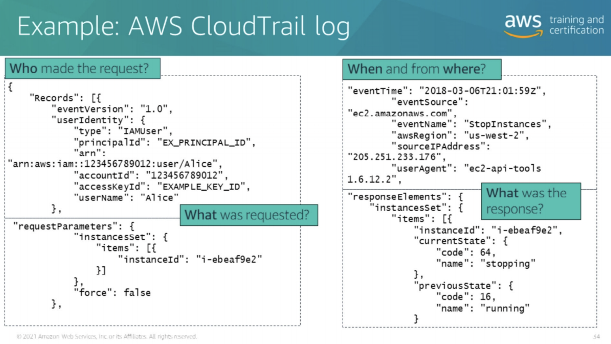

# Storage Services

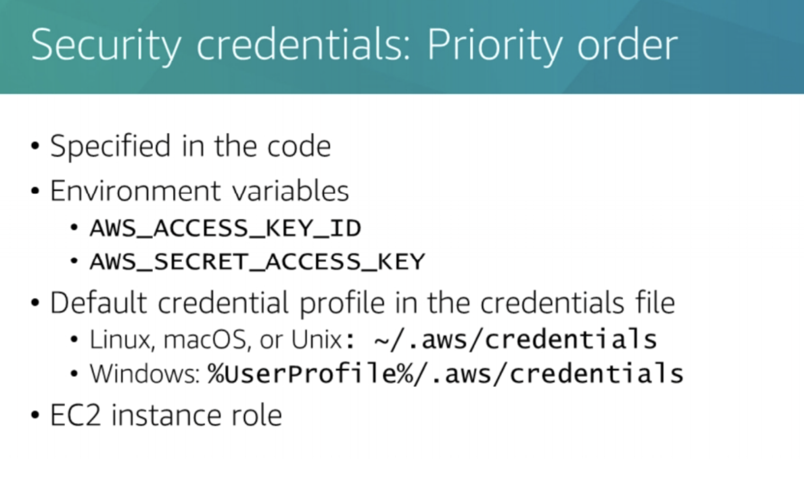</br>
