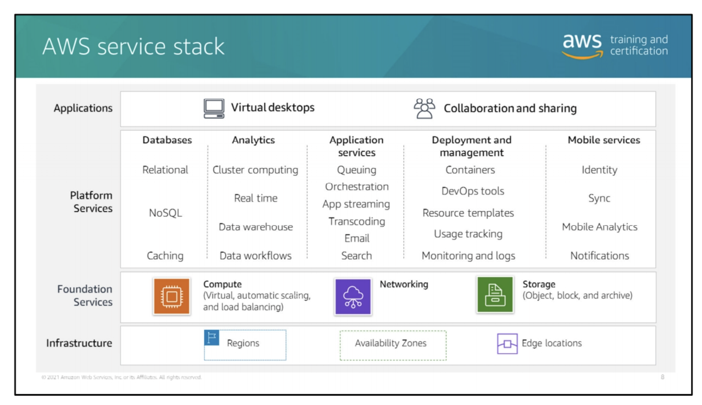
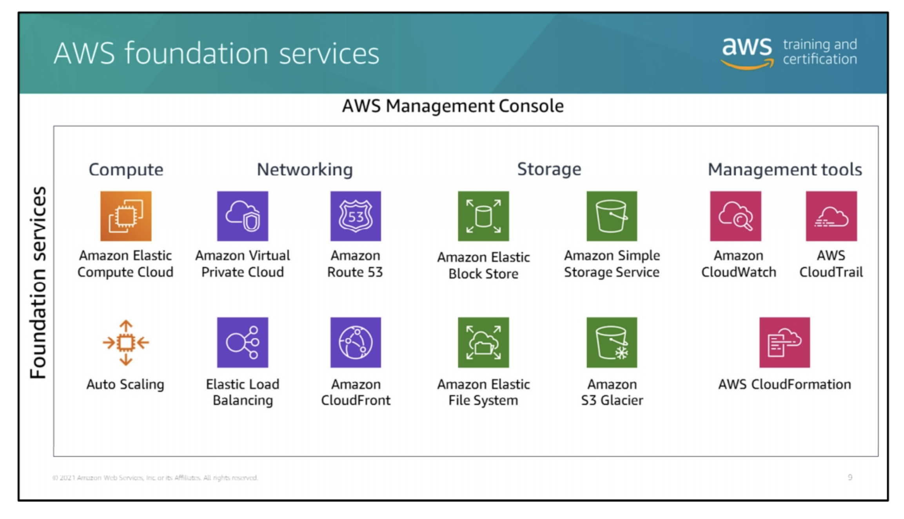
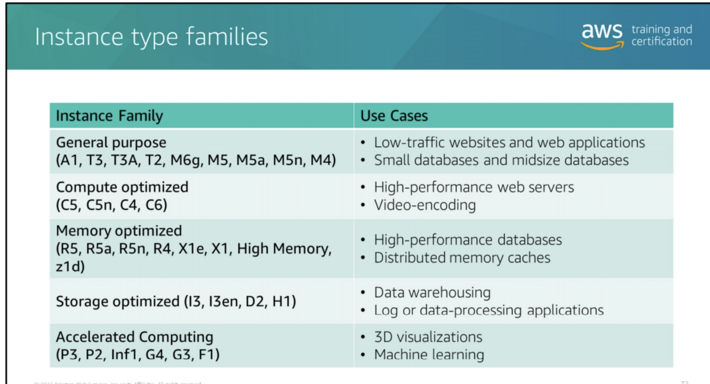
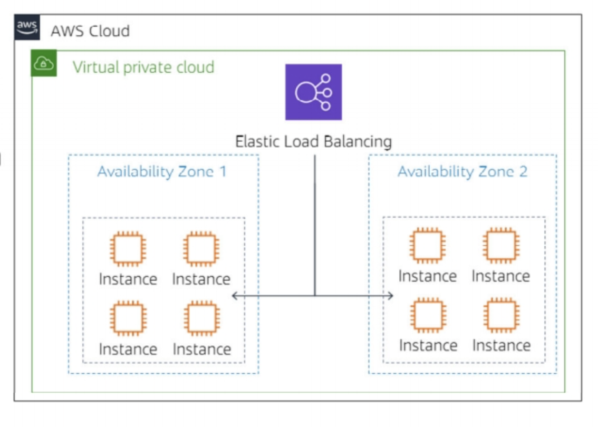
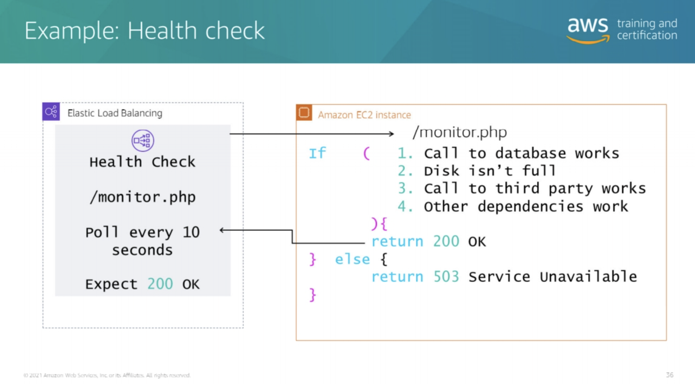
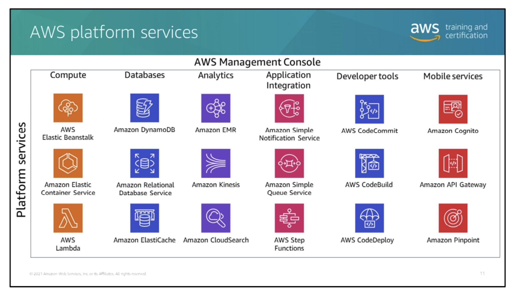
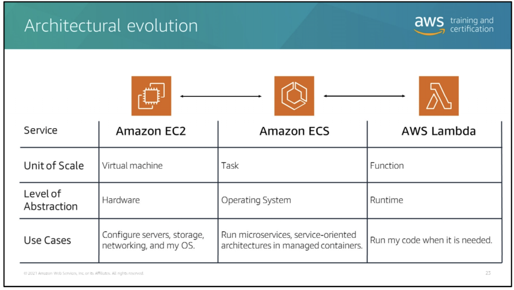
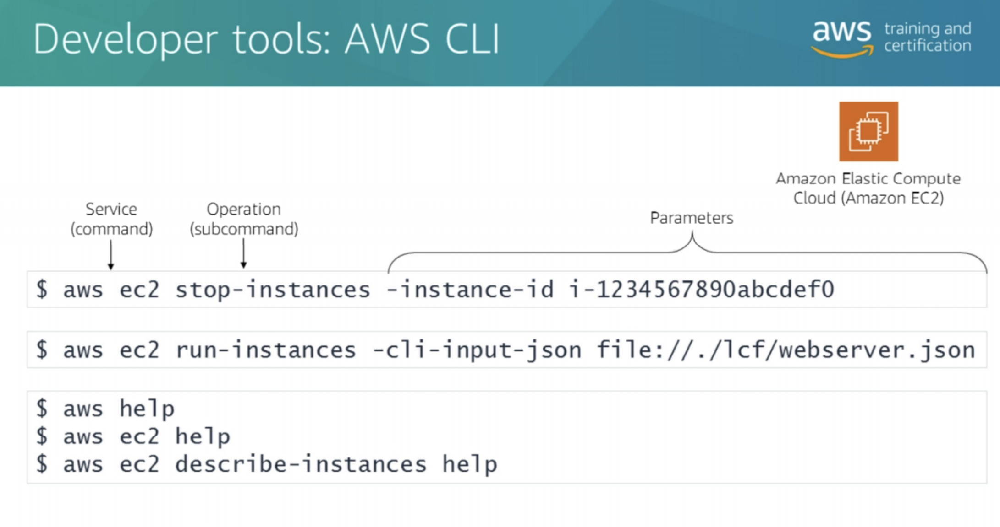
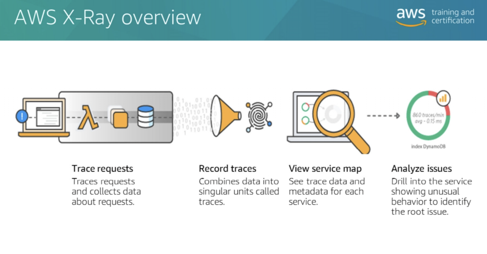

# Introduction to AWS

# What is Cloud Computing?

* Cloud computing enables you to stop thinking of your infrastructure as hardware, and instead think of it (and use it)
  as software.

## Models of Cloud Computing

* **Infrastructure as Service (IaaS):** Basic building blocks for cloud IT
    * Network features
    * Computer
    * Data storage space
* **Platform as a service (PaaS):** Enables you to run applications without the need to manage underlying
  infrastructure (
  for example hardware and operation system)
* **Software as a service (SaaS):** Provides you with a completed product that the service provider runs and manages

## AWS service Stack



## AWS Foundation Services



* AWS provides several foundation services
    * Compute:
        * Amazon Elastic Compute Cloud (EC2) id AWS compute services
        * Easy to boot new server
        * You can combine EC2 with Elastic Load Balancing and Auto Scaling services to develop a high availability and
          high-performance infra for your apps.
    * Networking:
        * Networking group provides a DNS
            * DNS can give direct control over your AWS and interaction with EC2 instances over your network.
    * Storage:
        * Provides several type of storage options

### Compute

* **Amazon Elastic Compute Cloud (EC2) :**
    * Provides pay-as-you-go pricing
    * Creates Amazon Machine Images (AMIs)
    * Add / terminate instances as needed
    * Pause / Resume instances
    * Scalability:
        * Scale in -> add more instance
        * Scale out -> removes instance
        * Scale up -> extend current memory , not recommended
        * Scale down -> downgrad current memory , not recommended
    * Pricing
        * On-demand
        * Reserved instance
        * Spot instance: is %90 less than on-demand.
            * Spot Instances are unused EC2 capacity; the price you pay is determined by the supply and demand for the
              instance
            * You can specify max price willing to pay by instance hour
                * can reduce the cost of running your Hadoop or Spark clusters, increase your compute capacity and
                  throughput without increasing your budget, or both
            * Spot Instances are also available to run for a predefined duration



* General purpose instances provide a balanced set of resources and a low-cost platform that is well suited for a wide
  variety of applications.
* Compute optimized instances provide a higher level of processing performance and are ideal for applications that
  require higher absolute CPU and memory capacities. For example, these include encoding applications, high-traffic
  content management systems, and Memcached applications.
* Memory optimized instances offer large memory sizes for high-throughput applications, including database and
  memory-caching applications.
* Accelerated Computing instances have proportionally more CPU resources than memory (RAM) and are well suited for
  compute-intensive applications. Various high-storage and cluster-computer instance types are also available
* [AWS instance Types](http://aws.amazon.com/ec2/instance-types/)


* **Amazon Elastic Load Balancing :**
    * Distributes traffic accross multiple targets, such as Amazon EC2 instances in multiple available zone, containers
      and IP addresses
    * Supports health check of EC2 instances
    * Supports routing and load balancing of EC2 instances.

</br>


## AWS Platform Services

* Platform services devided 4 categories
* Database: several options to store data based on the type
    * SQL: Amazon Relational Database (Amazon RDS)
    * NoSQL :
        * AWS DynamoDb is a great key value database
        * AWS Document DB : Document DB
        * AWS ElasticCache, for Redis or MemCache
        * Amazon Redshift for data warehouse
* Analytics: provides services to analyse big data
    * Amazon Kinesis
    * Amazon EMR
* Development Tools:
    * AWS CodeCommit is a source control service is combined with development services such as
        * AWS CodeDeploy
        * AWS Elastic Beanstalk
        * AWS Cloud Formation
    * Helps to create robust DevOps model.
* Mobile:
    * AWS Simple Notification Service SNS for notification.
    * Amazon Cognito for authentication and saving mobile user data
    * Amazon Pinpoint to measure and analyse mobile application usage



## Architecture Evaluation



# AWS Identity and Access Management

* **AWS IAM(Identity Access Management) :**
    * IAM enables you to create and manage AWS users and groups. With IAM, you can set up roles and policies to control
      access to AWS services.
    * Security of the Cloud = AWS
    * Security in the Cloud = You
    * To see who changed user account? Configure AWS CloudTrail or not.
    * When you create IAM **policies**, follow the principle of least privilege—that is, granting only the permissions
      required to perform a task. Determine what users need to do and then craft policies that allow the users to
      perform only those tasks
    * A **role** has policies granting access to specific services and operations.

# Developer Tools

* **AWS Cloud9 :** Creates a Development environment
    * Has all apps you can download

* **AWS SDK**
    * helps to build infra with code

* **AWS CLI:**
* Aws command, followed by the three parts:
    * Command – The top-level service that you are calling (for example, Amazon EC2, Amazon CloudWatch). For a list of
      currently supported services, see [Cli Doc](http://docs.aws.amazon.com/cli/latest/reference/). Using the example
      script, Amazon EC2 is being called.
    * Subcommand – The operation to perform on that service (for example, run-instances, put-metric-data). In this
      Amazon EC2 example, the run-instances subcommand requests the creation of a new Amazon EC2 instance.
    * Parameters – Any arguments required to perform the operation. Argument names are preceded by two dashes (--). For
      example, to run the Amazon EC2 run instances operation, pass in a number of parameters, such as the AMI ID, to
      create the instance.
    * Options – The AWS CLI also provides choices that you can specify when executing operation. For example, you can
      use the --query option to limit the response text so that it returns only the instance ID of your new instan



* to list EC2 instances

```shell
aws ec2 describe-instances
```

* To run an EC2 instance with one line command

```shell
aws ec2 run-instances --image-id ami-0164f9b296f8e78cc --instance-type t4g.micro --count 1 --key-name Calvin_Key_Pair --security-group-ids sg-0ad8af9859c84d24d --subnet-id subnet-0983cbe1804161068 --block-device-mappings DeviceName=/dev/sdh,Ebs={VolumeSize=10}  --dry-run
```

* stop instance

```shell
aws ec2 stop-instances --instance-id i-123456
```

* Configure the aws region info

```shell
aws configure
```

* **AWS X-Ray :**
    * helps to track all actions.
    * helps developers analyze and debug production or distributed applications
    * X-Ray provides a complete view of requests as they travel through your application, and shows a map of your
      application’s underlying components.
    * Creates service map
        * This provides you with a view of connections among services in your application. The service map enables you
          to do the following:
            * Create a dependency tree
            * Detect latency or errors when working across AWS Availability Zones or AWS Regions
            * Identify services not operating as expecte
    * Will show you how long the process takes time
    * identify errors and bugs
        * X-Ray can automatically highlight bugs or errors in your application code by analyzing the response code for
          each request made to your application.
    * identify performance bottlenecks
        * With service maps, you can view relationships between services and resources in your application in real time.
          You can easily detect where high latencies are occurring and visualize node and edge latency distribution for
          services.
    * Build our own analysis and visualization app
        * X-Ray provides a set of query APIs you can use to build your own analysis and visualizations applications that
          use the data that X-Ray records
    * X-Ray Commands: https://docs.aws.amazon.com/xray/latest/api/API_Operations.html
    * Instromentantion for code
    * [Integration with other services](https://github.com/aws?q=xray-sdk.)



# Management Tools:

* **AWS CloudWatch**:
    * Monitor performance metrics/ analytic
    * Collects ant tracks metrics
    * Setup alarms
    * Create dashboards
    * Does not tall you one of instances sotting down

* AWS CloudTrail:
    * tells you who, what and why?


* AWS Lambda :
    * AWS Lambda can automatically run code in response to multiple events, such as:
        * HTTP requests through Amazon API Gateway
        * Modifications to objects in Amazon S3 buckets
        * Table updates in Amazon DynamoDB
        * State transitions in AWS Step Functions
