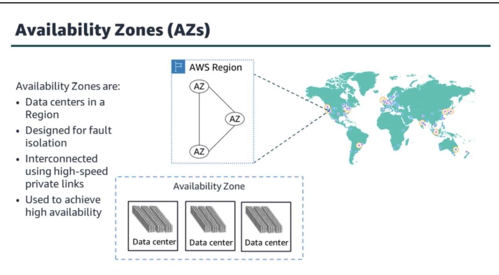
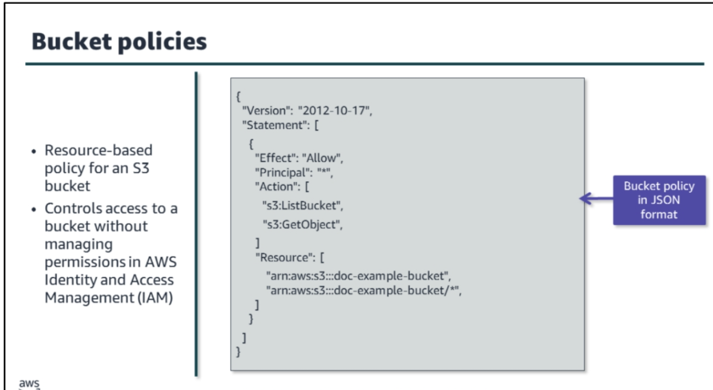

# Architecting on AWS

# Outlook

* [Fundamentals](#fundamentals)
* [Account Security](#account-security)
* [Networking](#networking)
* [Compute](#compute)
* [Storage](#storage)
* [Database Services](#database-services)
* [Monitoring and Storing](#monitoring-and-storing)
* [Automation](#automation)
* [Containers](#containers)
* [Serverless](#serverless)
* [Edge Services](#edge-services)
* [Backup and Recovery](#backup-and-recovery)

# Fundamentals

* AWS is the world’s most comprehensive and adopted cloud solution.
    * AWS offers services such as compute, database, and storage.
    * The AWS pay-as-you-go model, and its security practices, have made AWS the preferred cloud solution for businesses
      and public organizations.
* 
* Product list [here](https://aws.amazon.com/products/)

## AWS infrastructure

* 
* [AWS data Centers](https://aws.amazon.com/compliance/data-center/data-centers/)
    * 
* AWS Availability Zones [Global infra](https://aws.amazon.com/about-aws/global-infrastructure/):
    * A group of Data center called Availability Zones (AZ)
    * An Availability Zone is one or more discrete data centers with redundant power, networking, and connectivity in an
      AWS Region.
    * 
* AWS Region [Region AZ](https://aws.amazon.com/about-aws/global-infrastructure/regions_az/)
    * Each AWS Region consists of multiple isolated and physically separate Availability Zones within a geographic area.
      This achieves the greatest possible fault tolerance and stability. In your account, you determine which Regions
      you need
    * 
    * Factors impact Region Selection:
        * Governance and legal requirements – Consider any legal requirements based on data governance, sovereignty, or
          privacy laws.
        * Latency – Close proximity to customers means better performance.
        * Service availability – Not all AWS services are available in all Regions.
        * Cost – Different Regions have different costs.
* AWS Local Zones [Local zones](https://aws.amazon.com/about-aws/global-infrastructure/localzones/) :
    * AWS Local Zones can use for highly demanding applications that require single-digit millisecond latency to end
      users, For example:
        * Media and entertainment content creation – Includes live production, video editing, and graphics-intensive
          virtual workstations for artists in geographic proximity
        * Real-time multiplayer gaming – Includes real-time multiplayer game sessions, to maintain a reliable gameplay
          experience
        * Machine learning hosting and training – For high-performance, low latency inferencing • Augmented reality (AR)
          and virtual reality (VR) – Includes immersive entertainment, data driven insights, and engaging virtual
          training experiences
    *   
* Edge Location:
    * An edge location is the nearest point to a requester of an AWS service. Edge locations are located in major cities
      around the world. They receive requests and cache copies of your content for faster delivery.
    * You employ a worldwide network of edge sites that enable AWS services to provide content to users with lower
      latency.
        * Through a global point of presence (PoP) network made up of edge locations and regional edge cache servers,
          CloudFront distributes customer content.
        * When you have content that is not accessed frequently enough to stay in an edge location, regional edge
          caches—used by default with CloudFront—are employed.
        * This content is absorbed by local edge caches, eliminating the need to retrieve it from the origin server.
        * [AWS Cloud Front Key Features](https://aws.amazon.com/cloudfront/features/?whats-new-cloudfront.sort-by=item.additionalFields.postDateTime&whats-new-cloudfront.sort-order=desc)
        * For example:
            * edge locations is to serve content closer to your customers. An example of a video file
              stored in Amazon Simple Storage Service (Amazon S3) in South America. The file is cached to an edge
              location near the customer to serve the video file faster to a customer in A
    *   
* When to use AWS Local Zones?
    * You should use AWS Local Zones to deploy AWS compute, storage, database, and other services closer to your end
      users for low-latency requirements. With AWS Local Zones, you can use the same AWS infrastructure, services, APIs,
      and tool sets that you are familiar with in the cloud
* When to use AWS Edge Locations?
    * You should use edge locations for caching the data (content) to provide fast delivery of content for users. Using
      edge locations allows for a better user experience, providing faster delivery to users at any location.

## AWS Well-Architecture Framework

* [AWS Well Architecture tools](https://aws.amazon.com/architecture/well-architected/?wa-lens-whitepapers.sort-by=item.additionalFields.sortDate&wa-lens-whitepapers.sort-order=desc&wa-guidance-whitepapers.sort-by=item.additionalFields.sortDate&wa-guidance-whitepapers.sort-order=desc)
* [AWS Well Architect Labs](https://www.wellarchitectedlabs.com/)
* [AWS Well-Architected Tool – Review Workloads Against Best Practices](https://aws.amazon.com/blogs/aws/new-aws-well-architected-tool-review-workloads-against-best-practices/)
    * The AWS WA Tool is a self-service tool you can use to review the state of your existing workloads and compare them
      to the latest AWS architectural best practices. It is designed to help architects and their managers review AWS
      workloads without the need for an AWS SA. This service is based on the AWS Well-Architected Framework
* [Successful solutions architects do these five things](https://aws.amazon.com/blogs/training-and-certification/successful-solutions-architects-do-these-five-things/)
*   
* The AWS Well-Architected Framework helps cloud architects build secure, high-performing, resilient, and efficient
  application infrastructures. It is a consistent approach for customers and partners to evaluate architectures and
  implement designs that can scale over time
* 
* The architectural reviews focus on the following:
    * Security – Use AWS security best practices to build policies and processes to protect data and assets. Allow
      auditing
      and traceability. Monitor, alert, and audit actions and changes to your environment in real time.
    * Cost optimization – Achieve cost efficiency while considering fluctuating resource needs. • Reliability – Meet
      well-defined operational thresholds for applications. This includes support to recover from failures, handling
      increased
      demand, and mitigating disruption.
    * Performance efficiency – Deliver efficient performance for a set of resources like instances, storage, databases,
      space, and time.
    * Operational excellence – Run and monitor systems that deliver business value. Continually improve supporting
      processes
      and procedures.
    * Sustainability – Minimize and understand your environmental impact when running cloud workloads.

# Account Security

* When you create first an AWS account you create root account.
* AWS strongly recommends that you not use root account credentials for day-to-day interactions with AWS. Create users
  for everyday tassk
* Create your additional users and assign permissions to these users following the principle of least privilege.
    * Grant users only the level of access they require and nothing
      more [AWS Identity and Access Management User Guide](https://docs.aws.amazon.com/IAM/latest/UserGuide/best-practices.html#grant-least-privilege)
* Use IAM to control who is authenticated (signed in) and authorized (has permissions) to use resources
* [policies and Permissions](https://docs.aws.amazon.com/IAM/latest/UserGuide/access_policies.html)
* Principal:
    * A principal is an entity that can request an action or operation on an AWS resource. IAM users and IAM roles are
      the most common principals you work with,
    * A principal can also be an AWS service , like Amazon Elastic Compute Cloud (ec2)
* [Federated users](https://aws.amazon.com/identity/federation/) are external users and AWS is not manage those users
    * 

* **IAM**:
    * By default, a new IAM user has no permissions to do anything. The user is not authorized to perform any AWS
      operations or access any AWS resources.
    * An advantage of having individual IAM users is that you can assign permissions individually to each user
    * 
    * [AWS Identity and Access Management User Guide](https://docs.aws.amazon.com/IAM/latest/UserGuide/id_users.html)
* [To setup AWS CLI in your client](https://docs.aws.amazon.com/cli/latest/userguide/cli-configure-quickstart.html)
* **IAM USer Group:**
    * An IAM user group is a collection of IAM users. With user groups, you can specify permissions for multiple users,
      which makes it easier to manage the permissions.
    * [AWS User Group](https://docs.aws.amazon.com/IAM/latest/UserGuide/id_groups.html)
* **IAM Roles:**
    * IAM roles deliver temporary AWS credentials.
    * They’re easy to manage because multiple employees and applications can use the same role.
    * There are no charges for using roles
    * Use roles to delegate access to users, applications, or services that don't normally have access to your AWS
      resources.
    * 
* **Assuming a Role:**
    * 
    * You assume a role using a trusted entity, such as an IAM user, an AWS service, or a federated user
    * AWS services can use the same API call to assume roles in your AWS accounts.
    * Federated users use either the AssumeRoleWithSAML or AssumeRoleWithWebIdentity API calls
    * The API call is made to AWS Security Token Service (AWS STS).
    * AWS STS is a web service that provides temporary, limited-privilege credentials for IAM or federated
      users.
        * It returns a set of temporary security credentials consisting of an access key ID, a secret access key, and
          a security token. These credentials are then used to access AWS resources.
    * The AssumeRole API is typically used for cross-account access or federation.
        * [AWS Security Token Service API Reference ](https://docs.aws.amazon.com/STS/latest/APIReference/welcome.html)
* Security Policy types
    * Policy types
        * **Identity-based policies** – Attach managed and inline policies to IAM identities. This includes users,
          groups to
          which users belong, and roles.
            * Identity-based policies are JSON permissions policy documents that control:
                * What actions an IAM identity (users, groups of users, and roles) can perform
                * On which resources
                * Under what condition
            * Identity-based policies can be categorized by the following types:
                * **Managed policies –** Standalone identity-based policies that you can attach to multiple users,
                  groups, and roles in your AWS account. There are two types of managed policies: o AWS managed policies
                    * **Managed policies** that are created and managed by AWS. They are built to provide specific
                      service access or permissions for job functions.
                    * **Customer managed policies -** Managed policies that you create and manage in your AWS account.
                      Customer managed policies provide more precise control over your policies than AWS managed
                      policies.
                * **Inline policies –** Policies that you add directly to a single user, group, or role. Inline policies
                  maintain a strict one-to-one relationship between a policy
                    * An inline policy is one that you create and embed directly to an IAM group, user, or role. Inline
                      policies can't be reused on other identities or managed outside of the identity where they exist.
                    * [Use customer managed policies instead of inline policies](https://docs.aws.amazon.com/IAM/latest/UserGuide/best-practices.html#best-practice-managed-vs-inline)
            * **Resource-based policies** – Attach inline policies to resources. The most common examples of
              resource-based
              policies are Amazon S3 bucket policies and IAM role trust policies.
                * Resource-based policies are JSON policy documents that you attach to a resource such as an Amazon S3
                  bucket.
                * These policies grant the principal permission to perform specific actions on that resource and define
                  under what conditions this applies.
                * Resource-based policies are inline policies. There are no managed resource-based policies.
        * **AWS Organizations service control policies (SCPs)** – Use Organizations SCPs to define the maximum
          permissions for account members of an organization or organizational unit (OU).
        * **IAM permissions boundaries** - AWS supports permissions boundaries for IAM entities (users or roles). Use
          IAM permissions boundaries to set the maximum permissions that an IAM entity can receive.

* Identity Based Policy example
    * 
    * A JSON identity-based policy document includes these elements:
        * Version – The Version policy element specifies the language syntax rules that are to be used to process a
          policy. To use all of the available policy features, include the value “2012-10-17” for the version in your
          policies.
        * Effect – Use Allow or Deny to indicate whether the policy allows or denies access.
        * Action (or NotAction) – Include a list of actions that the policy allows or denies.
        * Resource (or NotResource) – You must specify a list of resources to which the actions apply.
        * Condition (or NotCondition) – Specify the circumstances under which the policy grants permission.
* By default, all requests are implicitly denied with the exception of the AWS account root user, which has full access.
  This is called an implicit deny.
    * An explicit allow in an identity-based or resource-based policy overrides this default.
    * An explicit deny in any policy overrides any allows

* Resource-based policy example:
    * 
    * Resource-based policies are attached to a single resource, like an S3 bucket or AWS Lambda function.
    * With resource-based policies, you choose who has access to the resource and what actions they can perform on it.
    * you must list the **principal** account, user, role, or federated user to which you want to allow or deny access.
      If you are creating an IAM permissions policy to attach to a user or role, you cannot include this element. The
      principal is implied as that user or role
    * The **resource** element is optional. If you do not include this element, the resource to which the action applies
      is the resource to which the policy is attached.
* Defense in depth:
    * Defense in depth is a strategy focused on creating multiple layers of security
    * 
    * In this example different users try to access a document in your S3 bucket. Each user needs an
      identity-based policy assigned to either their user or a role they assume to access AWS. They then navigate
      through layers of resource-based policies—first a VPC endpoint policy, then a bucket policy for the S3 bucket.
      Your users are able to access the documents they need for their task. You will learn more about VPC endpoints and
      S3 buckets later in this course
    * [policy evaluation logic](https://docs.aws.amazon.com/IAM/latest/UserGuide/reference_policies_evaluation-logic.html)

* IAM Permissions boundaries
    * AWS supports permissions boundaries for IAM entities—users or roles.
    * A permissions boundary is an advanced feature for using a managed policy to set the maximum permissions that an
      identity-based policy can grant to an IAM entity.
    * Permissions boundaries act as a filter.
    * An entity's permissions boundary allows it to perform only the actions that are allowed by both its identity-based
      policies and its permissions boundaries.
    * [Permissions boundaries for IAM entities](https://docs.aws.amazon.com/IAM/latest/UserGuide/access_policies_boundaries.html)

## Managing multiple aws accounts

* AWS Organization:
* 
* AWS Organizations provides these key features:
    * Centralized management of all your AWS accounts
    * Consolidated billing for all member accounts
    * Hierarchical grouping of your accounts to meet your budgetary, security, or compliance needs
    * Policies to centralize control over the AWS services and API actions that each account can access
    * Policies to standardize tags across the resources in your organization's accounts
    * Policies to control how AWS artificial intelligence (AI) and machine learning (ML) services can collect and store
      data
    * Policies that configure automatic backups for the resources in your organization's accounts
    * Integration and support for IAM
    * Integration with other AWS services
    * Global access
    * Data replication that is eventually consistent
    * No cost for use
* [Inheritance for service control policies](https://docs.aws.amazon.com/organizations/latest/userguide/orgs_manage_policies_inheritance_auth.html)

* Service Control Policy (SCPs):
    * An SCP is a type of organization policy that you can use to manage permissions in your organization. SCPs:
        * Offer central control over the maximum available permissions for all accounts in your organization
        * Help your accounts stay within your organization’s access control guidelines
        * Are available only in an organization that has all features turned on
    * AWS Organizations is a service for grouping and centrally managing the AWS accounts that your business owns. If
      you enable all features in an organization, then you can apply service control policies (SCPs) to any or all of
      your accounts.
    * Attaching an SCP to an Organizations entity (root, OU, or account) defines a guardrail. SCPs set limits upon the
      actions that the IAM users and roles in the affected accounts can perform.
    * To grant permissions, you need to attach identity-based or resource-based policies to IAM users, or to the
      resources in your organization's accounts.
    * When an IAM user or role belongs to an account that is a member of an organization, the SCPs limit the user's or
      role's effective permissions.
    * 
    * In the example, an SCP allows all EC2 and S3 actions. A collection of IAM identity-based permissions allow all EC2
      and IAM actions. The effective allowed permissions for the IAM identity are all EC2 actions. It excludes both S3
      and IAM actions because they are not explicitly allowed in both policy types.

# Networking

* **CIDR**:
    * CIDR notation defines an IP address range for a network or a subnet. This range is referred to as a CIDR block.
    * When building your network in AWS using VPC components, you specify CIDR blocks for your VPC and subnets. You must
      allocate enough IP addresses to support the resources on your network. Your VPC can have up to five CIDR blocks,
      and their address ranges cannot overlap.
    * Amazon VPC supports Ipv4 and IPv6 it has different CIDR blocks, IPV4 is default defined for all VPCs, you can not
      change this behaviour.
    * 
* **VPC Fundamentals:**
    * 
    * With Amazon VPC, you can launch AWS resources into a virtual network that you have defined. VPCs deploy into one
      of the AWS Regions and can host resources from any Availability Zone within its Region.
    * Amazon VPC is designed to provide greater control over the isolation of your environments and their resources.
    * With Amazon VPC, you can:
        * Select your own IP address range
        * Create subnets
        * Configure route tables and network gateway
    * [What is VPC?](https://docs.aws.amazon.com/vpc/latest/userguide/what-is-amazon-vpc.html)
    * 
    * Each AWS account comes with a default Amazon VPC that is preconfigured for you to use immediately. The default
      Amazon VPC is suitable for getting started quickly and for launching public instances, such as a blog or simple
      website
* **Subnet**:
    * 
    * A subnet is a range of IP addresses in your VPC.
    * Use a public subnet for resources that must be connected to the internet and a private subnet for resources that
      won't be connected to the internet. A subnet resides within one Availability Zone.
    * The first four IP addresses and the last IP address in each subnet CIDR block are not available and cannot be
      assigned to an instance.
        * For example, in a subnet with CIDR block 10.0.0.0/24, the following five IP addresses are reserved:
            * 10.0.0.0: Network address.
            * 10.0.0.1: Reserved by AWS for the VPC router.
            * 10.0.0.2: Reserved by AWS. The IP address of the DNS server is always the base of the VPC network range
              plus 2.
            * 10.0.0.3: Reserved by AWS for future use.
            * 10.0.0.255: Network broadcast address. We do not support broadcast in a VPC; therefore, we reserve this
              address.

* **Public Subnet:**
    * Your public subnet configuration acts as a two-way door—allowing traffic to flow in either direction, invited or
      not invited.
    * Since there is no automatic outbound routing, you must configure a subnet to be public.
    * A public subnet requires the following:
        * Internet gateway: The internet gateway allows communication between resources in your VPC and the internet.
        * Route table: A route table contains a set of rules (routes) that are used to determine where network traffic
          is directed. It can direct traffic to the internet gateway.
        * Public IP addresses: These are addresses that are accessible from the internet. Public IP addresses obscure
          the private IP addresses, which are only reachable within the network.

* **Internet gateway:**
    * internet gateway is a horizontally scaled, redundant, and highly available VPC component that permits
      communication between instances in your VPC and the internet. It imposes no availability risks or bandwidth
      constraints on your network traffic
    * An internet gateway serves two purposes:
        * It provides a target in your route table for internet-routable traffic.
        * It protects IP addresses on your network by performing network address translation (NAT).
    * **Provides a target in your route table for internet-routable traffic**
        * A subnet does not allow outbound traffic by default. Your VPC uses route tables to determine where to route
          traffic. To allow your VPC to route internet traffic, you create an outbound route in your route table with an
          internet gateway as a target, or destination
    * **Protects IP addresses on your network by performing network address translation (NAT)**
    * Resources on your network that connect to the internet should use two kinds of IP addresses:
        * Private IP: Use private IPs for communication within your private network. These addresses are not reachable
          over the internet.
        * Public IP: Use public IP addresses for communication between resources in your VPC and the internet. A public
          IP address is reachable over the internet.
    * [Connect to the internet using an internet gateway](https://docs.aws.amazon.com/vpc/latest/userguide/VPC_Internet_Gateway.html)

* **Route Tables:**
    *  
      * In this example, both route tables direct network traffic locally, but the public route table includes routes to the internet gateway.
    * A route table contains a set of rules (routes) that the VPC uses to determine where to direct network traffic.
    * When you create a VPC, it automatically has a main route table, that is a local route that permits communication
      for all the resources within the VPC and you can not modify the local route table.
    * Each subnet in your VPC must be associated with a route table. If you don't explicitly associate a subnet with a
      particular route table, the subnet is implicitly associated with and uses the main route table. A subnet can be
      associated with only one route table at a time, but you can associate multiple subnets with the same route table.
      Use custom route tables for each subnet to permit granular routing for destinations
    * [Configure Route tables](https://docs.aws.amazon.com/vpc/latest/userguide/VPC_Route_Tables.html)
    * Private subnets allow indirect access to the internet.
    * While you can put web-tier instances into a public subnet, we recommend that you put web-tier instances inside
      private subnets behind a load balancer placed in a public subnet

* **Elastic IP Address:**
    * An Elastic IP address is a static, public IPv4 address designed for dynamic cloud computing.
    * You can associate an Elastic IP address with any instance or network interface for any VPC in your account
    * With an Elastic IP address, you can mask the failure of an instance by rapidly remapping the address to another
      instance in your VPC.
    * You can move one Elastic IP to another instance. Instance can be the same or another VPC.
    * Elastic IP can access through to internet gateway of a VPC. If you use VPn can not possible to use Elastic IP.
    * You are limited to five Elastic IP addresses.
    * To help conserve them, you can use a NAT device. We strongly encourage you to use an Elastic IP address primarily
      for the ability to remap the address to another instance in the case of instance failure, and to use DNS hostnames
      for all other inter-node communication
    * 
    * In this example EC2 instance uses Elastic IP 203.0.133.15 fails and this elastic IP assign another EC2 instance.
    * VPC in a single AZ with a public and private subnet. Customers connect to the VPC through an internet gateway. The
      private subnet has one EC2 instance with a private IP of 172.31.128.75. The public subnet has two EC2 instances.
      The one with a private IP of 172.31.0.50 fails. The second, with a private IP of 172.31.32.51, is still running.
      The Elastic IP address is reassigned from the failed instance to the running instance

* **Elastic Network Interface:**
    * An elastic network interface is a logical networking component in a VPC that represents a virtual network card.
    * When you move a network interface from one instance to another, network traffic is redirected to the new instance.
      Each instance in a VPC has a default network interface (the primary network interface).
    * You can attach additional network intefaces
    * Attaching multiple network interfaces to an instance is useful when you want to do the following
        * Create a management network.
        * Use network and security appliances in your VPC.
        * Create dual-homed instances with workloads or roles on distinct subnets.
        * Create a low-budget, high-availability solution
    * You can attach a network interface in one subnet to an instance in another subnet in the same VPC.
    * However, both the network interface and the instance must reside in the same Availability Zone. This limits its
      use for disaster recovery (DR) scenarios, where you would want to redirect traffic to another Availability Zone.

* **Network Address Translation with NAT Gateways:**
    * NAT maps one IP address to another message.
    * NAT maps private IP addresses to a public IP address, you can use it to allow private IP networks to connect to
      the internet.
    * A single device, such as a router, can act as an agent between the internet (public network) and a local network (
      private network)
    * NAT communicates between instances in your VPC and the internet.
    * They are horizontally scaled, redundant, and highly available by default.
    * NAT gateways provide a target in your subnet route tables for internet-routable traffic.
        * Instances in the private subnet can initiate outbound traffic to the internet or other AWS services.
        * NAT gateways managed by AWS prevent private instances from receiving inbound traffic from the internet
    * You set up NAT gateways in the public subnets to handle outbound traffic to the internet from private subnets.
      This provides internet connectivity while preventing external traffic from connecting with your private instances.
    * You can put NAT gateways in both public and private subnets.
    * 
    * **Connecting Private subnets to internet**
    * You can use a NAT gateway for a one-way connection between private subnet instances and the internet or other AWS
      services. This type of connection prevents external traffic from connecting with your private instances
        * The route table for the private subnet sends all IPv4 internet traffic to the NAT gateway.
        * The NAT gateway uses its Elastic IP address as the source IP address for traffic from the private subnet.
        * The route table for the public subnet sends all internet traffic to the internet gateway. This is not
          supported for IPv6.
    * **Deploy a VPC accros multiple available zones**
        * 
        * In this diagram of a VPC spanning two Availability Zones, the backend servers are in two private subnets in
          the two separate Availability Zones. They send outbound traffic to NAT gateways in public subnets located in
          their Availability Zone. Backend traffic from both NAT gateways route to an internet gateway.
        * Elastic Load Balancing receives inbound traffic and routes it to the application servers in the private
          subnets of both Availability Zones.

## VPC traffic Security

* **Network Access Control Lists (ACLs)**
    * 
    * A network ACL is an optional layer of security for your VPC that acts as a firewall for controlling traffic in and
      out of one or more subnets.
    * Every VPC automatically comes with a default network ACL. It allows all inbound and outbound IPv4 traffic.
    * You can create a custom network ACL and associate it with a subnet.
    * By default, custom network ACLs deny all inbound and outbound traffic until you add rules.
    * A network ACL contains a numbered list of rules, which are evaluated in order, starting with the lowest numbered
      rule
    * Components of a network ACL rule include the following:
        * Rule number – Rules are evaluated starting with the lowest numbered rule.
        * Type – The type of traffic, for example, Secure Shell (SSH). You can also specify all traffic or a custom
          range.
        * Protocol – You can specify any protocol that has a standard protocol number.
        * Port range – The listening port or port range for the traffic, for example, 80 for HTTP traffic.
        * Source – For inbound rules only, the source of the traffic (CIDR range).
        * Destination – For outbound rules only, the destination for the traffic (CIDR range).
        * Allow or Deny – Whether to allow or deny the specified traffic.
    * [Control traffic to subnets using Network ACLs](https://docs.aws.amazon.com/vpc/latest/userguide/vpc-network-acls.html)

* **Security Groups**:
    * A security group acts as a virtual firewall for your instance to control inbound and outbound traffic.
    * Security groups act at the network interface level, not the subnet level, and they support Allow rules only.
    * 
    * Security Groups in default VPC allows all outbound traffic
    * Custom security group does not have inbound rules and allow only outbound traffic.
    * [Control traffic to resources using security groups](https://docs.aws.amazon.com/vpc/latest/userguide/VPC_SecurityGroups.html)
    * With security group rules, you can filter traffic based on protocols and port numbers. Security groups are
      stateful—if you send a request from your instance, the response traffic for that request is allowed to flow in
      regardless of inbound security group rules.
    * 
    * This table displays both inbound and outbound security group rules for a web server. The inbound rules allow for
      traffic on port 80 and port 443. Any user requesting the web server would be allowed in and the web server would
      return the response back to their request. From the outbound perspective, if trying to send traffic, not in
      response to something that was requested on 480 or 443, you are limited to the port 1433 and 3306.
    * Security Group chain
        * 

* **Multiple Layers of Defence Design:**
    * As a best practice, you should secure your infrastructure with multiple layers of defense.
    * You can control which instances are exposed to the internet by running your infrastructure in a VPC with a
      properly configured internet gateway and route tables.
    * You can also define security groups and network ACLs to further protect your infrastructure at the interface and
      subnet levels.
    * Additionally, you should secure your instances with a firewall at the operating system level and follow other
      security best practices.
    * 

* Comparing Security Group and ACLs
    * 
    * Security groups:
        * Security groups in default VPCs allow all traffic.
        * New security groups have no inbound rules and allow outbound traffic.
    * Network ACLs :
        * Network ACLs in default VPCs allow all inbound and outbound IPv4 traffic.
        * Custom network ACLs deny all inbound and outbound traffic, until you add rules.

# Compute

* 
* Virtual machines (VMs) provide the following:
    * Hardware independence
    * Faster provisioning speed, in minutes or hours
    * Pay-as-you-go pricing models instead of hardware purchases
    * More scale
    * Elastic resources
    * Greater agility
    * Reduced maintenance
* Containerization provides:
    * Platform independence
    * A consistent runtime environment
    * Higher resource use
    * Easier and faster deployments
    * Isolation and sandboxing
    * Quicker start speed, so you can deploy in seconds
* Serverless computing provides:
    * Continuous scaling
    * Built-in fault tolerance
    * Pay for value
    * Zero maintenance

## Elastic Compute Cloud EC2()

* EC2 is to create and run virtual machines
* Amazon EC2 is just like your traditional on-premises server, but it is available in the cloud. It can support
  workloads such as web hosting, applications, databases, authentication services, and anything else a server can
  support.
* Consideration while creating Ec2 instance:
    * Name and tags – How should your instance be identified?
    * Application and OS image – What will you start running?
    * Instance type and size – What technical requirements do you have?
    * Authentication and key pair – How do you plan to connect to the instance?
    * Network settings and security – What virtual private cloud (VPC), subnet, and security groups will you use?
    * Configure storage – What type of block storage is best for your use case?
    * Placement and tenancy – Where should you run your EC2 instances?
    * Scripts and metadata – What can you do to automate your launch
* Tags:
    * On AWS, you can assign metadata to your resources in the form of tags.
    * Each tag is a simple label consisting of a customer-defined key and an optional value.
    * Use tags to filter resources.
    * Tags can manage resource access control, track costs, help automate tasks, and keep you organize
    * [Tagging AWS resources](https://docs.aws.amazon.com/general/latest/gr/aws_tagging.html)
* Amazon Machine Image(AMI):
    * An AMI provides the information requires to launch an instance, which is a virtual server in cloud.
    * You can launch multiple servers by using AMI
    * An AMI includes:
        * A template for root volume for instance i.e an OS
        * Launch permission that controls which AWS account can use the AMI
        * Block device mapping that specifies the volume to attach to the instance when it is launched.
    * You can buy or sell AMIs through the following sources:
        * AWS user community
        * AWS Marketplace
    * To create a custom AMI, launch an instance and customize it to meet your requirements. Then, save that
      configuration as a custom AMI. Instances launched from this custom AMI will use all of your customization
    * [Amazon Machine Images (AMI)](https://docs.aws.amazon.com/AWSEC2/latest/UserGuide/AMIs.html)

* Understanding instance type names:
    * 
    * c – The first letter is the instance family. So, the c family, for example, is compute optimized. There are
      general purpose EC2 instances, burstable instances, and compute-intensive and memory-intensive instances, to name
      a few.
    * 6 –The next number is the generation, which gradually increases as AWS upgrades hardware in its data centers.
    * g – Sometimes there are one or more letters after the generation. The letters represent additional properties.
      In this example, the g stands for Graviton2, an ARM-based processor developed by AWS. Choose properties based on
      your needs, like optimized networking throughput or storage.
    * xlarge – The last part represents the size of the instance. This includes the CPU, memory, storage, and network
      performance.
* EC2 Types:
    * [Amazon EC2 Instance Types](https://aws.amazon.com/ec2/instance-types/)
    * 
    * General purpose:
        * Balance of compute, memory, and networking
        * Diverse workloads
        * Web application
    * Compute optimized:
        * Compute-bound applications
        * High-performance processors
        * Media transcoding
        * Scientific modeling
        * Machine learning
    * Memory optimized
        * Fast delivery of large data sets in memory
        * Database servers
        * Web caches
        * Data analytics
    * Accelerated computing
        * High-graphics processing
        * GPU bound
        * Machine learning
        * High performance comp
    * Storage optimized
        * High sequential read/write
        * Large data sets
        * NoSQL databases
        * Amazon OpenSearch Service
* Dedicated Host :
    * By default, EC2 instances have **shared tenancy**, meaning multiple AWS accounts might share the same physical
      hardware.
    * **Dedicated Instances** are EC2 instances that are physically isolated at the host hardware level from instances
      that
      aren't dedicated and from instances that belong to other AWS accounts.
    * When you launch instances on a **Dedicated Host**, the instances run on a physical server with EC2 instance
      capacity
      fully dedicated to your use. You are provided an isolated server with configurations that you can control. With
      Dedicated Hosts, you have the option to allow AWS to automatically select a server to place your instance. Or you
      can manually select a dedicated server to place your instance.
    * An Amazon EC2 Dedicated Host is a physical server fully dedicated for your use, so you can help address corporate
      compliance requirements.
    * [Amazon EC2 Dedicated Hosts](https://aws.amazon.com/ec2/dedicated-hosts/)
* Placement Groups:
    * [Placement groups](https://docs.aws.amazon.com/AWSEC2/latest/UserGuide/placement-groups.html)
    * **Cluster placement groups** are recommended for your applications that benefit from low network latency, high
      network
      throughput, or both. They are also recommended when the majority of the network traffic is between the instances
      in your group. HPC workloads can require this level of connectivity in your VPC.
    * **Spread placement groups** are recommended for applications that have a small number of critical instances that
      should be kept separate from each other. Services that require maximum uptime, such as a medical health record
      system, are more fault-tolerant in a spread.
    * **Partition placement groups** can be used to deploy your large distributed and replicated workloads. Avoid
      same-time
      hardware failures for multiple components by using partitions.
* User Data:
    * Runs script as root after the instance launches
    * Can be used to perform common authomated configuration tasks.
* Instance metadata
    * is data about your instance that you can use to configure or manage the running instance.
    * Instance metadata is divided into categories, for example, host name, events, and security group

## Amazon Elastic Block Store (EBS)

* Amazon EBS volumes provide durable, detachable, block-level storage for your Amazon EC2 instances. Because they are
  mounted to the instances, they can provide extremely low latency between where the data is stored and where it might
  be used on the instance. For this reason, they can be used to run a database with an Amazon EC2 instance.
* [Amazon Elastic Block Store (Amazon EBS)](https://docs.aws.amazon.com/AWSEC2/latest/UserGuide/AmazonEBS.html)
* EBS Volume types:
    * [Amazon EBS volume types](https://docs.aws.amazon.com/AWSEC2/latest/UserGuide/ebs-volume-types.html)
    * **General Purpose solid state drive (SSD)** volumes (gp2 and gp3) offer cost-effective storage that is ideal for a
      broad range of use cases. These volume types are ideal for boot volumes, small and medium-sized databases, and
      development and test environments. Use cases:
        * Transactional workloads
        * Virtual desktops
        * Medium-sized, single-instance databases
        * Low-latency interactive applications
        * Boot volumes
        * Development and test enviro
    * **Provisioned IOPS SSD volumes** (io1 and io2) are designed to meet the needs of I/O intensive workloads, for
      example, database workloads that are sensitive to storage performance and consistency. Provisioned IOPS SSD
      volumes use a consistent IOPS rate. You specify the rate when you create the volume. Amazon EBS delivers the
      provisioned performance 99.9 percent of the time.
    * **Throughput-optimized hard disk drive** (HDD) volumes (st1) provide low-cost magnetic storage that defines
      performance in terms of throughput rather than IOPS. This volume type is a good fit for large, sequential
      workloads such as Amazon EMR; extract, transform, and load (ETL); data warehouses; and log processing.
    * **Cold HDD (sc1) volumes** provide low-cost magnetic storage that defines performance in terms of throughput
      rather than IOPS. sc1 is a good fit for large, sequential
    * 
    * Provisioned IOP SSD use cases:
        * Workloads that require sustained IOPS performance or more than 16,000 IOPS
        * I/O intensive database workloads
    * Specific use cases for io2 Block Express include the following:
        * Sub-millisecond latency
        * Sustained IOPS performance
        * More than 64,000 IOPS or 1,000 MiB/s of throughput
    * 
    * HDD-backed volumes are optimized for large streaming workloads where throughput, measured in MiB/s, is a better
      performance measure than IOPS.
        * Use cases for Throughput Optimized HDD volumes include:
            * Big data
            * Data warehouses
            * Log processing
        * Use cases for Cold HDD volumes include:
            * Throughput-oriented storage for data that is infrequently accessed
            * Scenarios where the lowest storage cost is important
* Instance Storage:
    * An instance store provides temporary block-level storage for your instance. This storage is located on disks that
      are physically attached to the host computer.
    * An instance store is ideal for temporary storage of information that changes frequently, such as buffers, caches,
      scratch data, and other temporary content

* Purchase Options :
    * 
* Spot instance:
    * The hourly price for a Spot Instance is called a Spot price. The Spot price of each instance type in each
      Availability Zone is set by Amazon EC2. The price is adjusted gradually, based on the long-term supply and demand
      for Spot Instances. Your Spot Instance runs whenever capacity is available, and as long as your requested maximum
      price is higher than the Spot price. If your Spot request cannot be fulfilled, it fails
    * [Spot Instances](https://docs.aws.amazon.com/AWSEC2/latest/UserGuide/using-spot-instances.html)
    * Spot Instances are ideal for your fault-tolerant, flexible, loosely coupled, or stateless workloads.
    * 
    * 

## AWS Lambda

* [Serverless](https://aws.amazon.com/serverless/)
* [Managing Lambda reserved concurrency](https://docs.aws.amazon.com/lambda/latest/dg/configuration-concurrency.html)
* With Lambda, you can run code without provisioning or managing servers.
* The service runs your code on a high-availability compute infrastructure and performs all administration of the
  compute resources.
* This includes:
    * Server and OS maintenance
    * Capacity provisioning and automatic scaling
    * Code monitoring and logging
* 
* Event Source Example:
    * 
* [Common Lambda application types and use cases](https://docs.aws.amazon.com/lambda/latest/dg/applications-usecases.html)
* Lambda functions can be allocated up to 10 GB of memory. Lambda functions run for up to 15 minutes.

# Storage

* There are three types of cloud storage: object, file, and block
    * Amazon EBS for block storage
    * Amazon EFS and Amazon FSx for file storage
    * Amazon S3 and Amazon S3 Glacier for object storage

## Amazon Simple Storage Service S3 Bucket

* S3 is an object-level storage
* Amazon S3 storage tiers are all designed to provide 99.999999999% (11 9's) of data durability of objects over a given
  year
* With Amazon S3, you can:
    * Accelerate innovation – Integrate S3 buckets as storage solutions for static files and rely less on traditional
      file systems.
    * Increase agility – With hosted object storage, you won’t need to expand your storage as the quantity and size of
      data grows. Individual objects cannot be larger than 5 TB; however, you can store as much total data as you need.
    * Reduce cost – Use the variety of storage tiers in Amazon S3 to spend less on infrequently accessed data. Archive
      data in S3 for your long-term storage needs.
    * Strengthen security – Store your data in Amazon S3 and secure it from unauthorized access with encryption features
      and access management tools. S3 maintains compliance programs, such as PCI-DSS, HIPAA/HITECH, FedRAMP, EU Data
      Protection Directive, and FISMA, to help you meet regulatory requirements
* Some use cases for Amazon S3 include:
    * **Backup and restore**: Amazon S3 is designed for 99.999999999 percent durability, or 11 9’s of durability
    * **Data lakes for analytics**: Run big data analytics, artificial intelligence (AI), machine learning (ML), and
      high-performance computing (HPC) applications to unlock data insights
    * **Media storage and streaming**: You can use Amazon S3 with Amazon CloudFront’s edge locations to host videos for
      on-demand viewing in a secure and scalable way. Video on demand (VOD) streaming means that your video content is
      stored on a server and viewers can watch it at any time
    * **Static website** : You can use Amazon S3 to host a static website. On a static website, individual webpages
      include
      static content. They might also contain client-side scripts. Amazon S3’s object storage makes it easier to manage
      data access, replications, and data protection for static files
    * **Archiving and compliance**:  Replace your tape with low-cost cloud backup workflows, while maintaining
      corporate,
      contractual, and regulatory compliance requirements.
* [How AWS Partners Are Utilizing Amazon S3 to Help Customers Solve for Scale](https://aws.amazon.com/blogs/apn/how-aws-partners-are-utilizing-amazon-s3-to-help-customers-solve-for-scale/)
* When you upload a file to the bucket, you can set permissions on the object and add metadata.
* You can control permissions
* The diagram contains a virtual-hosted–style access URL made from a bucket and an object key. An object key is the
  unique identifier for an object in a bucket. The combination of a bucket, key, and version ID uniquely identifies each
  object. Every object can be uniquely addressed through the combination of the web service endpoint, bucket name, key,
  and optionally, a version.
* 
* By default, all Amazon S3 resources—buckets, objects, and related resources (for example, lifecycle configuration and
  website configuration)—are private
* The resource owner can provide controlled access to a resource. You can grant access permissions to others by writing
  access policies.
* Bucket policies are resource-based policies for your S3 buckets. Access control for your data is based on policies,
  such as IAM policies, S3 bucket policies, and AWS Organizations service control policies (SCPs).
* 

* **Server Side Encryption Keys:**
    * Cryptographic keys are used to encrypt your data at rest.
    * **Server-side encryption (SSE) with Amazon S3-managed keys (SSE-S3)**
        * Usage of SSE-S3, each object is encrypted with a unique key.
        * As an additional safeguard, it encrypts the key itself with a primary key that it regularly rotates.
        * Amazon S3 server-side encryption uses 256-bit Advanced Encryption Standard (AES-256) to encrypt your data.
    * **Server-side encryption with AWS KMS keys stored in AWS Key Management Service (AWS KMS) (SSE-KMS)**
        * KMS keys stored in SSE-KMS are similar to SSE-S3, but with some additional benefits and charges.
        * There are separate permissions for the use of a KMS key that provides added protection against unauthorized
          access of your objects in Amazon S3.
        * SSE-KMS also provides you an audit trail that shows when your KMS key was used, and by whom.
    * Server-side Encryption with Customer-Provided Keys (SSE-C):
        * With SSE-C, you manage the encryption keys and Amazon S3 manages the encryption as it writes to disks.
        * Also, Amazon S3 manages decryption when you access your objects.
        * But you have to manage your keys
    * [Protecting data using server-side encryption](https://docs.aws.amazon.com/AmazonS3/latest/userguide/serv-side-encryption.html)
* **Amazon S3 Storage Classes:**
    * **S3 Standard** for general-purpose storage of frequently accessed data.
    * **S3 Standard-Infrequent Access (S3 Standard-IA)** for long-lived, but less frequently accessed data.
    * **S3 One Zone-Infrequent Access (S3 One Zone-IA)** for long-lived, less frequently accessed data that can be
      stored in a single Availability Zone.
    * **S3 Glacier Instant Retrieval** for archive data that is rarely accessed but requires a restore in milliseconds.
    * **S3 Glacier Flexible Retrieval** for the most flexible retrieval options that balance cost with access times
      ranging from minutes to hours. Your retrieval options permit you to access all the archives you need, when you
      need them, for one low storage price. This storage class comes with multiple retrieval options: expedited
      retrievals (restore in 1–5 minutes), standard retrievals (restore in 3–5 hours), or bulk retrievals (restore in
      5–12 hours). Bulk retrievals are available at no additional charge.
    * **S3 Glacier Deep Archive** for long-term cold storage archive and digital preservation. Your objects can be
      restored in 12 hours or less.
    * **S3 on Outposts**  delivers object storage to your on-premises AWS Outposts environment. Outposts will
      be discussed later in this course
    * 
    * 
    * **S3 Intelligent-Tiering** is an additional storage class that provides flexibility for data with unknown or
      changing
      access patterns. It automates the movement of your objects between storage classes to optimize cost.
        * Amazon S3 Intelligent-Tiering is the only storage class that delivers you automatic storage cost savings when
          data
          access patterns change, without performance impact or operational overhead. Your data moves between access
          tiers
          as usage patterns change
        * When you assign an object to S3 Intelligent-Tiering, it is placed in the Frequent Access tier which has the
          same
          storage cost as S3 Standard. Objects not accessed for 30 days are then moved to the Infrequent Access tier
          where
          the storage cost is the same as S3 Standard-IA. After 90 days of no access, an object is moved to the Archive
          Instant Access tier, which has the same cost as S3 Glacier Instant Retrieval
    * **Amazon S3 Glacier** is a service that gives you extremely-low cost, powerful, and flexible data storage
      solutions. The storage is purpose-built for your archived data
        * 

* Amazon s3 Versioning:
    * Versioning-enabled buckets help you recover objects from accidental deletion or overwrite:
        * If you delete an object, instead of removing it permanently, Amazon S3 inserts a delete marker, which becomes
          the current object version.
        * If you overwrite an object, it results in a new object version in the bucket.
    * When S3 Versioning is turned on, you can restore the previous version of the object to correct the mistake.
    * 
    * [Object Lock](https://docs.aws.amazon.com/AmazonS3/latest/userguide/object-lock.html) is using mostly write one
      read many (WORM) strategy
    * [Versioning](https://docs.aws.amazon.com/AmazonS3/latest/userguide/Versioning.html)

* Amazon S3 life cycle Policy:
    * With S3 Lifecycle policies, you can delete or move objects based on age.
    * You should automate the lifecycle of your data stored in Amazon S3. Using S3 Lifecycle policies, you can have data
      cycled at regular intervals between different Amazon S3 storage types
* Replication
    * Replicate objects while retaining metadata – Ensure that your replica is identical to the source object if it is
      necessary.
    * Replicate objects into different storage classes – Use replication to directly put objects into S3 Glacier
      Flexible Retrieval, S3 Glacier Deep Archive, or another storage class in the destination buckets.
    * Maintain object copies under different ownership – Tell Amazon S3 to change replica ownership to the AWS account
      that owns the destination bucket.
    * Keep objects stored over multiple AWS Regions – Meet compliance requirements by replicating data to another AWS
      Region.

* **What if you need to upload large objects? How do you upload them and how does it work?**
    * Amazon s3 multipart upload:
        * With a multipart upload, you can consistently upload large objects in manageable parts.
        * This process involves three steps:
            * Initiating the upload
            * Uploading the object parts
            * Completing the multipart upload
        * When the multipart upload request is completed, Amazon S3 will re-create the full object from the individual
          pieces.
        * You cannot perform multipart uploads manually using the console.

* **How can you increase the speed at which objects are uploaded to AWS Regions that are not close to you?**
    * Amazon S3 Transfer Acceleration uses AWS globally-distributed edge locations to facilitate fast data transfer into
      an S3 bucket. The data is routed to Amazon S3 over an optimized network path
    * S3 Transfer Acceleration shortens the distance between client applications and AWS servers that acknowledge PUTS
      and GETS to Amazon S3 using a global network of hundreds of edge locations.
    * AWS automatically routes your uploads and downloads through the closest edge locations to your application.
    * Use Transfer Acceleration when you:
        * Have customers all over the world who upload to a centralized bucket
        * Transfer gigabytes or terabytes of data across continents on a regular basis
        * Underutilize the available bandwidth when uploading to Amazon S3 over the internet

* **Can actions be automated based on events like when you upload an object?**
    * With Amazon S3 event notifications, you can receive notifications when certain object events happen in your
      bucket. Event-driven models like this mean that you no longer have to build or maintain server-based polling
      infrastructure to check for object changes.
    * Nor do you have to pay for idle time of that infrastructure when there are no changes to process.
    * Amazon S3 can send event notification messages to the following destinations:
        * Amazon Simple Notification Service (Amazon SNS) topics
        * Amazon Simple Queue Service (Amazon SQS) queues
        * AWS Lambda function
    * [“Reliable event processing with Amazon S3 event notifications on the AWS Storage Blog](https://aws.amazon.com/blogs/storage/reliable-event-processing-with-amazon-s3-event-notifications/)

* Cost Factors:
    * **Storage** – Per-gigabyte cost to hold your objects. You pay for storing objects in your S3 buckets. The rate
      you’re
      charged depends on your objects' size, how long you stored the objects during the month, and the storage class.
      There are per-request ingest charges when using PUT, COPY, or lifecycle rules to move data into any S3 storage
      class.
    * **Requests and retrievals** – The number of API calls: PUT and GET requests. You pay for requests made against
      your S3
      buckets and objects. S3 request costs are based on the request type, and are charged on the quantity of requests.
      When you use the Amazon S3 console to browse your storage, you incur charges for GET, LIST, and other requests
      that are made to facilitate browsing.
    * **Data transfer** – Usually no transfer fee for data-in from the internet and, depending on the requestor location
      and
      medium of data transfer, different charges for data-out.
    * **Management and analytics** – You pay for the storage management features and analytics that are activated on
      your
      account’s buckets. These features are not discussed in detail in this course.
    * **S3 Replication and S3 Versioning** can have a big impact on your AWS bill. These services both create multiple
      copies of your objects and you pay for each PUT request in addition to the storage tier charge. S3 Cross-Region
      Replication also requires data transfer between AWS Regions

## Shared File Systems

* **How do we handle an application running on multiple instances that must use the same file system?**
* **Amazon EBS** provides block storage, so it could be used as the underlying storage component of a self-managed file
  storage solution. Amazon EBS supports multi-attach for up to 16 Linux EC2 instance attachments, but it is a very
  specialized use case. In most cases, an EBS volume is attached to one EC2 instance. This limit makes it difficult to
  have the scalability, availability, and affordability of a fully managed file storage solution.
* **Amazon S3** is an option, but what if you need the performance and read/write capacity of a network file system? S3
  is
  an object store system, not a block store, so changes overwrite entire files, not blocks of characters within files.
* For high throughput changes to files of varying sizes, a file system will be superior to an object store system.
  **Amazon Elastic File System (Amazon EFS)** and **Amazon FSx** are ideal for this use case.
  Using a fully managed cloud file storage solution removes complexities, reduces costs, and simplifies management. You
  will continue to learn about shared file systems in this section of the module.
* [“Attach a volume to multiple instances with Amazon EBS Multi-Attach](https://docs.aws.amazon.com/AWSEC2/latest/UserGuide/ebs-volumes-multi.html)
* 

## Amazon EFS

* Amazon EFS provides a scalable, elastic file system for Linux-based workloads for use with AWS Cloud services and
  on-premises resources.
* You can create a file system, mount the file system on an Amazon EC2 instance, and then read and write data to and
  from your file system. You can mount an Amazon EFS file system in your VPC through the Network File System (NFS)
  versions 4.0 and 4.1 (NFSv4) protocol. You do not need to take action to expand the file system as your storage needs
  grow.
* Amazon EC2 instances in your VPC can access Amazon EFS file systems concurrently, so applications that scale beyond a
  single connection can access a file system.
* Benefits:
    * Amazon EFS provides a shared, persistent layer that allows stateful applications to elastically scale up and down.
      Examples include DevOps, web serving, web content systems, media processing, machine learning, analytics, search
      index, and stateful microservices applications. Amazon EFS can support a petabyte-scale file system, and the
      throughput of the file system also scales with the capacity of the file system
    * Amazon EFS is serverless, you don’t need to provision or manage the infrastructure or capacity. Amazon EFS file
      systems can be shared with up to tens of thousands of concurrent clients, no matter the type. These could be
      traditional EC2 instances, containers running in one of your self-managed clusters or in one of the AWS container
      services, Amazon ECS, Amazon EKS, and Fargate, or in a serverless function running in Lambda.
* 

## Amazon FSx

* With Amazon FSx, you can quickly launch and run feature-rich and high-performing file systems. The service provides
  you with four file systems to choose from. This choice is based on your familiarity with a given file system or by
  matching the feature sets, performance profiles, and data management capabilities to your needs.
* 

## Data Migration

* **How can we move lots of data to the cloud in a relatively short time period?”**
* AWS offers a wide variety of services and Partner tools to help you migrate your data sets (files, databases, machine
  images, block volumes, or tape backups). In this module, you will learn about the following tools:
    * **AWS Storage Gateway** simplifies on-premises adoption of AWS storage. Storage Gateway lets you seamlessly
      connect and extend
      your on-premises applications to AWS storage. It supports multiple file transfer protocols: server message block (
      SMB),
      network file sharing (NFS), and internet small computer systems interface (iSCSI).
    * 
    * 
    * **AWS DataSync** is a data transfer service that facilitates moving data between on-premises storage and Amazon
      S3, Amazon EFS, or FSx for Windows File Server.
    * **The AWS Transfer Family** permits the transfer of files into and out of Amazon S3 using the secure file transfer
      protocol (SFTP). The Transfer Family will not be covered in this course.
    * **AWS Snow Family** is a group of edge computing, data migration, or edge storage devices designed for secure,
      physical transport.
* **Amazon DataSync**
    * Manual tasks related to data transfers can slow down migrations and burden IT operations. DataSync facilitates
      moving large amounts of data between on-premises storage and Amazon S3 and Amazon EFS, or FSx for Windows File
      Server
    * DataSync deploys as a single software agent that can connect to multiple shared file systems and run multiple
      tasks.
    * The software agent is typically deployed on premises through a virtual machine to handle the transfer of
      data over the wide area network (WAN) to AWS.
    * On the AWS side, the agent connects to the DataSync service infrastructure. Because DataSync is a service, there
      is no infrastructure for customers to set up or maintain in the cloud. DataSync configuration is managed directly
      from the console.
* AWS Snow Family Service Model
    * 

* Review:
    * What are some services to consider when looking at block, file and object storage?
        * Use Amazon EBS for block-level storage. Amazon S3 and S3 Glacier have object-level storage options to review.
          For file-level storage, choose Amazon EFS or Amazon FSx.
    * How can we move lots of data to the cloud in a relatibve short time?
        * o move data from one source to another destination, use AWS Datasync. For hybrid storage solutions, use AWS
          Storage Gateway. For an offline way to move data from on-premises to AWS Cloud destinations, use the AWS Snow
          Family
* Amazon s3 Cross-Region Pelication:
    * S3 Cross-Region Replication (CRR) is used to copy objects across Amazon S3 buckets in different AWS Regions. CRR
      can help you do the following:
    * Meet compliance requirements – Although Amazon S3 stores your data across
      multiple geographically distant Availability Zones by default, compliance requirements might dictate that you
      store data at even greater distances. To satisfy these requirements, use Cross-Region Replication to replicate
      data between distant AWS Regions.
    * Minimize latency – If your customers are in two geographic locations, you can minimize latency in accessing
      objects by maintaining object copies in AWS Regions that are geographically closer to your users.
    * Increase operational efficiency – If you have compute clusters in two different AWS Regions that analyze the
      same set of objects, you might choose to maintain object copies in those Regions

# Database Services

* [Amazon Database Services](https://aws.amazon.com/products/databases/)
* 

## Amazon RDS

* Amazon RDS is a web service that helps you to set up, operate, and scale a relational database in the cloud.
* It provides cost-efficient and resizable capacity, while managing time-consuming database administration tasks.
* By using Amazon RDS, you can focus on your applications and business.
* Amazon RDS provides you with six familiar database engines to choose from, including Amazon Aurora, PostgreSQL, MySQL,
  MariaDB, Oracle Database, and Microsoft SQL Server
* 
* Amazon RDS Multi-AZ deployments provide enhanced availability and durability for database (DB) instances, making them
  a natural fit for production database workloads. When you provision a Multi-AZ DB instance, Amazon RDS synchronously
  replicates the data to a standby instance in a different Availability Zone
* Amazon RDS Multi-AZ not used for read-only scenarios.
* In case of the primary instance failure, Amazon RDS performs an automatic failover to the standby instance.
* With Amazon RDS, you can create read replicas of your database.
    * Amazon automatically keeps them in sync with the primary DB instance.
    * Read replicas are available in Amazon RDS for Aurora, MySQL, MariaDB, PostgreSQL, Oracle, and
      Microsoft SQL Server.
    * Read replicas can help you do the following:
        * Relieve pressure on your primary node with additional read capacity.
        * Bring data close to your applications in different AWS Regions.
        * Promote a read replica to a standalone instance as a disaster recovery (DR) solution if the primary DB
          instance fails.

* Data Encryption at rest:
    * Amazon RDS provides encryption of data at rest using the AWS Key Management Service (AWS KMS).
    * AWS KMS is a managed service that provides the ability to create and manage encryption keys and then encrypt and
      decrypt your data using those keys.
    * All of these keys are tied to your AWS account and are fully managed by you.
    * AWS KMS provides an additional layer of protection against unauthorized access to the underlying storage of your
      Amazon RDS instance.

### Amazon Aurora

* Amazon Aurora is an enterprise-class relational database.
* It is compatible with MySQL and PostgreSQL relational databases.
* It is up to five times faster than standard MySQL databases and up to three times faster than standard PostgreSQL
  databases.
* Aurora helps to reduce your database costs by reducing unnecessary I/O operations, while ensuring that your database
  resources remain reliable and available.
* Consider Aurora if your workloads require high availability.
* It replicates six copies of your data across three Availability Zones and continuously backs up your data to Amazon
  Simple Storage Service (Amazon S3).
  Aurora supports network isolation, encryption at rest and in transit, and compliance and assurance programs.
* Aurora is managed by Amazon RDS, so it requires no server provisioning, software patching, setup, configuration, or
  backups.
* An Amazon Aurora DB cluster consists of one or more DB instances and a cluster volume that manages the data for those
  DB instances.
    * The instances perform the compute functions of the database while the cluster volume stores the actual data.
      Aurora offers two instance types:
        * Primary instance – Supports read and write operations and performs all the data modifications to the cluster
          volume. Each Aurora DB cluster has one primary instance.
        * Aurora replica – Supports read operations only. Each Aurora DB cluster can have up to 15 Aurora replicas in
          addition to the primary instance.
* An Aurora cluster volume is a virtual database storage volume that spans multiple Availability Zones, with each
  Availability Zone having a copy of the DB cluster data.
* Aurora Serverless V2 for PostgreSQL and MySQL:
    * Aurora Serverless v2 is an on-demand, auto scaling configuration for Amazon Aurora.
    * Aurora Serverless v2 helps to automate the processes of monitoring the workload and adjusting the capacity for
      your databases.
    * Capacity is adjusted automatically based on application demand.
    * You're charged only for the resources that your DB clusters consume, so Aurora Serverless v2 can help you to stay
      within budget and avoid paying for computer resources that
      you don't use.

## Amazon DynamoDB

* DynamoDB is a fully managed NoSQL database service.
* DynamoDB is cost effective. You pay for the storage you are consuming and the I/O throughput you have provisioned.
* DynamoDB supports end-to-end encryption and fine-grained access control
* 
* DynamoDB stores data in tables. When creating a table, you must specify a table name and a partition key.
* These are the only two required entities.
* DynamoDB uses primary keys to uniquely identify each item in a table and secondary indexes to provide more
  query flexibility.
* There are two types of primary keys supported:
    * **Simple primary key** – A simple primary key is composed of just one attribute designated as the partition key.
      If
      you use only the partition key, no two items can have the same value.
    * **Composite primary key** – A composite primary key is composed of both a partition key and a sort key. In this
      case,
      the partition key value for multiple items can be the same, but their sort key values must be different.
* You work with the core components: tables, items, and attributes. A table is a collection of items, and each
  item is a collection of attributes. In this example, the table includes two items, with simple primary keys Tom Hanks
  and Tim Allen. The item with the primary key Tom Hanks includes three attributes: Role, Year, and Genre. The
  primary key for Tim Allen includes a Height attribute, and it does not include the Genre attribute.
* [Core components of Amazon DynamoDB](https://docs.aws.amazon.com/amazondynamodb/latest/developerguide/HowItWorks.CoreComponents.html)
* 
* DynamoDB capacity and scaling:
    * On-demand capacity mode is a pay-per-request model. On-demand capacity mode is best when you:
        * Have unknown workloads
        * Have unpredictable traffic
        * Prefer to pay for only what you use
    * With provisioned capacity mode, you set a maximum number of RCUs and WCUs.
    * When traffic exceeds those limits, DynamoDB throttles those requests to control your costs.
    * You can adjust your provisioned capacity using auto scaling.
    * Provisioned capacity mode is best when you:
        * Have predictable application traffic
        * Have traffic that is consistent or changes gradually
        * Can forecast capacity requirements to control cost
    * [Amazon DynamoDB auto scaling: Performance and cost optimization at any scale](https://aws.amazon.com/blogs/database/amazon-dynamodb-auto-scaling-performance-and-cost-optimization-at-any-scale/)
    * 
* DynamoDb Consistency Options:
    * **Eventually consistent** reads When you read data from a DynamoDB table, the response might not reflect the
      results of a recently completed write operation. The response might include some stale data. If you repeat your
      read request after a short time, the response should return the latest data.
    * **Strongly consistent reads** When you request a strongly consistent read, DynamoDB returns a response with the
      most up-to-date data, reflecting the updates from all prior write operations that were successful. A strongly
      consistent read might not be available if there is a network delay or outage.
    * DynamoDB uses eventually consistent reads, unless you specify otherwise. Read operations (such as GetItem, Query,
      and Scan) provide a ConsistentRead parameter. If you set this parameter to true, DynamoDB uses strongly consistent
      reads during the operation.

# Monitoring and Storing

# Automation

# Containers

# Serverless

# Edge Services

# Backup and Recovery