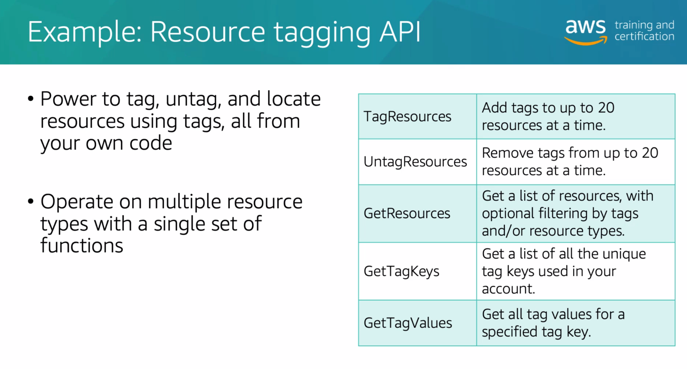
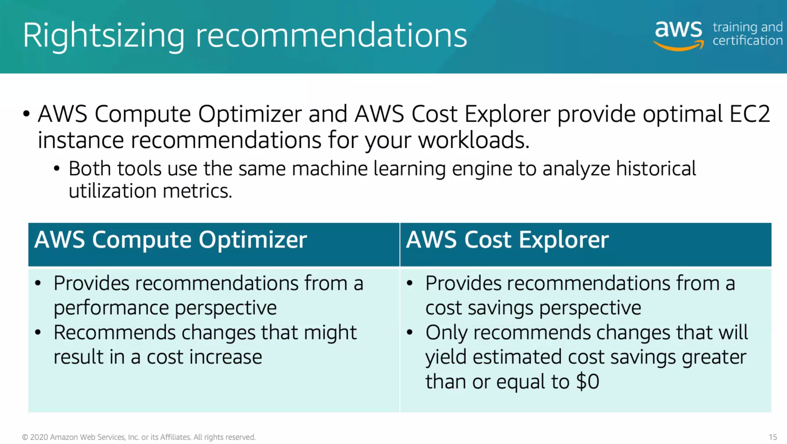
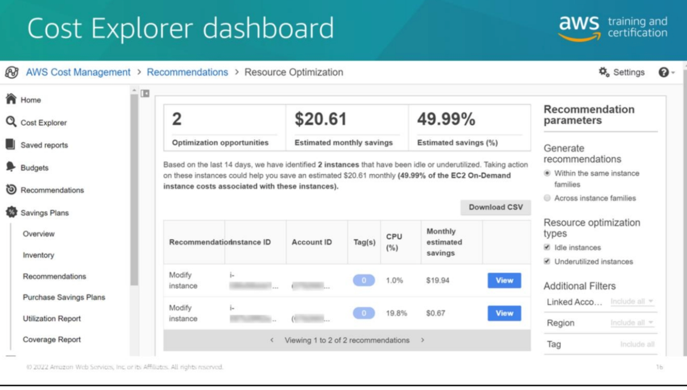
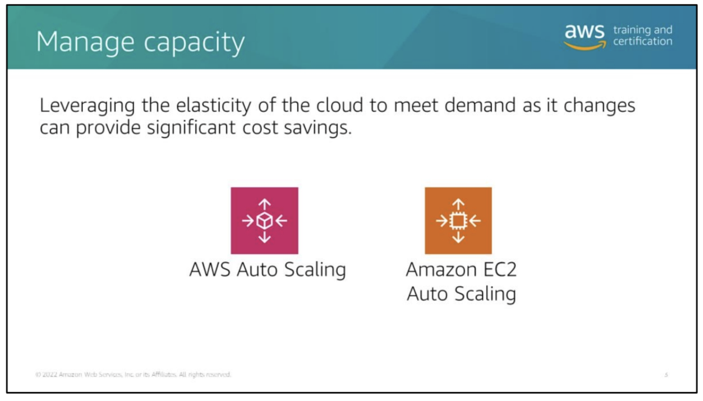
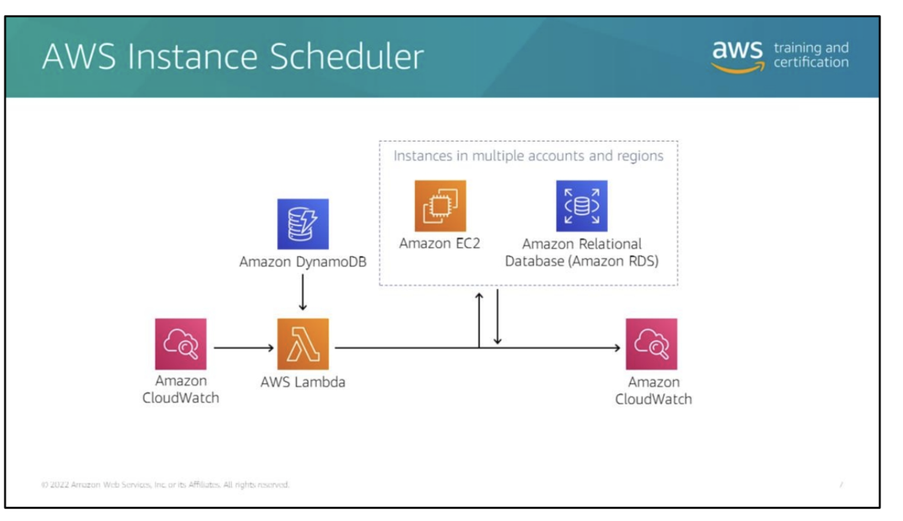
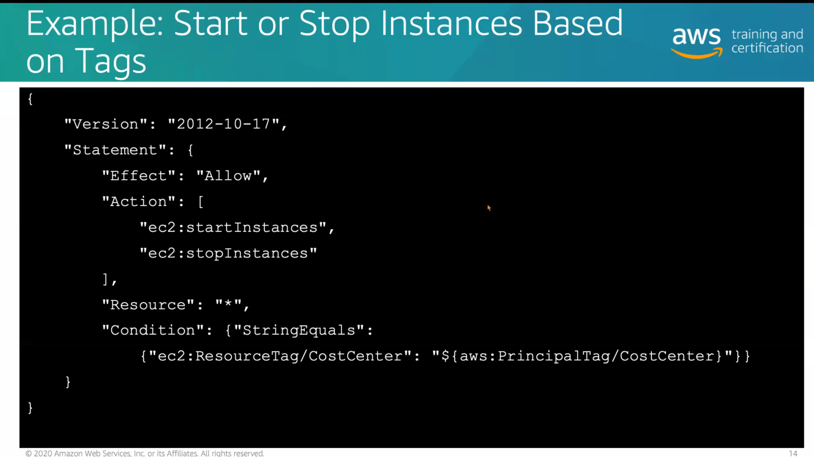
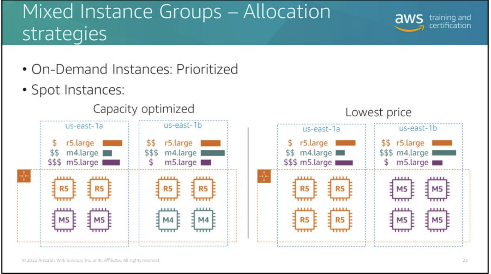
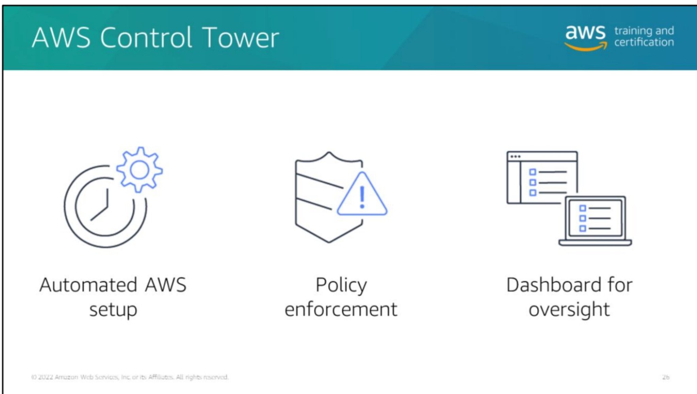
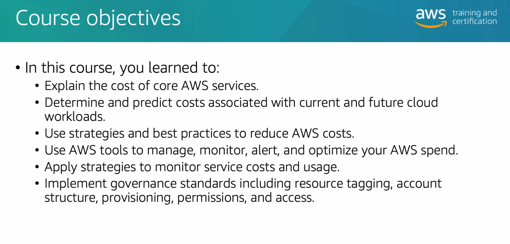

## Resource Tagging

-   [[https://docs.aws.amazon.com/general/latest/gr/aws_tagging.html]{.underline}](https://docs.aws.amazon.com/general/latest/gr/aws_tagging.html)

-   meta data of your AWS resources key-value

-   Hastto be unique

-   each resource can have max 50 user-created tags

-   case sensitive

-   Tags could use for : technical, automation, business, security


AWS Cost Management -\> Cost Explorer: Can orginized by tags too


Resources has no tags, missing informations, I can filter by specific
app/tags


Cost allocation tags : if you dont activate you wont see on const
explorer

Attributes based Access policy, I can define an IAM permission on and
create a principle to reach the specific tags !

principle tag and resource tag , FE. A user can have permission to reach
specific tagged applications.


### Best practices:


**Best practice on tagging:**

[[https://docs.aws.amazon.com/fr_fr/whitepapers/latest/tagging-best-practices/tagging-best-practices.html]{.underline}](https://docs.aws.amazon.com/fr_fr/whitepapers/latest/tagging-best-practices/tagging-best-practices.html)

Dont forget to activate tags, otherwise you wont see and need to wait 24
hours to see on cost allocation.


Service Catalog when you provide some product:

you can also define tag optiones with required data for example rsa:demo
can only have yes/no value.


Granting permission to tag resources during creation.




### AWS Config:

AWS Config provides a detailed view of the configuration of AWS
resources on your account. Additionally you can observe how resources
related to another, past configurations and how the relation changes
over time.

If you recall all resources you can grow your cost dramatically.

## Pricing and Cost Basics:

[[https://aws.amazon.com/pricing/?aws-products-pricing.sort-by=item.additionalFields.productNameLowercase&aws-products-pricing.sort-order=asc&awsf.Free%20Tier%20Type=\*all&awsf.tech-category=\*all]{.underline}](https://aws.amazon.com/pricing/?aws-products-pricing.sort-by=item.additionalFields.productNameLowercase&aws-products-pricing.sort-order=asc&awsf.Free%20Tier%20Type=*all&awsf.tech-category=*all)


[[https://d1.awsstatic.com/whitepapers/aws_pricing_overview.pdf]{.underline}](https://d1.awsstatic.com/whitepapers/aws_pricing_overview.pdf)


Prices change by region be careful.


free:


[[https://aws.amazon.com/free/?nc1=h_ls&all-free-tier.sort-by=item.additionalFields.SortRank&all-free-tier.sort-order=asc&awsf.Free%20Tier%20Types=\*all&awsf.Free%20Tier%20Categories=\*all]{.underline}](https://aws.amazon.com/free/?nc1=h_ls&all-free-tier.sort-by=item.additionalFields.SortRank&all-free-tier.sort-order=asc&awsf.Free%20Tier%20Types=*all&awsf.Free%20Tier%20Categories=*all)

### Always free


### For free trial


### Purchase options


Spot will terminate when you exceed. keep in mind that spot nodes can
terminate with a warning via a termination hook and your workload will
have \~2 mins to run on another spot node.


Reserved Instance


[[https://aws.amazon.com/ec2/pricing/reserved-instances/marketplace/]{.underline}](https://aws.amazon.com/ec2/pricing/reserved-instances/marketplace/)


The benefit to compute a Savings plan is , for example you can start
with EC2 then decide to move lambda your discount is still available.

but Ec2 instance saving plan, you have to stick to the EC2 even th type,
but more discount. You can change during commitment.


AWS Cost management has some recomendations:


Savin plan is more flexible then reserved


### AWS Calculator.

[[https://calculator.aws/#/]{.underline}](https://calculator.aws/#/)

## Billing, Reporting and Analyzing Budgets

### Billing and Cost Management:


**Analyzing Costs with AWS Cost Explorer**

The AWS Billing and Cost Management console includes the AWS Cost
Explorer tool for viewing your AWS cost data as a graph at no charge.
With AWS Cost Explorer, you can filter graphs by values such as API
operation, Availability Zone, AWS service, custom cost allocation tag,
Amazon Elastic Compute Cloud (Amazon EC2) instance type, purchase
option, AWS Region, usage type, usage type group, and more. Keep in mind
that unlike the console, the Cost Explorer API is not free because you
are making API calls. If you use consolidated billing, you can also
filter by member account. In addition, you can view a forecast of future
costs based on your historical cost data.

**AWS Budgets**

You can use AWS Budgets to track your AWS usage and costs. Budgets use
the cost visualization provided by Cost Explorer to show you the status
of your budgets. This provides forecasts of your estimated costs and
tracks your AWS usage, including your free tier usage. You can also use
budgets to create Amazon Simple Notification Service (Amazon SNS)
notifications that indicate when you go over your budgeted amounts or
when your estimated costs exceed your budgets.

**AWS Cost and Usage Reports**

You can choose to have AWS publish billing reports to an Amazon Simple
Storage Service (Amazon S3) bucket that you own. You can receive reports
that break down your costs by the hour or month, by product or product
resource, or by tags that you define yourself.

Let\'s preview the AWS Billing and Cost Management dashboard and some of
the additional cost management tools mentioned.

### Reporting and Planning:

1.  Billing Dashboard -- Ignore the forecasting that's provided there --
    > it's legacy and broken. The service team is aware of it and is
    > working on removing it.

2.  Invoice View -- Want to download your PDF invoices, or look at them
    > online by service or by member account? You can do so. More
    > details, but not super usable.

3.  AWS Cost Explorer -- Native tool that helps you slice and dice the
    > spend and usage associated with all accounts in your consolidated
    > accounts, which are updated approximately every eight hours.

4.  AWS Cost and Usage Report (AWS CUR) -- This is the last 100 pages of
    > your cell phone bill that you never read because you don't care
    > about each and every call you've made. There are billing and usage
    > line items for every resource for every hour of the month updated
    > approximately every eight hours. This is what our third-party
    > partners plug into, download, and make accessible for offline
    > slicing and dicing through their data warehouses.


**Amazon Quicksights.**


you can also add some actions then notifications, like block a user when
exceed the budget etc.

AWS Trusted Advisor draws on best practices learned from serving
hundreds of thousands of AWS customers. Trusted Advisor inspects your
AWS environment and makes recommendations when opportunities exist to
save money, improve system availability and performance, or help close
security gaps. All AWS customers have access to five Trusted Advisor
checks. AWS Business Support and AWS Enterprise Support customers get
access to all 115 Trusted Advisor checks (14 cost optimization, 17
security, 24 fault tolerance, 10 performance, and 50 service limits) and
recommendations


AWS Backup

Use AWS Backup to create daily backups of your production environment.
Once AWS Backup generates your first Amazon Machine Image (AMI), use it
to build a Launch Configuration and an Amazon EC2 Auto Scaling Group to
create your Test environment. Next, create an AWS Lambda function to
ensure that your Launch Configuration and Auto Scaling Group are always
using the latest AMI from your Backup process. This function identifies
the latest AMI ID, creates a new Launch Configuration, and updates the
Auto Scaling Group to reference the new Launch Configuration. Finally,
an Amazon CloudWatch Event starts the Lambda function based on a CRON
schedule to make these updates prior to the recurring Scheduled Actions
in your Auto Scaling Group.

##Lambda function expects one value passed in the event, targetASG

##Example, {\"targetASG\": \"ASG-NAME\"}

```
from \_\_future\_\_ import print_function

from dateutil import parser

import json

import boto3

import base64

print(\'Loading function\')

autoscaling = boto3.client(\'autoscaling\')

ec2 = boto3.client(\'ec2\')

#function to sort images by CreationDate

def newest_image(list_of_images):

latest = None

for image in list_of_images:

if not latest:

latest = image

continue

if parser.parse(image\[\'CreationDate\'\]) \>
parser.parse(latest\[\'CreationDate\'\]):

latest = image

return latest

def lambda_handler(event, context):

print(\"Received event: \" + json.dumps(event, indent=2))

#get Auto Scaling group by CloudWatch Event data

response =
autoscaling.describe_auto_scaling_groups(AutoScalingGroupNames=\[event\[\'targetASG\'\]\]).get(\'AutoScalingGroups\')\[0\]

#make sure that you found an ASG by the name passed in the event

if not response:

return \'No such Auto Scaling Group\'

#get the LC from the ASG

LC_name = response\[\'LaunchConfigurationName\'\]

#pull the Launch Configuration

response =
autoscaling.describe_launch_configurations(LaunchConfigurationNames=\[LC_name\]).get(\'LaunchConfigurations\')\[0\]

#save the Launch Configuration in a variable to be used when copying the
LC

LC = response

#save the ami in a variable

LC_ami = response\[\'ImageId\'\]

#get the information about the AMI currently being used in the LC

response =
ec2.describe_images(ImageIds=\[LC_ami\],Owners=\[\'self\'\]).get(\'Images\')\[0\]

#Loop through the tags on the AMI and set the serverName variable on the
one with

\# Name as the tag Key

for tag in response\[\'Tags\'\]:

if tag\[\'Key\'\] == \'Name\':

serverName = tag\[\'Value\'\]

#Make sure that the serverName variable was created

if not serverName:

return \'Image is not tagged properly\'

#get a list of AMIs that you own that has the same Name tag

response =
ec2.describe_images(Owners=\[\'self\'\],Filters=\[{\'Name\':\'tag:Name\',\'Values\':\[serverName\]}\]).get(\'Images\')

#find the latest AMIid with a help from the newest_image function

latestAMI = newest_image(response)\[\'ImageId\'\]

#check if you are already using the latest AMI, exit if you are

if LC_ami == latestAMI:

print(\'No newer AMIs are available\')

return \'No newer AMIs are available\'

#launch configurations for this function should be named with the
following

#pattern \<LC Name\>V\<version number\>. This line will increment the
version number

#creating a new unique name.

new_LC_name =
\"V\".join(\[LC_name.split(\'V\')\[0\],str(int(LC_name.split(\'V\')\[1\])+1)\])

#check if the LC is using Spot Pricing

spot = False

try:

if LC\[\"SpotPrice\"\]:

spot = True

print(\'Spot Price found!\')

except KeyError:

print(\'On Demand Pricing\')

#create new LC from values of the previous one

#if the current LC uses Spot pricing, pass that to the new one

#else, create a new one that does not use spot pricing

if spot:

response = autoscaling.create_launch_configuration(

ImageId=latestAMI,

InstanceType=LC\[\'InstanceType\'\],

LaunchConfigurationName=new_LC_name,

UserData=base64.b64decode(LC\[\'UserData\'\]),

SecurityGroups=LC\[\'SecurityGroups\'\],

SpotPrice=LC\[\"SpotPrice\"\]

)

else:

response = autoscaling.create_launch_configuration(

ImageId=latestAMI,

InstanceType=LC\[\'InstanceType\'\],

LaunchConfigurationName=new_LC_name,

UserData=base64.b64decode(LC\[\'UserData\'\]),

SecurityGroups=LC\[\'SecurityGroups\'\]

)

#update ASG with new LC

response = autoscaling.update_auto_scaling_group(

AutoScalingGroupName=\'Web-App-Test-ASG\',

LaunchConfigurationName=new_LC_name

).get(\'ResponseMetadata\')

#if the update was successful return a success.

if response\[\'HTTPStatusCode\'\]==200:

print(\'Successfully Updated Auto Scaling group: \' +
str(event\[\'targetASG\'\]))

return \'Successfully Updated Auto Scaling group: \' +
str(event\[\'targetASG\'\])
```


# Day 2

### Amazon EC2


General purpose

• Balance of compute, memory, and networking

• Diverse workloads

• Web applications

Compute optimized

• Compute-bound applications

• High performance processors

• Media transcoding

• Scientific modeling

• Machine learning

Memory optimized

• Fast delivery of large data sets in memory

• Database servers

• Web caches

• Data analytics

Accelerated computing

• High-graphics processing

• GPU bound

• Machine learning

• High-performance computing

• Autonomous vehicles

Storage optimized

• High sequential read/write

• Large data sets

• NoSQL databases

• Elasticse


### AWS Compute Optimiser:

Is helping to optimise compete and cost, it can make recommendation
based on your EC2 instances for example

[[https://aws.amazon.com/compute-optimizer/]{.underline}](https://aws.amazon.com/compute-optimizer/)



Cost explorer also recomment "Right sizing"




We can have Ec2 instance which is stopped. We won\'t pay for Ec2
instance but still incur the cost because of EBS volumes or cloudwatch
logs etc.


Cloud watch


Spot instances:


you can also hibernate your instance, you wont loose data but you will
pay for it.

[[https://aws.amazon.com/ec2/spot/instance-advisor/]{.underline}](https://aws.amazon.com/ec2/spot/instance-advisor/)

Amazon EC2 Spot Instances integrate with several AWS services.

Spot Integration with Other AWS Services:

​​[[https://docs.aws.amazon.com/whitepapers/latest/cost-optimization-leveraging-ec2-spot-instances/spot-integration-with-other-aws-services.html]{.underline}](https://docs.aws.amazon.com/whitepapers/latest/cost-optimization-leveraging-ec2-spot-instances/spot-integration-with-other-aws-services.html)

**Manage Capacity**



Use AWS Auto Scaling to manage scaling for multiple resources across
multiple services. AWS Auto Scaling lets you define dynamic scaling
policies for multiple Amazon EC2 Auto Scaling groups or other resources
using predefined scaling strategies.

Using AWS Auto Scaling to configure scaling policies for all the
scalable resources in your application is faster than managing scaling
policies for each resource using its individual service console. It's
also easier because AWS Auto Scaling includes predefined scaling
strategies that simplify the setup of scaling policies. Auto scaling can
use for other services too.

You should also use AWS Auto Scaling if you want to create predictive
scaling for Amazon EC2 resources.

Amazon EC2 Auto Scaling provides several ways for you to scale your
Amazon EC2 Auto Scaling group.


**Instance scheduler on aws**

[[https://docs.aws.amazon.com/solutions/latest/instance-scheduler-on-aws/solution-overview.html]{.underline}](https://docs.aws.amazon.com/solutions/latest/instance-scheduler-on-aws/solution-overview.html)



for example you can close your test environment on nights this helps you
to reduce cost.

**on Demand scaling :**

Simple scaling: Increase or decrease the current capacity of the group
based on a single scaling adjustment.

Step scaling: Increase or decrease the current capacity of the group
based on a set of scaling adjustments, known as step adjustments, that
vary based on the size of the alarm breach.

Target tracking scaling: Increase or decrease the current capacity of
the group based on a target value for a specific metric. This is similar
to the way that your thermostat maintains the temperature of your
home---you select a temperature and the thermostat does the rest.

Predicted Scaling : ML model is using behind. But need some time 14 days
to train model.

**Automation**:




[[https://docs.aws.amazon.com/IAM/latest/UserGuide/reference_policies_examples_ec2-start-stop-tags.html]{.underline}](https://docs.aws.amazon.com/IAM/latest/UserGuide/reference_policies_examples_ec2-start-stop-tags.html)

This example shows how you might create a policy that allows a principal
to start or stop an Amazon EC2 instance when the instance\'s resource
tag and the principal\'s tag have the same value for the tag key
CostCenter. This policy grants the permissions necessary to complete
this action from the AWS API or AWS CLI only. To use this policy,
replace the italicized placeholder text in the example policy with your
own information


When building automated deployments of EC2 instances, you have a few
options. One is to use an AMI that contains all your prebaked
dependencies. A second is to use a base image and download software from
a public source at the time of instance launch. Downloading public
binaries during an AWS CloudFormation launch of an EC2 instance,
however, can be slow and result in delayed bootstrapping of instances.
This can present challenges if such instances are part of an AWS Auto
Scaling group.


**Lifecycle** hooks enable you to control what happens when your EC2
instances are launched and terminated as you scale out and in. Lifecycle
hooks enable you to perform custom actions by pausing instances as an
Amazon EC2 Auto Scaling group launches or terminates them. When an
instance is paused, it remains in a wait state until you complete the
lifecycle action using the complete-lifecycle-action command or the
CompleteLifecycleAction operation, or until the timeout period ends (1
hour by default).


ystems Manager helps you reduce costs by providing easy to use,
automated tools for tracking, updating, and maintaining your software
and OS configurations. With Systems Manager, you can automatically
maintain compliant systems. This enables you to avoid wasting time on
manual updates and the risks associated with non-compliant systems.

[[https://docs.aws.amazon.com/systems-manager/latest/userguide/systems-manager-automation.html]{.underline}](https://docs.aws.amazon.com/systems-manager/latest/userguide/systems-manager-automation.html)


Do it yourself . give more control.

Amazon EC2 Fleet is a feature that simplifies the provisioning of Amazon
EC2 capacity across different EC2 instance types, Availability Zones,
and On-Demand, Amazon EC2 Reserved Instances (RI), and Amazon EC2 Spot
purchase models. With a single API call, now you can provision capacity
across EC2 instance types and purchase models to achieve the required
scale, performance, and cost.

you can specify via an API

Amazon EC2 Fleet API details (target capacity):

\--target-capacity-specification {

\"TotalTargetCapacity\": integer, \"OnDemandTargetCapacity\": integer,
\"SpotTargetCapacity\": integer, \"DefaultTargetCapacityType\":
\"spot\"\|\"on-demand"

}

**Alocation Strategy:**



you can priorities cost or Capacity. It will launch depends on this.


In this example, Mixed Instance Groups are defined using mixed On-Demand
and Spot Instances---scaling out on On-Demand Instances for the first 12
instances and maintaining a 50:50 ratio between On-Demand and Spot
Instances beyond th


**Licences**:


**serverless**:

[[https://aws.amazon.com/serverless/]{.underline}](https://aws.amazon.com/serverless/)


[[https://aws.amazon.com/event-driven-architecture/]{.underline}](https://aws.amazon.com/event-driven-architecture/)


[[https://docs.aws.amazon.com/lambda/latest/dg/best-practices.html]{.underline}](https://docs.aws.amazon.com/lambda/latest/dg/best-practices.html)

Lambda Power Tuning !!

[[https://github.com/alexcasalboni/aws-lambda-power-tuning]{.underline}](https://github.com/alexcasalboni/aws-lambda-power-tuning)

Don\'t put your lambda into VPC, we have to pay NAT gateway to access
the internet!! Extra cost.

## Networking


Private communication in the same AZ, it is free, but if you have public
IP address, you will charge DTO Data transfer Out money.!


Data transfer in from the internet is free. Data transfer out varies
depending on the origin Region and the destination.


Transit Gateway


you can use peer connection instead of it

It can set only regional base.

AWS Direct Connect:

Can create a bottleneck.


NAT Gateway

when I need to use NAT Gateway I need to have one more to get the data.
because it is ot supported cross between AZ.


[[https://docs.aws.amazon.com/vpc/latest/userguide/vpc-nat-comparison.html]{.underline}](https://docs.aws.amazon.com/vpc/latest/userguide/vpc-nat-comparison.html)

Here Tip suggest to use VPC Endpoints.

VPC Endpoints:

[[https://docs.aws.amazon.com/vpc/latest/privatelink/concepts.html]{.underline}](https://docs.aws.amazon.com/vpc/latest/privatelink/concepts.html)


There are 2 types of interface: Gateway and Interface.

Gateway is free, interface is NOT.


### Edge Services


**Amazon CloudFront Amazon**

CloudFront is a web service that gives businesses and web application
developers an easy and cost effective way to distribute content with low
latency and high data transfer speeds. Like other AWS services, Amazon
CloudFront is a self-service, pay-per-use offering, requiring no long
term commitments or minimum fees. With CloudFront, your files are
delivered to end-users using a global network of edge locations.

**AWS WAF**

AWS WAF is a web application firewall that helps protect web
applications from attacks by allowing you to configure rules that allow,
block, or monitor (count) web requests based on conditions that you
define. These conditions include IP addresses, HTTP headers, HTTP body,
URI strings, SQL injection and cross-site scripting.

**Amazon Route 53**

Amazon Route 53 provides highly available and scalable Domain Name
System (DNS), domain name registration, and health-checking web
services. It is designed to give developers and businesses an extremely
reliable and cost effective way to route end users to Internet
applications by translating names like example.com into the numeric IP
addresses, such as 192.0.2.1, that computers use to connect to each
other. You can combine your DNS with health-checking services to route
traffic to healthy endpoints or to independently monitor and/or alarm on
endpoints. You can also purchase and manage domain names such as
example.com and automatically configure DNS settings for your domains.
Route 53 effectively connects user requests to infrastructure running in
AWS -- such as Amazon EC2 instances, Elastic Load Balancing load
balancers, or Amazon S3 buckets -- and can also be used to route users
to infrastructure outside of AWS.

**AWS Shield**

Advanced AWS Shield Advanced provides enhanced protections for your
applications running on protected Amazon EC2, Elastic Load Balancing
(ELB), Amazon CloudFront, AWS Global Accelerator, and Route 53 resources
against more sophisticated and larger attacks. AWS Shield Advanced
protection provides always-on, flow-based monitoring of network traffic
and active application monitoring to provide near real-time
notifications of suspected DDoS incidents. AWS Shield Advanced also
employs advanced attack mitigation and routing techniques for
automatically mitigating attacks. Customers, with Business or Enterprise
support, can also engage the DDoS Response Team (DRT) 24x7 to manage and
mitigate their application layer DDoS attacks. The DDoS cost protection
for scaling protects your AWS bill against higher fees due to usage
spikes from protected Amazon EC2, Elastic Load Balancing (ELB), Amazon
CloudFront, AWS Global Accelerator, and Amazon Route 53 during a DDoS
attack.

**Lambda@Edge**

Lambda@Edge runs your code in response to events generated by the Amazon
CloudFront content delivery network (CDN). Just upload your code to AWS
Lambda, which takes care of everything required to run and scale your
code with high availability at an AWS location closest to your end user.

{width="6.267716535433071in"
height="3.3055555555555554in"}

I can use Lambda Edge for example for tests A/B. I can specify from
ClodFront which function will get request / response by separation
Viewer an Origin perspective.

Data Cost for different services:

S3:


Load balancer:


when you BYOIP bring your own IP you wont get charged.


Data transfer Cost !!

[[https://aws.amazon.com/blogs/architecture/overview-of-data-transfer-costs-for-common-architectures/]{.underline}](https://aws.amazon.com/blogs/architecture/overview-of-data-transfer-costs-for-common-architectures/)

# Day 3

## Storage Cost


[[https://aws.amazon.com/products/storage/?nc2=h_ql_prod_st]{.underline}](https://aws.amazon.com/products/storage/?nc2=h_ql_prod_st)


EBS (Elastic Block Storage )

Since we have discussed compute , let\'s expand on block storage that
can be used with compute. Amazon EBS is an easy-to-use, high-performance
block storage service designed for use with Amazon EC2 for throughput
and transaction-intensive workloads at any scale.

Amazon EBS volumes behave like raw, unformatted block devices. You can
mount these volumes as devices on your instances. You can mount multiple
volumes on the same instance, and you can mount a volume to multiple
instances at a time. You can create a file system on top of these
volumes, or use them in any way you would use a block device (like a
hard drive). You can dynamically change the configuration of a volume
attached to an instance.

Amazon EBS is recommended when data must be quickly accessible and
requires long-term persistence. Amazon EBS volumes are particularly well
suited for use as the primary storage for file systems, databases, or
any applications that require fine granular updates and access to raw,
unformatted, block-level storage. Amazon EBS is well suited to both
database-style applications that rely on random reads and writes and to
throughput-intensive applications that perform long, continuous reads
and writes.

You can attach multiple volumes to the same instance within the limits
specified by your AWS account. Your account has a limit on the number of
Amazon EBS volumes that you can use and the total storage available to
you


Cold HDD volumes provide low-cost magnetic storage that defines
performance in terms of throughput rather than IOPS. These volumes are
ideal for large, sequential, cold-data workloads. If you require
infrequent access to your data and want to save costs, these volumes
provides inexpensive block storage. For more information, see
[[https://docs.aws.amazon.com/AWSEC2/latest/UserGuide/ebs-volume-types.html#EBSVolumeTypes_sc1]{.underline}](https://docs.aws.amazon.com/AWSEC2/latest/UserGuide/ebs-volume-types.html#EBSVolumeTypes_sc1).

Throughput-Optimized HDD volumes provide low-cost magnetic storage that
defines performance in terms of throughput rather than IOPS. These
volumes are ideal for large, sequential workloads such as Amazon EMR,
extract, transform and load (ETL), data warehouses, and log processing.
For more information, see
[[https://docs.aws.amazon.com/AWSEC2/latest/UserGuide/ebs-volume-types.html#EBSVolumeTypes_st1]{.underline}](https://docs.aws.amazon.com/AWSEC2/latest/UserGuide/ebs-volume-types.html#EBSVolumeTypes_st1).

General-Purpose SSD volumes offer a base performance of 3 IOPS/GiB, with
the ability to burst to 3,000 IOPS for extended periods of time. These
volumes are ideal for a broad range of use cases such as boot volumes,
small and medium-size databases, and development and test environments.
For more information, see
[[https://docs.aws.amazon.com/AWSEC2/latest/UserGuide/ebs-volume-types.html#EBSVolumeTypes_gp2]{.underline}](https://docs.aws.amazon.com/AWSEC2/latest/UserGuide/ebs-volume-types.html#EBSVolumeTypes_gp2).

Provisioned IOPS SSD volumes support up to 64,000 IOPS and 1,000 MiB/s
of throughput. This enables you to predictably scale to tens of
thousands of IOPS per EC2 instance. For more information, see
[[https://docs.aws.amazon.com/AWSEC2/latest/UserGuide/ebs-volume-types.html#EBSVolumeTypes_piops]{.underline}](https://docs.aws.amazon.com/AWSEC2/latest/UserGuide/ebs-volume-types.html#EBSVolumeTypes_piops).

Amazon EBS General-Purpose SSD (gp2) volumes Volume storage for General
Purpose SSD (gp2) volumes is charged by the amount you provision in GB
per month until you release the storage. Provisioned storage for gp2
volumes will be billed in per-second increments, with a 60-second
minimum. I/O is included in the price of the volumes, so you pay only
for each GB of storage you provision

Amazon EBS Provisioned IOPS SSD (io1) volumes Volume storage for EBS
Provisioned IOPS SSD (io1) volumes is charged by the amount you
provision in GB per month until you release the storage. With
Provisioned IOPS SSD (io1) volumes, you are also charged by the amount
you provision in IOPS (input/output operations per second) per month.
Provisioned storage and provisioned IOPS for io1 volumes will be billed
in per-second increments, with a 60-second minimum.

Amazon Data Lifecycle Manager

You can use Amazon Data Lifecycle Manager to automate the creation,
retention, and deletion of snapshots taken to back up your Amazon EBS
volumes. Automating snapshot management helps you to: • Protect valuable
data by enforcing a regular backup schedule. • Retain backups as
required by auditors or internal compliance. • Reduce storage costs by
deleting outdated backups.

AMAZON S3 BUCKET


EFS (elastic File System )


AWS Storage Gateway

AWS Storage Gateway connects an on-premises software appliance with
cloud-based storage to provide seamless integration with data security
features between your on-premises IT environment and the AWS storage
infrastructure. You can use the service to store data in the AWS Cloud
for scalable and cost-effective storage that helps maintain data
security. AWS Storage Gateway offers file-based, volume-based, and
tape-based storage solutions: file gateway, volume gateway, and tape
gateway.


## Database

RDS:

Dynamo DB :

You can use Provisioned Capacity

-   1 write capacity unit is 1KB

-   1 strongly consistent read capacity is 1X4KB

-   1 eventually consistent read capacity is 2x4KB

And Reserved capacity to make cheaper.


In this example, there is an on-demand DynamoDB table used to deliver
data items to an application used by globally dispersed users. Included
are three additional DynamoDB Global tables to help with the global user
base. All tables are owned by a single AWS account, which makes it easy
to write data to one replica and have the same data available in other
Regions within milliseconds.

Global table pricing varies according to Region on a per million
replicated write request unit. Costs for data storage, data backups, and
data transfer out also affect global table pricing.

Elastic Cache:

ElastiCache is a web service that makes it easy to deploy, operate, and
scale an in-memory cache in the cloud.

ElastiCache caches data as key-value pairs. An application can retrieve
a value corresponding to a specific key or can store an item in cache by
specifying a key, value, and an expiration time Time to live (TTL). TTL
is an integer value that specifies the number of seconds until the key
expires.


AWs Redshift


Amazon Redshift is a fully managed, petabyte-scale data warehouse
service in the cloud. An Amazon Redshift cluster is a set of nodes
launched to upload your dataset. Data analysis queries can now run
against your dataset using common business intelligence tools or tools
offered by AWS.

Optimizing use of your Amazon Redshift clusters begins with
understanding nodes. Each cluster has at least one leader node and one
or more compute nodes. The leader node receives queries from
applications and develops a plan to run on the compute nodes where the
data resides. When launching a cluster, you have the option to choose a
node type, which determines the CPU, RAM, and storage capacity of each
node.

Ra3 nodes enable independent compute and storage scaling.

Dc2 nodes have fast CPUs, large amounts of RAM, and solid state drives
(SSDs) best for datasets lower than 500 GB.

Ds2 nodes offer cost-effective storage options on hard disk drives
(HDDs). Clusters using Ds2 nodes have the opt

Database services like Amazon RDS, Aurora, and Amazon Redshift
reservation models


For Elastic Cache and DynamoDb


You have the option to select Provisioned Capacity, which enables you to
specify the read and write capacity that you expect your application
will require. To further increase your savings, you can opt for Reserved
Capacity, paying a one-time upfront fee and commit to paying the hourly
rate for read capacity units (RCUs) and Write Capacity Units (WCUs) for
the duration of the reserved capacity term. Any capacity that you
provision in excess of your reserved capacity is billed at standard
provisioned capacity rates.

Note that Reserved capacity is only available with Provisioned Capacity
mode.

RCU: Each API call to read data from your table is a read request. WCU:
Each API call to write data to your table is a write request.

For more pricing information, see:
[[https://aws.amazon.com/dynamodb/pricing/]{.underline}](https://aws.amazon.com/dynamodb/pricing/).

## 

## Cost Governance :

You can think about governance in three areas:

Account management - Automate account provisioning and maintain good
security when hundreds of users and business units are requesting
cloud-based resources.

Budget and cost management - Enforce and monitor budgets across many
accounts, workloads, and users.

Security and compliance automation - Manage security, risk, and
compliance at a scale and pace to enable the organization to maintain
compliance, while minimizing impact to the business.

Cost Governence Pilars


Governance mechanisms:

• Resource controls govern who can deploy resources and the process for
identifying, monitoring, and categorizing these new resources.

• Cost allocation applies to teams using resources, shifting the
emphasis from the IT-as-cost-center mentality to one of shared
responsibility.

• Budgeting processes include reviewing budgets and realized costs, and
then acting on them.

• Architecture optimization focuses on the need to continually refine
workloads to be more cost-conscious to create better architected
systems.

• Tagging and tagging enforcement ensures cost tracking and visibility
across organization lines.

Three areas of Governence

With AWS, you can enable, provision, and operate your environment for
both business agility and governance control.

• Enable builders for speed with built-in governance control.

• Provision resources and applications that meet your policies.

• Operate your environment with speed and governance.


These are services enable builders for speed with built in cost
governance control.

-   • AWS Budgets: Govern your cost by tracking and monitoring your
    > costs and usage. Set custom budgets that alert you when you exceed
    > (or are forecasted to exceed) your budgeted thresholds.

-   • AWS License Manager: Govern your cost by managing your software
    > licenses from various software vendors. Have a centralized view of
    > license usage, so that you can determine the right number of
    > licenses required, and not purchase more licenses than needed.
    > With this improved visibility, you can also control overages and
    > avoid penalties from licensing audits. With License Manager, you
    > can reduce the time and cost needed for tracking and managing
    > licenses.

-   • AWS Organizations: Manage your multi-account infrastructure by
    > viewing billing for all accounts in one place and controlling
    > access and permissions.

-   • AWS Control Tower: Set up an AWS environment with governance built
    > in from the start across accounts.

-   • AWS Identity and Access Management (IAM): Enable, provision, and
    > operate your environment by controlling your resources. By
    > controlling resources, you can make sure that overspending does
    > not occur due to people having the wrong permissions and using the
    > wrong resources. You applied this concept in Lab 1 when you
    > reviewed a policy that prevented launching an instance that
    > didn\'t comply with the IAM policy requirements. (AWS IAM applies
    > to all three areas of governance and will therefore appear on the
    > next two slides as well.)


These services provision resources and applications that meet your
policies that support cost.

-   • AWS CloudFormation: Maintain agility while governing by using one
    > core scripting language tool for describing and provisioning
    > resources from over 100 AWS services.

-   • AWS Service Catalog: Create and manage catalogs of IT services
    > that are approved for use on AWS. Achieve consistent governance
    > and meet your compliance requirements, while enabling users to
    > quickly deploy only the approved IT services they need. AWS
    > Service Catalog enables you to centrally manage IT service
    > lifecycle by adding new versions of IT services as necessary, and
    > notifying end users so they can easily keep abreast of the latest
    > updates. With AWS Service Catalog you can control the use of IT
    > services by specifying constraints, such as the AWS region in
    > which a product can be launched or allowed IP ranges. You can
    > integrate with serverless services to automate lifecycle
    > management for ephemeral resources. For more details, refer to:
    > [[https://aws.amazon.com/blogs/mt/automating-life-cycle-management-for-ephemeral-resources-using-aws-service-catalog/]{.underline}](https://aws.amazon.com/blogs/mt/automating-life-cycle-management-for-ephemeral-resources-using-aws-service-catalog/)

-   • AWS Identity and Access Management (IAM):


These services operate your environment with speed and cost governance.

-   Amazon CloudWatch: Govern cost by monitoring your AWS resources,
    > applications, and services, and by setting alarms based on cost or
    > other metrics.

-   AWS Config: Automate, evaluate, and monitor your AWS resource
    > configurations, set policies for your configurations, and quickly
    > remediate configurations that fall out of compliance. Set custom
    > rules to enforce compliance with tagging policies.

-   AWS Managed Services: Save money by gaining access to AWS expertise
    > through our partners without needing to hire more. Gain assistance
    > with adherence to the AWS Well-Architected Framework, including
    > recommendations for cost optimization. Receive a monthly summary
    > of key performance metrics, including operational activities,
    > events and their respective impact, and recommendations to
    > optimize usage.

-   AWS Systems Manager: Manage applications and resources in AWS from
    > one central operational control point for operators. Seamlessly
    > extend across to your existing on-premises or hybrid cloud
    > environments. Automate common and repetitive IT operations and
    > management tasks.

-   AWS Cost and Usage Reports: See a comprehensive set of AWS cost and
    > usage data and metadata.

-   AWS Cost Explorer: Visualize, understand, and manage your AWS costs
    > and usage over time. Analyze cost data to identify trends,
    > pinpoint cost drivers, and detect anomalies.

-   AWS Identity and Access Management (IAM):




# Summary:




Cloud Financial Management

Cloud Financial Management (CFM) is a set of activities enabling Finance
and Technology organizations to manage, optimize, and plan costs as they
run more workloads on AWS. Effective CFM requires a partnership between
a customer's Finance and Technology teams, and span activities across
the following four pillars: See (measurement and accountability), Save
(cost optimization), Plan (planning and forecasting), and Run (cloud
financial operations).

Resource Tagging Strategies

Companies that are most effective in their use of tags typically create
business-relevant tag groupings to organize their resources along
technical, business, and security dimensions. Companies that use
automated processes to manage their infrastructure also include
additional, automation-specific tags.Tagging taxonomy is vital because
your reporting data will compromise if you do not have the accuracy in
your tags.

Lab 1: Control resource consumption using tagging and AWS Config In this
lab, you established reactive controls based on architectural standards
using AWS Config and implemented preventative controls by creating an
IAM policy

Pricing and cost

-   For compute resources, you pay hourly or per second from the time
    > you launch a resource until the time you terminate or stop it,
    > unless you have made a reservation for which the cost is
    > previously agreed upon.

-   • For data storage and transfer, you typically pay per GB. • In most
    > cases, there is no charge for inbound data transfer or for data
    > transfer between other AWS services within the same region. There
    > are some exceptions, so be sure to verify data transfer rates
    > before beginning. Outbound data transfer is aggregated across
    > services and then charged at the outbound data transfer rate. This
    > charge appears on the monthly statement as AWS Data Transfer Out.
    > The more data you transfer, the less you pay per GB.

-   • Use the AWS Pricing Calculator to estimate costs before launching
    > new applications. Add multiple services or group services to build
    > an estimate.

-   • With the Savings Plans pricing model, you can significantly reduce
    > costs on Amazon EC2, AWS Fargate, and AWS Lambda usage when you
    > commit to a consistent amount of usage per hour for a 1-or 3-year
    > term. • Use AWS Cost Explorer to navigate the purchasing process.

AWS billing, reporting, and monitoring

-   • Within the Billing and Cost Management dashboard, you can
    > visualize your cost drivers and usage trends with AWS Cost
    > Explorer, manage your costs and usage using AWS Budgets, and dive
    > deeper into your costs using the AWS Cost and Usage Reports.

-   • Cost Explorer is a free data visualization tool that can be used
    > to view graphs of your AWS costs (also known as your spend data).
    > It also allows you to view costs based on your AWS usage. The Cost
    > Explorer API allows you to programmatically query your cost and
    > usage data.

-   • AWS Budgets provides you with a quick way to see your
    > usage-to-date and current estimated charges

Day 2:

{width="6.267716535433071in"
height="2.888888888888889in"}

Architecting for cost: Networking

-   Data transferred between Amazon EC2, Amazon RDS, Amazon Redshift,
    > Amazon ElastiCache instances and Elastic Network Interfaces in the
    > same Availability Zone is free.

-   • Data transferred between Amazon S3, Amazon Glacier, Amazon
    > DynamoDB, Amazon SES, Amazon SQS, Amazon Kinesis, Amazon ECR,
    > Amazon SNS or Amazon SimpleDB and Amazon EC2 instances in the same
    > region is free.

-   • Data transfer between regions has the same cost as data
    > transferred OUT to the internet. There is no cost for data
    > transferred IN.

-   • If NAT gateway charges are related to traffic from Amazon S3 or
    > DynamoDB, route the traffic through a gateway VPC endpoint instead

Lab 5: Reduce data transfer costs using Amazon CloudFront and endpoints
In this lab, you modified the architecture of an existing solution in
order to reduce data transfer costs through the use of CloudFront and
VPC Endpoints.

Architecting for cost: Database

-   Choosing the right database engine for your applications' workload
    > will vary according to your applications specifications.

-   • Database services like Amazon RDS, Amazon Aurora, and Amazon
    > Redshift reservation models are an AWS concept that enable you to
    > commit to instance usage parameters at the time of purchase to
    > achieve a lower hourly rate. You have the option to reserve the
    > instance for a 1-or 3-year term in return for a discount.

Cost governance

-   • To scale increasingly complex workloads that are run on AWS, your
    > organization should emphasize the creation of clear, effective
    > policies and governance mechanisms around cloud deployment, usage,
    > and cost responsibility.

-   • With AWS, you can enable, provision, and operate your environment
    > for both business agility and governance control.

-   • Use AWS Organizations to manage your multi-account infrastructure
    > by viewing billing for all accounts in one place and controlling
    > access and permissions.

-   • A landing zone is a well-architected, multi-account AWS
    > environment that\'s based on security and compliance best
    > practices. This is the enterprise-wide container that holds all of
    > your organizational units (OUs), accounts, users, and other
    > resources that you want to be subject to compliance regulation.

Day 3:


Architecting for cost: Compute

• AWS Compute Optimizer and AWS Cost Explorer both provide optimal EC2
instance recommendations for your workloads. Compute Optimizer provides
recommendations from a performance perspective, while AWS Cost Explorer
provides recommendations from a cost savings perspective.

• Use AWS License Manager to manage a variety of software licenses based
on vCPU, physical cores, physical sockets, and number of instances.

• The AWS Instance Scheduler is a simple AWS-provided solution that
enables you to easily configure custom start and stop schedules for
Amazon Elastic Compute Cloud (Amazon EC2) and Amazon Relational Database
Service (Amazon RDS) instances.

Lab 3:

Right size Amazon EC2 instances using Amazon CloudWatch metrics In this
lab, you installed a CloudWatch agent on multiple instances with System
Manager and used the generated metrics to understand whether or not
their EC2 instances were sized correctly for their applications.

Architecting for cost: Storage

• Configure Amazon S3 Lifecycle to manage your objects so that they are
stored cost effectively throughout their lifecycle.

• You can use Amazon Data Lifecycle Manager to automate the creation,
retention, and deletion of snapshots taken to back up your Amazon EBS
volumes.

Lab 4:

Reduce storage costs using Amazon S3 life cycle management In this lab,
you optimized the architecture of an invoice imaging system by modifying
the storage solution being leveraged to store invoice image

Lab 6: Configure Instance Scheduler In this lab, you deployed an AWS
Solution used to start and stop resources based on user-defined schedule

## Additional Resources:

Well Architect Labs

[[https://www.wellarchitectedlabs.com/]{.underline}](https://www.wellarchitectedlabs.com/)

AWS Well-Architected page:
[[https://aws.amazon.com/architecture/well-architected/]{.underline}](https://aws.amazon.com/architecture/well-architected/)

AWS Well-Architected Labs site:
[[https://wellarchitectedlabs.com/]{.underline}](https://wellarchitectedlabs.com/)

Amazon EC2 Spot Instances Workshops site:
[[https://ec2spotworkshops.com/]{.underline}](https://ec2spotworkshops.com/)

AWS Cost Management blog:
[[https://aws.amazon.com/blogs/aws-cost-management/]{.underline}](https://aws.amazon.com/blogs/aws-cost-management/)

What's New with AWS? page:
[[https://aws.amazon.com/new/]{.underline}](https://aws.amazon.com/new/)

AWS Podcasts page:
[[https://aws.amazon.com/podcasts/]{.underline}](https://aws.amazon.com/podcasts/)

Expand your AWS Cloud skills. For more information, see the following:

• Digital training --
[[https://explore.skillbuilder.aws/]{.underline}](https://explore.skillbuilder.aws/)

• Classroom training --
[[https://aws.amazon.com/training]{.underline}](https://aws.amazon.com/training)

• AWS certification --
[[https://aws.amazon.com/certification/]{.underline}](https://aws.amazon.com/certification/)

• AWS Workshops --
[[https://workshops.aws/]{.underline}](https://workshops.aws/)

• Tech talks --
[[https://aws.amazon.com/events/online-tech-talks/on-demand/]{.underline}](https://aws.amazon.com/events/online-tech-talks/on-demand/)

• AWS Ramp-Up Guides --
[[https://aws.amazon.com/training/ramp-up-guides/]{.underline}](https://aws.amazon.com/training/ramp-up-guides/)

[[https://aws.amazon.com/certification/certification-prep/]{.underline}](https://aws.amazon.com/certification/certification-prep/)

[[https://aws.amazon.com/certification/]{.underline}](https://aws.amazon.com/certification/)
