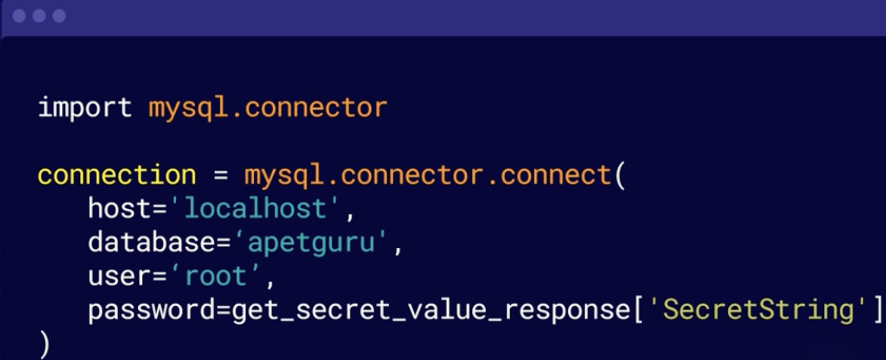

## Introduction to AWS

This course is to look overlay to the service of the AWS in introduction
level [AWS Introduction](https://learn.acloud.guru/course/intro-to-aws/)

## Sub titles:

* [Overview AWS](#overview-aws)
* [Security and Identity](#security-and-identity)
* [Compute](#compute)
* [Storage](#storage)
* [Database](#database)
* [Networking](#networking)
* [Management and Governance](#management-and-governance)
* [Machine learning](#machine-learning)

# Overview AWS

## What is Cloud ?

* A collections of services create a platform.
    * Data Storage
    * Network
    * Virtual Servers
    * Analytics
    * Security
    * Machine Learnings
* Cloud is aimed to making your organization's life easier by hosting for you instead of doing yourself instead of your
  server room.
* You can pay less as hostig by your self.
* Amazon launc hed EC2 in 2006
* AWS uses pay-as-you-go prices , by the seconds. 60 sec is min.
    * Lamba has switch moved to the miliseconds

## Brief introduction of AWS

* Benjamin Black & Christ Pinkham. They were searching how to people work on highly optimistic on a website/work at the
  same time.
    * Virtual machine as service EC2(Elastic Compute Cloud ) 2006
* Mach 2006 -> S3
* SQS - July 2006
* EC2 -> August 2006
* RDS-> October 2009
* Route 53-> December 2010
* Dynamo DB -> January 2012
* Code Pipeline -> 2015
* DevOps Guru-> 2020

## 10000 Foot Overview of AWS

* Compute: Is to run applications or processing things with computer power
* Storage:  S3
* Databases : Dynamo , RDS
* Migration & Transfer: Tools to migrate from your promises env to cloud
* Network & Content Delivery: Network tools, VPC(Virtual Private Cloud) is the corner stone of the AWS, where your all
  services in it.
* Developer Tools: Automatically deploy, setup
* Management and Governance: CloudWatch, Cloud ormation etc all the services which helps to manage AWS even on premise
  env.
* Analysis
* Security % Identity and Compliance: IAM authentication, stoeing passwords, firewalls , IOC etc
* .....

## Regions and Availability Zones.

* AWS has the concept of a region, which is a physical location,somewhere in the world, where they put their data
  centers,which have the servers that host all of their services.
    * AWS has regions in North America, South America, Europe,
      the Middle East, Africa, and the Asia Pacific.
* Availability zones. Inside a region, we have what AWS calls, availability zones.
    * Each region has multiple isolated and physically separate
      availability zones in a geographic area.
    * They all have independent power, cooling, and physical security,
      and they're all connected to each other via redundant, ultra high speed,
      and low latency networks.
        * this is just a complete guess, Amazon does not advertise their data centers
            
* For example, in my account, I will have the West availability zone called AP Southeast 2 a. North will be 2 b and
  South will be 2 c, but in your account, this won't be the same.
* So in your account, you will be 2 c in the West, 2 a in the North, and 2 b in the South.
* This occurs in every availability zone around the world to ensure that people aren't always just using availability
  zone a or b for their infrastructure.
* They want everything spread out across all of their availability zones. Now what's the purpose of having these
  availability zones? Well redundancy.
  If you split your AWS services across all of these availability zones, you will protect your AWS workloads from any
  issues that might arise in a single
  data center.

# Security and Identity

* Data Protection:
    * Amazon Macie: a service to discover and protect your sensitive data
    * AWS Key Management Service: A service to store and manage encryption keys
    * AWS CloudHSM: A service for hardware-based key storage and regulatory compliance
    * AWS Certificates Manager: A service to provision, manage, and deploy SSL and TLS security certificates,
    * AWS Secret Manager: a service to rotate, manage, and retrieve secrets like passwords
* Infrastructure protection:
    * AWS Shield: A service for denial of service protection
    * AWS Web Application Firewall or WAF:  A service to filter malicious website traffic.
    * AWS Firewall Manager: a service to centrally manage firewall rules .
* Threat detection:
    * Amazon Guard Duty: A service that automatically detects threats
    * Amazon Inspector: A service to analyze application security .
    * AWS Config:  A service to record and evaluate configurations of your AWS resources.
    * AWS CloudTrail: And a service to track user activity and API usage in your account is .
* Identity management services:
    * AWS Identity and Access Management(IAM): A service to securely manage access to your AWS accounts, services and
      resources is
    * AWS Single sign-on:  A service to implement cloud single sign-on is .
    * Amazon Cognito:  A service to manage identity inside applications you have made such as users logging in is .
    * AWS Directory Service And a service to implement and manage Microsoft Active Directory is .
    * AWS Organizations: And a service to centrally govern and manage multiple AWS accounts in one place.

## Illustrating IAM

* IAM is a way to manage who can access what throughout
  the AWS services and resources in your account.
* can create users and groups
  and set permissions on both of them to either allow
  or deny access to AWS resources via use of policies.
* IAM is free, and it's included in every AWS account. 2 of the main features of IAM are users and roles.
* Once you create your AWS account, you are given a root user login.
    * This is the main account you log in to your AWS resources with.
    * You are then able to create an IAM user, which is another name for a username and password that can log in to your
      AWS account,
* This can be your company structure:
    
* With IAM, you can create specific policies to define what a user can access.
* Users can also be added to groups, making this even easier. Policies can also be applied to groups.
    * can simply create a group, which has access to your development servers, and then add all of your developers to
      that group.
* Policies are usually created in the IAM console, which has both a visual editor and a JSON editor.
    * Simple Sample: This is the policy required to give a user administrator access to your entire account.
        
    * in AWS's storage service called S3:
        * Firstly, it has ListBucket. And the bucket is where files are stored in S3. ListBucket lets you see the
          bucket. Then, there's a permission allowing you to put
          or get objects from inside that bucket. And that's applied to the bucket.
            
* Roles allow you to delegate access to a user or a service.
    * different about roles is that not only can a user use or assume the role, a service can assume the role as well.
    * For Example:  You can create a role which allows someone to access your database service. And then you can tell
      your virtual machines to use that role. And when they assume that role, it grants them permission to them, and
      only them, to access your database. It's an extra layer of security above just the usual username and password
      or firewall that may normally protect your services.
        
* Explicit deny: If you set a permission with Effect=Denny this will override all assigned related permissions. In
  default
  all permissions are denny we don't need to do anything for them, but if you set explicit deny it will always override
  granted permissions too. Be
  careful.
* Less Privilege: Give minimum permission as much as you can, otherwise will be complex to manage.

## Secret Managers

* When you need to reach 3rd party solutions sometimes you need to store secrets in your code and this os not safe.
* So this is the issue that AWS Secrets Manager solves.
* AWS Secrets Manager is a simple service that helps you protect the secrets that are needed to access your
  applications, services, and resources.
* The secrets can be passwords, keys, and tokens that you may use to access things like the mentioned database in my
  story, but AWS secrets manager goes a step further than just password storage.
* Password can replace with secret management by a request for the application password, in your programming code. No
  longer to store password in application.
    
* And not only that secret manager can also change your passwords for you at regular intervals. So not only do you not
  have to keep passwords in your code, which saves you time, the passwords themselves are automatically changed by the
  service, both where they're stored and on the surface where it's being used.
* Completely automatically, which improves security.

## Directory Service

* AWS Directory Service can provide a specific managed Microsoft active directory, as well as a simple active directory
  option for when you don't need all the options that Microsoft active directory provides.
* And it also has an AD connector, which is used to allow your on-premises users to log into their AWS applications with
  their active directory credentials.
* And not only that, usually to ensure your users can always log in, you would normally have to build multiple servers
  or running a distributed active directory, so it continues to work if one server fails.
* If anything fails, the service automatically replaces the failed server with a working one.
* Also, in addition to the benefits of having your active directory hosted for you,
* AWS managed Microsoft Active Directory is also compatible with other AWS services.
    

# Compute

* AWS describe their own compute capability as compute for any workload. Instances, containers, and serverless
  computing.
* Instances:
    * Regarding instances also known as virtual machines
    * AWS EC2( Amazon Elastic Compute Cloud) : a service that provides secure and resizeable virtual machines in the
      cloud
      is known as Amazon Elastic Compute Cloud, also known as EC2.
    * Amazon EC2 Spot: A service which helps you run fault tolerant workloads for up to 90% of the
      normal price of EC2
    * Amazon EC2 Auto Scaling: A service which can automatically add or remove computing capacity to meet your
      changes in computing demand
    * Amazon LightSail: a service which provides a really easy to use cloud platform to build an
      application or website
* Containers:
    * Amazon Elastic Container Service (ECS): A service to run secure, reliable, and scalable container
    * Amazon Elastic Container Registry (ECR): A service to store manage and deploy container images
    * Amazon Elastic Kubernetes Service (EKS): fully managed Kubernetes service
* Serverless:
    * AWS Lambda
* Edge services:
    * AWS Outposts: lets you run your AWS services on your own servers, instead of Amazons.
    * AWS Snow Family: lets you bring a lot of data into AWS
        * These are devices you can order to put files on them. And then they're shipped back to Amazon and loaded into
          your AWS account. They have devices from the size of a portable hard disk to a full semi-trailer
          full of storage disks. The snow family has a solution useful for any business trying to move to the cloud.
    * 

# Storage

# Database

# Networking

# Management and Governance

# Machine learning
