# Amazon AWS Trainings

These training were provided via Cloud Guru

# Content

* [EC2](#ec2-elastic-compute-cloud-)
* [S3](#s3-bucket)
* [Serverless](#serverless)
* [SQS](#sqs)
* [DynamoDb](#dynamo-db)
* [KMS](#kms)

# EC2 (Elastic Compute Cloud )

##   * Exam tips - EC2:

* EC2 is like a VM hosted in AWS instead of your own Data center
* You can select the capacity right now
* You can grown and shirnk when ever you need
* Pay for what you use.
* Infrastructire can setup minutes not months.

##   * Exam Tips - EC2 Pricing:

* On Demand:
    * Default section
    * allows you to pay by the hour or second depending on the type of instance you run
    * this is a great option for flexibility
* Reserved :
    * allows you to reserve capacity for one or three years where the discount
      they claim of up to 72% on the hourly charge
    * Regional
    * Has some instance types:
        * Standard RIs: Up to %72 off on demand
        * Convertable RIs: When your reservation requirements changed in standatd you can not change thats why we
          have convertable RIs, comes with %54 demand price
        * Schedules RIs: these allow you to launch a reserved instance within a time frame that you specify and this
          allows you to match your capacity reservation to a predictable recurring schedule, which only requires
          either a fraction of a day, week, or month
* Spot:
    * If you've got known fixed requirements,
      we then have spot instances,
      which allows you to purchase unused capacity at a discount of up to 90%
      prices fluctuate with supply and demand,
    * you set your maximum that you're willing to pay and if the price goes over
      the maximum, they're going to either hibernate or terminate your instance,
      depending on the options that you selected
    * this is great for applications
      with flexible start and end times,
      but it's not so great for applications which need to be up and running all the
      time
* Dedicated:
    * it's really great if you've got server bound licenses that you want to
      reuse, or if you have compliance requirements,
      which are preventing you from using a multi-tendency
    * The most expensive one.

##                                                                                       * Exam Tips - Instance Types:

* Determines the hardware of the host computer
    * ach instance type offer different compute, memory and storage capabilities.
    * They are grouped in different instance families like :
        * General Purpose
        * Micro instance
        * Compute optimised
        * FPGA instance
        * GPU instance
        * Machine learning ASIC instance
        * Memory Optimised
        * Storage Optimised
    * Select an instance types based on requirement of the application.

##                                                                                       * Simple Web Page in EC2 instance

* Launch an instance in EC2
* Add SSH and HTTP Security Groups roles for port 22 and 80
* Store Security SSH key pair folder that downloaded to login .pem file
* Open terminal
* Set permission to Pem file to execute by using `chmod 400 ec2_ins.pem`
* then copy the Public IP of the ec2 instance and type this command to connect the ec2
  instance `ssh ec2-user@3.83....5 -i ec2_ins.pem` then say yes
* After you login lets get sudo rights by `sudo su`
* Then upgrade instance `yum update -y`
* install apache web by `yum install httpd -y`
* to start apache `systemctrl start httpd` or to autho start `systemctrl enable httpd`
* check status of Apache server by `systemctrl status httpd`
* let's add a simple web page index.html, change directroy to `cd /var/www/html`
* use Nano editor `nano index.html`
* Then write a simple html codes in it save with Control+x
* Then copy and paste ec2 instance public ip to the browser you will se your index page

##                                                                                       * EBS: Elastic Block Store

* Storage volume you can attach to EC2 instances
* When you first launch Ec2 instance it has launched with min 1 EBS volume attached an this is your OS will be instaled
  , windows or linux.
    * And you can add more depend on what you need.
* How we use EBS? Same way how we use any system disc
    * Run a DB
    * Run operate System
    * Run app etc
* Features of EBS:
    * Mission Critical:
        * Production Workload: Designed for Mission Critical workloads
    * Highly available
        * Authomaticaly replicated within single Availability zone to protect hardware failures.
        * You dont need to configure yourself, it happens under the hood.
    * Scalable:
        * Dynamicaly increase to capacity change the type of types of volumes.


* **EBS Volume Types - Solid State Disk (SSD):**
    * General Purpose SSD(gp2):
        * You get balance of performance, reasonable price and performance.
            * 3 IOPS(Input/output per second) per GIB up to max 16.000 IOPS per volume
            * gp2 volumes smaller than 1 TB can burst upo IOPS 3,000
            * Good for boot volumes or development and test applications which are not latency sensitive.
    * General Purpose SSD(gp3):
        * Latest generation
        * Baseline of 3000for any volume size (1GB-16TB)
        * Delivering up to 16000 IOPS
        * and %20 cheaper then gp2
    * Provision IOPS SSD (io1):
        * If your app is latency sensitive
        * high performance option
        * and most expensive
        * up to 64.000 IOPS per volume 50 IOPS per GIB
        * use if you need more 16.00 IOPS
        * Designed for I/O intensive apps and large DB and latency sensitive apps.
    * Provision IOPS SSD (io2):
        * Latest generation
        * higher durability more IOPS
        * io2 is same price with io1
        * 500 IOPS per GIB, up to 64000 IOPS
        * 99,99999% durability than 99,9% than io1
    * Provisioned IOPS SSD io2 Block Express:
        * SAN(Storage Area Network) in the cloud highest performance sub-milisecond latency
    * Throughput Optimise HDD(Hard disk drives)(st1)
        * Low cost HDD volume
        * it is a hardware drive
        * Great to store among of data, but you want to access the data frequently
        * Baseline throughput of 40 MB/s per TB.
        * Ability to burst up to 250MB/s per TB
        * Max is 500 MB/s per TB
        * Frequently access, throughput-intensive workload , bigdata, ware houses, ETL, and log processing.
        * Cost effective way to store data
        * Can not be a boot volume
    * Cold HDD(SC1):
        * Lowest cost option
        * Baseline throughput 12MB/s per TB
        * Availability to burst 80MB/s per TB
        * Max 250MB/s per volume
        * Great choose for fewer scans per day.
        * Cannot be a boot volume.
          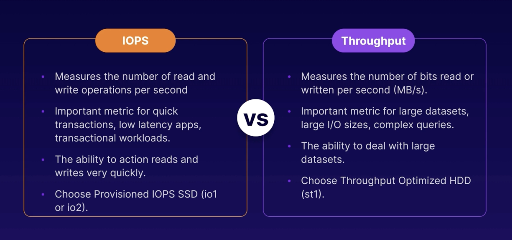


* Examp tips -EBS:
    * Highly available and scalable storage volumes that you can attach to an EC2 instance
    * 
    * 
    * 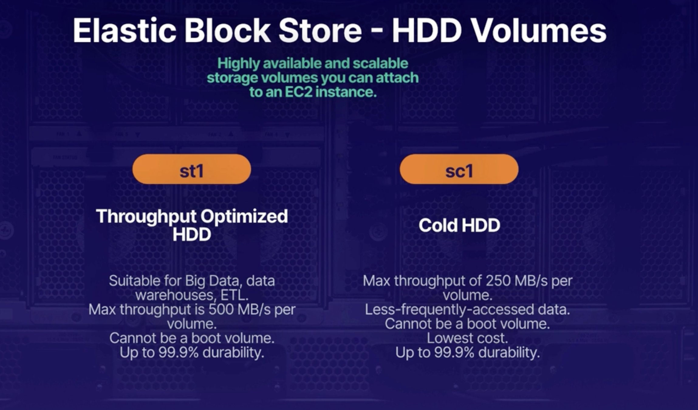
    * If you create an EBS volume from an encrypted snapshot you well get an encrypted volume
    * If you create an EBS volume from an unencrypted snapshot you well get an unencrypted volume

[Amazon EBS volume types](https://aws.amazon.com/tr/ebs/volume-types/)

## Elastic Load Balancer

* a load balancer distributes network traffic across a group of servers.
* Types of Load balancers in AWS:
    * Application Load Balancer:
        * load balances HTTP and HTTPS, and this provides intelligent load balancing,
          which allows you to route requests to a specific web server based on the HTTP request header
        * Application Load Balancers operate at **Layer 7 of the OSI model**, so they are application-aware.
        * as the Application Load Balancer is application-aware, they support advanced request routing. So that means
          you can route requests to specific web servers based on the HTTP header.
    * Network Load Balancers:
        * the high performance option for TCP traffic only
        * **Layer 4- Transport layer of the OSI model**\
        * is load balancing based on the TCP protocol. And it is capable of handling millions of requests per second
          while maintaining ultra low latencies
        * it's the highest performance, it is also the most expensive option
    * Classic Load Balancer - legacy:
        * can handle HTTP and HTTPS and TCP protocols as well
        * they support some Layer 7-specific features like X-Forwarded-For headers,
        * and sticky sessions that just allows you to keep sending requests
          which originate from the same session onto the same web server, making the session sticky
        * it does also support Layer 4 load balancing for applications which rely purely on the TCP protocol.
    * Gateway Load Balancer:
        * Highly new
        * for third-party virtual appliances
        * this one allows you to load balance workloads for third-party virtual appliances running in AWS, such as
          virtual appliances purchased on the AWS Marketplace, virtual firewalls from companies like Fortinet,
          Palo Alto, Juniper, or Cisco,
        * and intrusion detection or intrusion prevention systems from companies like CheckPoint and Trend Micro, etc.

* **OSI(Open System Interconnection) 7-layer model Model** :
    * it's a conceptual framework, which describes the functions of a network, beginning with the application layer,
      which directly serves the end user right down to the physical layer and everything in between.
    * Application Layer:
        * this is everything that the end user sees. So HTTP operates at this layer and so does your web browser as
          well.
    * Presentation Layer:
        * This layer makes sure that the data is in a usable format and protocols like encryption and SSH operates at
          this layer.
    * Session Layer:
        * all about maintaining connections and sessions
    * Transport Layer :
        * all about transmitting data using protocols like TCP and UDP
    * Network Layer:
        * this layer is concerned with logically routing network packets based on IP addresses.
    * Data Link Layer:
        * it is concerned with physically transmitting data based on MAC addresses
    * Physical Layer:
        * this is all about transmitting bits and bytes over physical devices,like the cables and hubs that make up the
          network
* Load balancer error 504 Gateway timeout:
    * it usually means that the target or the downstream web or application server has failed to respond.
    * the first thing we need to do is check the application.

* Exam tips - Elastic Load Balancer:
    * 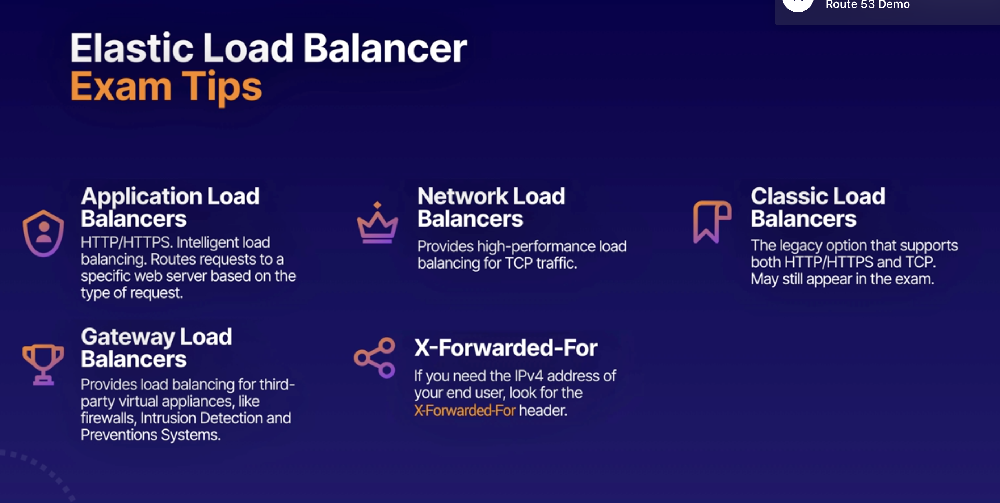

## Route 53

* AWS DNS service
* Allows you domain maps to
    * EC2 instances
    * Load balancer
    * s3 bucket

* Route Demo
    * We create an EC2 instance as we did in the previous (install httpd)
    * Then on right side down ec2 menu we add a LoadBalancer by adding and configure our EC2 instance as a target
    * We update security Group as launch-wizard to make accessible from internet
    * Then we went to the Route 53 and add our loadbalance instance as a simple Route Record with the ec2 target

* AWS CLI Lab
    * We create an EC@ instance with Linux
    * If you set up Linux AIM 2 then aws cli is default set up in it.
    * We configure our AWS Cli by using `aws configure`
    * it requires Access credentials and secret that's why we went to IAM and create a new user with S3 Full access the
      set access keys in configuration
    * To check aws configure `aws configure list`
    * To check s3 `aws s3 ls`
    * To create s3 `aws s3 mb s3://acloudgru-{unique numbers}`
    * Create hello.txt filr by `echo "Hello cloud guru" >hello.txt`
    * To upload s3 bucket: `aws s3 cp hello.txt s3://acloudgru-{unique numbers}`
    * To lost content of selected bucket `aws s3 ls s3://acloudgru-{unique numbers}`
    * [AWS CLI S3 command DOC](https://awscli.amazonaws.com/v2/documentation/api/latest/reference/s3/index.html)

##                                                                             * Exam tips - AWS CLI

* Least Privilege: always give your user the minimum amount of access required to do their job
* Use identity access management groups
    * Create IAM groupsand assign your user in it
    * Groips permission is assigned the IAM policy document
    * your user will authomaticaly inherit
* Secret access key
    * you will see only once is you lose it you can delete current key and recreate again, however you need to configure
      your aws cli again by `aws configure`
    * Dont share keys

##                                                                            * AWS Pagination

* You can control the numbur of items insluded the output when you run CLI command
* by default AWS CLI uses page size of 1000
    * i.e. imagine you call `aws s3api list-objects my_bucket` s3 bucket has 2500 items in it , AWS CLI will make 3
      calls at behind and shows once as a whole
* Errors:
    * 1000 page size can be so much when you see errors when listing a large amount of aws resources
    * you can see timeout errors that is probably you reached the max amount of recalls.
    * How to fix:
        * Adjust the default page-size, user the --page-size option to have CLI request a smaller number of items from
          each API call
        * the CLI retrieves the full list, but performs large amount of API calls in background and retrieves small
          amount of items each time
            * `aws s3api list-objects --bucket my_bucket --pages-size 100`
            * and --max-items `aws s3api list-objects --bucket my_bucket --max-items 100`
* Examp tips - CLI pagination:
    * if you do see like 'time out ' or errors related to too many results being return
        * adjust pagination in CLI results to avoid generated by too mant results
        * `aws s3api list-objects --bucket my_bucket --pages-size 100`
    * The CLI retrieves the full list ut performs a larger amount of api calls in the background retrieves smaller
      number of items with each call
* Examp Tips - Using Roles in Ec2 instances
    * The preferred option is Roles in security perspective. When they asked to access one servoce to another they
      probably asking Roles in the question
    * Avoid hard coding your credentials, roles are providing short term credentials to the application itself.
    * Policies control a role's permission
    * You can update policy of a role and affect immediately
    * Attach and deattach roles to runnig EC@ instances without terminate the service

## RDS (Relational database System)

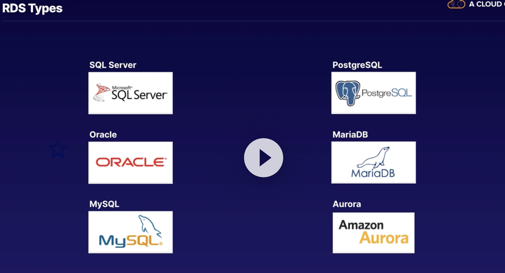

* RDS is Online Transaction Processing (OLTP)
* Aurora is Amazon product and compatable with MySql and Postgress
* Automaticaly scalable
* way better performance and functionalty
* Up and runnig in minutes
    * Multi-AZ (Availibityr Zone) : for durability, creates a stanby in in a different AZ to provide data redundancy,
      eliminate I/O freezes, and minimise latency spikes during system backups.
    * Failover Capacity
    * Automated backups
* RDS is not suitable for analysing large amount of data and instead you should think about datawarehouse like Redshif.
  Optimised for OLAP (online Analytics processing)
* OLAP and OLTP
  

##                            * Exam tips - RDS:

* RDS types:
    * SQLServer, MySql,Orackle, Postgres, Aurora, MariaDB
* RDS designed OLTP type of workloads:
    * Great for processing lots of small transactions, like customer orders banking transactions etc.
* RDS is not suitable OLAP

* **RDS Demo**
    * Have an EC@ instance that has mysqlCliend instaled in it try to reach MySql instance in AWS RDS
    * While create our EC2 we create a security group called "myec2-sg" , then while creating RDS Mysql free trial
      instance
      we also define another SG called 'rd-sq'
        * Then in 'rd-sg' we add our EC@ instance SG as "inbound Security group" into "rd-sg" security group to make
          reachabile
    * To reach from instande to RDS we need RDS endpoint , in RDS instance details you can find
    * Connect to your database using your endpoint:
        * `mysql -u acloudguru -p -h acluodguru.hjkhdjkfhdkf {endpoint} acloudguru` when we hit enter it will ask
          password '
          -p'

## RDS Multi-AZ and Read Replicas:

* **Multi-AZ** is an exact copy of your production database in another availability zone.
* Multi-AZ is for disaster recovery (DR).
* RDS will replicate the data from the primary instance to the standby. Now under normal circumstances with everything
  operating as expected, the standby RDS instance is not visible or accessible to the application servers.
    * But if something goes wrong with our primary database instance, it could be there's a hardware issue or even a
      problem with
      the entire availability zone, we still have another database instance in the standby location.
* RDS will automatically fail over to the standby database instance.
    * So we haven't lost our database. So with Multi-AZ AWS have done all the heavy lifting for you.
* AWS handles all the replication between primary and secondary, so you don't have to configure anything yourself.
* when you write to your production database, this right will automatically synchronize to the standby database.
* RDS database can be configured as Multi-AZ, well it's basically all of them. So that includes SQL Server, Oracle, My
  SQL. PostgreSQL and MariaDB as well.
* main purpose with Multi-AZ is to provide resilience and keep your application up and running, if you experience an
  unplanned failure or if you're performing maintenance on your primary RDS instance.
* you cannot have your database clients
  or your application servers connecting to both the primary
  and standby simultaneously

* **Read Replicas:**
* To improve performance the main things you can do to improve a performance and particularly read performance is to
  add Read Replicas.
* a Read Replica is a read-only copy of your primary database
* it takes the read load off your primary database.
* Read Replica can be loaded
    * in the same availability zone as your primary database.
    * also be cross-AZ, so located in a completely different ability zone.
    * can even be cross-region and located in a completely different region.
* each Read Replica has its own DNS and point, which different and independent from the primary database.
* Read Replicas can even be promoted to become their own independent databases.
    * However, of course if we do that, that's going to break the replication from the original database but it will
      give us two completely independent databases both allowing read and write access.
* they're primarily used for scaling and not fault disaster recovery
* in order to configure a Read Replica, you will need to have automatic backups enabled. And automatic backups of course
  they are enabled by default, but if for some reason you've disabled backups then you won't be able to deploy a Read
  Replica.
* multiple Read Replicas are supported. So for MySQL, MariaDB, PostgreSQL, Oracle and SQL Server they all allow you to
  add up to five Read Replicas to each database instance.

* Exam tips - Multi-AZ and Read Replicas:
    * Multi-AZ you get an exact copy of your production database in another availability zone.
        * It's used for disaster recovery.
        * the event of a failure, RDS audience will automatically fail over to the standby instance.
    * with Read Replicas, you get a read only copy of your primary database either in the same availability zone, in a
      different availability zone or in a different region entirely.
        * Read Replicas are used to increase or scale read performance,
        * they're not used for disaster recovery.
        * they are great for read heavy workloads because they take the load off your primary database for read-only
          workloads

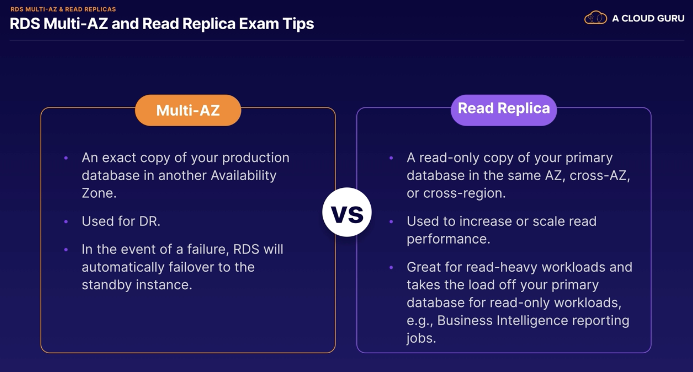

## RDS Backups and Snapshots

* Snapshots:
    * database snapshots, which are manual, ad-hoc, and user initiated.
    * this provides a snapshot or a point in time copy of the storage volume attached to your database instance.
    * Snapshots are stored in S3
    * So they are not deleted even after you delete the original RDS instance, including any automated backups. So the
      database and its backups can be deleted, and the snapshots will remain.
    * when would you use this?
        * Well, imagine you were planning some significant updates to your data.
        * You might wish to backup to a known state before you make any changes to your data, so that you can always
          restore back to that state if anything goes wrong
* Automated Backups:
    * these are enabled by default and you define the backup window
    * with automated backups, RDS creates daily backups or snapshots which run during a backup window that you define.
    * in addition to this daily backup, it also generates transaction logs, which are used to replay transactions when
      you come to restore the database.
    * this gives you the ability to perform a **point-in-time recovery** and recover your database to any point in time
      within a retention period of between one and 35 days.
        * this gives you the ability to recover to any point in time within your defined retention period.
    * How will work?
        * it performs a full daily backup or snapshot, and it also stores transaction logs throughout the day.
        * then during the recovery process, when you perform a recovery, AWS will first select the most recent daily
          backup.
        * It will then apply the transaction logs relevant to that day up to the recovery point that you select
    * the retention period is of course user-defined. And it can be anything between one and 35 days
    * Backups are stored in S3
    * You get free storage space equivalent to the size of your database. So if you've got an RDS instance with 10 gigs
      of data, then you will get 10 gigs worth of storage for your automated backups.
    * during the backup window, your storage I/O may be suspended for just a few seconds while the backup process
      initializes itself
        * And during this time, you may experience increased latency. But this is only during the initialization
          process.
    * 
* when you come to restore an RDS database, whether you restore from an automated backup or from a manual snapshot, the
  restored version of the database will always be a completely new RDS instance with a new DNS endpoint
    * So it's going to have a different endpoint to your original RDS instance

* Encryption:
    * Encryption at rest is very easy to enable with RDS, and you can enable it at creation time by just selecting the
      encryption option in the console.
        * YOu can select only by creating the database tha later can not vbe possible.
    * RDS is completely integrated with KMS. So encryption is done using KMS, and it uses the industry standard, AES-256
      bit encryption.
    * when we enable encryption on an RDS database, then RDS is going to encrypt all of the database storage. So that
      includes all of the underlying storage associated with your RDS database, including any automated backups, any
      manual snapshots, any logs, and read replicas as well.
    * if you have an existing unencrypted database and you are suddenly asked to encrypt that data?
        * snapshots can actually help you with that situation, to help encrypt your database.
            * So if you've already created an unencrypted database and you need to encrypt that data,
            * you can take a snapshot that snapshot will also be unencrypted.
            * then from that unencrypted snapshot, you can create an encrypted snapshot,
            * then perform a database restore using that encrypted snapshot
            * in that way, you will get an encrypted database.
            * 

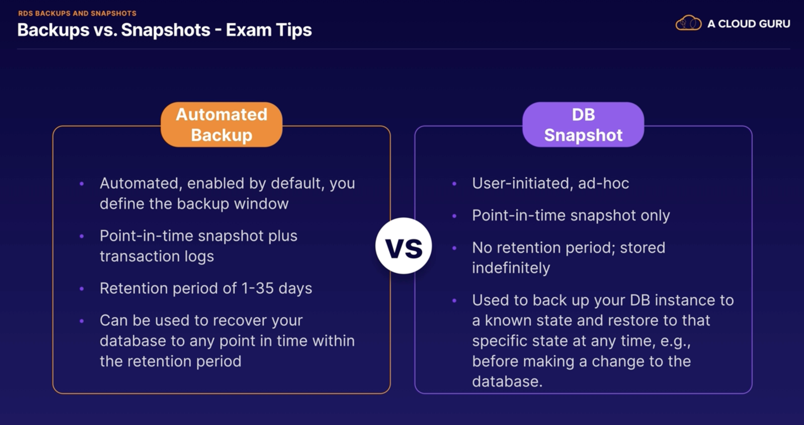


## Elastic Cache

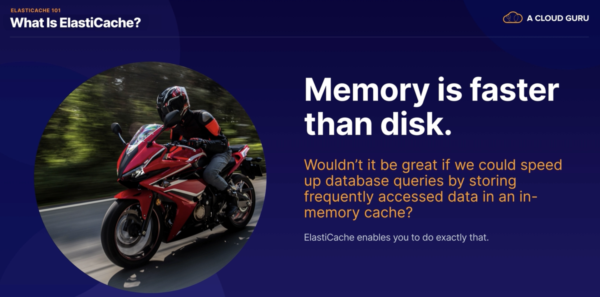

* memory is faster than disk. And wouldn't it be great if we could speed up database queries by storing frequently
  accessed data in an in-memory cache
* ElastiCache is an in-memory cache designed to improve read performance for read-heavy databases
* Unlike many data stores in AWS, it is a key value data store.
* An ElastiCache makes it really easy to deploy, operate, and scale an in-memory cache in the cloud.
    * And it's designed to improve database performance.
    * So it allows you to retrieve information from fast in memory caches, instead of slower disc based storage.
* it allows you to catch the results of I/O intensive database queries, and it's also really useful for storing session
  data for distributed applications
* 2 types Elastic Cache
* Memcached:
    * this is great for basic object caching.
    * It scales horizontally,
    * but there is no persistence for the data and there is no Multi-AZ or failover option either.
    * However, is a good choice if you just want basic caching
    * and you want your caching model to be as simple as possible.
* Redis:
    * this is a more sophisticated solution with enterprise features like persistence, replication, Multi-AZ and
      failover.
    * and it also supports sorting and ranking data for example, for gaming leaderboards.
    * And it also supports complex data types like lists and hashes.
* a typical scenario that you might see in the exam.
    * you might be given a scenario where a particular database is under a lot of stress and you'll be asked to find a
      solution.
    * So you might be asked at which service should you use to alleviate this.
    * And you will need to know when to use ElastiCache.
        * So ElastiCache is a really good choice
        * if your database is particularly read-heavy and the data is not prone to frequent changing.
        * Because if the data is changing too frequently, then ElastiCache will struggle to have the latest data
          available and it will not be a very effective solution.
    * be aware of when ElastiCache can't help.
        * it's not gonna help if your database is struggling with heavy write loads.
            * So caching will not help alleviate heavy write loads so in that case you may need to scale up your
              database instead.
        * And if you're running online, analytical processing or OLAP queries, and your database is feeling stress
          because you're performing online, analytical processing,
            * then ElastiCache is not going to help with that because you really need a data warehouse for that rather
              than a database. And you should think about using Redshift instead.
* 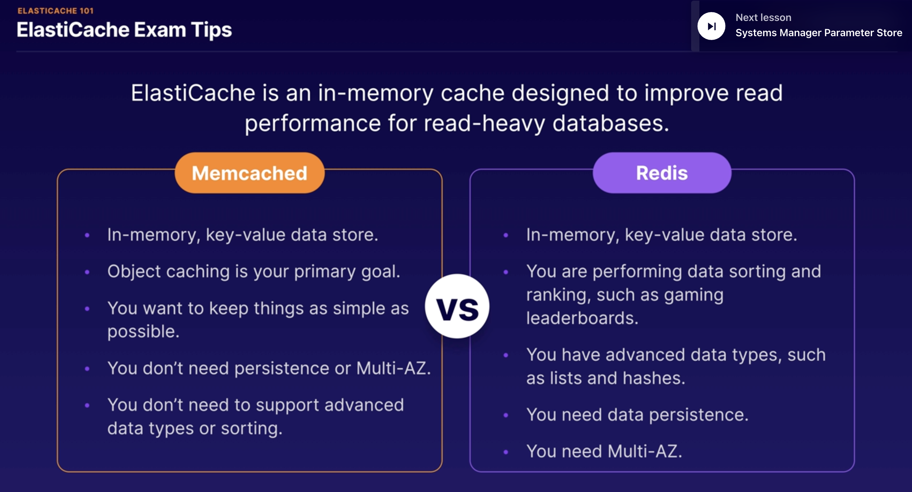

## System Manager Parameter Store:

* it's really important that you maintain the confidentiality of the information, and avoid hard coding parameters in
  your code.
* So you need a place to store this information centrally so that it can be accessed by your EC2 instances, and the data
  must be stored in a secure way
* this is where Parameter Store comes in
* In Management Console of AWS -> Systems Manager -> Parameter Store
* it provides centralized storage and management of your secrets and configuration data, like passwords, database
  strings, and license codes. And you can actually encrypt the values as well, or just store them in plain text,
  depending on the sensitivity of your data.
* Parameter Store is a great way to store confidential information. So you can store things like passwords, database
  connection strings, and license codes, etc.
    * So basically any piece of data or parameter that is useful to your application and that you want to store
      centrally in a secure way.
* You can store your values as either plain text or encrypted, using KMS.
* then you can reference your parameters using the parameter name, for example, in a bootstrap script.
    * And Parameter Store is integrated with loads of different AWS services, so you can use it with EC2,
      CloudFormation,
      Lambda, CodeBuild, CodePipeline, and CodeDeploy.
      

### Summary:

[EC2 - Part 1](https://acloudguru.visme.co/view/8r08r8nv-aws-certified-developer-associate-studyguide-s03-beginner-guide-to-ec2-part1)

* EC2 is like a virtual machine, which is hosted in AWS instead of your own data center.
    * You can select the capacity that you need right now, grow and shrink when you need,
    * pay only for what you use
    * and wait minutes, not months, so you can be up and running in just a few minutes rather
      than waiting months as you would

* if you were installing a server in your own data center.
  When it comes to pricing, there are 4 different pricing options to be aware of.
    * On-Demand:
        * And this is where you pay by the hour or second, depending on the type of instance you run.
        * this is great for flexibility.
    * Reserved instances:
        * which allows you to reserve capacity for 1 or 3 years with up to a 72% discount on the hourly charge.
        * this is great if you have known fixed requirements.
    * Spot instances:
        * which allows you to purchase unused capacity at a massive discount of up to 90%.
        * Prices fluctuate with supply and demand, but this is great for applications with flexible start and end times
          because as soon as the Spot price exceeds the maximum you're willing to pay, the instance will be terminated
          or stopped.
    * Dedicated :
        * this is where you have a physical EC2 server dedicated for your use.
        * this is great if you have server bound licenses that you want to reuse or compliance requirements, which mean
          you cannot use multi-tenant hardware.
        * The instance type determines the hardware of the host computer, and each instance type offers different
          compute, memory, and storage capabilities and these are grouped in instance families.

* EBS (Elastic Block Store) volumes.
    * EBS volumes are highly available and scalable storage volumes that you can attach to an EC2 instance.
    * When we launched an EC2 instance and created an EBS volume, and then we attached the EBS volume to our instance.
    * there are a few different types of EBS volumes to choose from.
    * gp2:
        * which is suitable for boot disks and general applications.
    * gp3:
        * which is the latest generation of SSD.
        * And it's also suitable for boot disks and general applications.
        * But the difference with this one is that you get a baseline of 3000 IOPS for all volumes no matter what their
          size,
        * it is currently 20% cheaper than gp2 because they want to encourage everybody to use the latest generation.
        * But both gp2 and gp3 are both limited to 16,000 IOPS per volume.
        * So if your application requires greater than 16,000 IOPS, then you should go for provisioned IOPS.
    * with provisioned IOPS,
        * io1 and io2,
            * io2 is the latest generation.
            * these are suitable for online transaction processing and latency sensitive applications.
            * you get up to 64,000 IOPS per volume.
        * io2 Block Express:
            * which is designed for the largest, most critical
              and high-performance applications like SAP HANA, Oracle and Microsoft SQL server, etc.,
            * with volume sizes of up to 64 terabytes and 256,000 IOPS per volume.
            * this really is SAN in the cloud performance.

    * HDD volumes or hard disk drives,
    * st1, also known as Throughput Optimized HDD,
        * these are all suitable for big data, data warehouses, and extract transform load workloads.
        * The maximum throughput is 500 megs per second per volume.
        * these cannot be used as a boot volume, and you get up to 99.9% durability.
    * sc1.
        * this is also known as Cold HDD.
        * You get a maximum Throughput of 250 megs per second per volume, but suitable for less frequently access data.
        * They cannot be a boot volume.
        * They come in at the lowest cost and you get up to 99.9% durability.

    * On to EBS snapshots.
        * EBS snapshot is a point in time copy of an EBS volume.
        * they are great for backing up your EBS volumes.
        * you can use a snapshot to create a new EBS volume.
        * if you create a new EBS volume from an encrypted snapshot, then you will get an encrypted volume.
        * if you create a new EBS volume from an un-encrypted snapshot, then you will get an un-encrypted volume.

* Elastic load balancer:
    * Application Load Balancers:
    * these provide intelligent load balancing for HTTP and HTTPS, and they allow you to route requests to a specific
      web server based on the request type.
    * think of my example of a car dealership
      website where you've got sales information,
      loan applications, and repairs and servicing,
      and you want to route the incoming requests
      to the appropriate application server.
    * Network Load Balances:
        * these provide high-performance load balancing for TCP traffic.
        * So this is the low-latency option
        * and it's also the most expensive.
    * Classic Load Balancer:
        * this is the legacy option, which supports
          basic HTTP, HTTPS, and TCP load balancing.
        * although it's the legacy option, it may still appear in the exam.

    * Gateway Load Balancers:
        * these provide load balancing for third-party virtual appliances, for example, virtual appliances that you
          might find on the AWS marketplace.

    * if you need to find the IPv4 address of the end user for the requests coming into your load balancer, then look
      for the X-Forwarded-For HTTP header.
        * this is supported by Application and Classic Load Balancers.
    * if you see a 504 Error with the message Gateway timeout, then that means your application is not responding within
      the time out period and you will need to troubleshoot your application or database server, fix the problem, and
      that should clear the error.

[EC2 - Part 2](https://acloudguru.visme.co/view/8r08r6nq-aws-certified-developer-associate-studyguide-s03-beginner-guide-to-ec2-part2)

* Route 53
    * Route 53 is Amazon's DNS service
    * it allows you to map a domain name to an EC2 instance, an elastic load balancer or S3 bucket.
    * if you remember, we created a web server running httpd,
        * we added an application load balancer
        * then we configured our hosted zone with a new alias
        * an A record to map our domain name to the DNS address of our application load balancer
        * this is one of the most common use cases for Route 53.
    * Route 53 terminology.
        * So we used a hosted zone, which is a container for DNS records for our domain
        * alias is what allows you to route traffic addressed to the zone apex or the top of the DNS namespace,
            * for example, ilovecloud.com and send it to a resource within AWS, for example, an elastic load balancer
        * an A record allows you to route traffic to a resource such as a web server, using an IPv4 address.

* AWS CLI,
    * the principle of least privilege and always give your users the minimum amount of access required to do their job.
        * And it's best practice to use groups,
    * create identity access management groups and assign your users to groups.
        * Group permissions are assigned using IAM policy documents and your users will automatically inherit the
          permissions of the group.
    * When it comes to generating the secret access key, remember that you will only see this once and if you lose it,
      then you can delete the access key ID and secret access key and regenerate them.
        * And if you do that, you will need to run AWS configure again and provide the new credentials.
        * Don't share your key pairs and each developer should have their own access key ID and secret access key and
          just like passwords, they should never be shared.
    * AWS CLI supports Linux, Windows and MacOS, so you can install it on your local machine
        * you can also use it on EC2 instances as well.
        * And of course, when we launch a Linux to EC2 instance, you get the AWS CLI pre-installed.
    * using roles with EC2
        * we can use a role to give an EC2 instance access to AWS resources like S3.
        * And to do that, we need to create an Identity access management role with S3 access.
            * Create an EC2 instance and attach the role that we just created and then we should be able to access S3
              from our EC2 instance.
        * And using roles in this way is the preferred option from a security perspective. And it allows you to avoid
          hard coding your credentials,
        * so roles allow you to provide access without having to manage access keys and secret access keys and manually
          configure them on every single EC2 instance.
    * IAM policies to control a roles permissions
        * you can update a policy attached to a role
        * it will take immediate effect.
        * And you can attach and detach roles to running EC2 instances without having to stop or terminate the instances

* RDS or Relational Database Service.
    * got a few different RDS database types : SQLServer, Oracle, MySQL, PostgreSQL, MariaDB and Amazon Aurora
    * RDS is for online transaction processing (OLTP) workloads.
    * So this is great for processing lots of small transactions
        * like customer orders, banking transactions, payments and booking systems
    * It is NOT suitable for online analytics processing (OLAP).
        * So instead, we should use RedShift for OLAP and data warehousing type tasks like analyzing large amounts of
          data, reporting and sales forecasting.
    * differences between automated backups and database snapshots (known as manual snapshots).
        * automated backups:
            * these are enabled by default and you define the backup window.
            * They provide point-in-time snapshots plus transaction logs.
            * You can define a retention period of up to 35 days and they can be used to recover your database to any
              point in time within the retention period.
        * snapshots:
            * are user-initiated and ad-hoc.
            * They provide point-in-time snapshots only,
            * there's no retention period
            * they are stored indefinitely until you delete them
            * they can be used to backup your database instance to a known state and restore to that specific state at
              any time,

    * when it comes to encrypting your RDS database, you will need to enable encryption at creation time.
        * So you cannot enable it later
        * when you encrypt your RDS database it includes all the underlying storage, automated backups, snapshots, logs
          and read replicas as well. So it's going to encrypt everything.
        * RDS integrates with KMS, so it uses the AWS Key Management Service for AES-256 bit encryption.
        * And if you have any existing RDS instance which you need to encrypt, of course you cannot add encryption later
            * but what you can do is take a snapshot of your database
            * then encrypt the snapshot
            * and create a new RDS instance from your encrypted snapshot.

    * multi-AZ:
        * you get an exact copy of your production database in another availability zone.
        * These are used for disaster recovery, so in the event of a failure, RDS will automatically failover to the
          standby instance.
    * a read replica
        * is a read-only copy of your primary database
        * this can be in the same AZ, cross-AZ or cross-region.
        * read replicas are used to increase or scale read performance.
        * a read replica is great for read-heavy workloads
            * because it takes the load off your primary database for read-only workloads,
            * for example, if you need to run a business intelligence reporting jobs.

* ElastiCache:
    * Another way to improve read performance for RDS is to use ElastiCache.
    * ElastiCache is an in-memory cache designed to improve read performance for read-heavy databases
    * there are two options available.
    * memcached:
        * this is an in-memory, key-value data store.
        * And this is the one to use if object caching is your primary goal
        * you want to keep things as simple as possible,
        * you don't need persistence or multi-AZ
        * and you don't need support for advanced data types or data sorting.
    * redis,
        * that is also an in-memory key-value data store
        * but this is the one to use if you are performing data sorting and ranking, such as in gaming leaderboards.
        * And it's also a great choice if you have advanced data types such as lists and hashes
        * if you need data persistence and multi-AZ.
            * So memcached is your basic option whereas redis provides enterprise features like persistence and
              multi-AZ.

* parameter store:
    * allows you to store confidential information
        * such as passwords, database connection strings and licensed codes, etc.
    * You can store your values as plain text or encrypt them and reference them using the parameter name,
        * for example, in a bootstrap script.
            * And parameter store is integrated with lots of different AWS services.
        * So you can use it with EC2, CloudFormation, Lambda and it also supports CodeBuild, CodePipeline and
          CodeDeploy.
* 

# S3 Bucket

## S3 101

* S3 stands for simple storage service
* it provides the secure, durable and highly scalable object storage.
* it's object storage and it's really for files, images, webpages and that kind of thing.
* it's also super scalable and allows you to store and retrieve any amount of data from anywhere on the web at a very
  low cost.
* S3 is **object based** storage so it manages it data as objects rather than in file systems like an operating system
  or in
  data blocks.
* you can upload any type of file that you can think of to S3.
    * For example, photos, videos, code, documents and text files.
* However, it cannot be used to run an operating system or a database.
* S3 you get unlimited storage.
    * So the total volume of data and the number of objects that you can store is unlimited.
* S3 objects can be up to 5 TB terabytes in size
    * they can range in size from a minimum of 0byte->5TB.
* within S3 the files are stored in **buckets**.
    * And a bucket is similar to a folder and it's really just a container and it's the name that AWS uses for the
      location where you are storing your files.
* S3 actually has a universal namespace.
    * And that means that all AWS accounts share the same S3 namespace and each S3 bucket name must be globally unique.
    * similar to a DNS address or an internet address which must also be globally unique.
* S3 URL:
    * https://**bucket-name**.s3.Region.amazonaws.com/**key-name**
    * https://**tugcecoloudguru**.s3.Region.amazonaws.com/**cat.jpeg**
    * keyname is the name of the object
* when you upload a file into an S3 bucket you are going to receive an HTTP 200 code if the upload was successful.
    * you'll only see this code if you're uploading using the API or the command line interface
* S3 is a key value store
    * the key which is simply the name
      of the object i.e cat.jpg.
    * the value, and this is really the data itself which is made up of a sequence of bytes which makes up the object.
    * a version ID which is important when we come to store multiple versions of the same object.
    * metadata and if you haven't heard that term before metadata just really means data about data
        * For example, content type, last modified or you could even add the name of the team that owns the file or the
          project that the file is related to.
    * 
* s3 is a safe place to store your data files and the data is spread across multiple devices and multiple facilities to
  ensure availability and durability.
    * And what that means is that Amazon could lose one of their devices or facilities and the S3 service will still be
      available.
* S3 is designed to be both highly available and highly durable.
    * S3 is built for between 99.95 and 99.99% service availability depending on the S3 tier that you select to store
      your data.
* it is also designed for 11 nines (99,9999999999) durability for data stored in S3.
    * we say durability that is all about your data being stored safely and not getting lost or corrupted
* S3 offers tiered storage.
    * So it offers a range of storage courses or tiers designed for different use cases depending on the type of data
      that you might be storing and your own business requirements.
* S3 has lifecycle management which allows you to set rules and define rules to automatically transition objects to a
  cheaper storage tier or even delete objects which are no longer required after a set period of time.
* versioning.
    * So with versioning all versions of an object are stored and can be retrieved including deleted objects.
    * So that means we can keep multiple historical versions of the same file allowing you to roll back to a previous
      version if you accidentally changed or deleted your file.
* Security:
    * S3 can enable server-side encryption:
        * you can set up default encryption on a bucket which will encrypt all new objects when they are stored in the
          bucket.
    * got access control lists:
        * which allow you to define which AWS accounts or groups are granted access and the type of access they're
          granted as well.
        * And you can attach S3 access control lists to individual objects within a bucket.
        * So that really gives you fine grained access control.
    * bucket policies
        * S3 bucket policies specify which actions are allowed or denied.
        * For example, you can use a bucket policy to allow a user named Alice to put but not delete objects within a
          bucket that you own.

## Reviewing s3 Storage Classes

* S3 Standard:
    * Data stored redundantly across multi devices in multi facilities.
        * Data will store >= 3 availability zones
    * Gets 99,99% availability
    * Gets 99,99999...% 11 9 durability
    * Perfect for frequently accessed data
    * It is designed to be suitable for most workloads,
    * it is the default storage class.
    * use cases include things like websites, content distribution, mobile and gaming applications, and big data
      analytics.
* S3 Standard-Infrequent Access:
    * this is designed for infrequently access data,
        * so data that you store can be accessing few times in a month but not daily bases
    * designed for rapid access
        * it can be use less frequently but requires to access rapid
    * there's a low per gigabyte storage price and a per gigabyte retrieval fee.
    * Use cases include long-term storage, backups, and disaster recovery files.
    * min storage duration is 30 days
    * Gets 99,99% availability
    * Gets 99,99999...% 11 9 durability
    * Data will store >= 3 availability zones
* S3 One zone-Infrequent Access:
    * Same as S3 infrequent Access storage but stored redundantly within a single availability zone instead of being
      stored in multiple availability zones.
    * Cost effective because it will cost less 20% than S3 Infrequent Access
    * It is great long-live infrequently non-critical data
    * Gets 99,95% availability because of one zone availability
    * Gets 99,99999...% 11 9 durability
* S3 Glacier:
    * very cheap and cost effect storage
    * optimised for data that is very infrequently access
    * you pay fee when you access data and only use for archiving
    * retrieval time is between 1 minute to 12 hours
    * great for historical data that you will reach few times in a year
    * min storage 90 days
    * Gets 99,99% availability
    * Gets 99,99999...% 11 9 durability
    * Data will store >= 3 availability zones
* S3 Glacier Deep Archive:
    * archiving rarely access data within 12 hours retrieval time
    * for example financial data that needs to access once or twice in a year or never, but you still need to store them
      because compliance purpose
    * min 180 days storage requires.
    * Gets 99,99% availability
    * Gets 99,99999...% 11 9 durability
    * Data will store >= 3 availability zones
* S3 Intelligent Tier:
    * When we need to access data frequently or non-frequently, we can use
    * has 2 tiers frequently and infrequently
    * with Intelligent-Tiering, S3 will automatically move your data to the most cost-effective tier based on how
      frequently you access each object.
    * This is great for optimizing your costs and they do charge you an additional monthly fee,
        * but it's a really small fee of $0.0025 per 1,000 objects, so the fee is negligible.
    * Gets 99,9% availability
    * Gets 99,99999...% 11 9 durability
    * Data will store >= 3 availability zones
* 

## Securing s3 buckets

* Secure by default:
    * all newly created buckets are completely private
    * only the bucket owner can upload/delete etc the files
    * No access on public by default
* Control Access to Bucket
    * Bucket Policy - bucket level:
        * it allows to give permission to pther users for some actions via defining policy
        * you can setup access control your buckets by define bucket policies
        * permissions granted by the policy are going to apply to all of the objects within the bucket.
        * not applying permissions to individual objects
        * you cannot attach a bucket policy to an individual object
        * it's not fine-grained access control
        * they are really useful.
            * If you have a group of files in the same bucket and they need to be accessed by the same people.
        * bucket policies are written in JSON,!
        * [Bucket policy](img/s3-3.png)
    * Bucket Access Control Lists(ACLs) - object level:
        * Access Control Lists are applied at an object level.
            * So this means that we can apply different permissions for different objects within the same bucket.
        * using Access Control Lists, we can grant different types of access to different objects within our bucket.
        * And we can define which accounts and groups are granted access and also the type of access.
            * For example, read, write or full control.
        * it's bucket ACLs which give you the fine-grained access control for objects within your S3 buckets. So you can
          grant a different type of access to different objects within the same bucket.
            * For example, you can apply different permissions for different objects for different users and groups.
* Access Logs:
    * these are not enabled by default but you can go in and enable S3 access logs.
    * this will log all of the requests made to your S3 buckets.
        * For example, every time a user makes a request to upload a file, read a file or delete a file.

* Object Lock:
    * Store objects using an write-once-read-many(Worm) model to prevent object being delete or overriten for a fix
      amount of time.

## S3 Encryption

* Encryption in transit:
    * means encrypting the data when you were sending it to and from your S3 buckets
        * SSL/TLS Transport Layer Security:
            * if you see SSL or TLS, then just know that that is encryption in transit
        * HTTPS:
            * typically that means we are using HTTPS to upload and download files between our local system and S3
* Encryption at rest - server-side encryption:
    * SSE-S3:
        * encrypts your data using encryption keys managed by S3.
        * each object is encrypted using its own unique key.
        * And as an additional step, they also encrypt the key itself with a master key, which they rotate for you.
        * Amazon manages the keys for you, so you don't need to worry about managing your own keys.
        * it uses AES 256-bit encryption, so Advanced Encryption Standard 256-bit.
        * this is very easy to enable
        * you can do that while you are uploading a file and you can also encrypt existing files as well
    * SSE-KMS:
        * this is with the AWS Key Management Service.
        * AWS manage the keys for you, but KMS comes with some additional benefits.
        * So firstly, you get separate permissions for the use of an additional key called an envelope key.
        * And that is a key which actually encrypts your data's encryption key.
        * So it gives you an added level of protection against unauthorized access.
        * And you also get an audit trail, which records the use of your encryption key.
        * And you can see when your key has been used, who used it, and what they did.
    * SSE-C:
        * which uses an encryption key that you provide yourself.
        * And this is where AWS manage the encryption and decryption activities, but you manage your own keys.
        * So that means you are in charge of administering the keys, rotating them, and the lifecycle of the keys as
          well.
* Encryption at rest - Client side Encryption:
    * this is where you encrypt the files yourself before uploading them into S3.

* you may have a requirement to enforce server-side encryption for any files stored in S3. how can you do that?
    * firstly, we can use the console.
        * can select the encryption setting on the S3 bucket
          and that is really the easiest way to do it and it's just a checkbox in the console
    * Bucket Policy:
        * every time a file is uploaded to S3, a PUT request is initiated,
        * the file is going to be transmitted into S3. So in this case, it's going to use HTTP.
        * hen expect 100-continue. This just tells S3 not to send your request body until it receives an
          acknowledgement. So that means that S3 can actually reject your message based on the contents of this header.
        * if the file is to be encrypted at upload time, then a special parameter will be included in the PUT request
          header.
            * ` x-amz-server-side` header parameter, 2 options in here
                * `x-amz-server-side encryption: AES256` : that is with S3 managed keys
                * `x-amz-server-side encryption: aws:kms` : this uses SSE-KMS, which uses KMS managed keys.
        * when this parameter is included in the header of the PUT request, it tells S3 to encrypt the object at the
          time of upload using the specified encryption method.
            * 
        * you can create a Bucket Policy which denies any S3 PUT request, which does not include this parameter in the
          request header.
        * this example policy explicitly denies any requests that are not using AWS Secure Transport.
        * So that means with this policy, S3 will only serve content over HTTPS SSL, and it will deny all unencrypted
          HTTP access.
            * 
* 

## CORS Configuration


* We will create 2 s3 buckets and publish as static webside from PRoperties -> Satatic Website section
    * bucket has to be publicly available
    * load index, loadpage and error.html with public Read ACLs permission for both buckets
    * then the second bucket which has loadpage.html needs to allow CORS thats why,
        * we went to Permission -> CORS enable and wrote that permission
          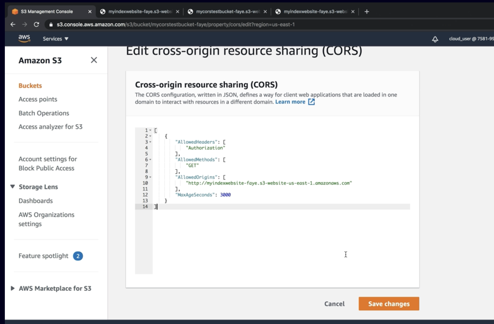
* 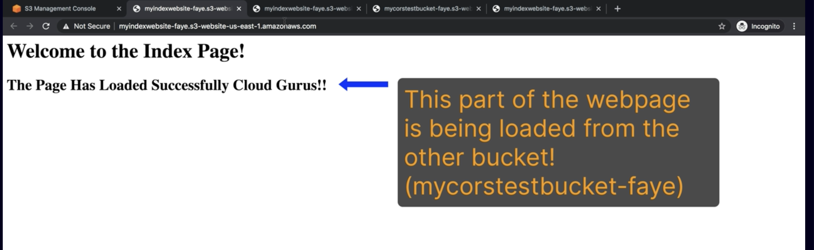
* Benefit:
    * cross-origin resource sharing is a really good way to organize your website. For example, you could store image
      files in one bucket, JavaScript in another bucket, and plain HTML in another,
    * and then use cross-origin resource sharing to allow the resources from one bucket to access the resources in
      another bucket.
    * And remember by default resources in one bucket cannot access the resources in another, if universal access were
      allowed, that would leave your resources open to attack and cause is the safe mechanism to allow controlled access
      between one resource and another.

## Overwiew CloudFront

* It is Amazon's Content Delivery Network (CDN), which is a system of distributed servers which deliver web pages and
  other web content
* it's an easy, and cost-effective way to distribute content with low latency and high data-transfer speeds
* this is all about making your web pages faster and CloudFront speeds up the distribution of your static and dynamic
  web content. So HTML, JavaScript, image files, videos, and web applications
* it's a much more efficient and performant way for geographically distributed users to access your content.
* the network latency is going to be different for each different location. And for users who are further away, they are
  going to experience greater latency and worse performance.
    * So for example, users based in Australia, they might experience worse performance and greater latency. And they
      might think that the website seems less responsive than users based, say in India, for example, which is
      geographically closer to London.
* with CloudFront, requests for your content are automatically routed to the nearest edge location. So content is
  delivered with the best possible performance, no matter where your users are located in the world.
* And this allows you to optimize performance for users accessing your website from all around the world.
* CloudFront is optimized to work with other AWS services.
    * So it's really well integrated with services like S3, EC2, elastic load balancer, and Route 53.
* TTL (time to live)
    * CloudFront, objects are cached and they are cached for a period of time,
    * default TTL 1 day
    * And when the TTL is up, the object is automatically cleared from the cache.
    * you can clear an object from the cache yourself before the TTL is up, but you will be charged for doing that
* how can we improve performance and make it more consistent for everybody. Well, this is where CloudFront comes in.
* 
* CloudFrond Edge:
    * and this is the location where the content is cached.
    * And it's separate to an AWS region or availability zone.
    * an edge location is simply a collection of servers which are in geographically-dispersed data centers.
    * And these edge locations are used by CloudFront to keep a cache of copies of your objects
    * this means that instead of requesting content from your server located in London for example, users can access
      that content from the edge location instead, which is physically much closer to them than the main server in
      London.
    * the edge location forwards the request onto the server located in London and it downloads the files requested and
      caches them locally.
    * So this means that next time the user requests the file, or if another user comes along and wants to access the
      same file, they can access directly from the edge location.
    * it means that your requests are only going to the local edge location and they're not going all the way to London.
    * edge locations are not just read only, and you can write to them as well.
        * For example, you can put an object onto them as well. And this is exactly what's happening with S3 transfer
          acceleration.
* CloudFront origin:
    * this is the origin of all the files that the distribution would serve.
    * And this can be an S3 bucket, an EC2 instance, or an elastic load balancer, or route 53 address. And it can also
      be your own server in your own data center.
* CloudFront distribution (CDN):
    * this is the name given to the origin and configuration settings for the content that you wish to distribute using
      the CloudFront content delivery network.
* 
* S3 transfer acceleration:
    * S3 transfer acceleration enables fast, easy, and secure transfers of files over long distances between your end
      users and an S3 bucket.
    * we can use CloudFront to accelerate the upload of files into S3.
    * you upload your file to the edge location and when it arrives at the edge
      location, it's routed to Amazon S3 over an optimized network path.
        * We have our S3 bucket located here in London, and again,
        * we've got our users geographically distributed,
        * and just imagine all these users need to upload some files into this S3 bucket.
        * So instead of uploading directly to the bucket in London, which could take a long time for some of these users
          who are furthest away,
          instead, they can upload their file into the CloudFront edge location.
        * And from there, the edge location will transfer that file into the London-based bucket, using the fast
          networks within AWS.
    * 
* Origin Request Header: You can pass all header params through CloudFront to the origin.
* Cache policy : You can define TTL on the Cloud Edge
* Restrict viewer Access (Use only signed content or Cookie): This allows you to restrict the users to reach the content
  with permission.
* It has also WAF(Web Application Firewalls): This provides traffic filtering for well-known attack, like SQL injection
  and Cross side.
* In CloudFrond you can restrict countries by adding white/black lists
* Invalidations are allows you to for example delete your old version cached images on CF cache without waiting.
    * This is am manual and everytime you do you will charge money

    * 
* We can give Origin Access Identity:
    * OAI is a special Cloudfront user that can access files in our bucket and serve them to users
    * OAI allows us to restrict access to the contents of your bucket, so that all users must use the cloud front URL
      instead of direct s3 bucket link.
    * Scenario: Create a public S3 bucket
        * Load image and make public Read ACL
        * Create CloudFront
        * Select OAI and create one
        * And dont forget to override S3 bucket access rule checkbox
        * Copy CloudFront link and image URl then you can reach
        * Even you make your S3 bucket, still you can reach via Cloudfronf address, but not s3 buvcket address link,
          because you let only access via Cloud Front link.
* Understand Cloud frond Allowed Methods:
    * When you create a Cloudfront distribution, you needs to choose which Http Methods your distribution will support.
    * GET,HEAD: read only
    * GET,HEAD,OPTIONS: read only
    * GET,HEAD,OPTIONS, POST,PUT,DELETE,PATCH: read and write methods
* 
* 

### Summary

* S3 is object-based storage.
    * it allows you to upload files and store them in AWS,
    * it's a great place to store things like images, videos, code, text files, and documents, etc.
    * However, it's not suitable to run an operating system or database from S3.
    * Files can be up to 5 terabytes in size,
    * and with S3, you get unlimited storage. So the total volume of data and the number of objects or files you can
      store within S3 is unlimited.
    * Files are stored in buckets and S3 has a universal namespace,
    * so all bucket names must be unique.
    * So we have the bucket name, followed by the region, followed by the key name or the object or file name.
        * And in my example, I've got a bucket named fayecloudguru. It's located in us-east-1 and I have a file in there
          named Ralphie.jpeg.
    * And if you're using the CLI or the API, then successful uploads will generate an HTTP 200 status code.
    * S3 objects consist of a key, which is the object name, for example, Ralphie.jpg;
    * the value, which is the data itself, which is made up of a sequence of bytes.
    * There's also a version ID, which allows you to store multiple versions of the same object;
    * and also metadata, which is data about the data you're storing.
        * For example, content type or last modified, etc.
* storage classes or tiers.
    * S3 Standard, which is suitable for most workloads.
        * For example, websites, content distribution, mobile and gaming applications, and big data analytics.
        * And this is great for frequently accessed data.
        * So data that you're accessing on a daily basis.
    * S3 Standard-Infrequent Access, which is long-term storage
        * for infrequently accessed critical data.
        * For example, backups or as a data store for disaster recovery files.
    * S3 One Zone-Infrequent Access and this is great for long-term, infrequently accessed, non-critical data.
        * And the data is stored redundantly, but only in one single Availability Zone.
        * So that's why you only get 99.5% availability.
        * So this is not suitable for critical data, like backups.
    * Glacier Instant Retrieval, which is archiving for long-lived data
        * that needs millisecond retrieval times,
        * and Glacier is a cost-effective way to store your data,
        * but you do pay a fee every time you access the data.
    * Glacier Flexible Retrieval is for archiving data that needs to be accessed within a few hours or minutes.
        * And Glacier Deep Archive is for rarely accessed data with a default retrieval time of 12 hours.
    * S3 Intelligent-Tiering, designed for unpredictable access patterns
        * and it will automatically move infrequently accessed data to a more cost-effective storage class to save you
          money.

* Security,
    * S3 is secure by default.
    * So by default, all newly created buckets are private.
    * You can control access to your buckets using bucket policies, which are applied at a bucket-level
    * access control lists, which are applied at an object-level and give you fine-grained access control.
    * S3 buckets can be configured to create access logs, which log all the requests made to the S3 bucket. And these
      logs can be written to another S3 bucket, but they are not enabled by default.

* encryption,
    * S3 supports encryption in transit using SSL or TLS. And this is all about encrypting your data as it travels over
      the network.
        * And we can use HTTPS to encrypt our data in transit.
    * encryption at rest.
        * And S3 supports 3 different types of server-side encryption.
            * SSE-S3, which uses the Advanced Encryption Standard 256-bit.
                * And this uses encryption keys, which are managed within S3.
            * SSE-KMS, which uses encryption keys, which are managed within the AWS KMS service, or Key Management
              Service.
            * SSE-C, which uses encryption keys which are managed by the customer.
    * client-side encryption as well.
        * And this is where you encrypt the files yourself before you upload them into S3.
    * enforce encryption using a bucket policy.
        * it's really easy to enforce encryption within the AWS console by selecting Encryption in the bucket
          configuration,
        * but you can also use a bucket policy to deny all PUT requests which do not include the
          x-amz-server-side-encryption parameter in the request header.
        * you can also use a bucket policy to deny requests that do not use aws:SecureTransport in order to enforce the
          use of HTTPS or SSL.

* Cross-Origin Resource Sharing, or CORS.
    * we used CORS to enable code in one S3 bucket to access code that was located in another S3 bucket.
    * So allowing one resource to access another resource.
    * So we configured one S3 bucket containing index.html and another bucket containing loadpage.html, and then we
      configured CORS to allow the file in our first bucket to read the file in our second bucket.
    * then when we accessed the website, then index.html is referencing loadpage.html and the website will display both
      the files.

* CloudFront,
    * CloudFront is a service which allows you to improve the performance of your website by caching your webpages at a
      local edge location.
    * an edge location, this is the location where the content will be cached, which is separate to an AWS Region or
      Availability Zone.
    * The origin is the origin of all the files that the distribution is going to serve.
        * And this can be an S3 bucket, an EC2 instance, Elastic Load Balancer, or Route53.
        * And it can even be a server in your own data center.
    * CloudFront distribution, which is the origin and configuration settings for the content that you wish to
      distribute using the CloudFront CDN.
    * edge locations are not just read-only. You can write to them as well. So you can PUT an object as well.
    * S3 Transfer Acceleration utilizes CloudFront edge locations to reduce latency for S3 uploads.
    * objects within CloudFront are cached for the Time to Live.
        * by default, that's 1 day.
        * However, if your website is changing more frequently than that, then you can clear cached objects;
        * however, you will be charged for doing so.
* CloudFront AllowedMethods defines the HTTP methods that your CloudFront configuration will support.
    * there are 3 options to choose from.
        * first 2, GET, HEAD and GET, HEAD, OPTIONS, are read-only,
        * third choice, which includes PUT, POST, PATCH, and DELETE, allow your users to write data.


# Serverless

## Serverles 101

* serverless allows you to run your application code in the cloud without having to worry about managing any servers.
* AWS handles all the infrastructure management tasks so that you can focus on writing code.
* So AWS takes care of
    * capacity provisioning,
    * patching the underlying operating systems,
    * auto-scaling, and high availability.

* So this means that as a developer, all you need to worry about is writing excellent code.
* Advantages:
    * For example, you can increase your speed to market because by eliminating the overhead of managing servers,
    * you can release code quickly and get your application to market faster than your competitors.
    * And serverless is extremely scalable.
      *You can have a million users on your website and everything will scale
      automatically.
    * And a serverless approach usually also means lower costs.
        * because you are not paying for any servers, you never pay for over provisioning.

    * And serverless applications are event driven, and you are only charged when your code is executed.
    * And the most important thing is that a serverless approach allows you to really focus on your application instead
      of focusing on configuring infrastructure.
    * AWS offers a range of serverless technologies which integrate together seamlessly, allowing you to focus on
      building great applications.
* which technologies are serverless? Well,
    * Lambda and Lambda enables you to run your code as functions, without provisioning any servers.
        * the first 1 million requests per month are actually free.
    * SQS or Simple Queue Service.
        * this is a message queuing service which allows you to decouple and scale your applications.
    * SNS which is Simple Notification Service.
        * this is a messaging service for sending text messages and mobile notifications and emails.
    * API Gateway and this allows you to create, publish, and secure APIs at any scale.
        * an API is like the front door to your application.
        * API Gateway is all about making your application accessible in a secure and scalable way.
    * DynamoDB, which is a fully managed NoSQL database
    * S3 provides object storage and web hosting.
    * 

* exam tips.
    * serverless enables you to build scalable applications quickly without managing any servers.
    * It's extremely low cost because serverless applications are event driven and you are only charged when your code
      is executed.
    * AWS handles all the heavy lifting. So they worry about the hardware, the operating system, capacity provisioning,
      auto-scaling,
    * high availability. And that means that you can focus on writing code and building your application instead of
      configuring servers.
    * 

## Lambda Functions

* Lambda is serverless compute,
* it allows you to run your application code in AWS without provisioning any servers
* Lambda takes care of everything required to run your code, including the runtime environment, supported languages,
  including Java, go PowerShell, no JS C-sharp Python and Ruby.
* all you need to do is upload your code to Lambda and you are good to go.
* it includes all the enterprise features that you would expect from an AWS service.
    * auto scaling
    * high availability are already baked in to the Lambda service.
* Lambda pricing, you are charged based on the number of requests that duration and the amount of memory used by your
  Lambda function.
* The first 1 million requests per month are always free.
    * And then after that, you are charged 20 cents per month per million requests.
* You also charge for the duration that your function runs
    * you are charging one millisecond increments,
* and the price depends on the amount of memory that you allocate to your Lambda
  function, and they charge you a price per gigabyte/second,
* For example function which uses 512 megabytes of memory, and it runs for a 100 milliseconds.
    * 0.5 gigabytes and 0.1 seconds = 0.05 gigabyte seconds.
    * So this is what we'd be charged for running that function every time that
      function runs. However,
    * you also get the first 400,000 gigabyte seconds per month, completely free.
* significantly cheaper than paying for EC2 two instances. Now,
* Lambda is event driven and serverless applications use an event driven architecture.
    * So that means that Lambda functions can be automatically triggered by other AWS services, or they can be called
      directly from any web or mobile application.
    * So Lambda is triggered by events and these events could be changes made to data in an S3 bucket.
        * For example, triggering a Lambda function to run your code, or you could run a Lambda function in response to
          a change in a dynamo DB table.
        * And you can also have a Lambda function triggered by a user request as well. So you can use API gateway to
          configure an HTTP endpoint, allowing you to trigger your function at any time using an HTTP request.
    * Lambda can be triggered by loads of different AWS services.
        * which AWS services can we use? Well, there's dynamo DB, Kinesis, SQS application load balancer, API gateway,
          Alexa, CloudFront, S3, SNS, SAS, cloud formation, CloudWatch code commits, and code pipeline.
    * [Here is the list of services](https://docs.aws.amazon.com/lambda/latest/dg/lambda-services.html)
    * 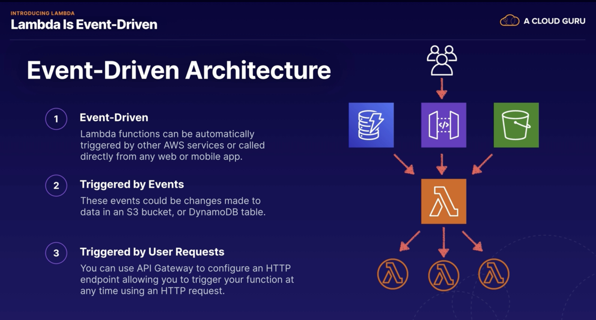
* Exam Tips
    * 

## API Gateway

* API stands fro Application Programming Interface and we use APIs to interact with web applications and applications
  use APIs to communicate with each other as well.
* API Gateway is a service which allows you to publish, maintain, monitor, and secure APIs at any scale.
* API Gateway provides a single endpoint for all traffic interacting with the backend of your application.
    * So here we've got our users and they are connecting using any kind of client device.
    * They make a request over to our AWS environment and the request hits API Gateway. And then, depending on the type
      of request, API Gateway can then forward the request to different services such as Lambda, EC2, or it could be a
      service like DynamoDB, or Kineses for example.
* It supports multiple endpoints and targets.
* it supports multiple versions of your API
* it allows you to maintain multiple versions of your API so that you can have different versions for your development
  testing and production environment
* API Gateway is serverless. So it's cost-effective and scalable.
* It integrates with CloudWatch. So it's logging all API calls, latencies, and error rates to CloudWatch
* it supports throttling.
    * So it helps you to manage traffic with throttling so that backend operations can withstand traffic spikes and
      denial-of-service
      attacks.
* Exam tips:
    * an API is like the front door to your application. And API Gateway provides an endpoint to your applications
      running in AWS
    * API Gateway is serverless so it is low cost and scales automatically.
    * It supports throttling. So you can throttle API Gateway to prevent your application from being overloaded by too
      many requests.
    * Everything is logged to CloudWatch. For example, API calls, latencies and errors as well.

## Lambda versioning

* the $LATEST is always the latest version of the code you've uploaded into Lambda
* use Lambda versioning and aliases to point your applications to a specific version if you don't want to use the
  $LATEST
* if you don't use any alias at all and you just use an unqualified ARN, so just ending in the function name, not using
  prod or latest or whatever then that will default to using the $LATEST version
    * arn:aws:lambda:eu-west-2:7893748934:function:myLambdaFunc:Prod
    * arn:aws:lambda:eu-west-2:7893748934:function:myLambdaFunc:$LATEST
* if your application is using an alias, remember that it will not automatically use new code when you upload it.
* So if you are using an alias and you're uploading new code that you want your application to use then just remember to
  update your application to point at the latest version of the code.

## Lambda Concurrent Executions limit

* Default Concurent Execution Limit is 1000 per seconds, concurrent executions per region account
* When you hit the number
    * You wil receive TooManyRequestsException
    * might also see this HTTP Status Code of 429
* To increase the Concurrency limit you need to contact with AWS support or you can also request via console to increase
* if you just have a few very critical functions, then you can set a reserved concurrency, to guarantee that a set
  number of concurrent executions are always available to your critical functions
    * alternatively you can also configure something called reserved concurrency, and this guarantees that a set number
      of
      executions will always be available, for any critical functions
        * For example. If you had a whole load of different functions, and some were highly critical, whereas others
          were
          not so important to your application or to your business, you can reserve some concurrency, for those critical
          functions, to make sure that there's always a set number of concurrent executions available for those critical
          functions.
        * However do be aware that it also does act as a limit.
            * for example if you set, a reserved concurrency
              of 500 for a specific function, that specific function will never be able to go over 500 concurrent
              executions.

## Lambda and VPCs

* as a developer, you may well see a situation or a use case where you are developing a Lambda function and it needs to
  be able to communicate with or access resources which are inside a private VPC in a private subnet with no access to
  the outside world
* by default, your Lambda function will not be able to access any resources within a private VPC without some additional
  configuration.
* basically you need to allow the function to connect to the private subnet and Lambda will need the
  following VPC configuration information so that it can go in and connect to resources in your VPC.
    * first of all, you're going to need to provide the private subnet ID where your resources are located.
        * we choose at least two subnets in order to run in high availability. So let's also select us-east-1b.
    * You also need to provide a security group ID with specific access for the Lambda function to allow it to do what
      it needs to do
    * and Lambda is going to use this information to set up an elastic network interface or ENI using an available IP
      address from the CIDR range of your private subnet.
        * The Lambda function needs to have permission to create elastic network interfaces in order to begin
          communicating with resources in your VPC and it's these permissions which enable the function to do that.
* you can add this VPC information to your Lambda function using the command line and you just need to use the
  vpc-config parameter
* You just need to select your VPC, provide the private subnet ID and a security group ID as well.
    * And once again, Lambda uses that VPC information to set up an elastic network interface using an IP from the
      private subnet CIDR range and then the security group that you provided needs to allow your function to access
      resources within the VPC.
* 

## Step Functions

* step functions provide a visual interface for serverless applications, which enables you to build and run serverless
  applications, as a series of steps.
* Each step in your application executes in order, as defined by your business logic.
* And the output of one step can act as the input into the next.
* So step functions provide orchestration for serverless applications and think of an application consisting of many
  different lambda functions.
* And we use step functions to manage the logic of the application, including sequencing, error handling, and retry
  logic, so that your application executes in order, and as expected.
* And step functions also log the state of each step.
    * So when things go wrong this helps you to diagnose and debug problems really quickly
    * because you can identify which step in the process failed.
* step functions consists of state machines and tasks.
* We can build step functions
    * Sequental
    * Parallel
    * Conditions
* step functions under "application integration"
* state machines are defined using Amazon States Language.
* Exam Tips:
    * 

#### Lambda you can create Function URl and reach from outside or authenticated, no need API gateway.

## Compaire Step Function Workflows

* 2 types workflows
* Standard Workflow:
    * these are great for long-running, durable, and auditable workflows that may run for up to 1 year.
    * And with these, full execution history is available for up to 90 days after the workflow has completed.
    * Standard Workflows use an at-most-once model.
        * And this means that tasks are never executed more than once unless you explicitly specify retry actions in
          your code or in your workflow.
    * Standard Workflows are designed for non-idempotent actions;
        * for example, when processing payments, and you only want a payment to be processed once, not multiple times.
        * non-idempotent?
            * non-idempotent if it always causes a change in state. So let's say we repeat an identical request, will it
              always cause a change in state?
                * And with our example of a payment, it is always going to cause a change in state if we repeat an
                  identical
                  payment.
* Express Workflow:
* these are designed for short-lived workflows that last up to 5 minutes.
* they are great for high volume event-processing-type workloads.
* They use an at-least-once model. So the workflow runs at least once, but it could run more than once.
    * So Express Workflows are ideal if there's a possibility that an execution might be run more than once or that you
      require multiple concurrent executions.
* these are great for idempotent actions;
    * for example, transforming some input data and then storing the result in DynamoDB. And a request is idempotent if
      an identical request has no side effect. So it's considered idempotent if an identical request can be made once or
      several times in a row with no additional side effects.
    * for example, taking some input data and running an identical process to transform that data and then store the
      result in DynamoDB.
    * The result will always be the same.
* Synchronous:
    * it begins the workflow. It waits until the workflow is completed and then returns the result.
    * this is great for operations that are going to be performed one at a time.
    * So the workflow must complete before the next step begins.
    * For example, you should wait for your customer to complete their payment before you send them their order.
* Asynchronous:
    * it begins a workflow, it confirms the workflow has started, but it is not going to return any result to you.
    * Instead, the result of the workflow can be found in CloudWatch Logs.
    * it's not waiting for the workflow to complete before moving on to the next task.
    * this is great if your services or operations don't depend on the completion and the result of your workflow.
    * For example, think of a messaging system where you just want to send a message and then move on to the next task
      without waiting for an acknowledgement.
* Asynchronous Workflows often run in the background while synchronous workflows hold you up until they all complete.
* 
* 
* 
* 

## Understanding X-Ray

* it's a tool which helps developers analyze and debug distributed applications, allowing you to troubleshoot the root
  cause of performance issues and errors, and particularly connection errors.
* And it provides a visualization of your applications underlying components, so it gives you a really nice visual
  representation of all the components that make up your application, and they call this the X-Ray service map.
* this is the X-Ray service map and it provides an end to end view of requests as they travel through your application.
  And it's collecting information like latency, HTTP status codes and any error messages that are generated, as well.
  And this information can be used to troubleshoot connectivity and performance issues.
* 
* integrating X-Ray :
    * it works with loads of different AWS services. So you can use X-Ray with EC2, Elastic Container Service, Lambda,
      Elastic Beanstalk, SNS, SQS, DynamoDB, Elastic Load Balancer, and API Gateway.
        * And you can also integrate X-Ray with your own application.
    * you can use X-Ray with applications written in Java, Node.js, .NET, Go, Ruby and Python. And it will monitor your
      API calls, so the X-Ray SDK automatically captures metadata for the API calls that you make to AWS services using
      the AWS SDK. So, if your application is making API calls to AWS services then X-Ray will automatically capture
      metadata about those API calls.
* To use X=Ray
    * you'll need to install the X-Ray agent on your EC2 instance.
    * you need to configure your application.
    * you need to instrument your application using the X-Ray SDK, and the X-Ray SDK provides a set of libraries and
      methods for generating the trace of data that will be sent to X-Ray.
    * the X-Ray SDK gathers information from request and response headers, the code in your application and metadata
      about the AWS resources on which it runs, and sends this trace data to X-Ray.
    * 
* 

## X-Ray Configuration

* X-Ray is great that you can actually use it to monitor applications which are running on EC2, in Elastic Container
  Service, and also applications running in your own data center, as well as serverless technologies like Lambda,
  DynamoDB, and API gateway.
* 
* in this diagram, we've got an EC2 instance, an Elastic Container Service cluster running Docker containers, and we've
  also got an on-premises system in our own data center.
* And they are all sending data into X-Ray. And the way that it all hangs together, is that you have this AWS X-Ray SDK
  installed on your system.
* And the AWS X-Ray SDK sends the data to the X-Ray Daemon, which is also running on your system, and the X-Ray Daemon
  actually buffers the segments in a
  queue and then it uploads them into X-Ray in batches.
* And the main point of this diagram is just really to show you that you need both the X-Ray SDK and the X-Ray Daemon on
  your systems, in order to start sending data into X-Ray.
* just remember that you need the X-Ray SDK and the X-Ray Daemon as well, and you use the SDK to instrument your
  application to send the required data.
* first of all, for on-premises and EC2 systems, you're going to need to install the X-Ray Daemon directly on your EC2
  instance, or on your on-premises server.
* If you're running Elastic Beanstalk, you can just install the X-Ray Daemon, once again, on the EC2 instances inside
  your Elastic Beanstalk environments.
* And if you're using Docket containers and Elastic Container Service, then you'll need to install the X-Ray Daemon on
  its own Docker container on your ECS cluster,alongside your application.
    * So, don't install the X-Ray Daemon on the same Docker container where your application is running. It's going to
      need to be in its own Docker container.
* what are annotations?
    * when instrumenting your application, you can actually record additional information about requests, or traces,
      by using annotations. And annotations are simply key-value pairs and they actually get indexed by X-Ray and you
      can use them with filter expressions, so that you can go ahead and search for traces which contain specific data,
      and it allows you to group related traces together in the console
* !
* [](img/xray-6.png)
* 

## Advanced API Gateway

* You can import APIS using external definition files i.e. OpenAPi or Swagger
* Dealing with legacy applications which is using SOAP(Single Object Access Protocol), you can configure your api
  Gateway as SOAP web service passthrought
    * or you can use API gateway to convert XML response to Json
    * [How to configure Amazon API Gateway as a SOAP webservice passthrough in minutes](https://blog.joshuamoesa.com/2017/06/how-to-configure-amazon-api-gateway-as.html)

## API Gateway Cachcing and Trottling

* APi Caching:
    * Is to improve performance by caching the outputs of API calls to avoid calling your backend everytime.
    * Reduces the amount of number of calls made your endpoint and also can improve the latency for request to your API
    * TTL (Time to live ) Api caches your endpoint responses for default 300 seconds = 5mins
    * Api Gateway returns the Cached Response, it looks up the cache instead to make a new call.
* API Throttling:
    * Prevent your API from being overwhelmed by to many requests.
    * Default API limits steady-state request rate limits is 10,000 request in 1 second per region
    * There is also limit for concurrent limits, max concurrent limit is 5000 across all APIs per region.
    * You can increase both of those limits.
    * If you exceed 10.000 request per second or 5000 concurrent requerst you will receive 429 To many request error.
        * That point you wil need to increas your limits.
* Example:
    * Your api receive 10K request in first second, what will happen ?
        * The first 5K will serves immediately because of the concurrency
        * Then the rest 5k will trottle the remaining over the one second period.
        * It will deal with all request in one second but 5k, but no more than one second.

## Summary - Serverless

* Serverless 101
    * Enables to build scable applications quickly without managing any service
    * Low Cots: Serverles-applications are event-driven and you are only charged when your code is executed
    * AWS handles all heavy lifting: you can focus on your code and building your app instead of server configuration
* Lambda:
    * Extremely cost effective: Paay only when your code execute
    * Continuous scaling: scales automaticaly
    * Event Driven: Lambda functions triggered only via event or action
    * Independent: Each event will trig one lambda function
    * Serverless Technology: Lambda ,APi gateway, S3, SQS, SNS Dynamo DB are serverless
    * Lambda Triggers: Be aware of services taht can trigger a Lambda function
        * DynamoDB
        * Kinesis
        * API Gateway
        * CloudFront
        * SQS
        * Application Load Balancer
        * S3
        * SNS
        * SES
        * CloudFormation
        * CloudWatch
        * Code Commit
        * Coe pipeline
        * Alexa , etc
* Api Gateway:
    * Front door of your application
    * API gateway provides an endpoint to your app running in AWS
    * Serverless: low cost and scales automatically
    * Throttling: you can throttle your API to prevent your application from being overloaded by to many request
    * Everything is logged in CloudWatch
* Lambda Versioning:
    * $LATEST is always the latest verdsion of code that uploaded to Lambda
    * We can use versioning or aliases to points your application to specific versions of your code if you dont want to
      use the latest version
    * Aliased codes wont use automateclly the latest version when you upload. You need to update your alias if you want
      to use the latest.
* Lambda Concurrent Execution Limits:
    * Default concurrency limit is 1k execution per second
    * When you hit the limit you will start to reach 429 HTTP Status Code error and your request will start to reject.
    * The remedy is to get the limit raised by AWS support
    * If you use critical application , the use Reserved concurrency, guaranties a set number of concurrent executions
      are always available to a critical function.
* Lambda & VPCs
    * You can enable lambda to access resources in a private Vpcs
    * You need to provide VPC Config information to your Lambda Function : Private Subnet ID and security Group ID
    * Lambda will use VPC information to configure an Elastic Network Interface (ENI) using an IP address from the
      private subnet CIDR range (i.e 10.0.0.0/24). Then Lambda will arrange ENI could be something 10.0.0.5
    * Security Group then allows your function to access resources in private VPC
* Step Functions:
    * Virtualize and Orchestra: great way to visualise and orchestrate your serverless applications.
    * Automatically track each step of the step machine or workflow and the output one of the step is often input to the
      next.
    * Step funtions will log the state of each step, so of something is goes wrong you can track what went wrong and
      where.
* Compairring Step Functions Workflows
    * Understand the differences:
        * Standatd workflow:
            * Designed Long running up to 1 year
            * Works at most once
            * Non-idempotent : if you run identical tasks it will cause always change in state
        * Express workflow:
            * Designed short lives processes, up tp 5 min
            * Then run at least once, can run multiple times
            * Idempotent: run same task multipole times without any state changes.
        * Synchronous Express Workflow:
            * The workflow must complete before to move the next step. (i.e customer has to provide address before order
              state)
        * Asynchronous Express Workflow:
            * Other task ios not depend on the completion of the workflow (i.e messaging system)
* X-Ray:
    * X-Ray helps to developer analyse and debug distributed systems.
    * Service Mao: Provides a service map is a visual presentation of your application.
    * If you like to run X-Ray, you need X-Ray agent/demon must be installed on your EC2 instance. ANd use the X-Ray SDK
      to instrument your app to send traces to X-Ray.
    * X-Ray provodes also some information like latency, Http status codes and error messages. This info can be use
      trouble shots
    * Integrated with a lot of AWS services, like DynamoDb. Lambda, API Gateway etc.
    * You can also instrument your own applications to send data to X-Ray. For example data about incoming HTTP requests
      to your app.
    * Supported Platforms: Applications can run on EC2, ECS, Elastic Beanstalk environment and on=premise systems
    * Running ECS:
        * For ECS, run X-Ray demons in its own Docker-container running along your side of application.
    * X-Ray annotations to add user-defined key-value pairs to X-Ray data to allowing you to filter, index and search (
      i.e game_name=TickTackToe, game_id=1 )
* API Gateway Caching
    * Improves the performance of your APIs by caching the output of API calls to avoid calling your app backend
      everytime
    * Responses cached in TTL period. TTL is default 300 sec = 5 min
    * Reduces the Number of API calls, API calls returns the cache response instead of making new reuest to your app.
      This improves performance and reduces latency
* API Gateway Throttling
    * Default 10k request per second and concurrency is 5k request per second per region
    * If you exceed the limit then you will receive 426 HTTP errors Too many Request.
    * Uses throttling to prevent your api by overwhelmed by too many requests
    * You can make a request AWS support to increase the limits.
* Advanced API Gateways:
    * You can import APIS using external definition files like Swagger and OpenAPi
    * When dealing with legacy applications with SOAP, you can configure API gateway as SOAP web service pass through,
      or you can use API gateway to convert responses from XML to Json.

# SQS

* SQS is actually the first ever AWS service that was publicly available
* SQS is a distributed message queuing system, and it allows us to decouple the components of an application so that
  they are independent. And if 1 of our application servers crashes, before they complete a task, you're not going to
  lose the task because it will reappear in the queue.
* it's basically a message queue service
* it enables web service applications to quickly and reliably queue messages, that one component in the application
  generates, for another component to consume
* if you get a massive surge of messages in the queue, this can trigger the auto scaling group to launch additional
  instances, to cope with the increased number of messages or jobs to complete.
* And if you have a reduced number of messages in the queue, auto scaling can also reduce the number of EC2 instances
  needed to process the messages
* if they are asking you for a pull-based service, then they're usually talking about SQS.
    * However, if they are asking you about a push-based system, then you'll need something like a Simple Notification
      Service or SNS
* the great thing about SQS is that if any of our application servers crashed, any messages, which are partially
  processed,
  will not be deleted and will end up back in the queue.
    * And this is because when a message is first picked up by our application server, it's going to be marked as
      invisible so that no other application server can start processing that message. And this is called the
      **visibility timeout**, and this is the amount of time that the application server gets to process the message,
      and as soon as that window has expired,
    * if the message has not been completely processed, then it will appear in the queue again and another application
      server will pick up that message and begin processing it.
* by using SQS, you're removing dependencies between individual components in your application.
* By using SQS, you can **decouple** your application components. So you can decouple the components of an application,
  allowing them to run independently and easing message management between components
* Any component of a distributed application can store messages in the queue and messages can contain up to 256
  kilobytes of text in any format.
    * For example, XML, JSON, or plain text format and any component can later retrieve the messages, programmatically
      using the Amazon SQS API
* SQS effectively act as a buffer between the components of your application.
* It guarantees that the messages will be processed at least once. The retention period of messages is up to 14 days.
* So messages can be kept in the queue from between one minute to 14 days. So the minimum is for one minute and the
  maximum is 14 days, but the default retention period is 4 days.

# Dynamo DB

## Introduction to DynamoDb

* Fast and flexible low latency NoSql database.
    * it is alternative more rigid databases like Oracle and sql
* Fully managed Database
    * Supports Key-value data models. Supports documented models like Json, HTML and XML
* Use cases:
    * It is a great fit for mobile, web, gaming and tech, IOT and many other applications.
* DynamoDB is serverless
    * Integrates with Lambda well
    * can configure automatically scale
    * popular chose for serverless architectures.
* Performance:
    * Stored SSD (Solid State Disk), which helps to give fast performance reads and writes.
* Resilience:
    * The underlying hardware supporting the DynamoDB table always spread across 3 geografically distinct data centers
      to avoid any single point of failure if any one of lost or unavaible.
* Consistency:
    * 2 options to chose consistency
        * Eventual consistency reads (default):
            * Consistency across all copies of data is usually reached within a second
            * That mean if you changed a data second ago then DynamoDb needs to return update data.
            * However can take up one second for new writes or updates the data to be reflected when you read data from
              DynamoDb.
            * Best for reads performance
        * Strong consistency reads:
            * Always reflects all successful writes.
            * All writes are reflected all 3 locations at once
            * You dont need to wait up to one second to across all locations.
            * This is best for read consistency.
* Also supports fpr ACID transactions called Dynamo DB transactions.
    * [Amazon DynamoDB Transactions: How it works](https://docs.aws.amazon.com/amazondynamodb/latest/developerguide/transaction-apis.html)
    * This provide the ability of ACID Transactions
        * Atomic: all-or-nothing transaction
        * Consistency: consistence with data validation rules
        * Isolation: Transactions happens in isolations independently one on another not impacting each other.
        * Durability: They dont disappear if system crash
    * Reads/writes multiple items across multiple items tables as an all-0r-nothing operation
* DynamoDb consist tables items and attributes.
* Primary Keys:
    * it allows us to query data in table
    * it stores and retrieves data based on PK
    * 2 types PK
        * Partition Key:
            * Based on unique attribute, ie customerID, orderId .
            * Value of the partition key is the imput on an internal hash function which determines the partition or
              physical location on which data is stored.
            * if you use Partition key as PK then it is not allowed to have 2 items have same partition key
        * Composite Key (partition + sort key):
            * made up combination Partition key and sorted key.
            * You would use this combination key in a situation where the partition key is not necessary unique within
              your table.
            * i.e forum posts table, users post multiple messages, in this case userId can not be unique and combination
              will be userId(partition) + timestamp(sort key)
            * This gives us a unique combination for your primary key
                * That means you can have same partition key,but they have to have different sortKey value
            * Storage:
                * All items with the same partition key are stored together and then sorted according to sortkey values
                  and this allow to store multiple items using same partition key.

## Demo creating DynamoDb with AWS CLI

* Command to query Dynamodb from EC2 command line - just remember replace the region with the correct one for your
  database
    * `aws dynamodb get-item --table-name ProductCatalog --region eu-west-2 --key '{"Id":{"N":"205"}}'`
* Creat a Dynamo DB commands
    ```
    1) Check your IAM user permissions:
    
    aws iam get-user
    
    2) Creating the SessionData table:
    
    ***LINUX or MAC USERS***:
    aws dynamodb create-table --table-name SessionData --attribute-definitions \
    AttributeName=UserID,AttributeType=N --key-schema \
    AttributeName=UserID,KeyType=HASH \
    --provisioned-throughput ReadCapacityUnits=5,WriteCapacityUnits=5
    
    3) Populate SessionData Table:
    
    aws dynamodb batch-write-item --request-items file://items.json
    ```

## DynamoDb Access Control

* How we control access to Dynamo Db
    * IAM : authentication and Access control is managed by AWS IAM
    * IAM Permission: create IAM users with specific permission to access and create DynamoDb
    * IAM Roles: create IAM roles to give temporary access to DynamoDb.
* Restricting User Access:
    * you can use special **IAM condition** to restrict user access to only their own records.
    * Only the data which is related with user can reach.
    * For example gaming solution you show peoples score, you want to be sure they can not see other peoples scores,
      then you can add **IAM condition**
    * This can done by adding **condition** to an IAM Policy to allow access only to items where the partition key value
      matches their User_Id.
    * IAM condition paramater **dynamodb:LeadingKeys** allows users to access only the items where the partition
      key-value
      matches their User_ID
    * 

## Secondary Indexes

* Secondary index allows you to perform more flexible queries
* Allows query based on an attribute which not the primary key
* DynamoDb allows you to run a query on non-primary key attributes using **global secondary indexes** and **local
  secondary indexes**
* A secondary index allows you to perform fast queries on specific columns in a table. You select the columns that you
  want to included in index and run your searches on the index, rather than on the entire table.
* Because you are running the search required columns, it means your queries a lot faster more efficient to run the
  query on the entire data set.
* Local Secondary Index:
    * Primary Key: A local secondary index is an index that can only be created when you are creating your table and it
      has same partition key as your original table.
    * Different View:  but ot has a different sort key at gives you a different view of data, because data will be
      orginize according to an alternative sorted key
    * Fast Query: Any queries based on this sortkey are much faster using the index than the main table.
    * Add at creation time: Can be created only when you create on creation time. You can not add, remove or modify
      after it later.
* Global secondary indexes:
    * Flexible: you can create secondary index when ever you like, you can create on table creation or add
      later.
    * Completely different Primary Key: Different partition key and sort key from table itself.
    * Data view: this gives completely different view of your data.
    * Speed up: ofc speeds up the queries related to this alternative partition and sort keys.
* 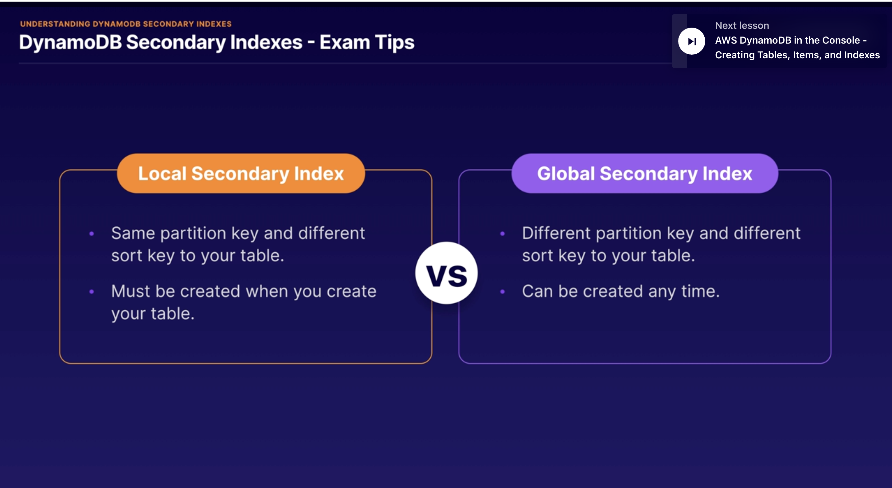

## Scan vs Query Api Calls

* Query:
    * A query finds items in a table based on the **primary key** attribute and a distinct value to search
        * For example: selecting an item where userId=200 will select all attributes of the item ie firstname lastname
    * And you can use optional sort key name and value to refine the query results.
        * For example: your sortkey is timestamp, you can select items with timestamp of the last 7 days.
    * By default query returns all attributes of the item, but if you want to return specific attributes you want you
      can use 'ProjectionExpression'
    * SortKey: Results always sorted by sorted ley value
    * Numeric Order: default is ascending numeric ordering
    * ASCII: if there is ascii characters, it orders ASCII characters also ascending orders
    * Reverse the order: You can reverse the order by setting "ScanIndexForward=false"
        * "ScanIndexForward" just use for query only not scan
    * Eventually consistent: queries are eventually consist
    * Strongly Consistent: You need to explicitly set query to be consistent
* Scan:
    * Scan operation examines every item in the table.
    * By default it returns all attributes.
    * You can use "ProjectionExpression" param to refine your results. and you can also filter once it has been run.
    * Even you apply filter, it dumps all data from table then apply the filter to show only the results we are looking
      for.
* Query or Scan:
    * Query is more efficient than Scan because Scan dumps all data in the table first then apply filters to provide
      desired results .
    * This is adding extra steps removing data you dont want, as the table grows the scan action will be longer.
    * A scan operation on a large table can use up the provisioned throughput for a large table in just a single
      operation.
* Ways to improve performance
    * You can reduce impact of the query and scan by adding a smaller page size which uses fewer read operation.
        * For example you set up page size 40
        * Runnig a larger number of smaller operations will allow other request to success without throttling.
        * Avoid scan operations as much as you can. Instead, design your queries that you can use Get, Query or
          BatchGetItem APIs
* How to improve Scan Operation?
    * Sequential by Default:
        * A scan operation process data sequentially returning 1MB increments before moving on to retrieve teh next 1MB
          data
        * Scans 1 partition at the time.
    * Parallel Scans:
        * You can configure DynamoDB to use parallel scans instead by logically dividing by table or index into segments
          and scanning each segment in parallels
        * BUT if your table has heavy read and write activity from other applications then can cause some performance
          issues.
    * Isolate: You can also isolate your scan operations to specific tables and segregate them from your
      mission-critical traffic.
        * Even it means writing data 2 different tables this is just another way to improve performance.

## Using DynamoDB APi calls:

* While we use AWS CLI and use get-item command it is using/calling GetItem API of the dynamoDB.
* Commonly used APIs:
    * 
    * 
* To be able run the command user needs to have the right IAM permission required for each operation that we would like
  to allow.For example to run put=item command user needs to have permission to call PutItem
* [Commands in DynamoDB](https://awscli.amazonaws.com/v2/documentation/api/latest/reference/dynamodb/index.html)

## DynamoDb Provisioned Capacity

* DynamoDb provisioned throughput is measured in capacity units.
* While you create dynamoDb you define write and read capacity units.
* This read/write capacity units are defines how much data you will write in your database
* 1 write capacity unit is 1KB
* 1 strongly consistent read capacity is 1X4KB
* 1 eventually consistent read capacity is 2x4KB
* For example; your application needs to read 80 items per second from your DynamoDB table. Each item is 3KB in
  size, and you need strongly consistent reads. How many read capacity units do you think you'll need?
    * Solution: 1 strongly read unit capacity is 4KB, lets calculate 1 item required capacity by dividing 4KB => 3KB/4KB
      =0.75 by rounding = 1
    * Thats mean we need 1 string read capacity unit for one item let's multiple 80x1= 80 read capacity unit requires
    * Ho about eventually consistency read ? 2x4KB for 1 read unit with thi info it makes 80/2 = 40 unit required.
* For example:  imagine you need to write 100 items per second to your DynamoDB table. And each item is 512 bytes in
  size.How many write capacity units do you think you'll need?
    * Solution : 512 byte = 0,5 KB lets round = 1 KB. 1 writing unit is 1KB per second, then for 100 items it will make
      100x1 = 100 writing unit capacity required.
* 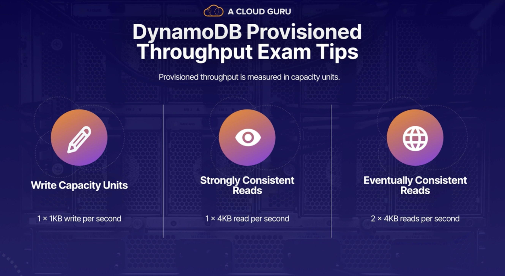

## DynamoDb on-demand Capacity

* On-demand capacity is a pricing model for DynamoDb
* Charges will apply for reading, writing and storing your data on DynamoDb
* DynamoDb will scale up/down on depending reads and writes or activities of your application on your DynamoDb
* Great for:
    * Unpredictable workloads
    * New applications where you don't know to use pattern yet.
    * When you want to pay for only what you use (pay per request). This can make harder to predict the pricing because
      of the DynamoDb scaling depending on your application activities.
* Which Pricing model should we use?
* 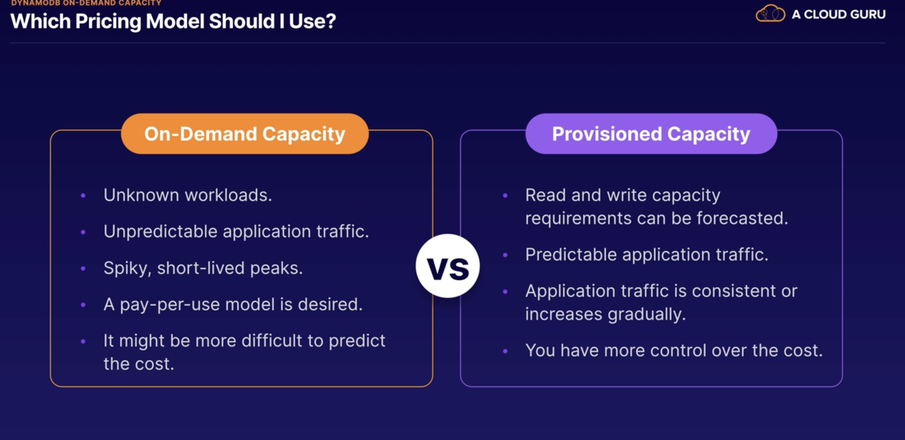
* Exam tips:
    * Understand the differences of pricing model is important.
    * On-demand capacity is for unpredictable application trafic and pay-per-usage model.
    * Use Provision capacity model :
        * Read and write capacity can be predictable/forecasted
        * Application traffic is consistent or increases gradually

## DynamoDb Accelerator (DAX)

* DynamoDb Accelerator (DAX) is a full managed, clustered, in-memory cache for DynamoDb
* They claim that 10X better performance on readings
* it is ideal for read-heavly also bursty read workloads ie gaming, retail sites for black friday session etc.
* How DAX is work?
    * DAX is a write-throught caching service, it meand data is writing on cache as well as the backend store at the
      same time.
    * That means anytime DynamoDb table update, add new item or modify item, it is also writing the cache DAX itself.
* When a call comes it will go to DAX cluster first then DynamoDb itself if DAX does not have the item.
* Cache hit
    * 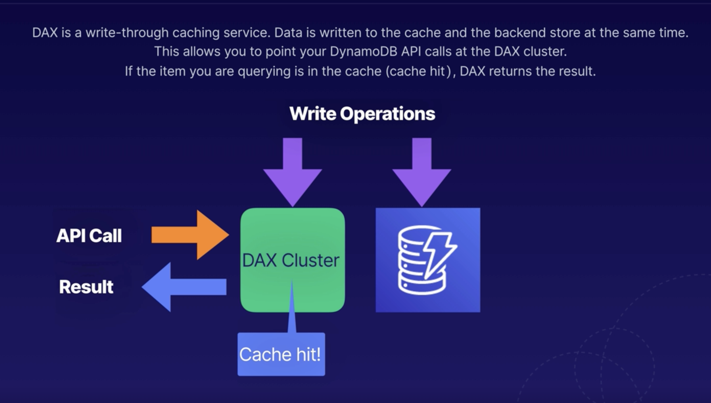
* Cache Missed
    * When the item is not in DAX means cache missed, DAX is making call GetItem Api and it writes into its cache,
      and it also hands it back to the application.
    * 
* So retrieval of data from DAX reduces the read load on your DynamoDB tables. And in some cases, you may even be able
  to reduce the provisioned read capacity on your tables. So that means you can save some money on your DynamoDB bill
* When DAX is not suitable:
    * DAX is suitable for eventually consistent reads only, not suitable for applications on strongly consistent reads
      needs.
    * DAX is not really suitable for write-intensive applications. So you're not going to get a benefit from using DAX
      because it only helps with read operations.
    * Applications that don't perform that many read operations are not really going to see a benefit from configuring
      DAX,
    * and the same goes for applications that don't require microsecond response times. There's no point in configuring
      it if you don't need that low latency.
    * 

## DynamoDb Time To Live (TTL)

* It is an attribute which defines an expiration time for your data
* You define an expiration time and your data is marking for deletion. After 48 hours letter DynamoDb deletes data from
  datasource automatically.
* And this is really good for removing any irrelevant or old data, so data that's no longer useful to your application.
* So think session data, event logs, any temporary data.
* So any data that's no longer useful to your application after a certain period of time.
* And this is going to really help to reduce costs for storing data in DynamoDB because it automatically removes data,
  which you no longer need.
* TTL is expressed on epoc time called Unix time or POSIX time as well. it represents the number of seconds which have
  elapsed since 12:00 AM on January the 1st, 1970
* We can manage TTL by clicking "manage TTL" button on table. popped up menu will ask which attribute to choose for
  expiration time and we can set the attribute to check TTL of the items.
* It will mark your data for expiration as soon as the current time is greater than the TTL. The item will then be
  expired, marked for deletion, and then deleted within 48 hours.
* 
* 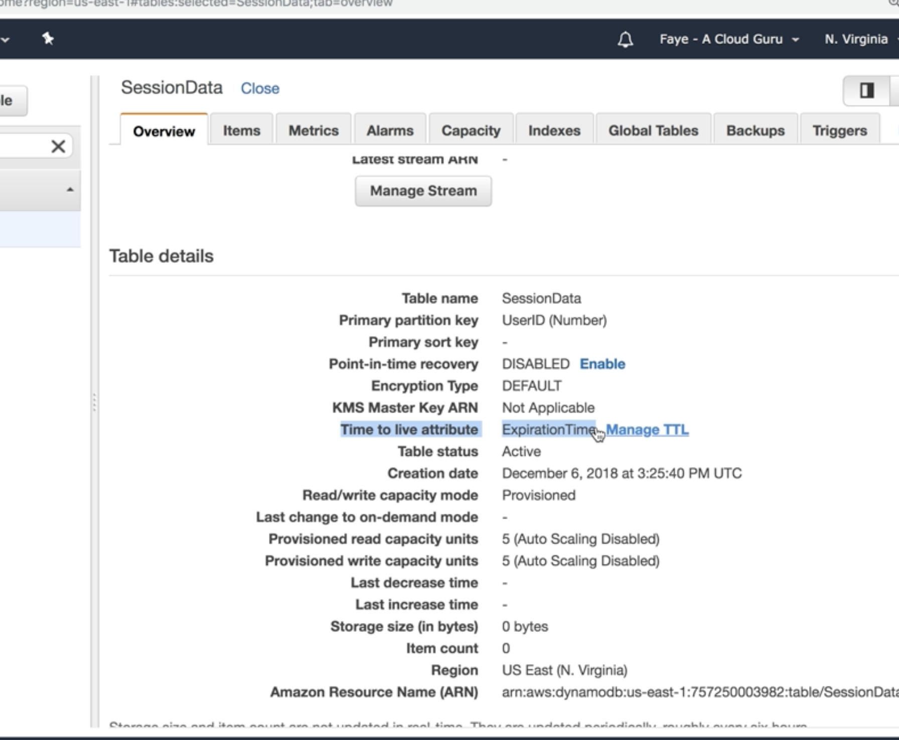
* Exam Tips:
    * It's great for removing irrelevant or old data, for example, session data, event logs, and temporary data that
      your application no longer requires.
    * And this is great because it saves you money and reduces the cost of your DynamoDB table by automatically removing
      data, which is no longer relevant or useful to your application.

## DynamoDb Streams

* DynamoDb Streams are time ordered sequence streams and it records any modification that are made to items in your
  dynamoDb like insert,update or delete.
* it records all of these actions in a log and the logs are encrypted at rest and stored for 24 hours only.
* after 24 hours, it's going to start deleting those entries.
* typically, DynamoDB streams can be used for auditing or archiving of transactions
* Also replaying transactions to a different table
* They are really good for serverless architectures.
* You can trigger a lambda function by DynamoDb streams.
* the streams are accessed using their own dedicated endpoint. So there's one endpoint to access the DynamoDB table
  itself and then there's a second separate endpoint for the DynamoDB stream.
* by default, the minimum amount of data that you can record is the primary key of the item that was being modified,
  updated or deleted, but you can also store before and after images as well.
    * So you can capture the state of the item before the change and the state of the item after the change as well.
* the Stream events are logged in near real-time
* In serverless architecture it allows you to build applications which respond to changes in the DynamoDB table.
  Applications can take actions based on the contents of your stream.
* here is a sample scenario :
* 
* Exam tips:
    * **Sequence of modification:** it's a time-ordered sequence of item-level modifications in your DynamoDB tables.
        * every time an item gets changed in your DynamoDB table, it's going to record that in the DynamoDB stream.
    * **Encrypted and stored:** The data is only stored for 24 hours and after that, it's going to start getting
      deleted.
    * **Lambda event Source:** it's a really good event source for Lambda, allowing you to create applications that can
      take
      actions based on events that are happening in your DynamoDB table.

## Provisioned Throughput Exceeded and Exponential Backoff

* **ProvisionedThroughputExceededException** : the provision to throughput exceeded exception is one that you might see
  on
  your DynamoDB table if your request rate is too high for the read and write capacity provisioned on the DynamoDB
  table.
* if your app is making too many read/ write request on DynamoDb than can not handle based on read/write capacity then
  you start to get this error.
* if you're using the AWS SDK, it's going to automatically retry the requests until they are successful.
    * all of the AWS SDKs, they all implement automatic retries, which simply send the request again until it is
      successful.
    * But in addition to these simple retries, all AWS SDKs also use exponential backoff.
    * And with exponential backoff, this means that the requester uses progressively longer waits between consecutive
      retries for improved flow control
* if you dont use AWS SDK, there are some things to do:
    * firstly, you can reduce the request frequency, so reduce the number of concurrent requests that are being sent to
      the DynamoDB table, reduce the frequency of the requests that are being sent to the table,
    * second thing you can do is to implement exponential backoff.
* What is exponential backofs ?
    * consecutive retries for improved flow control.
    * For example, after the first failed request, it might wait, for example, 50 milliseconds before trying again. And
      then if that retry fails, it then might wait 100 milliseconds until trying again. And then if that retry fails,
      it might wait 200 milliseconds before trying again.
    * So it will continue like that until the request is successful.
    * And this gives significantly improved flow control in the hope that at some point, the traffic is going to start
      flowing freely again, and requests will start to be fulfilled again.
    * 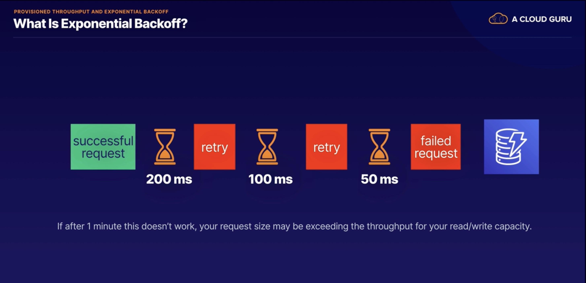
* But if after about 1 minute this doesn't work, it might be instead that your request size is actually exceeding the
  throughput for your read and write capacity on the DynamoDB table.
    * So in this case, it may be worth investigating your provisioned throughput.
    * And if your workload is mainly Get requests, you might be able to improve performance using either DynamoDB
      Accelerator, or DAX, or using ElastiCache. However,
    * if it's mainly write requests that are causing the issue, then maybe take a look at increasing your write capacity
      for the DynamoDB table.
* Exam tips:
    * if you see the ProvisionedThroughputExceeded error, this means that the number of requests into your DynamoDB
      table is too high.
    * Exponential backoff can be used to improve the flow control by retrying the requests using progressively longer
      waits.
    * However, if your wait is getting up to around 1 minute, it's definitely worth checking your read and write
      capacity units' settings and seeing if they need to be adjusted. And just remember that exponential backoff, it
      doesn't only apply to DynamoDB.
    * It's actually a feature of every single AWS SDK, and it applies to many services within AWS, for example,
      S3 buckets, if you're using CloudFormation heavily, and SES, etc.
    * And if you're not using the AWS SDK, then you're going to need to handle this yourself in your application
      settings or in your application code.
    * So the way to do that is just to reduce the frequency of your requests and
      implement exponential backoff yourself.

# KMS

## KMS (Key management Service) 101

* Managed service that makes really easy for you to create and control the encryption keys used to encrypt your data in
  AWS
* Completely integrated with loads of different AWS services, thats mean it is easy to encrypt the data by a checkbox
* When should we use KMS?
    * Basically whenever you deal with sensitive data, i.e. For example, if you're storing customer data, financial
      data, passwords, so anything like database passwords, any secrets for your application, and credentials as well.
* KMS integrates with most other AWS services,
    * S3, RDS, DynamoDb,
    * Lambda, Lambda can integrate with KMS is that it can go in and encrypt and decrypt data, provided you give it
      access to the KMS service and your encryption keys
    * Elastic Block Store, Elastic File System,
    * CloudTrail: CloudTrail is that you'll get an audit trail of all of the API calls into KMS. So you'll know exactly
      who has been using your keys to encrypt and decrypt, and who has been attempting to access your encrypted data.
* what is a CMK?
    * it stands for customer master key, and the customer master key is capable of encrypting and decrypting data up to
      4 kilobytes.
    * what is it actually used for?
    * the customer master key is used to generate, encrypt, and decrypt the data key. And it's this data key, which is
      then used in turn to encrypt and decrypt your data.
    * And this idea of using the customer master key to encrypt a data key, and then using that data key to encrypt your
      data is known as envelope encryption
    * There are 2 types
        * Symetric
            * Single key is used for enc/decrypt data or generates HMAC (Hash based Message Authentication Codes)
        * Asymetric
    * after you select keytypes you need to choose key administrator users
    * And then will create Key policy which is resource base policy like IAM

## Customer Managed Key CMK Summary

* you can use an alias to create a friendly name that you can use to refer to the CMK.
* The CMK also has a creation date. So the date and time when the CMK was created,
* you can add your own description that's meaningful to you to describe the CMK.
* Every customer master key also has a key state, and typically you'll see enabled, disabled,
* In terms of key material, you can provide your own key material that was generated externally, or you can use AWS
  provided
* customer master keys cannot be exported outside of KMS.
    * they stay within KMS and they are managed within KMS.
    * you cannot export your entire customer master key out of KMS
      and administer it somewhere else.
* 
* to set up our customer master key:
    * we can create an alias, a friendly name that we can use to help identify our key
    * You can add description
    * provide own key material or are we going to use a CloudHSM?
    * The next thing we need to do is define the key administrative permissions. So this is going to be the identity
      access management users and roles who are allowed to administer and manage the key.
    * This is all about the administrative side, the lifecycle management of the key, being able to delete the key or
      disable it.
    * we need to provide the name of the identity access management users or roles who are going to have administrative
      permissions
    * finally, we need to set the key usage permissions. So this will be the permissions for the identity access
      management users and roles who can use the key to encrypt and decrypt data.
    * 
* AWS Managed KMS
    * these are the CMKs that are used on your behalf with the services that are integrated with KMS.
    * services like S3 and audience. When you select encryption in the console for those services, it's these AWS
      managed keys,which are used in the background
* Customer Managed CMK
    * the term customer managed key, this refers to keys that you create own and manage yourself.
    * they're not created by AWS. You create them yourself, either using the command line interface or using the console
      and later on
* Data Key
    * the data key is an encryption key that you can use to encrypt data, including large amounts of data.
    * You generate a data key when you want to encrypt any data over 4KB
    * you can use your customer managed CMK to generate encrypt and decrypt your data key.
    * 

## AWS CLI commands for KMS

* [AWS CLI KMS commnds](https://awscli.amazonaws.com/v2/documentation/api/latest/reference/kms/index.html#cli-aws-kms)

```
// encrypt to secret.txt file with YOURKEY
aws kms encrypt --key-id YOURKEYIDHERE --plaintext fileb://secret.txt --output text --query CiphertextBlob | base64
--decode > encryptedsecret.txt

// decrypt to secret.txt file
aws kms decrypt --ciphertext-blob fileb://encryptedsecret.txt --output text --query Plaintext | base64 --decode >
decryptedsecret.txt

// Re-encrypt takes an encrypted file and reenc with other key.
aws kms re-encrypt --destination-key-id YOURKEYIDHERE --ciphertext-blob fileb://encryptedsecret.txt | base64 >
newencryption.txt

// this will give AWS KMS to allow to rotate your key anual bases.
aws kms enable-key-rotation --key-id YOURKEYIDHERE

aws kms get-key-rotation-status --key-id YOURKEYIDHERE

// this is to genarete a data key with AES_256 for example from your CMK 
aws kms generate-data-key --key-id YOURKEYIDHERE --key-spec AES_256
// You generate a data key when you want to encrypt any data over 4KB

```

* we use `aws kms encrypt` : enc plain text to ciphertext by using customer master key.
* we use `aws kms decrypt` : decrypt ciphertext text that was enc by using AWS KMS CMK to plain by using customer master
  key.
* we use `aws kms re-encrypt` : decrypt ciphertext text and then re-enc it entirely within AWS KMS(i.e when you
  change CMK or manually rotate to CMK).
* we use `aws kms enable-key-rotation` : enable key rotation every 365 days by AWS KMS
* we use `aws kms generate-data-key` : used CMK to generate a data key to encrypt the data > 4KB

## Explore Envelope Encryption

* Envelope Encryption is a process that encrypting your data it applies files over >4KB
* data key = envelope key
* Enc Process:
    * the customer master key encrypts the data key, and then the data key is used to encrypt the data
    * and finally, the encrypted data key is stored locally with the data so that it can be used later on for decryption
      purposes
    * and KMS does not store the data keys anywhere.
    * Instead, the encrypted copy of the data key is stored with your data.
    * 
* the decryption process:
    * here is our encrypted data and here's our encrypted data key, but in order to use our data key, we need to decrypt
      it first.
    * So that's where KMS comes in and in KMS we'll use the CMK and the KMS API to run a decrypt operation and return
      the data key in plain text form
    * and then the plain text data key is used to decrypt the data.
    * at the end of the process, the data has been decrypted and the plain text key is deleted from memory,
    * 
* Why not encrypt the data directly using the CMK?
    * the main reason is for network performance because when you encrypt that data directly with KMS, that data needs
      to be transferred over the network into the KMS service
    * and with envelopes encryption, only the data key goes over the network and not your data and then the data key is
      used locally in your application or AWS service, avoiding the need to transfer lots of data over the network to
      KMS.
    * if we're talking about gigabytes or terabytes of data, we don't want to send that over the network to KMS.
    * Even if it's going over the Amazon network, it's just not going to be efficient or performance.
    * So instead with envelope encryption, it's only the data key that gets sent over the network to KMS and your data
      doesn't move anywhere.
* Exam tips:
    * envelope encryption is all about encrypting the key, which encrypts our data and the CMK is used to encrypt the
      data key and it's also called at the envelope key
    * it's the data key, which encrypts our data and envelope encryption is used for encrypting anything over four
      kilobytes and it avoids sending all your data into KMS over the network
    * finally remember the GenerateDataKey API call, which is used by KMS to create an encrypted data key
    * when we were playing around with the KMS API, we ran a generate data key and it returned an encrypted and plain
      text version of a data key.

