## Introduction to DynamoDb

* Fast and flexible low latency NoSql database.
    * it is alternative more rigid databases like Oracle and sql
* Fully managed Database
    * Supports Key-value data models. Supports documented models like Json, HTML and XML
* Use cases:
    * It is a great fit for mobile, web, gaming and tech, IOT and many other applications.
* DynamoDB is serverless
    * Integrates with Lambda well
    * can configure automatically scale
    * popular chose for serverless architectures.
* Performance:
    * Stored SSD (Solid State Disk), which helps to give fast performance reads and writes.
* Resilience:
    * The underlying hardware supporting the DynamoDB table always spread across 3 geografically distinct data centers
      to avoid any single point of failure if any one of lost or unavaible.
* Consistency:
    * 2 options to chose consistency
        * Eventual consistency reads (default):
            * Consistency across all copies of data is usually reached within a second
            * That mean if you changed a data second ago then DynamoDb needs to return update data.
            * However can take up one second for new writes or updates the data to be reflected when you read data from
              DynamoDb.
            * Best for reads performance
        * Strong consistency reads:
            * Always reflects all successful writes.
            * All writes are reflected all 3 locations at once
            * You dont need to wait up to one second to across all locations.
            * This is best for read consistency.
* Also supports fpr ACID transactions called Dynamo DB transactions.
    * [Amazon DynamoDB Transactions: How it works](https://docs.aws.amazon.com/amazondynamodb/latest/developerguide/transaction-apis.html)
    * This provide the ability of ACID Transactions
        * Atomic: all-or-nothing transaction
        * Consistency: consistence with data validation rules
        * Isolation: Transactions happens in isolations independently one on another not impacting each other.
        * Durability: They dont disappear if system crash
    * Reads/writes multiple items across multiple items tables as an all-0r-nothing operation
* DynamoDb consist tables items and attributes.
* Primary Keys:
    * it allows us to query data in table
    * it stores and retrieves data based on PK
    * 2 types PK
        * Partition Key:
            * Based on unique attribute, ie customerID, orderId .
            * Value of the partition key is the imput on an internal hash function which determines the partition or
              physical location on which data is stored.
            * if you use Partition key as PK then it is not allowed to have 2 items have same partition key
        * Composite Key (partition + sort key):
            * made up combination Partition key and sorted key.
            * You would use this combination key in a situation where the partition key is not necessary unique within
              your table.
            * i.e forum posts table, users post multiple messages, in this case userId can not be unique and combination
              will be userId(partition) + timestamp(sort key)
            * This gives us a unique combination for your primary key
                * That means you can have same partition key,but they have to have different sortKey value
            * Storage:
                * All items with the same partition key are stored together and then sorted according to sortkey values
                  and this allow to store multiple items using same partition key.

## Demo creating DynamoDb with AWS CLI

* Command to query Dynamodb from EC2 command line - just remember replace the region with the correct one for your
  database
    * `aws dynamodb get-item --table-name ProductCatalog --region eu-west-2 --key '{"Id":{"N":"205"}}'`
* Creat a Dynamo DB commands
    ```
    1) Check your IAM user permissions:
    
    aws iam get-user
    
    2) Creating the SessionData table:
    
    ***LINUX or MAC USERS***:
    aws dynamodb create-table --table-name SessionData --attribute-definitions \
    AttributeName=UserID,AttributeType=N --key-schema \
    AttributeName=UserID,KeyType=HASH \
    --provisioned-throughput ReadCapacityUnits=5,WriteCapacityUnits=5
    
    3) Populate SessionData Table:
    
    aws dynamodb batch-write-item --request-items file://items.json
    ```

## DynamoDb Access Control

* How we control access to Dynamo Db
    * IAM : authentication and Access control is managed by AWS IAM
    * IAM Permission: create IAM users with specific permission to access and create DynamoDb
    * IAM Roles: create IAM roles to give temporary access to DynamoDb.
* Restricting User Access:
    * you can use special **IAM condition** to restrict user access to only their own records.
    * Only the data which is related with user can reach.
    * For example gaming solution you show peoples score, you want to be sure they can not see other peoples scores,
      then you can add **IAM condition**
    * This can done by adding **condition** to an IAM Policy to allow access only to items where the partition key value
      matches their User_Id.
    * IAM condition paramater **dynamodb:LeadingKeys** allows users to access only the items where the partition
      key-value
      matches their User_ID
    * 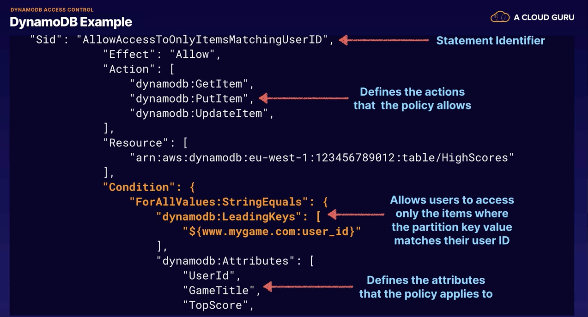

## Secondary Indexes

* Secondary index allows you to perform more flexible queries
* Allows query based on an attribute which not the primary key
* DynamoDb allows you to run a query on non-primary key attributes using **global secondary indexes** and **local
  secondary indexes**
* A secondary index allows you to perform fast queries on specific columns in a table. You select the columns that you
  want to included in index and run your searches on the index, rather than on the entire table.
* Because you are running the search required columns, it means your queries a lot faster more efficient to run the
  query on the entire data set.
* Local Secondary Index:
    * Primary Key: A local secondary index is an index that can only be created when you are creating your table and it
      has same partition key as your original table.
    * Different View:  but ot has a different sort key at gives you a different view of data, because data will be
      orginize according to an alternative sorted key
    * Fast Query: Any queries based on this sortkey are much faster using the index than the main table.
    * Add at creation time: Can be created only when you create on creation time. You can not add, remove or modify
      after it later.
* Global secondary indexes:
    * Flexible: you can create secondary index when ever you like, you can create on table creation or add
      later.
    * Completely different Primary Key: Different partition key and sort key from table itself.
    * Data view: this gives completely different view of your data.
    * Speed up: ofc speeds up the queries related to this alternative partition and sort keys.
* 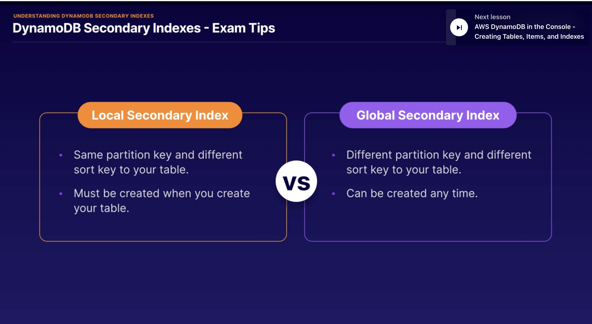

## Scan vs Query Api Calls

* Query:
    * A query finds items in a table based on the **primary key** attribute and a distinct value to search
        * For example: selecting an item where userId=200 will select all attributes of the item ie firstname lastname
    * And you can use optional sort key name and value to refine the query results.
        * For example: your sortkey is timestamp, you can select items with timestamp of the last 7 days.
    * By default query returns all attributes of the item, but if you want to return specific attributes you want you
      can use 'ProjectionExpression'
    * SortKey: Results always sorted by sorted ley value
    * Numeric Order: default is ascending numeric ordering
    * ASCII: if there is ascii characters, it orders ASCII characters also ascending orders
    * Reverse the order: You can reverse the order by setting "ScanIndexForward=false"
        * "ScanIndexForward" just use for query only not scan
    * Eventually consistent: queries are eventually consist
    * Strongly Consistent: You need to explicitly set query to be consistent
* Scan:
    * Scan operation examines every item in the table.
    * By default it returns all attributes.
    * You can use "ProjectionExpression" param to refine your results. and you can also filter once it has been run.
    * Even you apply filter, it dumps all data from table then apply the filter to show only the results we are looking
      for.
* Query or Scan:
    * Query is more efficient than Scan because Scan dumps all data in the table first then apply filters to provide
      desired results .
    * This is adding extra steps removing data you dont want, as the table grows the scan action will be longer.
    * A scan operation on a large table can use up the provisioned throughput for a large table in just a single
      operation.
* Ways to improve performance
    * You can reduce impact of the query and scan by adding a smaller page size which uses fewer read operation.
        * For example you set up page size 40
        * Runnig a larger number of smaller operations will allow other request to success without throttling.
        * Avoid scan operations as much as you can. Instead, design your queries that you can use Get, Query or
          BatchGetItem APIs
* How to improve Scan Operation?
    * Sequential by Default:
        * A scan operation process data sequentially returning 1MB increments before moving on to retrieve teh next 1MB
          data
        * Scans 1 partition at the time.
    * Parallel Scans:
        * You can configure DynamoDB to use parallel scans instead by logically dividing by table or index into segments
          and scanning each segment in parallels
        * BUT if your table has heavy read and write activity from other applications then can cause some performance
          issues.
    * Isolate: You can also isolate your scan operations to specific tables and segregate them from your
      mission-critical traffic.
        * Even it means writing data 2 different tables this is just another way to improve performance.

## Using DynamoDB APi calls:

* While we use AWS CLI and use get-item command it is using/calling GetItem API of the dynamoDB.
* Commonly used APIs:
    * 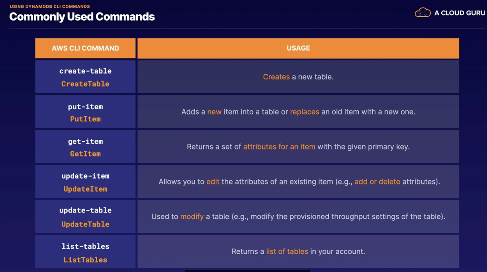
    * 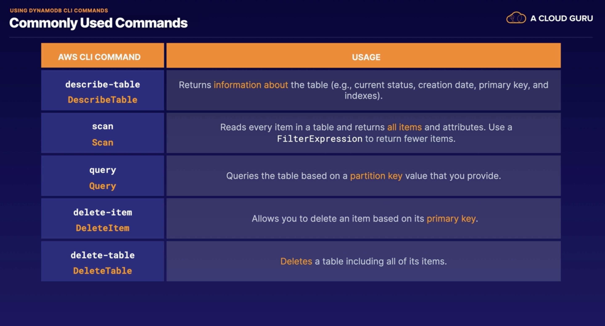
* To be able run the command user needs to have the right IAM permission required for each operation that we would like
  to allow.For example to run put=item command user needs to have permission to call PutItem
* [Commands in DynamoDB](https://awscli.amazonaws.com/v2/documentation/api/latest/reference/dynamodb/index.html)

## DynamoDb Provisioned Capacity

* DynamoDb provisioned throughput is measured in capacity units.
* While you create dynamoDb you define write and read capacity units.
* This read/write capacity units are defines how much data you will write in your database
* 1 write capacity unit is 1KB
* 1 strongly consistent read capacity is 1X4KB
* 1 eventually consistent read capacity is 2x4KB
* For example; your application needs to read 80 items per second from your DynamoDB table. Each item is 3KB in
  size, and you need strongly consistent reads. How many read capacity units do you think you'll need?
    * Solution: 1 strongly read unit capacity is 4KB, lets calculate 1 item required capacity by dividing 4KB => 3KB/4KB
      =0.75 by rounding = 1
    * Thats mean we need 1 string read capacity unit for one item let's multiple 80x1= 80 read capacity unit requires
    * Ho about eventually consistency read ? 2x4KB for 1 read unit with thi info it makes 80/2 = 40 unit required.
* For example:  imagine you need to write 100 items per second to your DynamoDB table. And each item is 512 bytes in
  size.How many write capacity units do you think you'll need?
    * Solution : 512 byte = 0,5 KB lets round = 1 KB. 1 writing unit is 1KB per second, then for 100 items it will make
      100x1 = 100 writing unit capacity required.
* 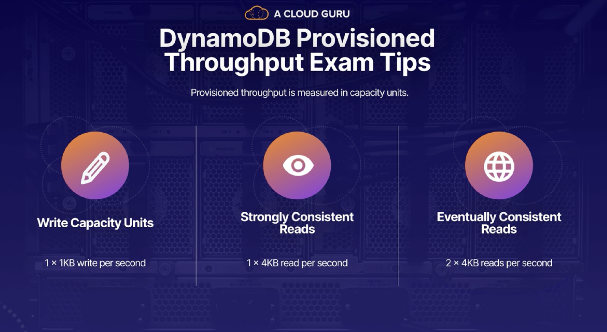

## DynamoDb on-demand Capacity

* On-demand capacity is a pricing model for DynamoDb
* Charges will apply for reading, writing and storing your data on DynamoDb
* DynamoDb will scale up/down on depending reads and writes or activities of your application on your DynamoDb
* Great for:
    * Unpredictable workloads
    * New applications where you don't know to use pattern yet.
    * When you want to pay for only what you use (pay per request). This can make harder to predict the pricing because
      of the DynamoDb scaling depending on your application activities.
* Which Pricing model should we use?
* 
* Exam tips:
    * Understand the differences of pricing model is important.
    * On-demand capacity is for unpredictable application trafic and pay-per-usage model.
    * Use Provision capacity model :
        * Read and write capacity can be predictable/forecasted
        * Application traffic is consistent or increases gradually

## DynamoDb Accelerator (DAX)

* DynamoDb Accelerator (DAX) is a full managed, clustered, in-memory cache for DynamoDb
* They claim that 10X better performance on readings
* it is ideal for read-heavly also bursty read workloads ie gaming, retail sites for black friday session etc.
* How DAX is work?
    * DAX is a write-throught caching service, it meand data is writing on cache as well as the backend store at the
      same time.
    * That means anytime DynamoDb table update, add new item or modify item, it is also writing the cache DAX itself.
* When a call comes it will go to DAX cluster first then DynamoDb itself if DAX does not have the item.
* Cache hit
    * 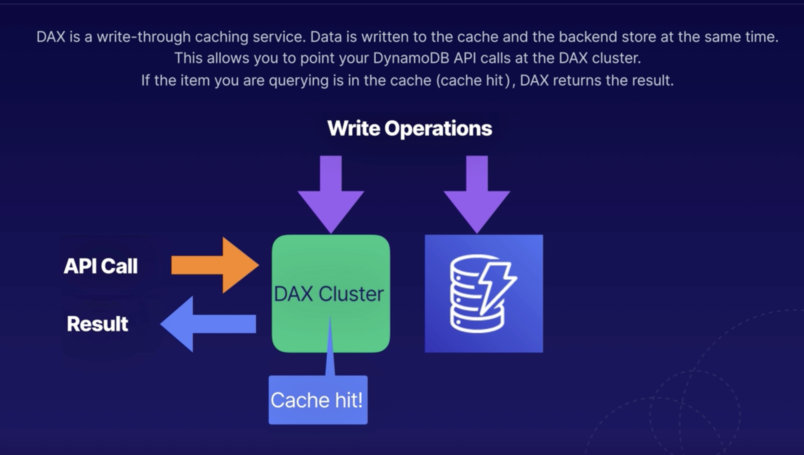
* Cache Missed
    * When the item is not in DAX means cache missed, DAX is making call GetItem Api and it writes into its cache,
      and it also hands it back to the application.
    * 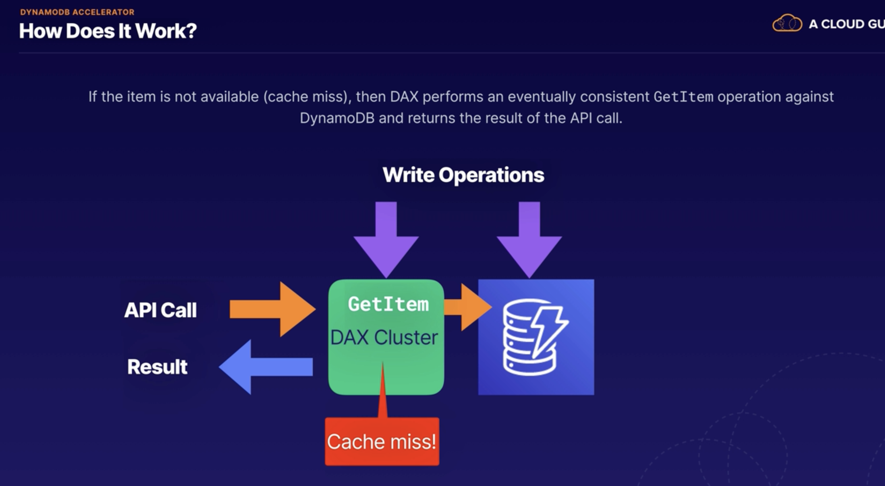
* So retrieval of data from DAX reduces the read load on your DynamoDB tables. And in some cases, you may even be able
  to reduce the provisioned read capacity on your tables. So that means you can save some money on your DynamoDB bill
* When DAX is not suitable:
    * DAX is suitable for eventually consistent reads only, not suitable for applications on strongly consistent reads
      needs.
    * DAX is not really suitable for write-intensive applications. So you're not going to get a benefit from using DAX
      because it only helps with read operations.
    * Applications that don't perform that many read operations are not really going to see a benefit from configuring
      DAX,
    * and the same goes for applications that don't require microsecond response times. There's no point in configuring
      it if you don't need that low latency.
    * 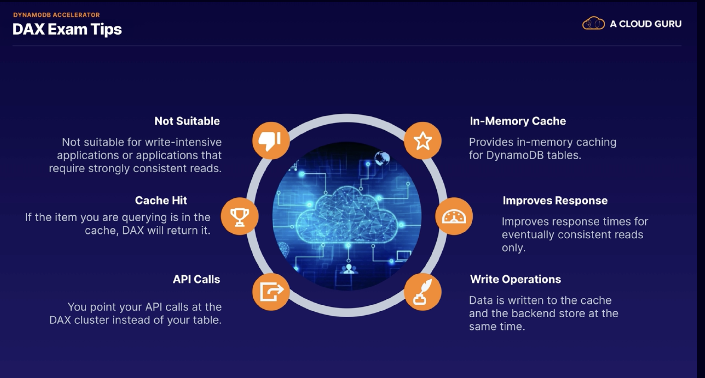

## DynamoDb Time To Live (TTL)

* It is an attribute which defines an expiration time for your data
* You define an expiration time and your data is marking for deletion. After 48 hours letter DynamoDb deletes data from
  datasource automatically.
* And this is really good for removing any irrelevant or old data, so data that's no longer useful to your application.
* So think session data, event logs, any temporary data.
* So any data that's no longer useful to your application after a certain period of time.
* And this is going to really help to reduce costs for storing data in DynamoDB because it automatically removes data,
  which you no longer need.
* TTL is expressed on epoc time called Unix time or POSIX time as well. it represents the number of seconds which have
  elapsed since 12:00 AM on January the 1st, 1970
* We can manage TTL by clicking "manage TTL" button on table. popped up menu will ask which attribute to choose for
  expiration time and we can set the attribute to check TTL of the items.
* It will mark your data for expiration as soon as the current time is greater than the TTL. The item will then be
  expired, marked for deletion, and then deleted within 48 hours.
* 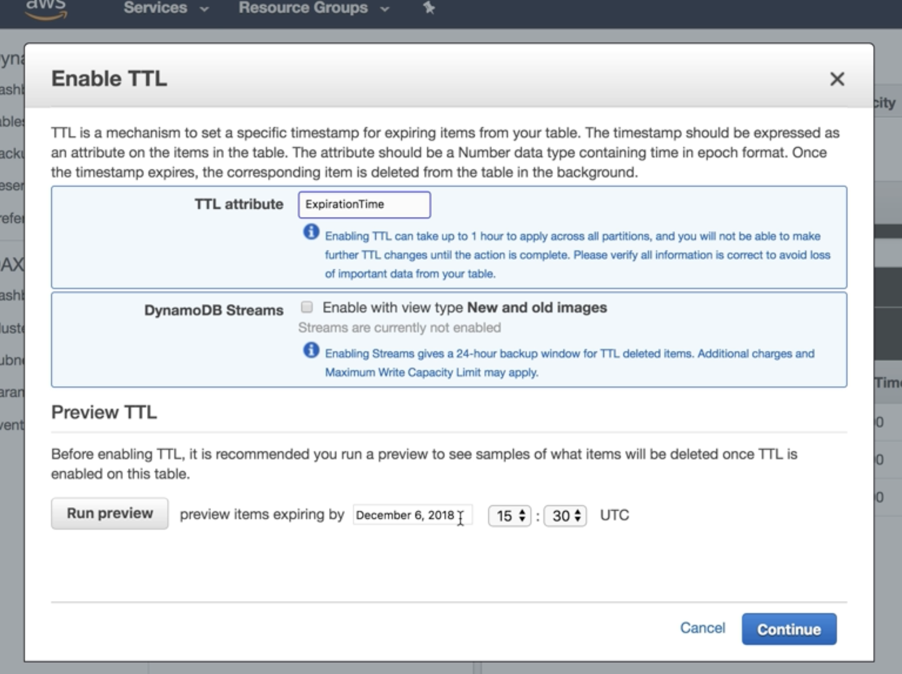
* 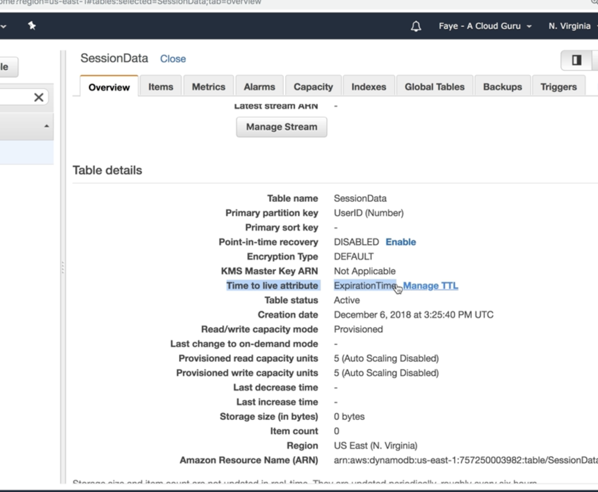
* Exam Tips:
    * It's great for removing irrelevant or old data, for example, session data, event logs, and temporary data that
      your application no longer requires.
    * And this is great because it saves you money and reduces the cost of your DynamoDB table by automatically removing
      data, which is no longer relevant or useful to your application.

## DynamoDb Streams

* DynamoDb Streams are time ordered sequence streams and it records any modification that are made to items in your
  dynamoDb like insert,update or delete.
* it records all of these actions in a log and the logs are encrypted at rest and stored for 24 hours only.
* after 24 hours, it's going to start deleting those entries.
* typically, DynamoDB streams can be used for auditing or archiving of transactions
* Also replaying transactions to a different table
* They are really good for serverless architectures.
* You can trigger a lambda function by DynamoDb streams.
* the streams are accessed using their own dedicated endpoint. So there's one endpoint to access the DynamoDB table
  itself and then there's a second separate endpoint for the DynamoDB stream.
* by default, the minimum amount of data that you can record is the primary key of the item that was being modified,
  updated or deleted, but you can also store before and after images as well.
    * So you can capture the state of the item before the change and the state of the item after the change as well.
* the Stream events are logged in near real-time
* In serverless architecture it allows you to build applications which respond to changes in the DynamoDB table.
  Applications can take actions based on the contents of your stream.
* here is a sample scenario :
* 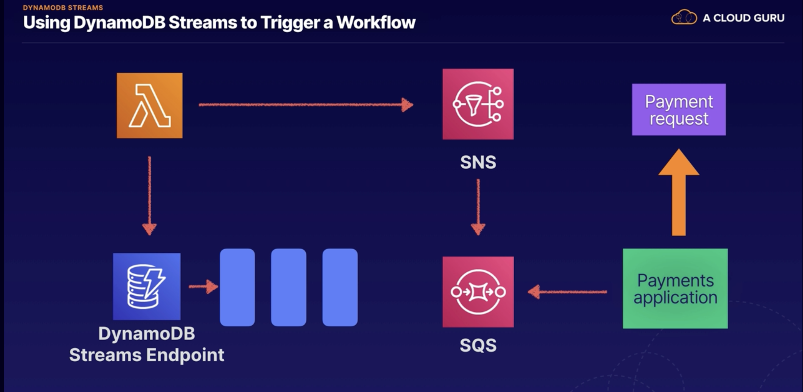
* Exam tips:
    * **Sequence of modification:** it's a time-ordered sequence of item-level modifications in your DynamoDB tables.
        * every time an item gets changed in your DynamoDB table, it's going to record that in the DynamoDB stream.
    * **Encrypted and stored:** The data is only stored for 24 hours and after that, it's going to start getting
      deleted.
    * **Lambda event Source:** it's a really good event source for Lambda, allowing you to create applications that can
      take
      actions based on events that are happening in your DynamoDB table.

## Provisioned Throughput Exceeded and Exponential Backoff

* **ProvisionedThroughputExceededException** : the provision to throughput exceeded exception is one that you might see
  on
  your DynamoDB table if your request rate is too high for the read and write capacity provisioned on the DynamoDB
  table.
* if your app is making too many read/ write request on DynamoDb than can not handle based on read/write capacity then
  you start to get this error.
* if you're using the AWS SDK, it's going to automatically retry the requests until they are successful.
    * all of the AWS SDKs, they all implement automatic retries, which simply send the request again until it is
      successful.
    * But in addition to these simple retries, all AWS SDKs also use exponential backoff.
    * And with exponential backoff, this means that the requester uses progressively longer waits between consecutive
      retries for improved flow control
* if you dont use AWS SDK, there are some things to do:
    * firstly, you can reduce the request frequency, so reduce the number of concurrent requests that are being sent to
      the DynamoDB table, reduce the frequency of the requests that are being sent to the table,
    * second thing you can do is to implement exponential backoff.
* What is exponential backofs ?
    * consecutive retries for improved flow control.
    * For example, after the first failed request, it might wait, for example, 50 milliseconds before trying again. And
      then if that retry fails, it then might wait 100 milliseconds until trying again. And then if that retry fails,
      it might wait 200 milliseconds before trying again.
    * So it will continue like that until the request is successful.
    * And this gives significantly improved flow control in the hope that at some point, the traffic is going to start
      flowing freely again, and requests will start to be fulfilled again.
    * 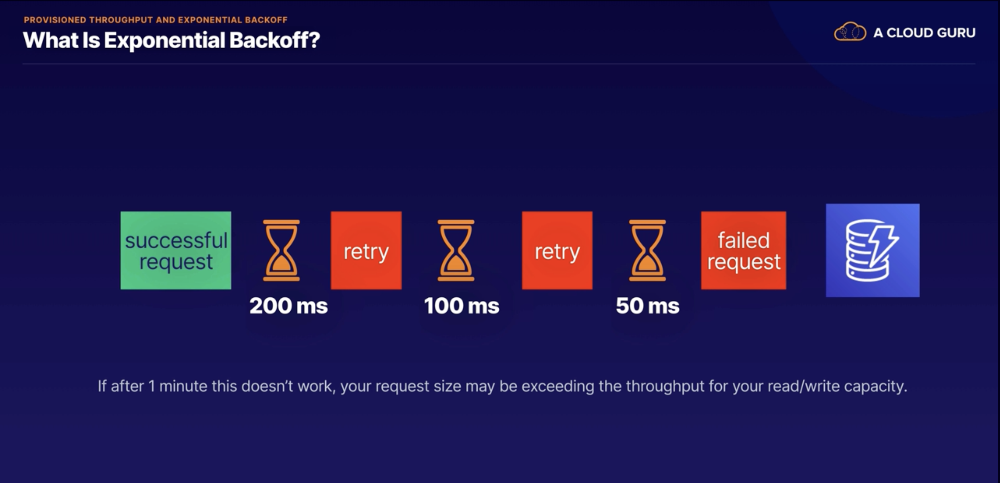
* But if after about 1 minute this doesn't work, it might be instead that your request size is actually exceeding the
  throughput for your read and write capacity on the DynamoDB table.
    * So in this case, it may be worth investigating your provisioned throughput.
    * And if your workload is mainly Get requests, you might be able to improve performance using either DynamoDB
      Accelerator, or DAX, or using ElastiCache. However,
    * if it's mainly write requests that are causing the issue, then maybe take a look at increasing your write capacity
      for the DynamoDB table.
* Exam tips:
    * if you see the ProvisionedThroughputExceeded error, this means that the number of requests into your DynamoDB
      table is too high.
    * Exponential backoff can be used to improve the flow control by retrying the requests using progressively longer
      waits.
    * However, if your wait is getting up to around 1 minute, it's definitely worth checking your read and write
      capacity units' settings and seeing if they need to be adjusted. And just remember that exponential backoff, it
      doesn't only apply to DynamoDB.
    * It's actually a feature of every single AWS SDK, and it applies to many services within AWS, for example,
      S3 buckets, if you're using CloudFormation heavily, and SES, etc.
    * And if you're not using the AWS SDK, then you're going to need to handle this yourself in your application
      settings or in your application code.
    * So the way to do that is just to reduce the frequency of your requests and
      implement exponential backoff yourself. 