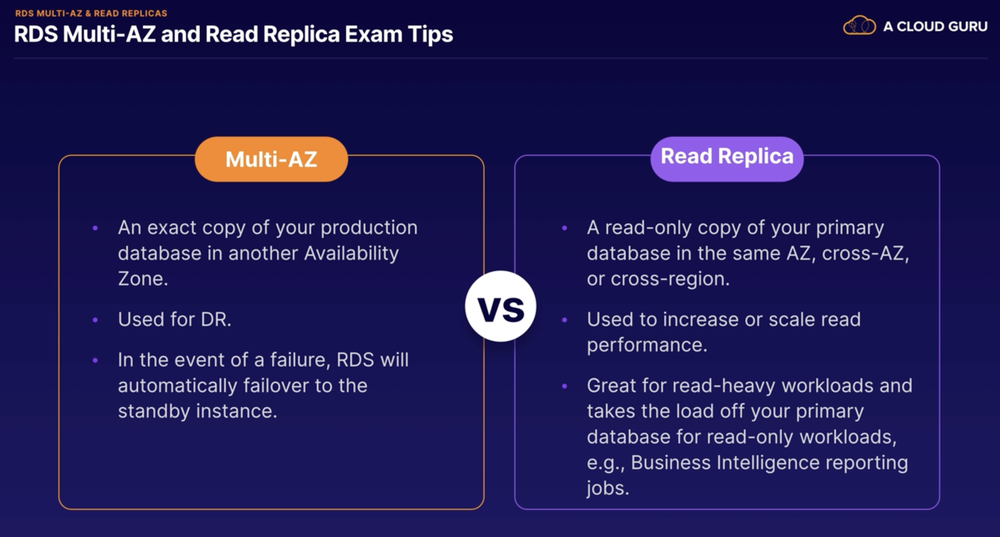
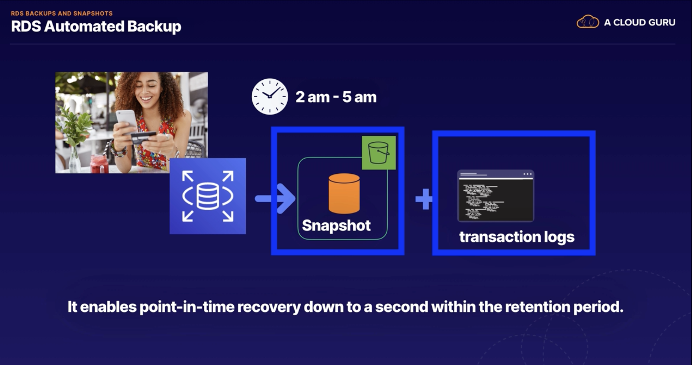
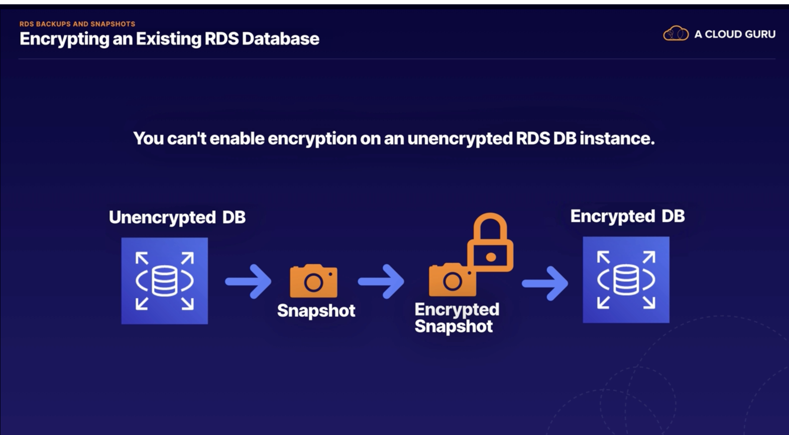
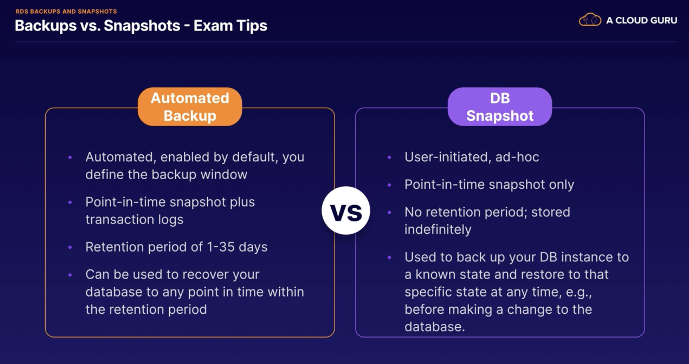
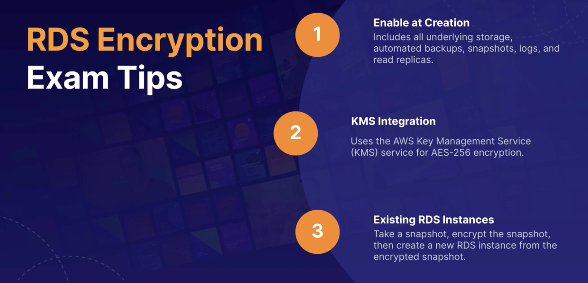
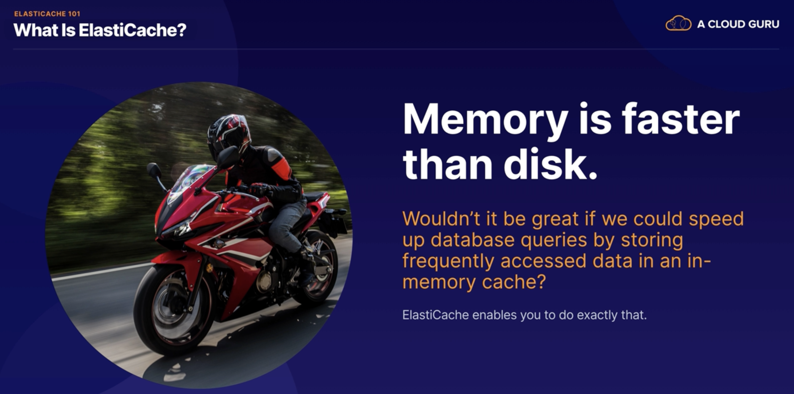
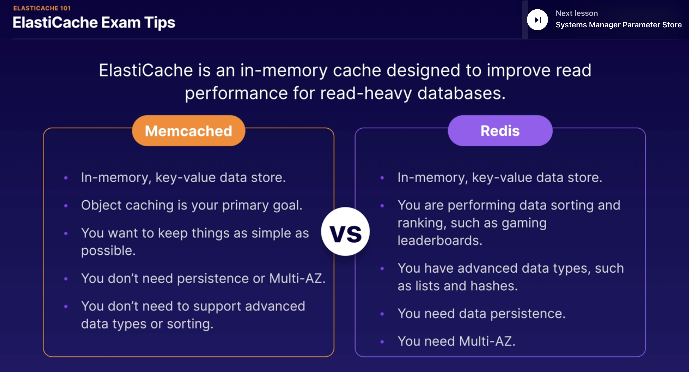
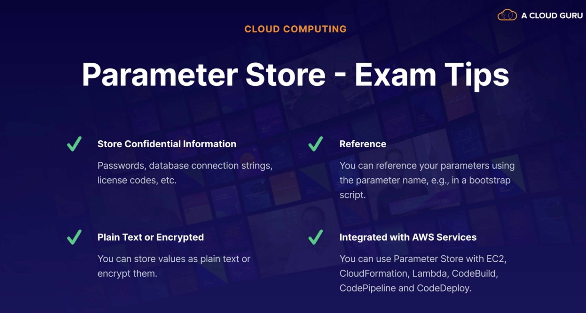

# EC2 (Elastic Compute Cloud )

####                                                                           * Exam tips - EC2:

* EC2 is like a VM hosted in AWS instead of your own Data center
* You can select the capacity right now
* You can grown and shirnk when ever you need
* Pay for what you use.
* Infrastructire can setup minutes not months.

####                                                                           * Exam Tips - EC2 Pricing:

* On Demand:
    * Default section
    * allows you to pay by the hour or second depending on the type of instance you run
    * this is a great option for flexibility
* Reserved :
    * allows you to reserve capacity for one or three years where the discount
      they claim of up to 72% on the hourly charge
    * Regional
    * Has some instance types:
        * Standard RIs: Up to %72 off on demand
        * Convertable RIs: When your reservation requirements changed in standatd you can not change thats why we
          have convertable RIs, comes with %54 demand price
        * Schedules RIs: these allow you to launch a reserved instance within a time frame that you specify and this
          allows you to match your capacity reservation to a predictable recurring schedule, which only requires
          either a fraction of a day, week, or month
* Spot:
    * If you've got known fixed requirements,
      we then have spot instances,
      which allows you to purchase unused capacity at a discount of up to 90%
      prices fluctuate with supply and demand,
    * you set your maximum that you're willing to pay and if the price goes over
      the maximum, they're going to either hibernate or terminate your instance,
      depending on the options that you selected
    * this is great for applications
      with flexible start and end times,
      but it's not so great for applications which need to be up and running all the
      time
* Dedicated:
    * it's really great if you've got server bound licenses that you want to
      reuse, or if you have compliance requirements,
      which are preventing you from using a multi-tendency
    * The most expensive one.

####                                                                           * Exam Tips - Instance Types:

* Determines the hardware of the host computer
    * ach instance type offer different compute, memory and storage capabilities.
    * They are grouped in different instance families like :
        * General Purpose
        * Micro instance
        * Compute optimised
        * FPGA instance
        * GPU instance
        * Machine learning ASIC instance
        * Memory Optimised
        * Storage Optimised
    * Select an instance types based on requirement of the application.

####                                                                           * Simple Web Page in EC2 instance

* Launch an instance in EC2
* Add SSH and HTTP Security Groups roles for port 22 and 80
* Store Security SSH key pair folder that downloaded to login .pem file
* Open terminal
* Set permission to Pem file to execute by using `chmod 400 ec2_ins.pem`
* then copy the Public IP of the ec2 instance and type this command to connect the ec2
  instance `ssh ec2-user@3.83....5 -i ec2_ins.pem` then say yes
* After you login lets get sudo rights by `sudo su`
* Then upgrade instance `yum update -y`
* install apache web by `yum install httpd -y`
* to start apache `systemctrl start httpd` or to autho start `systemctrl enable httpd`
* check status of Apache server by `systemctrl status httpd`
* let's add a simple web page index.html, change directroy to `cd /var/www/html`
* use Nano editor `nano index.html`
* Then write a simple html codes in it save with Control+x
* Then copy and paste ec2 instance public ip to the browser you will se your index page

####                                                                           * EBS: Elastic Block Store

* Storage volume you can attach to EC2 instances
* When you first launch Ec2 instance it has launched with min 1 EBS volume attached an this is your OS will be instaled
  , windows or linux.
    * And you can add more depend on what you need.
* How we use EBS? Same way how we use any system disc
    * Run a DB
    * Run operate System
    * Run app etc
* Features of EBS:
    * Mission Critical:
        * Production Workload: Designed for Mission Critical workloads
    * Highly available
        * Authomaticaly replicated within single Availability zone to protect hardware failures.
        * You dont need to configure yourself, it happens under the hood.
    * Scalable:
        * Dynamicaly increase to capacity change the type of types of volumes.

* **EBS Volume Types - Solid State Disk (SSD):**
    * General Purpose SSD(gp2):
        * You get balance of performance, reasonable price and performance.
            * 3 IOPS(Input/output per second) per GIB up to max 16.000 IOPS per volume
            * gp2 volumes smaller than 1 TB can burst upo IOPS 3,000
            * Good for boot volumes or development and test applications which are not latency sensitive.
    * General Purpose SSD(gp3):
        * Latest generation
        * Baseline of 3000for any volume size (1GB-16TB)
        * Delivering up to 16000 IOPS
        * and %20 cheaper then gp2
    * Provision IOPS SSD (io1):
        * If your app is latency sensitive
        * high performance option
        * and most expensive
        * up to 64.000 IOPS per volume 50 IOPS per GIB
        * use if you need more 16.00 IOPS
        * Designed for I/O intensive apps and large DB and latency sensitive apps.
    * Provision IOPS SSD (io2):
        * Latest generation
        * higher durability more IOPS
        * io2 is same price with io1
        * 500 IOPS per GIB, up to 64000 IOPS
        * 99,99999% durability than 99,9% than io1
    * Provisioned IOPS SSD io2 Block Express:
        * SAN(Storage Area Network) in the cloud highest performance sub-milisecond latency
    * Throughput Optimise HDD(Hard disk drives)(st1)
        * Low cost HDD volume
        * it is a hardware drive
        * Great to store among of data, but you want to access the data frequently
        * Baseline throughput of 40 MB/s per TB.
        * Ability to burst up to 250MB/s per TB
        * Max is 500 MB/s per TB
        * Frequently access, throughput-intensive workload , bigdata, ware houses, ETL, and log processing.
        * Cost effective way to store data
        * Can not be a boot volume
    * Cold HDD(SC1):
        * Lowest cost option
        * Baseline throughput 12MB/s per TB
        * Availability to burst 80MB/s per TB
        * Max 250MB/s per volume
        * Great choose for fewer scans per day.
        * Cannot be a boot volume.
          

* Examp tips -EBS:
    * Highly available and scalable storage volumes that you can attach to an EC2 instance
    * 
    * 
    * 
    * If you create an EBS volume from an encrypted snapshot you well get an encrypted volume
    * If you create an EBS volume from an unencrypted snapshot you well get an unencrypted volume

[Amazon EBS volume types](https://aws.amazon.com/tr/ebs/volume-types/)

#### Elastic Load Balancer

* a load balancer distributes network traffic across a group of servers.
* Types of Load balancers in AWS:
    * Application Load Balancer:
        * load balances HTTP and HTTPS, and this provides intelligent load balancing,
          which allows you to route requests to a specific web server based on the HTTP request header
        * Application Load Balancers operate at **Layer 7 of the OSI model**, so they are application-aware.
        * as the Application Load Balancer is application-aware, they support advanced request routing. So that means
          you can route requests to specific web servers based on the HTTP header.
    * Network Load Balancers:
        * the high performance option for TCP traffic only
        * **Layer 4- Transport layer of the OSI model**\
        * is load balancing based on the TCP protocol. And it is capable of handling millions of requests per second
          while maintaining ultra low latencies
        * it's the highest performance, it is also the most expensive option
    * Classic Load Balancer - legacy:
        * can handle HTTP and HTTPS and TCP protocols as well
        * they support some Layer 7-specific features like X-Forwarded-For headers,
        * and sticky sessions that just allows you to keep sending requests
          which originate from the same session onto the same web server, making the session sticky
        * it does also support Layer 4 load balancing for applications which rely purely on the TCP protocol.
    * Gateway Load Balancer:
        * Highly new
        * for third-party virtual appliances
        * this one allows you to load balance workloads for third-party virtual appliances running in AWS, such as
          virtual appliances purchased on the AWS Marketplace, virtual firewalls from companies like Fortinet,
          Palo Alto, Juniper, or Cisco,
        * and intrusion detection or intrusion prevention systems from companies like CheckPoint and Trend Micro, etc.

* **OSI(Open System Interconnection) 7-layer model Model** :
    * it's a conceptual framework, which describes the functions of a network, beginning with the application layer,
      which directly serves the end user right down to the physical layer and everything in between.
    * Application Layer:
        * this is everything that the end user sees. So HTTP operates at this layer and so does your web browser as
          well.
    * Presentation Layer:
        * This layer makes sure that the data is in a usable format and protocols like encryption and SSH operates at
          this layer.
    * Session Layer:
        * all about maintaining connections and sessions
    * Transport Layer :
        * all about transmitting data using protocols like TCP and UDP
    * Network Layer:
        * this layer is concerned with logically routing network packets based on IP addresses.
    * Data Link Layer:
        * it is concerned with physically transmitting data based on MAC addresses
    * Physical Layer:
        * this is all about transmitting bits and bytes over physical devices,like the cables and hubs that make up the
          network
* Load balancer error 504 Gateway timeout:
    * it usually means that the target or the downstream web or application server has failed to respond.
    * the first thing we need to do is check the application.

* Exam tips - Elastic Load Balancer:
    * 

#### Route 53

* AWS DNS service
* Allows you domain maps to
    * EC2 instances
    * Load balancer
    * s3 bucket

* Route Demo
    * We create an EC2 instance as we did in the previous (install httpd)
    * Then on right side down ec2 menu we add a LoadBalancer by adding and configure our EC2 instance as a target
    * We update security Group as launch-wizard to make accessible from internet
    * Then we went to the Route 53 and add our loadbalance instance as a simple Route Record with the ec2 target

* AWS CLI Lab
    * We create an EC@ instance with Linux
    * If you set up Linux AIM 2 then aws cli is default set up in it.
    * We configure our AWS Cli by using `aws configure`
    * it requires Access credentials and secret that's why we went to IAM and create a new user with S3 Full access the
      set access keys in configuration
    * To check aws configure `aws configure list`
    * To check s3 `aws s3 ls`
    * To create s3 `aws s3 mb s3://acloudgru-{unique numbers}`
    * Create hello.txt filr by `echo "Hello cloud guru" >hello.txt`
    * To upload s3 bucket: `aws s3 cp hello.txt s3://acloudgru-{unique numbers}`
    * To lost content of selected bucket `aws s3 ls s3://acloudgru-{unique numbers}`
    * [AWS CLI S3 command DOC](https://awscli.amazonaws.com/v2/documentation/api/latest/reference/s3/index.html)

####                                                                 * Exam tips - AWS CLI

* Least Privilege: always give your user the minimum amount of access required to do their job
* Use identity access management groups
    * Create IAM groupsand assign your user in it
    * Groips permission is assigned the IAM policy document
    * your user will authomaticaly inherit
* Secret access key
    * you will see only once is you lose it you can delete current key and recreate again, however you need to configure
      your aws cli again by `aws configure`
    * Dont share keys

####                                                                * AWS Pagination

* You can control the numbur of items insluded the output when you run CLI command
* by default AWS CLI uses page size of 1000
    * i.e. imagine you call `aws s3api list-objects my_bucket` s3 bucket has 2500 items in it , AWS CLI will make 3
      calls at behind and shows once as a whole
* Errors:
    * 1000 page size can be so much when you see errors when listing a large amount of aws resources
    * you can see timeout errors that is probably you reached the max amount of recalls.
    * How to fix:
        * Adjust the default page-size, user the --page-size option to have CLI request a smaller number of items from
          each API call
        * the CLI retrieves the full list, but performs large amount of API calls in background and retrieves small
          amount of items each time
            * `aws s3api list-objects --bucket my_bucket --pages-size 100`
            * and --max-items `aws s3api list-objects --bucket my_bucket --max-items 100`
* Examp tips - CLI pagination:
    * if you do see like 'time out ' or errors related to too many results being return
        * adjust pagination in CLI results to avoid generated by too mant results
        * `aws s3api list-objects --bucket my_bucket --pages-size 100`
    * The CLI retrieves the full list ut performs a larger amount of api calls in the background retrieves smaller
      number of items with each call
* Examp Tips - Using Roles in Ec2 instances
    * The preferred option is Roles in security perspective. When they asked to access one servoce to another they
      probably asking Roles in the question
    * Avoid hard coding your credentials, roles are providing short term credentials to the application itself.
    * Policies control a role's permission
    * You can update policy of a role and affect immediately
    * Attach and deattach roles to runnig EC@ instances without terminate the service

#### RDS (Relational database System)

* RDS is Online Transaction Processing (OLTP)
* Aurora is Amazon product and compatable with MySql and Postgress
* Automaticaly scalable
* way better performance and functionalty
* Up and runnig in minutes
    * Multi-AZ (Availibityr Zone) : for durability, creates a stanby in in a different AZ to provide data redundancy,
      eliminate I/O freezes, and minimise latency spikes during system backups.
    * Failover Capacity
    * Automated backups
* RDS is not suitable for analysing large amount of data and instead you should think about datawarehouse like Redshif.
  Optimised for OLAP
* OLAP and OLTP
  

####                * Exam tips - RDS:

* RDS types:
    * SQLServer, MySql,Orackle, Postgres, Aurora, MariaDB
* RDS designed OLTP type of workloads:
    * Great for processing lots of small transactions, like customer orders banking transactions etc.
* RDS is not suitable OLAP

* **RDS Demo**
    * Have an EC@ instance that has mysqlCliend instaled in it try to reach MySql instance in AWS RDS
    * While create our EC2 we create a security group called "myec2-sg" , then while creating RDS Mysql free trial
      instance
      we also define another SG called 'rd-sq'
        * Then in 'rd-sg' we add our EC@ instance SG as "inbound Security group" into "rd-sg" security group to make
          reachabile
    * To reach from instande to RDS we need RDS endpoint , in RDS instance details you can find
    * Connect to your database using your endpoint:
        * `mysql -u acloudguru -p -h acluodguru.hjkhdjkfhdkf {endpoint} acloudguru` when we hit enter it will ask
          password '
          -p'

#### RDS Multi-AZ and Read Replicas:

* **Multi-AZ** is an exact copy of your production database in another availability zone.
* Multi-AZ is for disaster recovery (DR).
* RDS will replicate the data from the primary instance to the standby. Now under normal circumstances with everything
  operating as expected, the standby RDS instance is not visible or accessible to the application servers.
    * But if something goes wrong with our primary database instance, it could be there's a hardware issue or even a
      problem with
      the entire availability zone, we still have another database instance in the standby location.
* RDS will automatically fail over to the standby database instance.
    * So we haven't lost our database. So with Multi-AZ AWS have done all the heavy lifting for you.
* AWS handles all the replication between primary and secondary, so you don't have to configure anything yourself.
* when you write to your production database, this right will automatically synchronize to the standby database.
* RDS database can be configured as Multi-AZ, well it's basically all of them. So that includes SQL Server, Oracle, My
  SQL. PostgreSQL and MariaDB as well.
* main purpose with Multi-AZ is to provide resilience and keep your application up and running, if you experience an
  unplanned failure or if you're performing maintenance on your primary RDS instance.
* you cannot have your database clients
  or your application servers connecting to both the primary
  and standby simultaneously

* **Read Replicas:**
* To improve performance the main things you can do to improve a performance and particularly read performance is to
  add Read Replicas.
* a Read Replica is a read-only copy of your primary database
* it takes the read load off your primary database.
* Read Replica can be loaded
    * in the same availability zone as your primary database.
    * also be cross-AZ, so located in a completely different ability zone.
    * can even be cross-region and located in a completely different region.
* each Read Replica has its own DNS and point, which different and independent from the primary database.
* Read Replicas can even be promoted to become their own independent databases.
    * However, of course if we do that, that's going to break the replication from the original database but it will
      give us two completely independent databases both allowing read and write access.
* they're primarily used for scaling and not fault disaster recovery
* in order to configure a Read Replica, you will need to have automatic backups enabled. And automatic backups of course
  they are enabled by default, but if for some reason you've disabled backups then you won't be able to deploy a Read
  Replica.
* multiple Read Replicas are supported. So for MySQL, MariaDB, PostgreSQL, Oracle and SQL Server they all allow you to
  add up to five Read Replicas to each database instance.

* Exam tips - Multi-AZ and Read Replicas:
    * Multi-AZ you get an exact copy of your production database in another availability zone.
        * It's used for disaster recovery.
        * the event of a failure, RDS audience will automatically fail over to the standby instance.
    * with Read Replicas, you get a read only copy of your primary database either in the same availability zone, in a
      different availability zone or in a different region entirely.
        * Read Replicas are used to increase or scale read performance,
        * they're not used for disaster recovery.
        * they are great for read heavy workloads because they take the load off your primary database for read-only
          workloads

#### RDS Backups and Snapshots

* Snapshots:
    * database snapshots, which are manual, ad-hoc, and user initiated.
    * this provides a snapshot or a point in time copy of the storage volume attached to your database instance.
    * Snapshots are stored in S3
    * So they are not deleted even after you delete the original RDS instance, including any automated backups. So the
      database and its backups can be deleted, and the snapshots will remain.
    * when would you use this?
        * Well, imagine you were planning some significant updates to your data.
        * You might wish to backup to a known state before you make any changes to your data, so that you can always
          restore back to that state if anything goes wrong
* Automated Backups:
    * these are enabled by default and you define the backup window
    * with automated backups, RDS creates daily backups or snapshots which run during a backup window that you define.
    * in addition to this daily backup, it also generates transaction logs, which are used to replay transactions when
      you come to restore the database.
    * this gives you the ability to perform a **point-in-time recovery** and recover your database to any point in time
      within a retention period of between one and 35 days.
        * this gives you the ability to recover to any point in time within your defined retention period.
    * How will work?
        * it performs a full daily backup or snapshot, and it also stores transaction logs throughout the day.
        * then during the recovery process, when you perform a recovery, AWS will first select the most recent daily
          backup.
        * It will then apply the transaction logs relevant to that day up to the recovery point that you select
    * the retention period is of course user-defined. And it can be anything between one and 35 days
    * Backups are stored in S3
    * You get free storage space equivalent to the size of your database. So if you've got an RDS instance with 10 gigs
      of data, then you will get 10 gigs worth of storage for your automated backups.
    * during the backup window, your storage I/O may be suspended for just a few seconds while the backup process
      initializes itself
        * And during this time, you may experience increased latency. But this is only during the initialization
          process.
    * 
* when you come to restore an RDS database, whether you restore from an automated backup or from a manual snapshot, the
  restored version of the database will always be a completely new RDS instance with a new DNS endpoint
    * So it's going to have a different endpoint to your original RDS instance

* Encryption:
    * Encryption at rest is very easy to enable with RDS, and you can enable it at creation time by just selecting the
      encryption option in the console.
        * YOu can select only by creating the database tha later can not vbe possible.
    * RDS is completely integrated with KMS. So encryption is done using KMS, and it uses the industry standard, AES-256
      bit encryption.
    * when we enable encryption on an RDS database, then RDS is going to encrypt all of the database storage. So that
      includes all of the underlying storage associated with your RDS database, including any automated backups, any
      manual snapshots, any logs, and read replicas as well.
    * if you have an existing unencrypted database and you are suddenly asked to encrypt that data?
        * snapshots can actually help you with that situation, to help encrypt your database.
            * So if you've already created an unencrypted database and you need to encrypt that data,
            * you can take a snapshot that snapshot will also be unencrypted.
            * then from that unencrypted snapshot, you can create an encrypted snapshot,
            * then perform a database restore using that encrypted snapshot
            * in that way, you will get an encrypted database.
            * 

#### Elastic Cache

* memory is faster than disk. And wouldn't it be great if we could speed up database queries by storing frequently
  accessed data in an in-memory cache
* ElastiCache is an in-memory cache designed to improve read performance for read-heavy databases
* Unlike many data stores in AWS, it is a key value data store.
* An ElastiCache makes it really easy to deploy, operate, and scale an in-memory cache in the cloud.
    * And it's designed to improve database performance.
    * So it allows you to retrieve information from fast in memory caches, instead of slower disc based storage.
* it allows you to catch the results of I/O intensive database queries, and it's also really useful for storing session
  data for distributed applications
* 2 types Elastic Cache
* Memcached:
    * this is great for basic object caching.
    * It scales horizontally,
    * but there is no persistence for the data and there is no Multi-AZ or failover option either.
    * However, is a good choice if you just want basic caching
    * and you want your caching model to be as simple as possible.
* Redis:
    * this is a more sophisticated solution with enterprise features like persistence, replication, Multi-AZ and
      failover.
    * and it also supports sorting and ranking data for example, for gaming leaderboards.
    * And it also supports complex data types like lists and hashes.
* a typical scenario that you might see in the exam.
    * you might be given a scenario where a particular database is under a lot of stress and you'll be asked to find a
      solution.
    * So you might be asked at which service should you use to alleviate this.
    * And you will need to know when to use ElastiCache.
        * So ElastiCache is a really good choice
        * if your database is particularly read-heavy and the data is not prone to frequent changing.
        * Because if the data is changing too frequently, then ElastiCache will struggle to have the latest data
          available and it will not be a very effective solution.
    * be aware of when ElastiCache can't help.
        * it's not gonna help if your database is struggling with heavy write loads.
            * So caching will not help alleviate heavy write loads so in that case you may need to scale up your
              database instead.
        * And if you're running online, analytical processing or OLAP queries, and your database is feeling stress
          because you're performing online, analytical processing,
            * then ElastiCache is not going to help with that because you really need a data warehouse for that rather
              than a database. And you should think about using Redshift instead.
* 

#### System Manager Parameter Store:

* it's really important that you maintain the confidentiality of the information, and avoid hard coding parameters in
  your code.
* So you need a place to store this information centrally so that it can be accessed by your EC2 instances, and the data
  must be stored in a secure way
* this is where Parameter Store comes in
* In Management Console of AWS -> Systems Manager -> Parameter Store
* it provides centralized storage and management of your secrets and configuration data, like passwords, database
  strings, and license codes. And you can actually encrypt the values as well, or just store them in plain text,
  depending on the sensitivity of your data.
* Parameter Store is a great way to store confidential information. So you can store things like passwords, database
  connection strings, and license codes, etc.
    * So basically any piece of data or parameter that is useful to your application and that you want to store
      centrally in a secure way.
* You can store your values as either plain text or encrypted, using KMS.
* then you can reference your parameters using the parameter name, for example, in a bootstrap script.
    * And Parameter Store is integrated with loads of different AWS services, so you can use it with EC2,
      CloudFormation,
      Lambda, CodeBuild, CodePipeline, and CodeDeploy.
      

### Summary:

[EC2 - Part 1](https://acloudguru.visme.co/view/8r08r8nv-aws-certified-developer-associate-studyguide-s03-beginner-guide-to-ec2-part1)

* EC2 is like a virtual machine, which is hosted in AWS instead of your own data center.
    * You can select the capacity that you need right now, grow and shrink when you need,
    * pay only for what you use
    * and wait minutes, not months, so you can be up and running in just a few minutes rather
      than waiting months as you would

* if you were installing a server in your own data center.
  When it comes to pricing, there are 4 different pricing options to be aware of.
    * On-Demand:
        * And this is where you pay by the hour or second, depending on the type of instance you run.
        * this is great for flexibility.
    * Reserved instances:
        * which allows you to reserve capacity for 1 or 3 years with up to a 72% discount on the hourly charge.
        * this is great if you have known fixed requirements.
    * Spot instances:
        * which allows you to purchase unused capacity at a massive discount of up to 90%.
        * Prices fluctuate with supply and demand, but this is great for applications with flexible start and end times
          because as soon as the Spot price exceeds the maximum you're willing to pay, the instance will be terminated
          or stopped.
    * Dedicated :
        * this is where you have a physical EC2 server dedicated for your use.
        * this is great if you have server bound licenses that you want to reuse or compliance requirements, which mean
          you cannot use multi-tenant hardware.
        * The instance type determines the hardware of the host computer, and each instance type offers different
          compute, memory, and storage capabilities and these are grouped in instance families.

* EBS (Elastic Block Store) volumes.
    * EBS volumes are highly available and scalable storage volumes that you can attach to an EC2 instance.
    * When we launched an EC2 instance and created an EBS volume, and then we attached the EBS volume to our instance.
    * there are a few different types of EBS volumes to choose from.
    * gp2:
        * which is suitable for boot disks and general applications.
    * gp3:
        * which is the latest generation of SSD.
        * And it's also suitable for boot disks and general applications.
        * But the difference with this one is that you get a baseline of 3000 IOPS for all volumes no matter what their
          size,
        * it is currently 20% cheaper than gp2 because they want to encourage everybody to use the latest generation.
        * But both gp2 and gp3 are both limited to 16,000 IOPS per volume.
        * So if your application requires greater than 16,000 IOPS, then you should go for provisioned IOPS.
    * with provisioned IOPS,
        * io1 and io2,
            * io2 is the latest generation.
            * these are suitable for online transaction processing and latency sensitive applications.
            * you get up to 64,000 IOPS per volume.
        * io2 Block Express:
            * which is designed for the largest, most critical
              and high-performance applications like SAP HANA, Oracle and Microsoft SQL server, etc.,
            * with volume sizes of up to 64 terabytes and 256,000 IOPS per volume.
            * this really is SAN in the cloud performance.

    * HDD volumes or hard disk drives,
    * st1, also known as Throughput Optimized HDD,
        * these are all suitable for big data, data warehouses, and extract transform load workloads.
        * The maximum throughput is 500 megs per second per volume.
        * these cannot be used as a boot volume, and you get up to 99.9% durability.
    * sc1.
        * this is also known as Cold HDD.
        * You get a maximum Throughput of 250 megs per second per volume, but suitable for less frequently access data.
        * They cannot be a boot volume.
        * They come in at the lowest cost and you get up to 99.9% durability.

    * On to EBS snapshots.
        * EBS snapshot is a point in time copy of an EBS volume.
        * they are great for backing up your EBS volumes.
        * you can use a snapshot to create a new EBS volume.
        * if you create a new EBS volume from an encrypted snapshot, then you will get an encrypted volume.
        * if you create a new EBS volume from an un-encrypted snapshot, then you will get an un-encrypted volume.

* Elastic load balancer:
    * Application Load Balancers:
    * these provide intelligent load balancing for HTTP and HTTPS, and they allow you to route requests to a specific
      web server based on the request type.
    * think of my example of a car dealership
      website where you've got sales information,
      loan applications, and repairs and servicing,
      and you want to route the incoming requests
      to the appropriate application server.
    * Network Load Balances:
        * these provide high-performance load balancing for TCP traffic.
        * So this is the low-latency option
        * and it's also the most expensive.
    * Classic Load Balancer:
        * this is the legacy option, which supports
          basic HTTP, HTTPS, and TCP load balancing.
        * although it's the legacy option, it may still appear in the exam.

    * Gateway Load Balancers:
        * these provide load balancing for third-party virtual appliances, for example, virtual appliances that you
          might find on the AWS marketplace.

    * if you need to find the IPv4 address of the end user for the requests coming into your load balancer, then look
      for the X-Forwarded-For HTTP header.
        * this is supported by Application and Classic Load Balancers.
    * if you see a 504 Error with the message Gateway timeout, then that means your application is not responding within
      the time out period and you will need to troubleshoot your application or database server, fix the problem, and
      that should clear the error.

