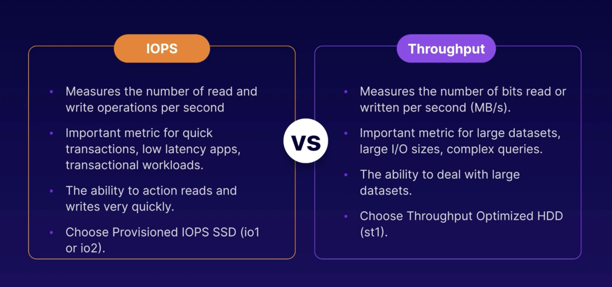
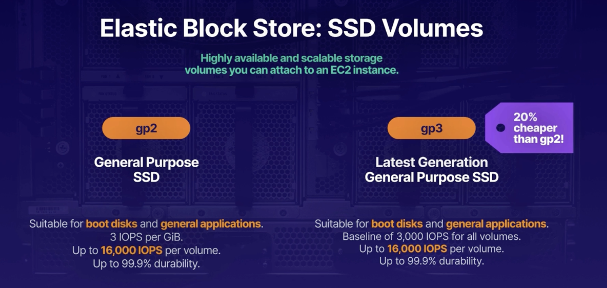
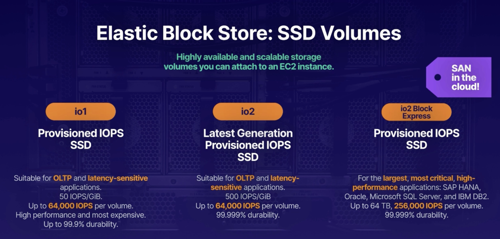
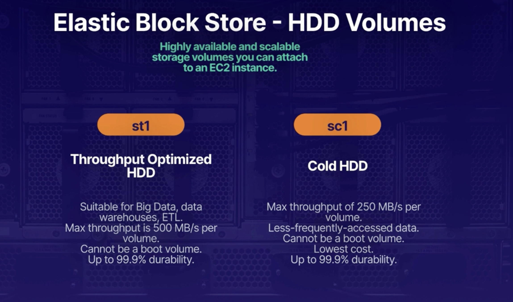
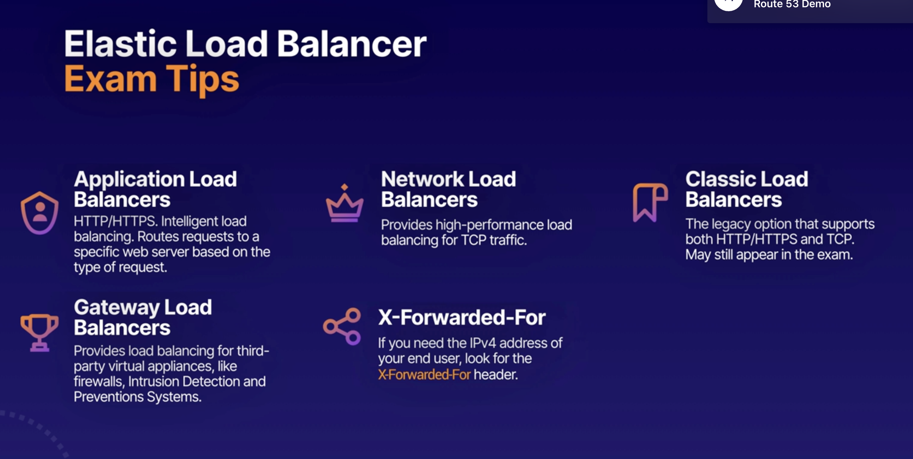
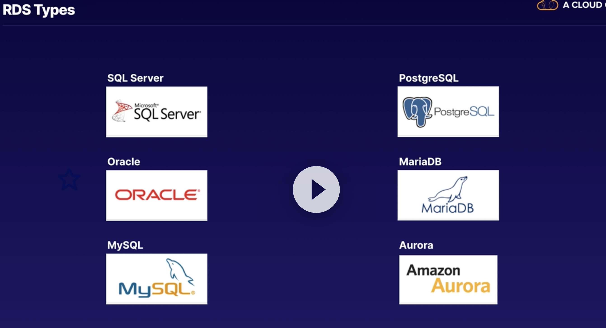

# EC2 (Elastic Compute Cloud )

####                * Exam tips - EC2:

    * EC2 is like a VM hosted in AWS instead of your own Data center
    * You can select the capacity right now
    * You can grown and shirnk when ever you need
    * Pay for what you use.
    * Infrastructire can setup minutes not months.

####                * Exam Tips - EC2 Pricing:

* On Demand:
    * Default section
    * allows you to pay by the hour or second depending on the type of instance you run
    * this is a great option for flexibility
* Reserved :
    * allows you to reserve capacity for one or three years where the discount
      they claim of up to 72% on the hourly charge
    * Regional
    * Has some instance types:
        * Standard RIs: Up to %72 off on demand
        * Convertable RIs: When your reservation requirements changed in standatd you can not change thats why we
          have convertable RIs, comes with %54 demand price
        * Schedules RIs: these allow you to launch a reserved instance within a time frame that you specify and this
          allows you to match your capacity reservation to a predictable recurring schedule, which only requires
          either a fraction of a day, week, or month
* Spot:
    * If you've got known fixed requirements,
      we then have spot instances,
      which allows you to purchase unused capacity at a discount of up to 90%
      prices fluctuate with supply and demand,
    * you set your maximum that you're willing to pay and if the price goes over
      the maximum, they're going to either hibernate or terminate your instance,
      depending on the options that you selected
    * this is great for applications
      with flexible start and end times,
      but it's not so great for applications which need to be up and running all the
      time
* Dedicated:
    * it's really great if you've got server bound licenses that you want to
      reuse, or if you have compliance requirements,
      which are preventing you from using a multi-tendency
    * The most expensive one.

####                * Exam Tips - Instance Types:

* Determines the hardware of the host computer
    * ach instance type offer different compute, memory and storage capabilities.
    * They are grouped in different instance families like :
        * General Purpose
        * Micro instance
        * Compute optimised
        * FPGA instance
        * GPU instance
        * Machine learning ASIC instance
        * Memory Optimised
        * Storage Optimised
    * Select an instance types based on requirement of the application.

####                * Simple Web Page in EC2 instance

* Launch an instance in EC2
* Add SSH and HTTP Security Groups roles for port 22 and 80
* Store Security SSH key pair folder that downloaded to login .pem file
* Open terminal
* Set permission to Pem file to execute by using `chmod 400 ec2_ins.pem`
* then copy the Public IP of the ec2 instance and type this command to connect the ec2
  instance `ssh ec2-user@3.83....5 -i ec2_ins.pem` then say yes
* After you login lets get sudo rights by `sudo su`
* Then upgrade instance `yum update -y`
* install apache web by `yum install httpd -y`
* to start apache `systemctrl start httpd` or to autho start `systemctrl enable httpd`
* check status of Apache server by `systemctrl status httpd`
* let's add a simple web page index.html, change directroy to `cd /var/www/html`
* use Nano editor `nano index.html`
* Then write a simple html codes in it save with Control+x
* Then copy and paste ec2 instance public ip to the browser you will se your index page

####                * EBS: Elastic Block Store

* Storage volume you can attach to EC2 instances
* When you first launch Ec2 instance it has launched with min 1 EBS volume attached an this is your OS will be instaled
  , windows or linux.
    * And you can add more depend on what you need.
* How we use EBS? Same way how we use any system disc
    * Run a DB
    * Run operate System
    * Run app etc
* Features of EBS:
    * Mission Critical:
        * Production Workload: Designed for Mission Critical workloads
    * Highly available
        * Authomaticaly replicated within single Availability zone to protect hardware failures.
        * You dont need to configure yourself, it happens under the hood.
    * Scalable:
        * Dynamicaly increase to capacity change the type of types of volumes.

* **EBS Volume Types - Solid State Disk (SSD):**
    * General Purpose SSD(gp2):
        * You get balance of performance, reasonable price and performance.
            * 3 IOPS(Input/output per second) per GIB up to max 16.000 IOPS per volume
            * gp2 volumes smaller than 1 TB can burst upo IOPS 3,000
            * Good for boot volumes or development and test applications which are not latency sensitive.
    * General Purpose SSD(gp3):
        * Latest generation
        * Baseline of 3000for any volume size (1GB-16TB)
        * Delivering up to 16000 IOPS
        * and %20 cheaper then gp2
    * Provision IOPS SSD (io1):
        * If your app is latency sensitive
        * high performance option
        * and most expensive
        * up to 64.000 IOPS per volume 50 IOPS per GIB
        * use if you need more 16.00 IOPS
        * Designed for I/O intensive apps and large DB and latency sensitive apps.
    * Provision IOPS SSD (io2):
        * Latest generation
        * higher durability more IOPS
        * io2 is same price with io1
        * 500 IOPS per GIB, up to 64000 IOPS
        * 99,99999% durability than 99,9% than io1
    * Provisioned IOPS SSD io2 Block Express:
        * SAN(Storage Area Network) in the cloud highest performance sub-milisecond latency
    * Throughput Optimise HDD(st1)
        * Low cost HDD volume
        * it is a hardware drive
        * Great to store among of data, but you want to access the data frequently
        * Baseline throughput of 40 MB/s per TB.
        * Ability to burst up to 250MB/s per TB
        * Max is 500 MB/s per TB
        * Frequently access, throughput-intensive workload , bigdata, ware houses, ETL, and log processing.
        * Cost effective way to store data
        * Can not be a boot volume
    * Cold HDD(SC1):
        * Lowest cost option
        * Baseline throughput 12MB/s per TB
        * Availability to burst 80MB/s per TB
        * Max 250MB/s per volume
        * Great choose for fewer scans per day.
        * Cannot be a boot volume.
          

* Examp tips -EBS:
    * Highly available and scalable storage volumes that you can attach to an EC2 instance
    * 
    * 
    * 
    * If you create an EBS volume from an encrypted snapshot you well get an encrypted volume
    * If you create an EBS volume from an unencrypted snapshot you well get an unencrypted volume

[Amazon EBS volume types](https://aws.amazon.com/tr/ebs/volume-types/)

#### Elastic Load Balancer

* a load balancer distributes network traffic across a group of servers.
* Types of Load balancers in AWS:
    * Application Load Balancer:
        * load balances HTTP and HTTPS, and this provides intelligent load balancing,
          which allows you to route requests to a specific web server based on the HTTP request header
        * Application Load Balancers operate at **Layer 7 of the OSI model**, so they are application-aware.
        * as the Application Load Balancer is application-aware, they support advanced request routing. So that means
          you can route requests to specific web servers based on the HTTP header.
    * Network Load Balancers:
        * the high performance option for TCP traffic only
        * **Layer 4- Transport layer of the OSI model**\
        * is load balancing based on the TCP protocol. And it is capable of handling millions of requests per second
          while maintaining ultra low latencies
        * it's the highest performance, it is also the most expensive option
    * Classic Load Balancer - legacy:
        * can handle HTTP and HTTPS and TCP protocols as well
        * they support some Layer 7-specific features like X-Forwarded-For headers,
        * and sticky sessions that just allows you to keep sending requests
          which originate from the same session onto the same web server, making the session sticky
        * it does also support Layer 4 load balancing for applications which rely purely on the TCP protocol.
    * Gateway Load Balancer:
        * Highly new
        * for third-party virtual appliances
        * this one allows you to load balance workloads for third-party virtual appliances running in AWS, such as
          virtual appliances purchased on the AWS Marketplace, virtual firewalls from companies like Fortinet,
          Palo Alto, Juniper, or Cisco,
        * and intrusion detection or intrusion prevention systems from companies like CheckPoint and Trend Micro, etc.

* **OSI(Open System Interconnection) 7-layer model Model** :
    * it's a conceptual framework, which describes the functions of a network, beginning with the application layer,
      which directly serves the end user right down to the physical layer and everything in between.
    * Application Layer:
        * this is everything that the end user sees. So HTTP operates at this layer and so does your web browser as
          well.
    * Presentation Layer:
        * This layer makes sure that the data is in a usable format and protocols like encryption and SSH operates at
          this layer.
    * Session Layer:
        * all about maintaining connections and sessions
    * Transport Layer :
        * all about transmitting data using protocols like TCP and UDP
    * Network Layer:
        * this layer is concerned with logically routing network packets based on IP addresses.
    * Data Link Layer:
        * it is concerned with physically transmitting data based on MAC addresses
    * Physical Layer:
        * this is all about transmitting bits and bytes over physical devices,like the cables and hubs that make up the
          network
* Load balancer error 504 Gateway timeout:
    * it usually means that the target or the downstream web or application server has failed to respond.
    * the first thing we need to do is check the application.

* Exam tips - Elastic Load Balancer:
    * 

#### Route 53

* AWS DNS service
* Allows you domain maps to
    * EC2 instances
    * Load balancer
    * s3 bucket

* Route Demo
    * We create an EC2 instance as we did in the previous (install httpd)
    * Then on right side down ec2 menu we add a LoadBalancer by adding and configure our EC2 instance as a target
    * We update security Group as launch-wizard to make accessible from internet
    * Then we went to the Route 53 and add our loadbalance instance as a simple Route Record with the ec2 target

* AWS CLI Lab
    * We create an EC@ instance with Linux
    * If you set up Linux AIM 2 then aws cli is default set up in it.
    * We configure our AWS Cli by using `aws configure`
    * it requires Access credentials and secret that's why we went to IAM and create a new user with S3 Full access the
      set access keys in configuration
    * To check aws configure `aws configure list`
    * To check s3 `aws s3 ls`
    * To create s3 `aws s3 mb s3://acloudgru-{unique numbers}`
    * Create hello.txt filr by `echo "Hello cloud guru" >hello.txt`
    * To upload s3 bucket: `aws s3 cp hello.txt s3://acloudgru-{unique numbers}`
    * To lost content of selected bucket `aws s3 ls s3://acloudgru-{unique numbers}`
    * [AWS CLI S3 command DOC](https://awscli.amazonaws.com/v2/documentation/api/latest/reference/s3/index.html)

####      * Exam tips - AWS CLI

* Least Privilege: always give your user the minimum amount of access required to do their job
* Use identity access management groups
    * Create IAM groupsand assign your user in it
    * Groips permission is assigned the IAM policy document
    * your user will authomaticaly inherit
* Secret access key
    * you will see only once is you lose it you can delete current key and recreate again, however you need to configure
      your aws cli again by `aws configure`
    * Dont share keys

####     * AWS Pagination

* You can control the numbur of items insluded the output when you run CLI command
* by default AWS CLI uses page size of 1000
    * i.e. imagine you call `aws s3api list-objects my_bucket` s3 bucket has 2500 items in it , AWS CLI will make 3
      calls at behind and shows once as a whole
* Errors:
    * 1000 page size can be so much when you see errors when listing a large amount of aws resources
    * you can see timeout errors that is probably you reached the max amount of recalls.
    * How to fix:
        * Adjust the default page-size, user the --page-size option to have CLI request a smaller number of items from
          each API call
        * the CLI retrieves the full list, but performs large amount of API calls in background and retrieves small
          amount of items each time
            * `aws s3api list-objects --bucket my_bucket --pages-size 100`
            * and --max-items `aws s3api list-objects --bucket my_bucket --max-items 100`
* Examp tips - CLI pagination:
    * if you do see like 'time out ' or errors related to too many results being return
        * adjust pagination in CLI results to avoid generated by too mant results
        * `aws s3api list-objects --bucket my_bucket --pages-size 100`
    * The CLI retrieves the full list ut performs a larger amount of api calls in the background retrieves smaller
      number of items with each call
* Examp Tips - Using Roles in Ec2 instances
    * The preferred option is Roles in security perspective. When they asked to access one servoce to another they
      probably asking Roles in the question
    * Avoid hard coding your credentials, roles are providing short term credentials to the application itself.
    * Policies control a role's permission
    * You can update policy of a role and affect immediately
    * Attach and deattach roles to runnig EC@ instances without terminate the service

#### RDS (Relational database System)

* RDS is Online Transaction Processing (OLTP)
* Aurora is Amazon product and compatable with MySql and Postgress
* Automaticaly scalable
* way better performance and functionalty
* Up and runnig in minutes
    * Multi-AZ (Availibityr Zone) : for durability, creates a stanby in in a different AZ to provide data redundancy,
      eliminate I/O freezes, and minimise latency spikes during system backups.
    * Failover Capacity
    * Automated backups
* RDS is not suitable for analysing large amount of data and instead you should think about datawarehouse liek Redshif.
  Optimised for OLAP
* OLAP and OLTP
  

####  * Exam tips - RDS:

* RDS types:
    * SQLServer, MySql,Orackle, Postgres, Aurora, MariaDB
* RDS designed OLTP type of workloads:
    * Great for processing lots of small transactions, like customer orders banking transactions etc.
* RDS is not suitable OLAP

RDS Demo
* Have an EC@ instance that has mysqlCliend instaled in it try to reach MySql instance in AWS RDS
* While create our EC2 we create a security group called "myec2-sg" , then while creating RDS Mysql free trial instance we also define another SG called 'rd-sq'
  * Then in 'rd-sg' we add our EC@ instance SG as "inbound Security group" into "rd-sg" security group to make reachabile
* To reach from instande to RDS we need RDS endpoint , in RDS instance details you can find
* Connect to your database using your endpoint:
  * `mysql -u acloudguru -p -h acluodguru.hjkhdjkfhdkf {endpoint} acloudguru` when we hit enter it will ask password '-p'