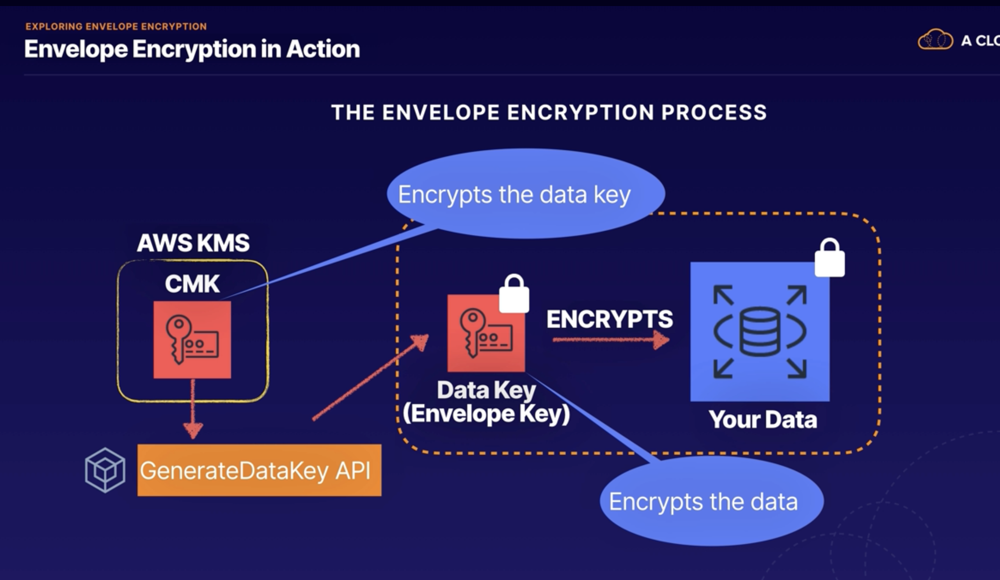
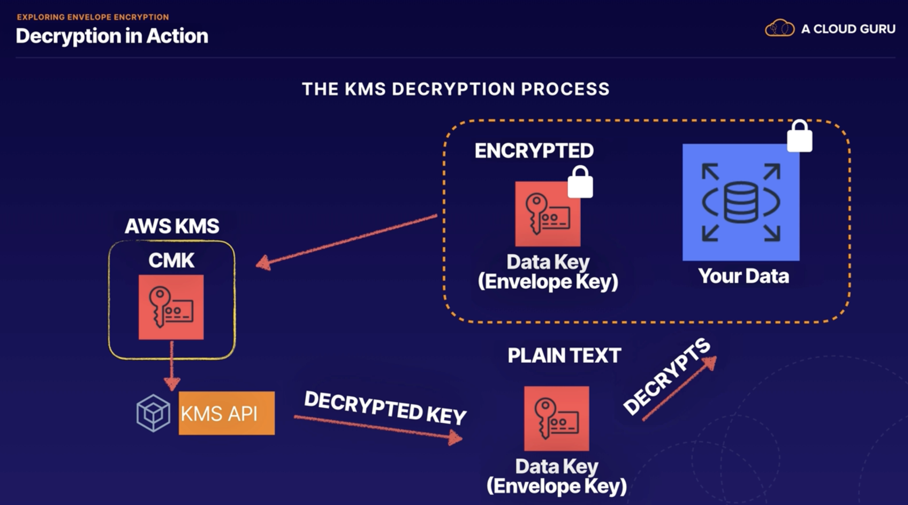

## KMS (KEy management Service) 101

* Managed service that makes really easy for you to create and control the encryption keys used to encrypt your data in
  AWS
* Completely integrated with loads of different AWS services, thats mean it is easy to encrypt the data by a checkbox
* When should we use KMS?
    * Basically whenever you deal with sensitive data, i.e. For example, if you're storing customer data, financial
      data, passwords, so anything like database passwords, any secrets for your application, and credentials as well.
* KMS integrates with most other AWS services,
    * S3, RDS, DynamoDb,
    * Lambda, Lambda can integrate with KMS is that it can go in and encrypt and decrypt data, provided you give it
      access to the KMS service and your encryption keys
    * Elastic Block Store, Elastic File System,
    * CloudTrail: CloudTrail is that you'll get an audit trail of all of the API calls into KMS. So you'll know exactly
      who has been using your keys to encrypt and decrypt, and who has been attempting to access your encrypted data.
* what is a CMK?
    * it stands for customer master key, and the customer master key is capable of encrypting and decrypting data up to
      4 kilobytes.
    * what is it actually used for?
    * the customer master key is used to generate, encrypt, and decrypt the data key. And it's this data key, which is
      then used in turn to encrypt and decrypt your data.
    * And this idea of using the customer master key to encrypt a data key, and then using that data key to encrypt your
      data is known as envelope encryption
    * There are 2 types
        * Symetric
            * Single key is used for enc/decrypt data or generates HMAC (Hash based Message Authentication Codes)
        * Asymetric
    * after you select keytypes you need to choose key administrator users
    * And then will create Key policy which is resource base policy like IAM

## Customer Managed Key CMK Summary

* you can use an alias to create a friendly name that you can use to refer to the CMK.
* The CMK also has a creation date. So the date and time when the CMK was created,
* you can add your own description that's meaningful to you to describe the CMK.
* Every customer master key also has a key state, and typically you'll see enabled, disabled,
* In terms of key material, you can provide your own key material that was generated externally, or you can use AWS
  provided
* customer master keys cannot be exported outside of KMS.
    * they stay within KMS and they are managed within KMS.
    * you cannot export your entire customer master key out of KMS
      and administer it somewhere else.
* 
* to set up our customer master key:
    * we can create an alias, a friendly name that we can use to help identify our key
    * You can add description
    * provide own key material or are we going to use a CloudHSM?
    * The next thing we need to do is define the key administrative permissions. So this is going to be the identity
      access management users and roles who are allowed to administer and manage the key.
    * This is all about the administrative side, the lifecycle management of the key, being able to delete the key or
      disable it.
    * we need to provide the name of the identity access management users or roles who are going to have administrative
      permissions
    * finally, we need to set the key usage permissions. So this will be the permissions for the identity access
      management users and roles who can use the key to encrypt and decrypt data.
    * 
* AWS Managed KMS
    * these are the CMKs that are used on your behalf with the services that are integrated with KMS.
    * services like S3 and audience. When you select encryption in the console for those services, it's these AWS
      managed keys,which are used in the background
* Customer Managed CMK
    * the term customer managed key, this refers to keys that you create own and manage yourself.
    * they're not created by AWS. You create them yourself, either using the command line interface or using the console
      and later on
* Data Key
    * the data key is an encryption key that you can use to encrypt data, including large amounts of data.
    * You generate a data key when you want to encrypt any data over 4KB
    * you can use your customer managed CMK to generate encrypt and decrypt your data key.
    * 

## AWS CLI commands for KMS

* [AWS CLI KMS commnds](https://awscli.amazonaws.com/v2/documentation/api/latest/reference/kms/index.html#cli-aws-kms)

```
// encrypt to secret.txt file with YOURKEY
aws kms encrypt --key-id YOURKEYIDHERE --plaintext fileb://secret.txt --output text --query CiphertextBlob | base64
--decode > encryptedsecret.txt

// decrypt to secret.txt file
aws kms decrypt --ciphertext-blob fileb://encryptedsecret.txt --output text --query Plaintext | base64 --decode >
decryptedsecret.txt

// Re-encrypt takes an encrypted file and reenc with other key.
aws kms re-encrypt --destination-key-id YOURKEYIDHERE --ciphertext-blob fileb://encryptedsecret.txt | base64 >
newencryption.txt

// this will give AWS KMS to allow to rotate your key anual bases.
aws kms enable-key-rotation --key-id YOURKEYIDHERE

aws kms get-key-rotation-status --key-id YOURKEYIDHERE

// this is to genarete a data key with AES_256 for example from your CMK 
aws kms generate-data-key --key-id YOURKEYIDHERE --key-spec AES_256
// You generate a data key when you want to encrypt any data over 4KB

```

* we use `aws kms encrypt` : enc plain text to ciphertext by using customer master key.
* we use `aws kms decrypt` : decrypt ciphertext text that was enc by using AWS KMS CMK to plain by using customer master
  key.
* we use `aws kms re-encrypt` : decrypt ciphertext text and then re-enc it entirely within AWS KMS(i.e when you
  change CMK or manually rotate to CMK).
* we use `aws kms enable-key-rotation` : enable key rotation every 365 days by AWS KMS
* we use `aws kms generate-data-key` : used CMK to generate a data key to encrypt the data > 4KB

## Explore Envelope Encryption

* Envelope Encryption is a process that encrypting your data it applies files over >4KB
* data key = envelope key
* Enc Process:
    * the customer master key encrypts the data key, and then the data key is used to encrypt the data
    * and finally, the encrypted data key is stored locally with the data so that it can be used later on for decryption
      purposes
    * and KMS does not store the data keys anywhere.
    * Instead, the encrypted copy of the data key is stored with your data.
    * 
* the decryption process:
    * here is our encrypted data and here's our encrypted data key, but in order to use our data key, we need to decrypt
      it first.
    * So that's where KMS comes in and in KMS we'll use the CMK and the KMS API to run a decrypt operation and return
      the data key in plain text form
    * and then the plain text data key is used to decrypt the data.
    * at the end of the process, the data has been decrypted and the plain text key is deleted from memory,
    * 
* Why not encrypt the data directly using the CMK?
    * the main reason is for network performance because when you encrypt that data directly with KMS, that data needs
      to be transferred over the network into the KMS service
    * and with envelopes encryption, only the data key goes over the network and not your data and then the data key is
      used locally in your application or AWS service, avoiding the need to transfer lots of data over the network to
      KMS.
    * if we're talking about gigabytes or terabytes of data, we don't want to send that over the network to KMS.
    * Even if it's going over the Amazon network, it's just not going to be efficient or performance.
    * So instead with envelope encryption, it's only the data key that gets sent over the network to KMS and your data
      doesn't move anywhere.
* Exam tips:
    * envelope encryption is all about encrypting the key, which encrypts our data and the CMK is used to encrypt the
      data key and it's also called at the envelope key
    * it's the data key, which encrypts our data and envelope encryption is used for encrypting anything over four
      kilobytes and it avoids sending all your data into KMS over the network
    * finally remember the GenerateDataKey API call, which is used by KMS to create an encrypted data key
    * when we were playing around with the KMS API, we ran a generate data key and it returned an encrypted and plain
      text version of a data key.