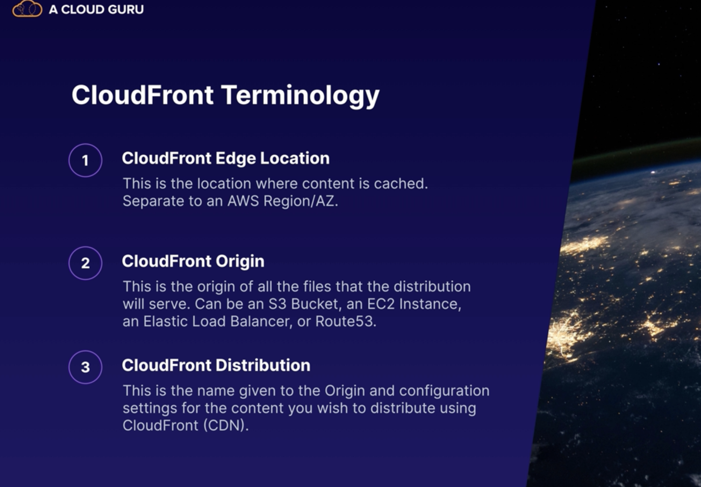
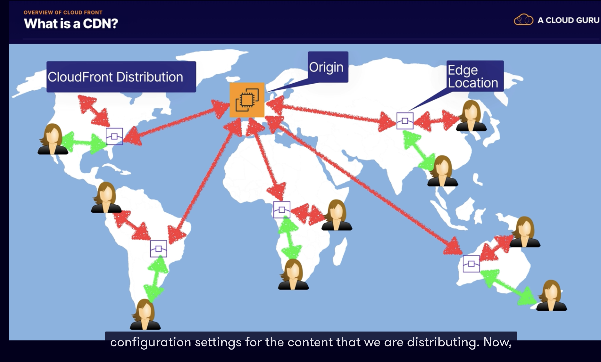
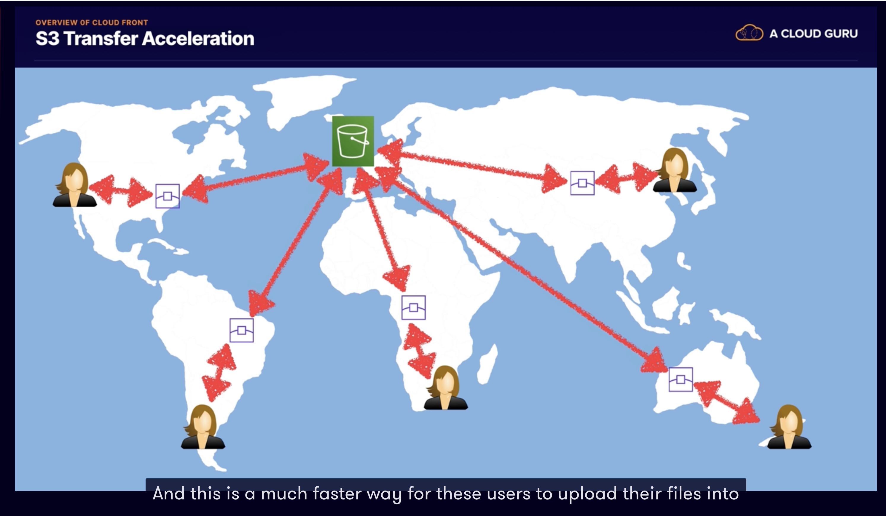
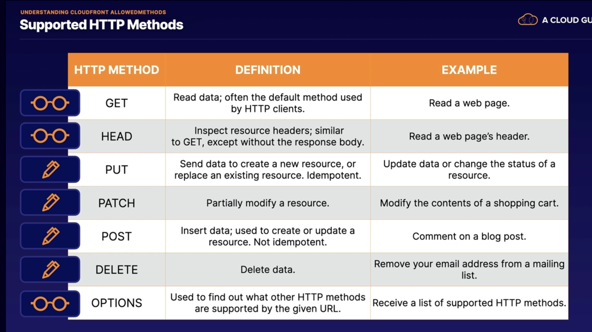
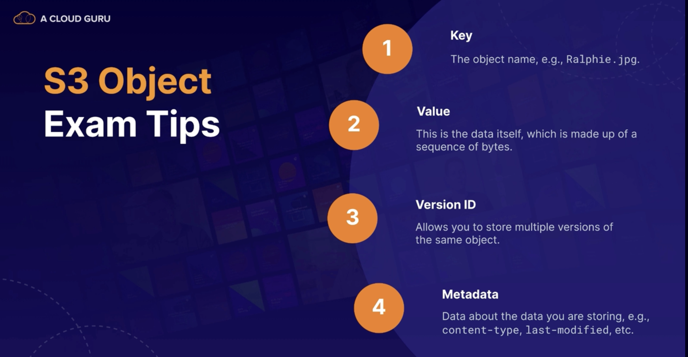
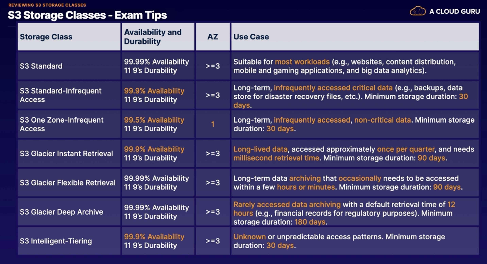
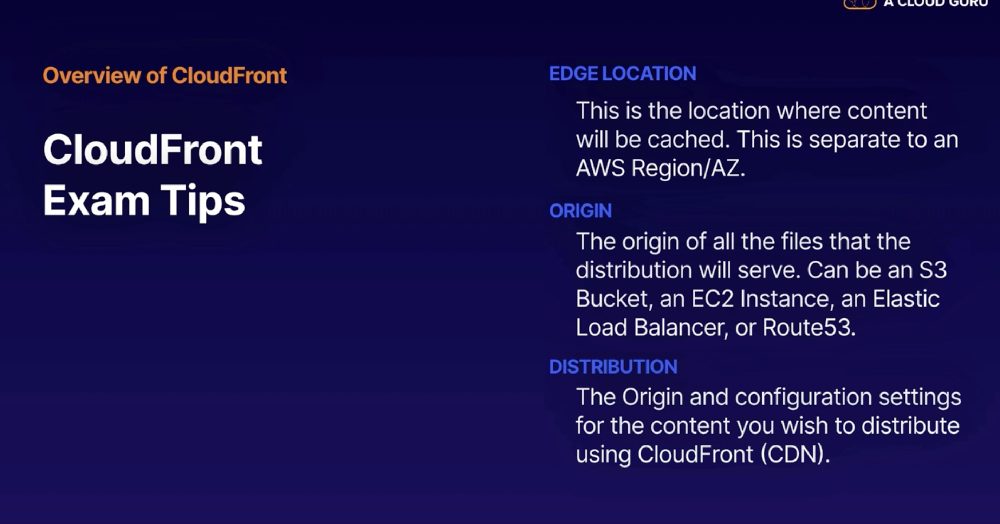
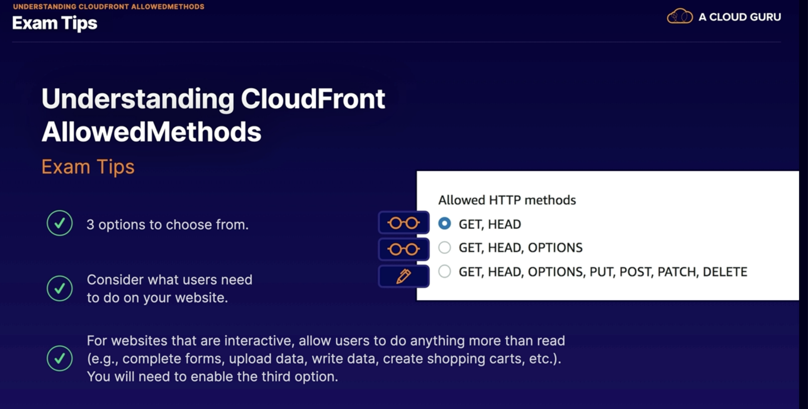

## S3 101

* S3 stands for simple storage service
* it provides the secure, durable and highly scalable object storage.
* it's object storage and it's really for files, images, webpages and that kind of thing.
* it's also super scalable and allows you to store and retrieve any amount of data from anywhere on the web at a very
  low cost.
* S3 is **object based** storage so it manages it data as objects rather than in file systems like an operating system
  or in
  data blocks.
* you can upload any type of file that you can think of to S3.
    * For example, photos, videos, code, documents and text files.
* However, it cannot be used to run an operating system or a database.
* S3 you get unlimited storage.
    * So the total volume of data and the number of objects that you can store is unlimited.
* S3 objects can be up to 5 TB terabytes in size
    * they can range in size from a minimum of 0byte->5TB.
* within S3 the files are stored in **buckets**.
    * And a bucket is similar to a folder and it's really just a container and it's the name that AWS uses for the
      location where you are storing your files.
* S3 actually has a universal namespace.
    * And that means that all AWS accounts share the same S3 namespace and each S3 bucket name must be globally unique.
    * similar to a DNS address or an internet address which must also be globally unique.
* S3 URL:
    * https://**bucket-name**.s3.Region.amazonaws.com/**key-name**
    * https://**tugcecoloudguru**.s3.Region.amazonaws.com/**cat.jpeg**
    * keyname is the name of the object
* when you upload a file into an S3 bucket you are going to receive an HTTP 200 code if the upload was successful.
    * you'll only see this code if you're uploading using the API or the command line interface
* S3 is a key value store
    * the key which is simply the name
      of the object i.e cat.jpg.
    * the value, and this is really the data itself which is made up of a sequence of bytes which makes up the object.
    * a version ID which is important when we come to store multiple versions of the same object.
    * metadata and if you haven't heard that term before metadata just really means data about data
        * For example, content type, last modified or you could even add the name of the team that owns the file or the
          project that the file is related to.
    * 
* s3 is a safe place to store your data files and the data is spread across multiple devices and multiple facilities to
  ensure availability and durability.
    * And what that means is that Amazon could lose one of their devices or facilities and the S3 service will still be
      available.
* S3 is designed to be both highly available and highly durable.
    * S3 is built for between 99.95 and 99.99% service availability depending on the S3 tier that you select to store
      your data.
* it is also designed for 11 nines (99,9999999999) durability for data stored in S3.
    * we say durability that is all about your data being stored safely and not getting lost or corrupted
* S3 offers tiered storage.
    * So it offers a range of storage courses or tiers designed for different use cases depending on the type of data
      that you might be storing and your own business requirements.
* S3 has lifecycle management which allows you to set rules and define rules to automatically transition objects to a
  cheaper storage tier or even delete objects which are no longer required after a set period of time.
* versioning.
    * So with versioning all versions of an object are stored and can be retrieved including deleted objects.
    * So that means we can keep multiple historical versions of the same file allowing you to roll back to a previous
      version if you accidentally changed or deleted your file.
* Security:
    * S3 can enable server-side encryption:
        * you can set up default encryption on a bucket which will encrypt all new objects when they are stored in the
          bucket.
    * got access control lists:
        * which allow you to define which AWS accounts or groups are granted access and the type of access they're
          granted as well.
        * And you can attach S3 access control lists to individual objects within a bucket.
        * So that really gives you fine grained access control.
    * bucket policies
        * S3 bucket policies specify which actions are allowed or denied.
        * For example, you can use a bucket policy to allow a user named Alice to put but not delete objects within a
          bucket that you own.

## Reviewing s3 Storage Classes

* S3 Standard:
    * Data stored redundantly across multi devices in multi facilities.
        * Data will store >= 3 availability zones
    * Gets 99,99% availability
    * Gets 99,99999...% 11 9 durability
    * Perfect for frequently accessed data
    * It is designed to be suitable for most workloads,
    * it is the default storage class.
    * use cases include things like websites, content distribution, mobile and gaming applications, and big data
      analytics.
* S3 Standard-Infrequent Access:
    * this is designed for infrequently access data,
        * so data that you store can be accessing few times in a month but not daily bases
    * designed for rapid access
        * it can be use less frequently but requires to access rapid
    * there's a low per gigabyte storage price and a per gigabyte retrieval fee.
    * Use cases include long-term storage, backups, and disaster recovery files.
    * min storage duration is 30 days
    * Gets 99,99% availability
    * Gets 99,99999...% 11 9 durability
    * Data will store >= 3 availability zones
* S3 One zone-Infrequent Access:
    * Same as S3 infrequent Access storage but stored redundantly within a single availability zone instead of being
      stored in multiple availability zones.
    * Cost effective because it will cost less 20% than S3 Infrequent Access
    * It is great long-live infrequently non-critical data
    * Gets 99,95% availability because of one zone availability
    * Gets 99,99999...% 11 9 durability
* S3 Glacier:
    * very cheap and cost effect storage
    * optimised for data that is very infrequently access
    * you pay fee when you access data and only use for archiving
    * retrieval time is between 1 minute to 12 hours
    * great for historical data that you will reach few times in a year
    * min storage 90 days
    * Gets 99,99% availability
    * Gets 99,99999...% 11 9 durability
    * Data will store >= 3 availability zones
* S3 Glacier Deep Archive:
    * archiving rarely access data within 12 hours retrieval time
    * for example financial data that needs to access once or twice in a year or never, but you still need to store them
      because compliance purpose
    * min 180 days storage requires.
    * Gets 99,99% availability
    * Gets 99,99999...% 11 9 durability
    * Data will store >= 3 availability zones
* S3 Intelligent Tier:
    * When we need to access data frequently or non-frequently, we can use
    * has 2 tiers frequently and infrequently
    * with Intelligent-Tiering, S3 will automatically move your data to the most cost-effective tier based on how
      frequently you access each object.
    * This is great for optimizing your costs and they do charge you an additional monthly fee,
        * but it's a really small fee of $0.0025 per 1,000 objects, so the fee is negligible.
    * Gets 99,9% availability
    * Gets 99,99999...% 11 9 durability
    * Data will store >= 3 availability zones
* 

## Securing s3 buckets

* Secure by default:
    * all newly created buckets are completely private
    * only the bucket owner can upload/delete etc the files
    * No access on public by default
* Control Access to Bucket
    * Bucket Policy - bucket level:
        * it allows to give permission to pther users for some actions via defining policy
        * you can setup access control your buckets by define bucket policies
        * permissions granted by the policy are going to apply to all of the objects within the bucket.
        * not applying permissions to individual objects
        * you cannot attach a bucket policy to an individual object
        * it's not fine-grained access control
        * they are really useful.
            * If you have a group of files in the same bucket and they need to be accessed by the same people.
        * bucket policies are written in JSON,!
        * [Bucket policy](img/s3-3.png)
    * Bucket Access Control Lists(ACLs) - object level:
        * Access Control Lists are applied at an object level.
            * So this means that we can apply different permissions for different objects within the same bucket.
        * using Access Control Lists, we can grant different types of access to different objects within our bucket.
        * And we can define which accounts and groups are granted access and also the type of access.
            * For example, read, write or full control.
        * it's bucket ACLs which give you the fine-grained access control for objects within your S3 buckets. So you can
          grant a different type of access to different objects within the same bucket.
            * For example, you can apply different permissions for different objects for different users and groups.
* Access Logs:
    * these are not enabled by default but you can go in and enable S3 access logs.
    * this will log all of the requests made to your S3 buckets.
        * For example, every time a user makes a request to upload a file, read a file or delete a file.

* Object Lock:
    * Store objects using an write-once-read-many(Worm) model to prevent object being delete or overriten for a fix
      amount of time.

## S3 Encryption

* Encryption in transit:
    * means encrypting the data when you were sending it to and from your S3 buckets
        * SSL/TLS Transport Layer Security:
            * if you see SSL or TLS, then just know that that is encryption in transit
        * HTTPS:
            * typically that means we are using HTTPS to upload and download files between our local system and S3
* Encryption at rest - server-side encryption:
    * SSE-S3:
        * encrypts your data using encryption keys managed by S3.
        * each object is encrypted using its own unique key.
        * And as an additional step, they also encrypt the key itself with a master key, which they rotate for you.
        * Amazon manages the keys for you, so you don't need to worry about managing your own keys.
        * it uses AES 256-bit encryption, so Advanced Encryption Standard 256-bit.
        * this is very easy to enable
        * you can do that while you are uploading a file and you can also encrypt existing files as well
    * SSE-KMS:
        * this is with the AWS Key Management Service.
        * AWS manage the keys for you, but KMS comes with some additional benefits.
        * So firstly, you get separate permissions for the use of an additional key called an envelope key.
        * And that is a key which actually encrypts your data's encryption key.
        * So it gives you an added level of protection against unauthorized access.
        * And you also get an audit trail, which records the use of your encryption key.
        * And you can see when your key has been used, who used it, and what they did.
    * SSE-C:
        * which uses an encryption key that you provide yourself.
        * And this is where AWS manage the encryption and decryption activities, but you manage your own keys.
        * So that means you are in charge of administering the keys, rotating them, and the lifecycle of the keys as
          well.
* Encryption at rest - Client side Encryption:
    * this is where you encrypt the files yourself before uploading them into S3.

* you may have a requirement to enforce server-side encryption for any files stored in S3. how can you do that?
    * firstly, we can use the console.
        * can select the encryption setting on the S3 bucket
          and that is really the easiest way to do it and it's just a checkbox in the console
    * Bucket Policy:
        * every time a file is uploaded to S3, a PUT request is initiated,
        * the file is going to be transmitted into S3. So in this case, it's going to use HTTP.
        * hen expect 100-continue. This just tells S3 not to send your request body until it receives an
          acknowledgement. So that means that S3 can actually reject your message based on the contents of this header.
        * if the file is to be encrypted at upload time, then a special parameter will be included in the PUT request
          header.
            * ` x-amz-server-side` header parameter, 2 options in here
                * `x-amz-server-side encryption: AES256` : that is with S3 managed keys
                * `x-amz-server-side encryption: aws:kms` : this uses SSE-KMS, which uses KMS managed keys.
        * when this parameter is included in the header of the PUT request, it tells S3 to encrypt the object at the
          time of upload using the specified encryption method.
            * 
        * you can create a Bucket Policy which denies any S3 PUT request, which does not include this parameter in the
          request header.
        * this example policy explicitly denies any requests that are not using AWS Secure Transport.
        * So that means with this policy, S3 will only serve content over HTTPS SSL, and it will deny all unencrypted
          HTTP access.
            * 
* 

## CORS Configuration

* We will create 2 s3 buckets and publish as static webside from PRoperties -> Satatic Website section
    * bucket has to be publicly available
    * load index, loadpage and error.html with public Read ACLs permission for both buckets
    * then the second bucket which has loadpage.html needs to allow CORS thats why,
        * we went to Permission -> CORS enable and wrote that permission
          
* 
* Benefit:
    * cross-origin resource sharing is a really good way to organize your website. For example, you could store image
      files in one bucket, JavaScript in another bucket, and plain HTML in another,
    * and then use cross-origin resource sharing to allow the resources from one bucket to access the resources in
      another bucket.
    * And remember by default resources in one bucket cannot access the resources in another, if universal access were
      allowed, that would leave your resources open to attack and cause is the safe mechanism to allow controlled access
      between one resource and another.

## Overwiew CloudFront

* It is Amazon's Content Delivery Network (CDN), which is a system of distributed servers which deliver web pages and
  other web content
* it's an easy, and cost-effective way to distribute content with low latency and high data-transfer speeds
* this is all about making your web pages faster and CloudFront speeds up the distribution of your static and dynamic
  web content. So HTML, JavaScript, image files, videos, and web applications
* it's a much more efficient and performant way for geographically distributed users to access your content.
* the network latency is going to be different for each different location. And for users who are further away, they are
  going to experience greater latency and worse performance.
    * So for example, users based in Australia, they might experience worse performance and greater latency. And they
      might think that the website seems less responsive than users based, say in India, for example, which is
      geographically closer to London.
* with CloudFront, requests for your content are automatically routed to the nearest edge location. So content is
  delivered with the best possible performance, no matter where your users are located in the world.
* And this allows you to optimize performance for users accessing your website from all around the world.
* CloudFront is optimized to work with other AWS services.
    * So it's really well integrated with services like S3, EC2, elastic load balancer, and Route 53.
* TTL (time to live)
    * CloudFront, objects are cached and they are cached for a period of time,
    * default TTL 1 day
    * And when the TTL is up, the object is automatically cleared from the cache.
    * you can clear an object from the cache yourself before the TTL is up, but you will be charged for doing that
* how can we improve performance and make it more consistent for everybody. Well, this is where CloudFront comes in.
* 
* CloudFrond Edge:
    * and this is the location where the content is cached.
    * And it's separate to an AWS region or availability zone.
    * an edge location is simply a collection of servers which are in geographically-dispersed data centers.
    * And these edge locations are used by CloudFront to keep a cache of copies of your objects
    * this means that instead of requesting content from your server located in London for example, users can access
      that content from the edge location instead, which is physically much closer to them than the main server in
      London.
    * the edge location forwards the request onto the server located in London and it downloads the files requested and
      caches them locally.
    * So this means that next time the user requests the file, or if another user comes along and wants to access the
      same file, they can access directly from the edge location.
    * it means that your requests are only going to the local edge location and they're not going all the way to London.
    * edge locations are not just read only, and you can write to them as well.
        * For example, you can put an object onto them as well. And this is exactly what's happening with S3 transfer
          acceleration.
* CloudFront origin:
    * this is the origin of all the files that the distribution would serve.
    * And this can be an S3 bucket, an EC2 instance, or an elastic load balancer, or route 53 address. And it can also
      be your own server in your own data center.
* CloudFront distribution (CDN):
    * this is the name given to the origin and configuration settings for the content that you wish to distribute using
      the CloudFront content delivery network.
* 
* S3 transfer acceleration:
    * S3 transfer acceleration enables fast, easy, and secure transfers of files over long distances between your end
      users and an S3 bucket.
    * we can use CloudFront to accelerate the upload of files into S3.
    * you upload your file to the edge location and when it arrives at the edge
      location, it's routed to Amazon S3 over an optimized network path.
        * We have our S3 bucket located here in London, and again,
        * we've got our users geographically distributed,
        * and just imagine all these users need to upload some files into this S3 bucket.
        * So instead of uploading directly to the bucket in London, which could take a long time for some of these users
          who are furthest away,
          instead, they can upload their file into the CloudFront edge location.
        * And from there, the edge location will transfer that file into the London-based bucket, using the fast
          networks within AWS.
    * 
* Origin Request Header: You can pass all header params through CloudFront to the origin.
* Cache policy : You can define TTL on the Cloud Edge
* Restrict viewer Access (Use only signed content or Cookie): This allows you to restrict the users to reach the content
  with permission.
* It has also WAF(Web Application Firewalls): This provides traffic filtering for well-known attack, like SQL injection
  and Cross side.
* In CloudFrond you can restrict countries by adding white/black lists
* Invalidations are allows you to for example delete your old version cached images on CF cache without waiting.
    * This is am manual and everytime you do you will charge money

    * 
* We can give Origin Access Identity:
    * OAI is a special Cloudfront user that can access files in our bucket and serve them to users
    * OAI allows us to restrict access to the contents of your bucket, so that all users must use the cloud front URL
      instead of direct s3 bucket link.
    * Scenario: Create a public S3 bucket
        * Load image and make public Read ACL
        * Create CloudFront
        * Select OAI and create one
        * And dont forget to override S3 bucket access rule checkbox
        * Copy CloudFront link and image URl then you can reach
        * Even you make your S3 bucket, still you can reach via Cloudfronf address, but not s3 buvcket address link,
          because you let only access via Cloud Front link.
* Understand Cloud frond Allowed Methods:
    * When you create a Cloudfront distribution, you needs to choose which Http Methods your distribution will support.
    * GET,HEAD: read only
    * GET,HEAD,OPTIONS: read only
    * GET,HEAD,OPTIONS, POST,PUT,DELETE,PATCH: read and write methods
* 
* 

### Summary

* S3 is object-based storage.
    * it allows you to upload files and store them in AWS,
    * it's a great place to store things like images, videos, code, text files, and documents, etc.
    * However, it's not suitable to run an operating system or database from S3.
    * Files can be up to 5 terabytes in size,
    * and with S3, you get unlimited storage. So the total volume of data and the number of objects or files you can
      store within S3 is unlimited.
    * Files are stored in buckets and S3 has a universal namespace,
    * so all bucket names must be unique.
    * So we have the bucket name, followed by the region, followed by the key name or the object or file name.
        * And in my example, I've got a bucket named fayecloudguru. It's located in us-east-1 and I have a file in there
          named Ralphie.jpeg.
    * And if you're using the CLI or the API, then successful uploads will generate an HTTP 200 status code.
    * S3 objects consist of a key, which is the object name, for example, Ralphie.jpg;
    * the value, which is the data itself, which is made up of a sequence of bytes.
    * There's also a version ID, which allows you to store multiple versions of the same object;
    * and also metadata, which is data about the data you're storing.
        * For example, content type or last modified, etc.
* storage classes or tiers.
    * S3 Standard, which is suitable for most workloads.
        * For example, websites, content distribution, mobile and gaming applications, and big data analytics.
        * And this is great for frequently accessed data.
        * So data that you're accessing on a daily basis.
    * S3 Standard-Infrequent Access, which is long-term storage
        * for infrequently accessed critical data.
        * For example, backups or as a data store for disaster recovery files.
    * S3 One Zone-Infrequent Access and this is great for long-term, infrequently accessed, non-critical data.
        * And the data is stored redundantly, but only in one single Availability Zone.
        * So that's why you only get 99.5% availability.
        * So this is not suitable for critical data, like backups.
    * Glacier Instant Retrieval, which is archiving for long-lived data
        * that needs millisecond retrieval times,
        * and Glacier is a cost-effective way to store your data,
        * but you do pay a fee every time you access the data.
    * Glacier Flexible Retrieval is for archiving data that needs to be accessed within a few hours or minutes.
        * And Glacier Deep Archive is for rarely accessed data with a default retrieval time of 12 hours.
    * S3 Intelligent-Tiering, designed for unpredictable access patterns
        * and it will automatically move infrequently accessed data to a more cost-effective storage class to save you
          money.

* Security,
    * S3 is secure by default.
    * So by default, all newly created buckets are private.
    * You can control access to your buckets using bucket policies, which are applied at a bucket-level
    * access control lists, which are applied at an object-level and give you fine-grained access control.
    * S3 buckets can be configured to create access logs, which log all the requests made to the S3 bucket. And these
      logs can be written to another S3 bucket, but they are not enabled by default.

* encryption,
    * S3 supports encryption in transit using SSL or TLS. And this is all about encrypting your data as it travels over
      the network.
        * And we can use HTTPS to encrypt our data in transit.
    * encryption at rest.
        * And S3 supports 3 different types of server-side encryption.
            * SSE-S3, which uses the Advanced Encryption Standard 256-bit.
                * And this uses encryption keys, which are managed within S3.
            * SSE-KMS, which uses encryption keys, which are managed within the AWS KMS service, or Key Management
              Service.
            * SSE-C, which uses encryption keys which are managed by the customer.
    * client-side encryption as well.
        * And this is where you encrypt the files yourself before you upload them into S3.
    * enforce encryption using a bucket policy.
        * it's really easy to enforce encryption within the AWS console by selecting Encryption in the bucket
          configuration,
        * but you can also use a bucket policy to deny all PUT requests which do not include the
          x-amz-server-side-encryption parameter in the request header.
        * you can also use a bucket policy to deny requests that do not use aws:SecureTransport in order to enforce the
          use of HTTPS or SSL.

* Cross-Origin Resource Sharing, or CORS.
    * we used CORS to enable code in one S3 bucket to access code that was located in another S3 bucket.
    * So allowing one resource to access another resource.
    * So we configured one S3 bucket containing index.html and another bucket containing loadpage.html, and then we
      configured CORS to allow the file in our first bucket to read the file in our second bucket.
    * then when we accessed the website, then index.html is referencing loadpage.html and the website will display both
      the files.

* CloudFront,
    * CloudFront is a service which allows you to improve the performance of your website by caching your webpages at a
      local edge location.
    * an edge location, this is the location where the content will be cached, which is separate to an AWS Region or
      Availability Zone.
    * The origin is the origin of all the files that the distribution is going to serve.
        * And this can be an S3 bucket, an EC2 instance, Elastic Load Balancer, or Route53.
        * And it can even be a server in your own data center.
    * CloudFront distribution, which is the origin and configuration settings for the content that you wish to
      distribute using the CloudFront CDN.
    * edge locations are not just read-only. You can write to them as well. So you can PUT an object as well.
    * S3 Transfer Acceleration utilizes CloudFront edge locations to reduce latency for S3 uploads.
    * objects within CloudFront are cached for the Time to Live.
        * by default, that's 1 day.
        * However, if your website is changing more frequently than that, then you can clear cached objects;
        * however, you will be charged for doing so.
* CloudFront AllowedMethods defines the HTTP methods that your CloudFront configuration will support.
    * there are 3 options to choose from.
        * first 2, GET, HEAD and GET, HEAD, OPTIONS, are read-only,
        * third choice, which includes PUT, POST, PATCH, and DELETE, allow your users to write data.

