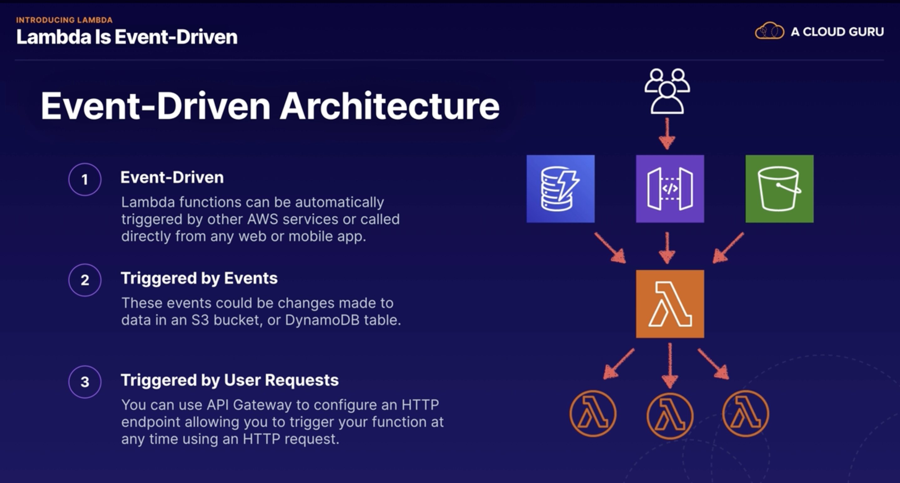
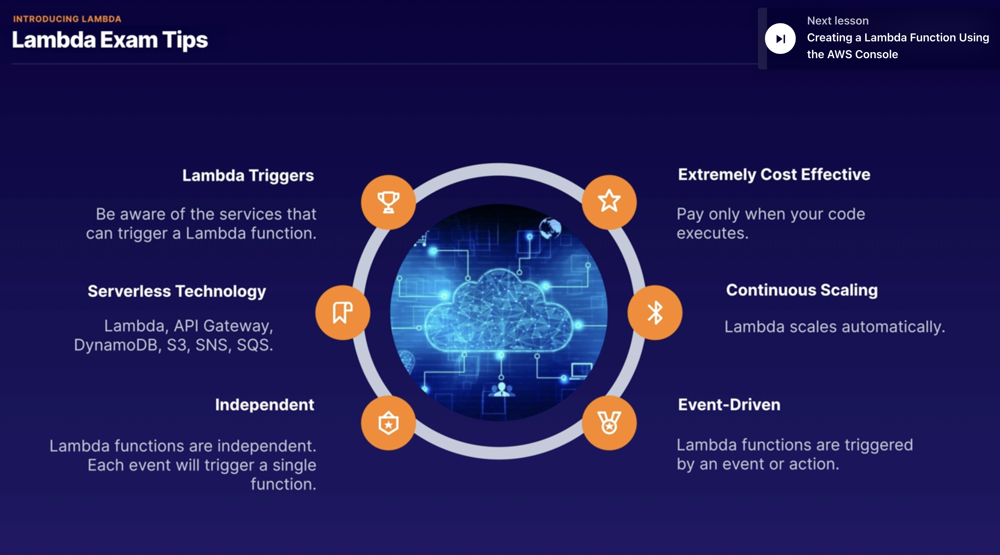

## Serverles 101

* serverless allows you to run your application code in the cloud without having to worry about managing any servers.
* AWS handles all the infrastructure management tasks so that you can focus on writing code.
* So AWS takes care of
    * capacity provisioning,
    * patching the underlying operating systems,
    * auto-scaling, and high availability.

* So this means that as a developer, all you need to worry about is writing excellent code.
* Advantages:
    * For example, you can increase your speed to market because by eliminating the overhead of managing servers,
    * you can release code quickly and get your application to market faster than your competitors.
    * And serverless is extremely scalable.
      *You can have a million users on your website and everything will scale
      automatically.
    * And a serverless approach usually also means lower costs.
        * because you are not paying for any servers, you never pay for over provisioning.

    * And serverless applications are event driven, and you are only charged when your code is executed.
    * And the most important thing is that a serverless approach allows you to really focus on your application instead
      of focusing on configuring infrastructure.
    * AWS offers a range of serverless technologies which integrate together seamlessly, allowing you to focus on
      building great applications.
* which technologies are serverless? Well,
    * Lambda and Lambda enables you to run your code as functions, without provisioning any servers.
        * the first 1 million requests per month are actually free.
    * SQS or Simple Queue Service.
        * this is a message queuing service which allows you to decouple and scale your applications.
    * SNS which is Simple Notification Service.
        * this is a messaging service for sending text messages and mobile notifications and emails.
    * API Gateway and this allows you to create, publish, and secure APIs at any scale.
        * an API is like the front door to your application.
        * API Gateway is all about making your application accessible in a secure and scalable way.
    * DynamoDB, which is a fully managed NoSQL database
    * S3 provides object storage and web hosting.
    * 

* exam tips.
    * serverless enables you to build scalable applications quickly without managing any servers.
    * It's extremely low cost because serverless applications are event driven and you are only charged when your code
      is executed.
    * AWS handles all the heavy lifting. So they worry about the hardware, the operating system, capacity provisioning,
      auto-scaling,
    * high availability. And that means that you can focus on writing code and building your application instead of
      configuring servers.
    * 

## Lambda Functions

* Lambda is serverless compute,
* it allows you to run your application code in AWS without provisioning any servers
* Lambda takes care of everything required to run your code, including the runtime environment, supported languages,
  including Java, go PowerShell, no JS C-sharp Python and Ruby.
* all you need to do is upload your code to Lambda and you are good to go.
* it includes all the enterprise features that you would expect from an AWS service.
    * auto scaling
    * high availability are already baked in to the Lambda service.
* Lambda pricing, you are charged based on the number of requests that duration and the amount of memory used by your
  Lambda function.
* The first 1 million requests per month are always free.
    * And then after that, you are charged 20 cents per month per million requests.
* You also charge for the duration that your function runs
    * you are charging one millisecond increments,
* and the price depends on the amount of memory that you allocate to your Lambda
  function, and they charge you a price per gigabyte/second,
* For example function which uses 512 megabytes of memory, and it runs for a 100 milliseconds.
    * 0.5 gigabytes and 0.1 seconds = 0.05 gigabyte seconds.
    * So this is what we'd be charged for running that function every time that
      function runs. However,
    * you also get the first 400,000 gigabyte seconds per month, completely free.
* significantly cheaper than paying for EC2 two instances. Now,
* Lambda is event driven and serverless applications use an event driven architecture.
    * So that means that Lambda functions can be automatically triggered by other AWS services, or they can be called
      directly from any web or mobile application.
    * So Lambda is triggered by events and these events could be changes made to data in an S3 bucket.
        * For example, triggering a Lambda function to run your code, or you could run a Lambda function in response to
          a change in a dynamo DB table.
        * And you can also have a Lambda function triggered by a user request as well. So you can use API gateway to
          configure an HTTP endpoint, allowing you to trigger your function at any time using an HTTP request.
    * Lambda can be triggered by loads of different AWS services.
        * which AWS services can we use? Well, there's dynamo DB, Kinesis, SQS application load balancer, API gateway,
          Alexa, CloudFront, S3, SNS, SAS, cloud formation, CloudWatch code commits, and code pipeline.
    * [Here is the list of services](https://docs.aws.amazon.com/lambda/latest/dg/lambda-services.html)
    * 
* Exam Tips
    * 

## API Gateway

* API stands fro Application Programming Interface and we use APIs to interact with web applications and applications
  use APIs to communicate with each other as well.
* API Gateway is a service which allows you to publish, maintain, monitor, and secure APIs at any scale.
* API Gateway provides a single endpoint for all traffic interacting with the backend of your application.
    * So here we've got our users and they are connecting using any kind of client device.
    * They make a request over to our AWS environment and the request hits API Gateway. And then, depending on the type
      of request, API Gateway can then forward the request to different services such as Lambda, EC2, or it could be a
      service like DynamoDB, or Kineses for example.
* It supports multiple endpoints and targets.
* it supports multiple versions of your API
* it allows you to maintain multiple versions of your API so that you can have different versions for your development
  testing and production environment
* API Gateway is serverless. So it's cost-effective and scalable.
* It integrates with CloudWatch. So it's logging all API calls, latencies, and error rates to CloudWatch
* it supports throttling.
    * So it helps you to manage traffic with throttling so that backend operations can withstand traffic spikes and
      denial-of-service
      attacks.
* Exam tips:
    * an API is like the front door to your application. And API Gateway provides an endpoint to your applications
      running in AWS
    * API Gateway is serverless so it is low cost and scales automatically.
    * It supports throttling. So you can throttle API Gateway to prevent your application from being overloaded by too
      many requests.
    * Everything is logged to CloudWatch. For example, API calls, latencies and errors as well.

## Lambda versioning

* the $LATEST is always the latest version of the code you've uploaded into Lambda
* use Lambda versioning and aliases to point your applications to a specific version if you don't want to use the
  $LATEST
* if you don't use any alias at all and you just use an unqualified ARN, so just ending in the function name, not using
  prod or latest or whatever then that will default to using the $LATEST version
    * arn:aws:lambda:eu-west-2:7893748934:function:myLambdaFunc:Prod
    * arn:aws:lambda:eu-west-2:7893748934:function:myLambdaFunc:$LATEST
* if your application is using an alias, remember that it will not automatically use new code when you upload it.
* So if you are using an alias and you're uploading new code that you want your application to use then just remember to
  update your application to point at the latest version of the code.

## Lambda Concurrent Executions limit

* Default Concurent Execution Limit is 1000 per seconds, concurrent executions per region account
* When you hit the number
    * You wil receive TooManyRequestsException
    * might also see this HTTP Status Code of 429
* To increase the Concurrency limit you need to contact with AWS support or you can also request via console to increase
* if you just have a few very critical functions, then you can set a reserved concurrency, to guarantee that a set
  number of concurrent executions are always available to your critical functions
    * alternatively you can also configure something called reserved concurrency, and this guarantees that a set number
      of
      executions will always be available, for any critical functions
        * For example. If you had a whole load of different functions, and some were highly critical, whereas others
          were
          not so important to your application or to your business, you can reserve some concurrency, for those critical
          functions, to make sure that there's always a set number of concurrent executions available for those critical
          functions.
        * However do be aware that it also does act as a limit.
            * for example if you set, a reserved concurrency
              of 500 for a specific function, that specific function will never be able to go over 500 concurrent
              executions.