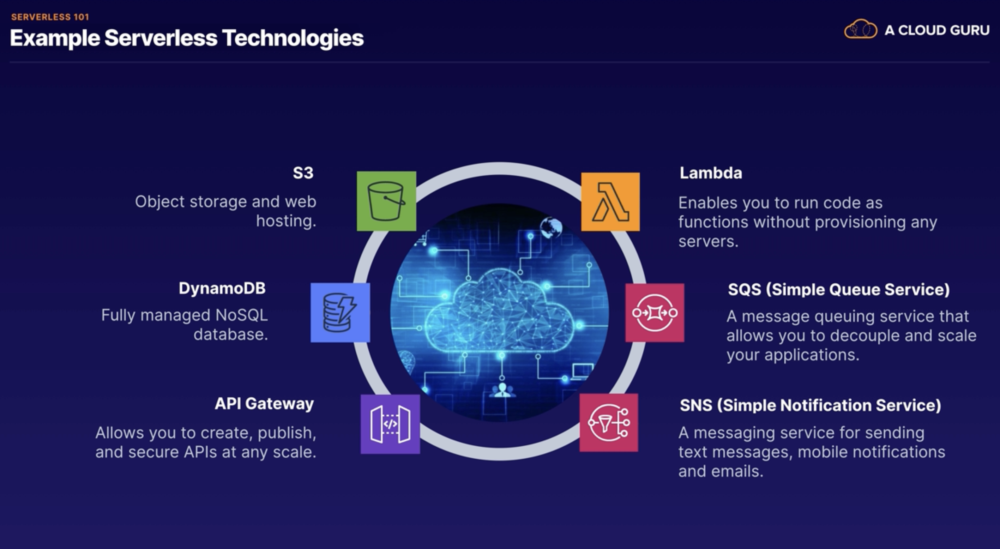
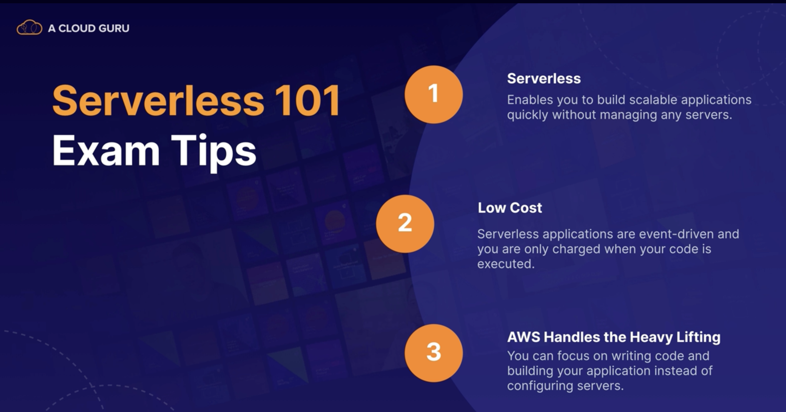

## Serverles 101

* serverless allows you to run your application code in the cloud without having to worry about managing any servers.
* AWS handles all the infrastructure management tasks so that you can focus on writing code.
* So AWS takes care of
    * capacity provisioning,
    * patching the underlying operating systems,
    * auto-scaling, and high availability.

* So this means that as a developer, all you need to worry about is writing excellent code.
* Advantages:
    * For example, you can increase your speed to market because by eliminating the overhead of managing servers,
    * you can release code quickly and get your application to market faster than your competitors.
    * And serverless is extremely scalable.
      *You can have a million users on your website and everything will scale
      automatically.
    * And a serverless approach usually also means lower costs.
        * because you are not paying for any servers, you never pay for over provisioning.

    * And serverless applications are event driven, and you are only charged when your code is executed.
    * And the most important thing is that a serverless approach allows you to really focus on your application instead
      of focusing on configuring infrastructure.
    * AWS offers a range of serverless technologies which integrate together seamlessly, allowing you to focus on
      building great applications.
* which technologies are serverless? Well,
    * Lambda and Lambda enables you to run your code as functions, without provisioning any servers.
        * the first 1 million requests per month are actually free.
    * SQS or Simple Queue Service.
        * this is a message queuing service which allows you to decouple and scale your applications.
    * SNS which is Simple Notification Service.
        * this is a messaging service for sending text messages and mobile notifications and emails.
    * API Gateway and this allows you to create, publish, and secure APIs at any scale.
        * an API is like the front door to your application.
        * API Gateway is all about making your application accessible in a secure and scalable way.
    * DynamoDB, which is a fully managed NoSQL database
    * S3 provides object storage and web hosting.
    * 

* exam tips.
    * serverless enables you to build scalable applications quickly without managing any servers.
    * It's extremely low cost because serverless applications are event driven and you are only charged when your code
      is executed.
    * AWS handles all the heavy lifting. So they worry about the hardware, the operating system, capacity provisioning,
      auto-scaling,
    * high availability. And that means that you can focus on writing code and building your application instead of
      configuring servers.
    * 