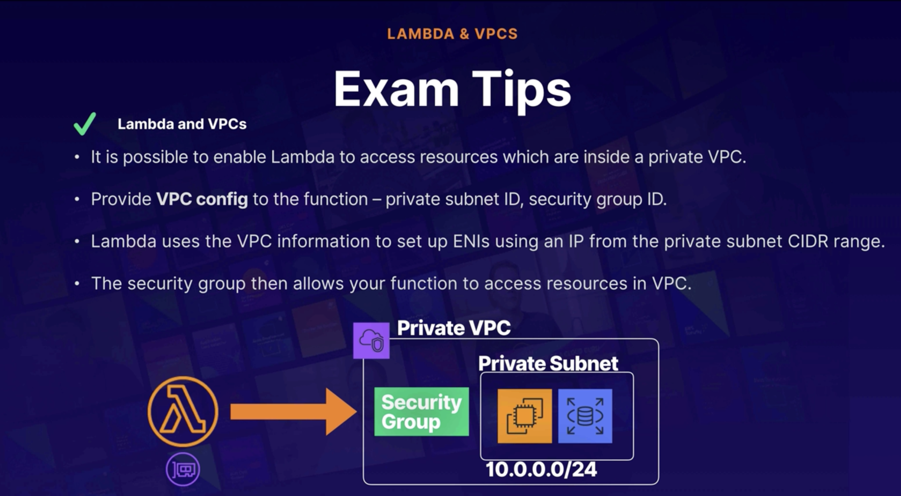
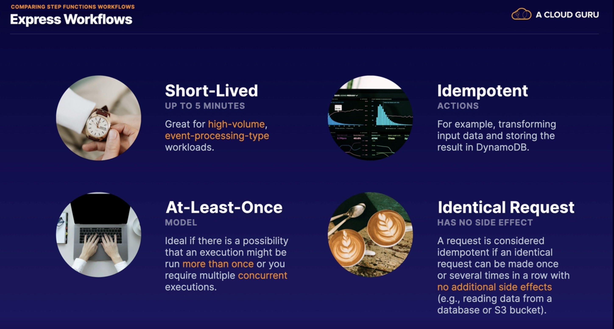
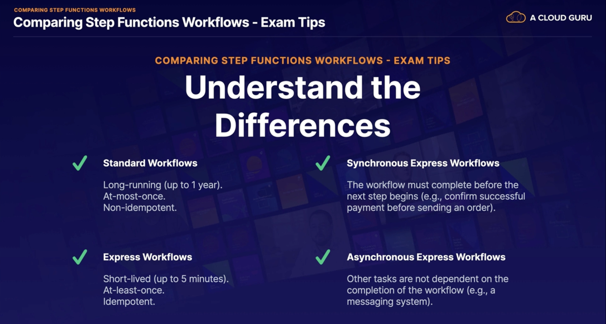
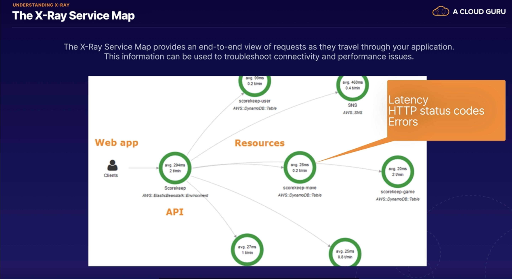
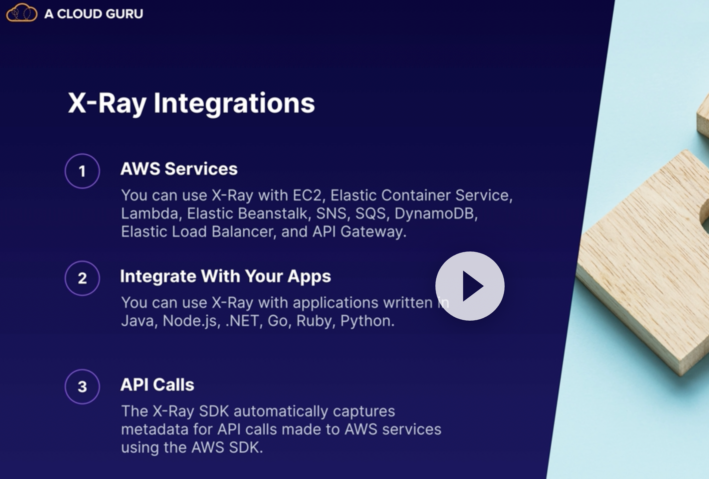
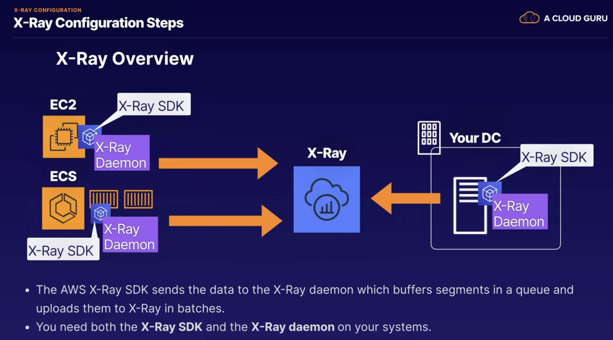
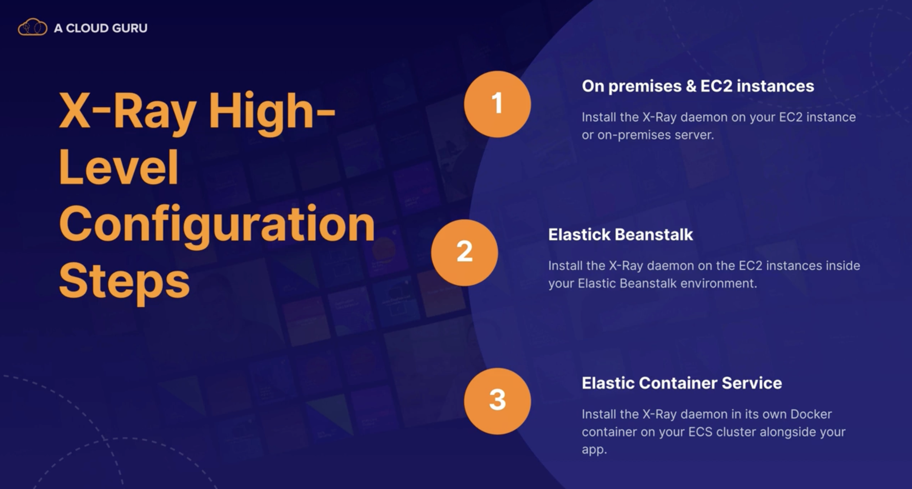

## Serverles 101

* serverless allows you to run your application code in the cloud without having to worry about managing any servers.
* AWS handles all the infrastructure management tasks so that you can focus on writing code.
* So AWS takes care of
    * capacity provisioning,
    * patching the underlying operating systems,
    * auto-scaling, and high availability.

* So this means that as a developer, all you need to worry about is writing excellent code.
* Advantages:
    * For example, you can increase your speed to market because by eliminating the overhead of managing servers,
    * you can release code quickly and get your application to market faster than your competitors.
    * And serverless is extremely scalable.
      *You can have a million users on your website and everything will scale
      automatically.
    * And a serverless approach usually also means lower costs.
        * because you are not paying for any servers, you never pay for over provisioning.

    * And serverless applications are event driven, and you are only charged when your code is executed.
    * And the most important thing is that a serverless approach allows you to really focus on your application instead
      of focusing on configuring infrastructure.
    * AWS offers a range of serverless technologies which integrate together seamlessly, allowing you to focus on
      building great applications.
* which technologies are serverless? Well,
    * Lambda and Lambda enables you to run your code as functions, without provisioning any servers.
        * the first 1 million requests per month are actually free.
    * SQS or Simple Queue Service.
        * this is a message queuing service which allows you to decouple and scale your applications.
    * SNS which is Simple Notification Service.
        * this is a messaging service for sending text messages and mobile notifications and emails.
    * API Gateway and this allows you to create, publish, and secure APIs at any scale.
        * an API is like the front door to your application.
        * API Gateway is all about making your application accessible in a secure and scalable way.
    * DynamoDB, which is a fully managed NoSQL database
    * S3 provides object storage and web hosting.
    * 

* exam tips.
    * serverless enables you to build scalable applications quickly without managing any servers.
    * It's extremely low cost because serverless applications are event driven and you are only charged when your code
      is executed.
    * AWS handles all the heavy lifting. So they worry about the hardware, the operating system, capacity provisioning,
      auto-scaling,
    * high availability. And that means that you can focus on writing code and building your application instead of
      configuring servers.
    * 

## Lambda Functions

* Lambda is serverless compute,
* it allows you to run your application code in AWS without provisioning any servers
* Lambda takes care of everything required to run your code, including the runtime environment, supported languages,
  including Java, go PowerShell, no JS C-sharp Python and Ruby.
* all you need to do is upload your code to Lambda and you are good to go.
* it includes all the enterprise features that you would expect from an AWS service.
    * auto scaling
    * high availability are already baked in to the Lambda service.
* Lambda pricing, you are charged based on the number of requests that duration and the amount of memory used by your
  Lambda function.
* The first 1 million requests per month are always free.
    * And then after that, you are charged 20 cents per month per million requests.
* You also charge for the duration that your function runs
    * you are charging one millisecond increments,
* and the price depends on the amount of memory that you allocate to your Lambda
  function, and they charge you a price per gigabyte/second,
* For example function which uses 512 megabytes of memory, and it runs for a 100 milliseconds.
    * 0.5 gigabytes and 0.1 seconds = 0.05 gigabyte seconds.
    * So this is what we'd be charged for running that function every time that
      function runs. However,
    * you also get the first 400,000 gigabyte seconds per month, completely free.
* significantly cheaper than paying for EC2 two instances. Now,
* Lambda is event driven and serverless applications use an event driven architecture.
    * So that means that Lambda functions can be automatically triggered by other AWS services, or they can be called
      directly from any web or mobile application.
    * So Lambda is triggered by events and these events could be changes made to data in an S3 bucket.
        * For example, triggering a Lambda function to run your code, or you could run a Lambda function in response to
          a change in a dynamo DB table.
        * And you can also have a Lambda function triggered by a user request as well. So you can use API gateway to
          configure an HTTP endpoint, allowing you to trigger your function at any time using an HTTP request.
    * Lambda can be triggered by loads of different AWS services.
        * which AWS services can we use? Well, there's dynamo DB, Kinesis, SQS application load balancer, API gateway,
          Alexa, CloudFront, S3, SNS, SAS, cloud formation, CloudWatch code commits, and code pipeline.
    * [Here is the list of services](https://docs.aws.amazon.com/lambda/latest/dg/lambda-services.html)
    * 
* Exam Tips
    * 

## API Gateway

* API stands fro Application Programming Interface and we use APIs to interact with web applications and applications
  use APIs to communicate with each other as well.
* API Gateway is a service which allows you to publish, maintain, monitor, and secure APIs at any scale.
* API Gateway provides a single endpoint for all traffic interacting with the backend of your application.
    * So here we've got our users and they are connecting using any kind of client device.
    * They make a request over to our AWS environment and the request hits API Gateway. And then, depending on the type
      of request, API Gateway can then forward the request to different services such as Lambda, EC2, or it could be a
      service like DynamoDB, or Kineses for example.
* It supports multiple endpoints and targets.
* it supports multiple versions of your API
* it allows you to maintain multiple versions of your API so that you can have different versions for your development
  testing and production environment
* API Gateway is serverless. So it's cost-effective and scalable.
* It integrates with CloudWatch. So it's logging all API calls, latencies, and error rates to CloudWatch
* it supports throttling.
    * So it helps you to manage traffic with throttling so that backend operations can withstand traffic spikes and
      denial-of-service
      attacks.
* Exam tips:
    * an API is like the front door to your application. And API Gateway provides an endpoint to your applications
      running in AWS
    * API Gateway is serverless so it is low cost and scales automatically.
    * It supports throttling. So you can throttle API Gateway to prevent your application from being overloaded by too
      many requests.
    * Everything is logged to CloudWatch. For example, API calls, latencies and errors as well.

## Lambda versioning

* the $LATEST is always the latest version of the code you've uploaded into Lambda
* use Lambda versioning and aliases to point your applications to a specific version if you don't want to use the
  $LATEST
* if you don't use any alias at all and you just use an unqualified ARN, so just ending in the function name, not using
  prod or latest or whatever then that will default to using the $LATEST version
    * arn:aws:lambda:eu-west-2:7893748934:function:myLambdaFunc:Prod
    * arn:aws:lambda:eu-west-2:7893748934:function:myLambdaFunc:$LATEST
* if your application is using an alias, remember that it will not automatically use new code when you upload it.
* So if you are using an alias and you're uploading new code that you want your application to use then just remember to
  update your application to point at the latest version of the code.

## Lambda Concurrent Executions limit

* Default Concurent Execution Limit is 1000 per seconds, concurrent executions per region account
* When you hit the number
    * You wil receive TooManyRequestsException
    * might also see this HTTP Status Code of 429
* To increase the Concurrency limit you need to contact with AWS support or you can also request via console to increase
* if you just have a few very critical functions, then you can set a reserved concurrency, to guarantee that a set
  number of concurrent executions are always available to your critical functions
    * alternatively you can also configure something called reserved concurrency, and this guarantees that a set number
      of
      executions will always be available, for any critical functions
        * For example. If you had a whole load of different functions, and some were highly critical, whereas others
          were
          not so important to your application or to your business, you can reserve some concurrency, for those critical
          functions, to make sure that there's always a set number of concurrent executions available for those critical
          functions.
        * However do be aware that it also does act as a limit.
            * for example if you set, a reserved concurrency
              of 500 for a specific function, that specific function will never be able to go over 500 concurrent
              executions.

## Lambda and VPCs

* as a developer, you may well see a situation or a use case where you are developing a Lambda function and it needs to
  be able to communicate with or access resources which are inside a private VPC in a private subnet with no access to
  the outside world
* by default, your Lambda function will not be able to access any resources within a private VPC without some additional
  configuration.
* basically you need to allow the function to connect to the private subnet and Lambda will need the
  following VPC configuration information so that it can go in and connect to resources in your VPC.
    * first of all, you're going to need to provide the private subnet ID where your resources are located.
        * we choose at least two subnets in order to run in high availability. So let's also select us-east-1b.
    * You also need to provide a security group ID with specific access for the Lambda function to allow it to do what
      it needs to do
    * and Lambda is going to use this information to set up an elastic network interface or ENI using an available IP
      address from the CIDR range of your private subnet.
        * The Lambda function needs to have permission to create elastic network interfaces in order to begin
          communicating with resources in your VPC and it's these permissions which enable the function to do that.
* you can add this VPC information to your Lambda function using the command line and you just need to use the
  vpc-config parameter
* You just need to select your VPC, provide the private subnet ID and a security group ID as well.
    * And once again, Lambda uses that VPC information to set up an elastic network interface using an IP from the
      private subnet CIDR range and then the security group that you provided needs to allow your function to access
      resources within the VPC.
* 

## Step Functions

* step functions provide a visual interface for serverless applications, which enables you to build and run serverless
  applications, as a series of steps.
* Each step in your application executes in order, as defined by your business logic.
* And the output of one step can act as the input into the next.
* So step functions provide orchestration for serverless applications and think of an application consisting of many
  different lambda functions.
* And we use step functions to manage the logic of the application, including sequencing, error handling, and retry
  logic, so that your application executes in order, and as expected.
* And step functions also log the state of each step.
    * So when things go wrong this helps you to diagnose and debug problems really quickly
    * because you can identify which step in the process failed.
* step functions consists of state machines and tasks.
* We can build step functions
    * Sequental
    * Parallel
    * Conditions
* step functions under "application integration"
* state machines are defined using Amazon States Language.
* Exam Tips:
    * 

#### Lambda you can create Function URl and reach from outside or authenticated, no need API gateway.

## Compaire Step Function Workflows

* 2 types workflows
* Standard Workflow:
    * these are great for long-running, durable, and auditable workflows that may run for up to 1 year.
    * And with these, full execution history is available for up to 90 days after the workflow has completed.
    * Standard Workflows use an at-most-once model.
        * And this means that tasks are never executed more than once unless you explicitly specify retry actions in
          your code or in your workflow.
    * Standard Workflows are designed for non-idempotent actions;
        * for example, when processing payments, and you only want a payment to be processed once, not multiple times.
        * non-idempotent?
            * non-idempotent if it always causes a change in state. So let's say we repeat an identical request, will it
              always cause a change in state?
                * And with our example of a payment, it is always going to cause a change in state if we repeat an
                  identical
                  payment.
* Express Workflow:
* these are designed for short-lived workflows that last up to 5 minutes.
* they are great for high volume event-processing-type workloads.
* They use an at-least-once model. So the workflow runs at least once, but it could run more than once.
    * So Express Workflows are ideal if there's a possibility that an execution might be run more than once or that you
      require multiple concurrent executions.
* these are great for idempotent actions;
    * for example, transforming some input data and then storing the result in DynamoDB. And a request is idempotent if
      an identical request has no side effect. So it's considered idempotent if an identical request can be made once or
      several times in a row with no additional side effects.
    * for example, taking some input data and running an identical process to transform that data and then store the
      result in DynamoDB.
    * The result will always be the same.
* Synchronous:
    * it begins the workflow. It waits until the workflow is completed and then returns the result.
    * this is great for operations that are going to be performed one at a time.
    * So the workflow must complete before the next step begins.
    * For example, you should wait for your customer to complete their payment before you send them their order.
* Asynchronous:
    * it begins a workflow, it confirms the workflow has started, but it is not going to return any result to you.
    * Instead, the result of the workflow can be found in CloudWatch Logs.
    * it's not waiting for the workflow to complete before moving on to the next task.
    * this is great if your services or operations don't depend on the completion and the result of your workflow.
    * For example, think of a messaging system where you just want to send a message and then move on to the next task
      without waiting for an acknowledgement.
* Asynchronous Workflows often run in the background while synchronous workflows hold you up until they all complete.
* 
* 
* 
* 

## Understanding X-Ray

* it's a tool which helps developers analyze and debug distributed applications, allowing you to troubleshoot the root
  cause of performance issues and errors, and particularly connection errors.
* And it provides a visualization of your applications underlying components, so it gives you a really nice visual
  representation of all the components that make up your application, and they call this the X-Ray service map.
* this is the X-Ray service map and it provides an end to end view of requests as they travel through your application.
  And it's collecting information like latency, HTTP status codes and any error messages that are generated, as well.
  And this information can be used to troubleshoot connectivity and performance issues.
* 
* integrating X-Ray :
    * it works with loads of different AWS services. So you can use X-Ray with EC2, Elastic Container Service, Lambda,
      Elastic Beanstalk, SNS, SQS, DynamoDB, Elastic Load Balancer, and API Gateway.
        * And you can also integrate X-Ray with your own application.
    * you can use X-Ray with applications written in Java, Node.js, .NET, Go, Ruby and Python. And it will monitor your
      API calls, so the X-Ray SDK automatically captures metadata for the API calls that you make to AWS services using
      the AWS SDK. So, if your application is making API calls to AWS services then X-Ray will automatically capture
      metadata about those API calls.
* To use X=Ray
    * you'll need to install the X-Ray agent on your EC2 instance.
    * you need to configure your application.
    * you need to instrument your application using the X-Ray SDK, and the X-Ray SDK provides a set of libraries and
      methods for generating the trace of data that will be sent to X-Ray.
    * the X-Ray SDK gathers information from request and response headers, the code in your application and metadata
      about the AWS resources on which it runs, and sends this trace data to X-Ray.
    * 
* 

## X-Ray Configuration

* X-Ray is great that you can actually use it to monitor applications which are running on EC2, in Elastic Container
  Service, and also applications running in your own data center, as well as serverless technologies like Lambda,
  DynamoDB, and API gateway.
* 
* in this diagram, we've got an EC2 instance, an Elastic Container Service cluster running Docker containers, and we've
  also got an on-premises system in our own data center.
* And they are all sending data into X-Ray. And the way that it all hangs together, is that you have this AWS X-Ray SDK
  installed on your system.
* And the AWS X-Ray SDK sends the data to the X-Ray Daemon, which is also running on your system, and the X-Ray Daemon
  actually buffers the segments in a
  queue and then it uploads them into X-Ray in batches.
* And the main point of this diagram is just really to show you that you need both the X-Ray SDK and the X-Ray Daemon on
  your systems, in order to start sending data into X-Ray.
* just remember that you need the X-Ray SDK and the X-Ray Daemon as well, and you use the SDK to instrument your
  application to send the required data.
* first of all, for on-premises and EC2 systems, you're going to need to install the X-Ray Daemon directly on your EC2
  instance, or on your on-premises server.
* If you're running Elastic Beanstalk, you can just install the X-Ray Daemon, once again, on the EC2 instances inside
  your Elastic Beanstalk environments.
* And if you're using Docket containers and Elastic Container Service, then you'll need to install the X-Ray Daemon on
  its own Docker container on your ECS cluster,alongside your application.
    * So, don't install the X-Ray Daemon on the same Docker container where your application is running. It's going to
      need to be in its own Docker container.
* what are annotations?
    * when instrumenting your application, you can actually record additional information about requests, or traces,
      by using annotations. And annotations are simply key-value pairs and they actually get indexed by X-Ray and you
      can use them with filter expressions, so that you can go ahead and search for traces which contain specific data,
      and it allows you to group related traces together in the console
* !
* 
* 

## Advanced API Gateway

* You can import APIS using external definition files i.e. OpenAPi or Swagger
* Dealing with legacy applications which is using SOAP(Single Object Access Protocol), you can configure your api Gateway as SOAP web service passthrought 
  * or you can use API gateway to convert XML response to Json
  * [How to configure Amazon API Gateway as a SOAP webservice passthrough in minutes](https://blog.joshuamoesa.com/2017/06/how-to-configure-amazon-api-gateway-as.html)
